# Apache Fesod

快速、简洁、解决大文件内存溢出的 Java 处理电子表格工具

- [官网地址](https://fesod.apache.org/zh-cn/)


## 基础配置

**添加依赖**

```xml
<properties>
    <fesod.version>2.0.0</fesod.version>
</properties>

<dependencies>
    <!-- Apache Fesod -->
    <dependency>
        <groupId>org.apache.fesod</groupId>
        <artifactId>fesod-sheet</artifactId>
    </dependency>
</dependencies>

<dependencyManagement>
    <dependencies>
        <dependency>
            <groupId>org.apache.fesod</groupId>
            <artifactId>fesod-bom</artifactId>
            <version>${fesod.version}</version>
            <type>pom</type>
            <scope>import</scope>
        </dependency>
    </dependencies>
</dependencyManagement>
```


## 数据准备

### 创建实体类

```java
package io.github.atengk.entity;

import lombok.AllArgsConstructor;
import lombok.Builder;
import lombok.Data;
import lombok.NoArgsConstructor;

import java.io.Serializable;
import java.math.BigDecimal;
import java.time.LocalDate;
import java.time.LocalDateTime;

@Data
@Builder
@NoArgsConstructor
@AllArgsConstructor
public class MyUser implements Serializable {

    private static final long serialVersionUID = 1L;

    /**
     * 主键id
     */
    private Long id;

    /**
     * 名称
     */
    private String name;

    /**
     * 年龄
     */
    private Integer age;

    /**
     * 手机号码
     */
    private String phoneNumber;

    /**
     * 邮箱
     */
    private String email;

    /**
     * 分数
     */
    private BigDecimal score;

    /**
     * 比例
     */
    private Double ratio;

    /**
     * 生日
     */
    private LocalDate birthday;

    /**
     * 所在省份
     */
    private String province;

    /**
     * 所在城市
     */
    private String city;

    /**
     * 创建时间
     */
    private LocalDateTime createTime;

}
```

### 给实体类添加注解

常用注解，更多参考 [官网文档](https://fesod.apache.org/zh-cn/docs/sheet/help/annotation)

| 注解                  | 参数                                                         | 类型                         | 含义                                 | 默认值 / 备注                                                |
| --------------------- | ------------------------------------------------------------ | ---------------------------- | ------------------------------------ | ------------------------------------------------------------ |
| **@ExcelProperty**    | `value`                                                      | `String` / `String[]`        | Excel 列名，用于匹配/写入列标题      | 空（需配合 index 或 value 才生效）([Apache Fesod](https://fesod.apache.org/docs/help/annotation/?utm_source=chatgpt.com)) |
|                       | `index`                                                      | `int`                        | Excel 列索引位置                     | `-1`（不指定）([Apache Fesod](https://fesod.apache.org/docs/help/annotation/?utm_source=chatgpt.com)) |
|                       | `order`                                                      | `int`                        | 配合 `value` 排序优先级              | `Integer.MAX_VALUE`([Apache Fesod](https://fesod.apache.org/docs/help/annotation/?utm_source=chatgpt.com)) |
|                       | `converter`                                                  | `Class<? extends Converter>` | 自定义转换器类                       | 默认自动选择([Apache Fesod](https://fesod.apache.org/docs/help/annotation/?utm_source=chatgpt.com)) |
| **@ExcelIgnore**      | *无*                                                         | /                            | 标记字段不参与 Excel 读写            | —([Apache Fesod](https://fesod.apache.org/docs/help/annotation/?utm_source=chatgpt.com)) |
| **@DateTimeFormat**   | `value`                                                      | `String`                     | 日期时间格式（如 `yyyy-MM-dd`）      | 空([Apache Fesod](https://fesod.apache.org/docs/help/annotation/?utm_source=chatgpt.com)) |
|                       | `use1904windowing`                                           | `boolean`                    | 是否使用 1904 日期系统               | 自动选择([Apache Fesod](https://fesod.apache.org/docs/help/annotation/?utm_source=chatgpt.com)) |
| **@NumberFormat**     | `value`                                                      | `String`                     | 数字格式（如 `#,##0.00`）            | 空([Apache Fesod](https://fesod.apache.org/docs/help/annotation/?utm_source=chatgpt.com)) |
|                       | `roundingMode`                                               | `RoundingMode`               | 小数舍入模式                         | `RoundingMode.HALF_UP`([Apache Fesod](https://fesod.apache.org/docs/help/annotation/?utm_source=chatgpt.com)) |
| **@ColumnWidth**      | `value`                                                      | `int`                        | 列宽（字符单位）                     | —([Apache Fesod](https://fesod.apache.org/docs/sheet/write/style?utm_source=chatgpt.com)) |
| **@HeadFontStyle**    | `fontName`                                                   | `String`                     | 字体名称                             | —([Apache Fesod](https://fesod.apache.org/docs/sheet/write/style?utm_source=chatgpt.com)) |
|                       | `fontHeightInPoints`                                         | `short`                      | 字体大小（磅）                       | —([Apache Fesod](https://fesod.apache.org/docs/sheet/write/style?utm_source=chatgpt.com)) |
|                       | `bold`                                                       | `BooleanEnum`                | 是否加粗                             | —([Apache Fesod](https://fesod.apache.org/docs/sheet/write/style?utm_source=chatgpt.com)) |
|                       | `italic`                                                     | `BooleanEnum`                | 是否斜体                             | —（可选）([Apache Fesod](https://fesod.apache.org/docs/help/annotation/?utm_source=chatgpt.com)) |
|                       | `strikeout`                                                  | `BooleanEnum`                | 是否删除线                           | —（可选）([Apache Fesod](https://fesod.apache.org/docs/help/annotation/?utm_source=chatgpt.com)) |
|                       | `color`                                                      | `short/int`                  | 字体颜色索引                         | —（可选）([Apache Fesod](https://fesod.apache.org/docs/help/annotation/?utm_source=chatgpt.com)) |
|                       | `underline`                                                  | `short/int`                  | 下划线样式                           | —（可选）([Apache Fesod](https://fesod.apache.org/docs/help/annotation/?utm_source=chatgpt.com)) |
|                       | `charset`                                                    | `short/int`                  | 字体编码                             | —（可选）([Apache Fesod](https://fesod.apache.org/docs/help/annotation/?utm_source=chatgpt.com)) |
| **@ContentFontStyle** | 同 `@HeadFontStyle`                                          | —                            | 内容单元格字体样式参数               | 用法同上([Apache Fesod](https://fesod.apache.org/docs/sheet/write/style?utm_source=chatgpt.com)) |
| **@HeadStyle**        | `horizontalAlignment`                                        | `HorizontalAlignmentEnum`    | 水平对齐枚举                         | —([Apache Fesod](https://fesod.apache.org/docs/sheet/write/style?utm_source=chatgpt.com)) |
|                       | `verticalAlignment`                                          | `VerticalAlignmentEnum`      | 垂直对齐枚举                         | —([Apache Fesod](https://fesod.apache.org/docs/sheet/write/style?utm_source=chatgpt.com)) |
|                       | `verticalAlignment`                                          | `VerticalAlignmentEnum`      | 垂直对齐枚举                         | —([Apache Fesod](https://fesod.apache.org/docs/sheet/write/style?utm_source=chatgpt.com)) |
|                       | `fillForegroundColor`                                        | `short/int`                  | 单元格填充前景色                     | —([Apache Fesod](https://fesod.apache.org/docs/sheet/write/style?utm_source=chatgpt.com)) |
|                       | `wrapped`                                                    | `BooleanEnum.DEFAULT`        | 设置文本是否在单元格内自动换行       | —([Apache Fesod](https://fesod.apache.org/docs/sheet/write/style?utm_source=chatgpt.com)) |
|                       | `borderLeft` / `borderRight` / `borderTop` / `borderBottom`  | `BorderStyleEnum`            | 边框样式                             | —([Apache Fesod](https://fesod.apache.org/docs/sheet/write/style?utm_source=chatgpt.com)) |
| *其他可选样式属性*    | `dataFormat`, `hidden`, `locked`, `quotePrefix`, `wrapped`, `rotation`, `indent`, `leftBorderColor`, `rightBorderColor`, `topBorderColor`, `bottomBorderColor`, `fillPatternType` | 多种类型                     | 详细可参考 POI 样式及 EasyExcel 文档 | 注：Fesod 也支持类似参数，但官方文档未全部列出，需要根据 POI 和源码使用([CSDN博客](https://blog.csdn.net/weixin_45151960/article/details/109095332?utm_source=chatgpt.com)) |
| **@ContentStyle**     | 同 `@HeadStyle`                                              | —                            | 内容单元格样式参数                   | 同样支持 POI 样式多数参数([CSDN博客](https://blog.csdn.net/weixin_45151960/article/details/109095332?utm_source=chatgpt.com)) |
| **@HeadRowHeight**    | `value`                                                      | `int`                        | 表头行高（单位：点/像素）            | —([Apache Fesod](https://fesod.apache.org/docs/sheet/write/style?utm_source=chatgpt.com)) |
| **@ContentRowHeight** | `value`                                                      | `int`                        | 内容行高（单位：点/像素）            | —([Apache Fesod](https://fesod.apache.org/docs/sheet/write/style?utm_source=chatgpt.com)) |

```java
package io.github.atengk.entity;

import lombok.AllArgsConstructor;
import lombok.Builder;
import lombok.Data;
import lombok.NoArgsConstructor;
import org.apache.fesod.sheet.annotation.ExcelIgnore;
import org.apache.fesod.sheet.annotation.ExcelProperty;
import org.apache.fesod.sheet.annotation.format.DateTimeFormat;
import org.apache.fesod.sheet.annotation.format.NumberFormat;
import org.apache.fesod.sheet.annotation.write.style.*;
import org.apache.fesod.sheet.enums.BooleanEnum;
import org.apache.fesod.sheet.enums.poi.BorderStyleEnum;
import org.apache.fesod.sheet.enums.poi.HorizontalAlignmentEnum;
import org.apache.fesod.sheet.enums.poi.VerticalAlignmentEnum;

import java.io.Serializable;
import java.math.BigDecimal;
import java.math.RoundingMode;
import java.time.LocalDate;
import java.time.LocalDateTime;

@Data
@Builder
@NoArgsConstructor
@AllArgsConstructor
@HeadFontStyle(fontName = "宋体", fontHeightInPoints = 11, bold = BooleanEnum.TRUE)
@ContentFontStyle(fontName = "宋体", fontHeightInPoints = 11, bold = BooleanEnum.FALSE)
@HeadStyle(wrapped = BooleanEnum.TRUE, horizontalAlignment = HorizontalAlignmentEnum.CENTER, verticalAlignment = VerticalAlignmentEnum.CENTER, fillBackgroundColor = 9, fillForegroundColor = 9, borderLeft = BorderStyleEnum.THIN, borderRight = BorderStyleEnum.THIN, borderTop = BorderStyleEnum.THIN, borderBottom = BorderStyleEnum.THIN)
@ContentStyle(wrapped = BooleanEnum.TRUE, horizontalAlignment = HorizontalAlignmentEnum.CENTER, verticalAlignment = VerticalAlignmentEnum.CENTER, fillBackgroundColor = 9, fillForegroundColor = 9, borderLeft = BorderStyleEnum.THIN, borderRight = BorderStyleEnum.THIN, borderTop = BorderStyleEnum.THIN, borderBottom = BorderStyleEnum.THIN)
@HeadRowHeight(25)  // 设置表头行高
@ContentRowHeight(20)  // 设置数据内容行高
@ColumnWidth(15)       // 设置列宽
public class MyUser implements Serializable {

    private static final long serialVersionUID = 1L;

    /**
     * 主键id
     */
    @ExcelIgnore
    private Long id;

    /**
     * 名称
     */
    @ExcelProperty(value = "名称", index = 0)
    @ColumnWidth(20) // 单独设置列宽
    private String name;

    /**
     * 年龄
     */
    @ExcelProperty(value = "年龄", index = 1)
    private Integer age;

    /**
     * 手机号码
     */
    @ExcelProperty(value = "手机号码", index = 2)
    @ColumnWidth(30) // 单独设置列宽
    private String phoneNumber;

    /**
     * 邮箱
     */
    @ExcelProperty(value = "邮箱", index = 3)
    @ColumnWidth(30) // 单独设置列宽
    private String email;

    /**
     * 分数
     */
    @ExcelProperty(value = "分数", index = 4)
    @NumberFormat(value = "#,##0.00", roundingMode = RoundingMode.HALF_UP)
    private BigDecimal score;

    /**
     * 比例
     */
    @ExcelProperty(value = "比例", index = 5)
    @NumberFormat(value = "0.00%", roundingMode = RoundingMode.HALF_UP)
    private Double ratio;

    /**
     * 生日
     */
    @ExcelProperty(value = "生日", index = 6)
    @DateTimeFormat("yyyy年MM月dd日")
    private LocalDate birthday;

    /**
     * 所在省份
     */
    @ExcelProperty(value = "所在省份", index = 7)
    private String province;

    /**
     * 所在城市
     */
    @ExcelProperty(value = "所在城市", index = 8)
    private String city;

    /**
     * 创建时间
     */
    @ExcelProperty(value = "创建时间", index = 9)
    @DateTimeFormat("yyyy-MM-dd HH:mm:ss")
    @ColumnWidth(30) // 单独设置列宽
    private LocalDateTime createTime;

}
```

### 初始化数据

```java
package io.github.atengk.init;

import com.github.javafaker.Faker;
import io.github.atengk.entity.MyUser;
import lombok.Getter;

import java.math.BigDecimal;
import java.time.LocalDate;
import java.time.LocalDateTime;
import java.util.ArrayList;
import java.util.List;
import java.util.Locale;

/**
 * 初始化数据
 *
 * @author 孔余
 * @email 2385569970@qq.com
 * @since 2025-01-09
 */
@Getter
public class InitData {

    public static List<MyUser> getDataList() {
        return getDataList(1000);
    }

    public static List<MyUser> getDataList(int total) {
        //生成测试数据
        // 创建一个Java Faker实例，指定Locale为中文
        Faker faker = new Faker(new Locale("zh-CN"));
        List<MyUser> userList = new ArrayList();
        for (int i = 1; i <= total; i++) {
            MyUser user = new MyUser();
            user.setId((long) i);
            user.setName(faker.name().fullName());
            user.setAge(faker.number().numberBetween(1, 100));
            user.setPhoneNumber(faker.phoneNumber().cellPhone());
            user.setEmail(faker.internet().emailAddress());
            user.setScore(BigDecimal.valueOf(faker.number().randomDouble(2, 0, 100000)));
            user.setRatio(faker.number().randomDouble(5, 0, 1));
            user.setBirthday(LocalDate.now());
            user.setProvince(faker.address().state());
            user.setCity(faker.address().cityName());
            user.setCreateTime(LocalDateTime.now());
            userList.add(user);
        }
        return userList;
    }

}
```


## 创建工具类

### ExcelUtil

```java
package io.github.atengk.util;

import org.apache.fesod.sheet.ExcelReader;
import org.apache.fesod.sheet.ExcelWriter;
import org.apache.fesod.sheet.FesodSheet;
import org.apache.fesod.sheet.read.builder.ExcelReaderSheetBuilder;
import org.apache.fesod.sheet.read.listener.ReadListener;
import org.apache.fesod.sheet.read.metadata.ReadSheet;
import org.apache.fesod.sheet.write.builder.ExcelWriterBuilder;
import org.apache.fesod.sheet.write.builder.ExcelWriterSheetBuilder;
import org.apache.fesod.sheet.write.handler.WriteHandler;
import org.apache.fesod.sheet.write.metadata.WriteSheet;
import org.apache.fesod.sheet.write.metadata.fill.FillWrapper;
import org.apache.poi.ss.usermodel.Sheet;
import org.apache.poi.ss.usermodel.Workbook;
import org.apache.poi.ss.usermodel.WorkbookFactory;
import org.apache.poi.xssf.usermodel.*;
import org.slf4j.Logger;
import org.slf4j.LoggerFactory;
import org.springframework.web.multipart.MultipartFile;

import javax.servlet.http.HttpServletResponse;
import java.io.*;
import java.net.URL;
import java.net.URLEncoder;
import java.nio.charset.StandardCharsets;
import java.nio.file.Path;
import java.util.*;
import java.util.stream.Collectors;

/**
 * Excel 工具类
 *
 * <p>
 * 提供与 Excel 读写相关的常用操作方法，可按需扩展。
 * 支持基础导出、表头构建、多 Sheet 处理、输出流适配等能力。
 * 适用于服务端常见 Excel 处理场景。
 * </p>
 *
 * @author 孔余
 * @since 2026-01-27
 */
public class ExcelUtil {

    private static final Logger log = LoggerFactory.getLogger(ExcelUtil.class);

    private ExcelUtil() {
    }

    /*---------------------------------------------
     * Excel 导入方法区域
     *---------------------------------------------*/

    /**
     * 实体同步导入（单 Sheet）
     *
     * @param in    Excel 输入流（不可为空）
     * @param clazz 实体类型（不可为空）
     * @param <T>   实体泛型
     * @return 实体数据列表
     */
    public static <T> List<T> importExcel(InputStream in, Class<T> clazz) {
        if (in == null) {
            log.error("[importExcel] 输入流不能为空");
            throw new IllegalArgumentException("输入流不能为空");
        }
        if (clazz == null) {
            log.error("[importExcel] 实体类型不能为空");
            throw new IllegalArgumentException("实体类型不能为空");
        }

        log.info("[importExcel] 开始实体同步导入，entity={}", clazz.getSimpleName());

        List<T> list = FesodSheet
                .read(in)
                .head(clazz)
                .sheet()
                .doReadSync();

        log.info("[importExcel] 实体同步导入完成，rows={}", list.size());
        return list;
    }

    /**
     * Map 同步导入（单 Sheet）
     *
     * <p>
     * key = 列索引
     * value = 单元格字符串值
     * </p>
     *
     * @param in Excel 输入流（不可为空）
     * @return 数据列表
     */
    public static List<Map<Integer, String>> importExcel(InputStream in) {
        if (in == null) {
            log.error("[importExcel] 输入流不能为空");
            throw new IllegalArgumentException("输入流不能为空");
        }

        log.info("[importExcel] 开始 Map 模式同步导入");

        List<Map<Integer, String>> list = FesodSheet
                .read(in)
                .sheet()
                .doReadSync();

        log.info("[importExcel] Map 模式同步导入完成，rows={}", list.size());
        return list;
    }

    /**
     * 带监听器的实体导入
     *
     * @param in       Excel 输入流（不可为空）
     * @param clazz    实体类型（不可为空）
     * @param listener 读取监听器（不可为空）
     * @param <T>      实体泛型
     */
    public static <T> void importExcel(InputStream in,
                                       Class<T> clazz,
                                       ReadListener listener) {
        if (in == null) {
            log.error("[importExcel] 输入流不能为空");
            throw new IllegalArgumentException("输入流不能为空");
        }
        if (clazz == null) {
            log.error("[importExcel] 实体类型不能为空");
            throw new IllegalArgumentException("实体类型不能为空");
        }
        if (listener == null) {
            log.error("[importExcel] 监听器不能为空");
            throw new IllegalArgumentException("监听器不能为空");
        }

        log.info("[importExcel] 开始监听器导入，entity={}", clazz.getSimpleName());

        FesodSheet
                .read(in, listener)
                .head(clazz)
                .sheet()
                .doRead();

        log.info("[importExcel] 监听器导入完成");
    }

    /**
     * 多 Sheet 实体导入
     *
     * <p>完全等价于：
     * <pre>
     * ExcelReader reader = FesodSheet.read(in).build();
     * ReadSheet rs1 = FesodSheet.readSheet(...).head(...).registerReadListener(...).build();
     * ReadSheet rs2 = ...
     * reader.read(rs1, rs2);
     * reader.finish();
     * </pre>
     *
     * @param in            Excel 输入流
     * @param sheetDataList Sheet 配置列表
     */
    public static void importExcelMultiSheet(InputStream in,
                                             List<ImportSheetData<?>> sheetDataList) {

        if (in == null) {
            log.error("[importExcelMultiSheet] 输入流不能为空");
            throw new IllegalArgumentException("输入流不能为空");
        }

        if (sheetDataList == null || sheetDataList.isEmpty()) {
            log.error("[importExcelMultiSheet] Sheet 定义不能为空");
            throw new IllegalArgumentException("Sheet 定义不能为空");
        }

        log.info("[importExcelMultiSheet] 开始多 Sheet 导入，sheetCount={}", sheetDataList.size());

        try (ExcelReader excelReader = FesodSheet.read(in).build()) {

            ReadSheet[] readSheets = new ReadSheet[sheetDataList.size()];

            for (int i = 0; i < sheetDataList.size(); i++) {
                ImportSheetData<?> sd = sheetDataList.get(i);

                if (sd.getClazz() == null) {
                    throw new IllegalArgumentException("clazz 不能为空");
                }

                boolean hasIndex = sd.getSheetIndex() != null;
                boolean hasName = sd.getSheetName() != null && sd.getSheetName().length() > 0;

                if (!hasIndex && !hasName) {
                    throw new IllegalArgumentException("sheetIndex 和 sheetName 不能同时为空");
                }

                if (hasIndex && hasName) {
                    throw new IllegalArgumentException("sheetIndex 和 sheetName 不能同时指定");
                }

                ExcelReaderSheetBuilder builder;

                if (hasIndex) {
                    builder = FesodSheet.readSheet(sd.getSheetIndex());
                } else {
                    builder = FesodSheet.readSheet(sd.getSheetName());
                }

                builder.head(sd.getClazz());

                if (sd.getListener() != null) {
                    builder.registerReadListener(sd.getListener());
                }

                readSheets[i] = builder.build();
            }

            excelReader.read(readSheets);
            excelReader.finish();
        }

        log.info("[importExcelMultiSheet] 多 Sheet 导入完成");
    }

    /*---------------------------------------------
     * Excel 图片读取工具方法
     *---------------------------------------------*/

    /**
     * 读取 Excel 中的图片数据，返回内存级图片信息集合
     *
     * <p>说明：
     * 该方法只负责“解析并提取图片数据”，不关心图片如何存储或如何使用，
     * 不进行任何文件写入操作，属于纯读取能力方法。
     * 适用于需要将图片上传至 OSS、存入数据库、缓存到内存、或进行自定义处理的场景。
     *
     * <p>支持能力：
     * <ul>
     *     <li>支持指定 Sheet 读取图片</li>
     *     <li>支持按列过滤图片（单列或多列）</li>
     *     <li>支持一次性读取所有图片</li>
     *     <li>返回图片的行号、列号、字节数据和文件扩展名</li>
     * </ul>
     *
     * <p>返回的 {@link ExcelImageData} 中字段说明：
     * <ul>
     *     <li>rowIndex：图片所在行号（0-based）</li>
     *     <li>columnIndex：图片所在列号（0-based）</li>
     *     <li>bytes：图片的二进制数据</li>
     *     <li>extension：图片文件扩展名（如 png、jpeg）</li>
     * </ul>
     *
     * <p>典型使用方式：
     * <pre>
     * ImageReadOptions options = new ImageReadOptions();
     * options.setSheetIndex(0);
     * options.setColumnIndexSet(Set.of(10));
     *
     * List<ExcelImageData> images = ExcelUtil.readImages(inputStream, options);
     * </pre>
     *
     * <p>设计原则：
     * <ul>
     *     <li>方法只做“读取”，不做“落盘”</li>
     *     <li>通过 {@link ImageReadOptions} 解耦读取规则</li>
     *     <li>通过返回模型对象提升扩展性和可复用性</li>
     * </ul>
     *
     * @param in      Excel 文件输入流，不能为空
     * @param options 图片读取配置对象，不能为空
     * @return Excel 中解析得到的图片数据集合，如果没有图片则返回空集合
     * @throws IllegalArgumentException 当输入流或配置对象为空时抛出
     * @throws IllegalStateException    当读取 Excel 或解析图片失败时抛出
     */
    public static List<ExcelImageData> readImages(InputStream in,
                                                  ImageReadOptions options) {

        if (in == null) {
            log.error("[readImages] 输入流不能为空");
            throw new IllegalArgumentException("输入流不能为空");
        }

        if (options == null) {
            log.error("[readImages] ImageReadOptions 不能为空");
            throw new IllegalArgumentException("ImageReadOptions 不能为空");
        }

        List<ExcelImageData> result = new ArrayList<>();

        try (Workbook workbook = WorkbookFactory.create(in)) {
            Sheet sheet = workbook.getSheetAt(options.getSheetIndex());

            if (!(sheet instanceof XSSFSheet)) {
                return result;
            }

            XSSFSheet xssfSheet = (XSSFSheet) sheet;
            XSSFDrawing drawing = xssfSheet.getDrawingPatriarch();
            if (drawing == null) {
                return result;
            }

            for (XSSFShape shape : drawing.getShapes()) {
                if (!(shape instanceof XSSFPicture)) {
                    continue;
                }

                XSSFPicture picture = (XSSFPicture) shape;
                XSSFClientAnchor anchor = picture.getPreferredSize();

                int row = anchor.getRow1();
                int col = anchor.getCol1();

                if (options.getColumnIndexSet() != null
                        && !options.getColumnIndexSet().isEmpty()
                        && !options.getColumnIndexSet().contains(col)) {
                    continue;
                }

                XSSFPictureData pictureData = picture.getPictureData();

                ExcelImageData imageData = new ExcelImageData();
                imageData.setRowIndex(row);
                imageData.setColumnIndex(col);
                imageData.setBytes(pictureData.getData());
                imageData.setExtension(pictureData.suggestFileExtension());

                result.add(imageData);
            }

        } catch (Exception e) {
            log.error("[readImages] 读取 Excel 图片失败", e);
            throw new IllegalStateException("读取 Excel 图片失败", e);
        }

        return result;
    }

    /**
     * 读取 Excel 指定列的所有图片
     *
     * @param in          Excel 输入流
     * @param columnIndex 图片所在列索引
     * @param outputDir   图片输出目录
     * @return key = 行号(0-based)，value = 图片文件绝对路径
     */
    public static Map<Integer, String> readImagesToFile(InputStream in,
                                                        int columnIndex,
                                                        String outputDir) {

        ImageReadOptions options = new ImageReadOptions();
        options.setColumnIndexSet(Collections.singleton(columnIndex));

        List<ExcelImageData> images = readImages(in, options);

        Map<Integer, String> result = new HashMap<>();

        File dir = new File(outputDir);
        if (!dir.exists()) {
            boolean created = dir.mkdirs();
            if (!created) {
                log.warn("[readImagesToFile] 图片输出目录创建失败: {}", outputDir);
            }
        }

        for (ExcelImageData img : images) {
            String fileName = "img_" + img.getRowIndex() + "_" + img.getColumnIndex()
                    + "." + img.getExtension();
            File file = new File(dir, fileName);

            try (FileOutputStream fos = new FileOutputStream(file)) {
                fos.write(img.getBytes());
            } catch (Exception e) {
                throw new IllegalStateException("图片写入失败: " + file.getAbsolutePath(), e);
            }

            result.put(img.getRowIndex(), file.getAbsolutePath());
        }

        return result;
    }


    /*---------------------------------------------
     * 模板导出方法区域（Template Export）
     *---------------------------------------------*/

    /**
     * 模板导出（单 Sheet，仅普通变量填充）
     *
     * <p>使用场景：
     * - 模板中只包含普通占位符变量
     * - 不包含任何列表循环填充
     *
     * @param out      输出流（不可为空）
     * @param template 模板输入流（不可为空）
     * @param data     普通变量数据 Map，例如 {name}、{createTime}
     * @throws IllegalStateException 模板导出失败时抛出
     */
    public static void exportExcelTemplate(OutputStream out,
                                           InputStream template,
                                           Map<String, Object> data) {
        Objects.requireNonNull(out, "输出流不能为空");
        Objects.requireNonNull(template, "模板输入流不能为空");
        try (ExcelWriter writer = FesodSheet.write(out)
                .withTemplate(template)
                .build()) {
            WriteSheet sheet = FesodSheet.writerSheet().build();
            writer.fill(data, sheet);
            log.info("[exportExcelTemplate] 模板普通变量导出成功");
        } catch (Exception e) {
            log.error("[exportExcelTemplate] 模板普通变量导出失败", e);
            throw new IllegalStateException("模板普通变量导出失败", e);
        }
    }

    /**
     * 模板导出（单 Sheet，单列表变量填充）
     *
     * <p>使用场景：
     * - 模板中存在单个列表循环
     * - 支持匿名列表 {.name} 或命名列表 {list.name}
     *
     * @param out      输出流（不可为空）
     * @param template 模板输入流（不可为空）
     * @param listName 列表名称，为空表示匿名列表
     * @param dataList 列表数据（不可为空）
     * @throws IllegalStateException 模板导出失败时抛出
     */
    public static void exportExcelTemplate(OutputStream out,
                                           InputStream template,
                                           String listName,
                                           List<?> dataList) {
        Objects.requireNonNull(out, "输出流不能为空");
        Objects.requireNonNull(template, "模板输入流不能为空");
        Objects.requireNonNull(dataList, "数据列表不能为空");
        try (ExcelWriter writer = FesodSheet.write(out)
                .withTemplate(template)
                .build()) {
            WriteSheet sheet = FesodSheet.writerSheet().build();
            if (listName == null || listName.trim().isEmpty()) {
                writer.fill(dataList, sheet);
            } else {
                writer.fill(new FillWrapper(listName, dataList), sheet);
            }
            log.info("[exportExcelTemplate] 模板单列表导出成功，listName={}", listName);
        } catch (Exception e) {
            log.error("[exportExcelTemplate] 模板单列表导出失败，listName={}", listName, e);
            throw new IllegalStateException("模板单列表导出失败", e);
        }
    }

    /**
     * 模板导出（单 Sheet，普通变量 + 多列表混合填充）
     *
     * <p>使用场景：
     * - 模板中同时存在普通变量和多个列表变量
     *
     * @param out      输出流（不可为空）
     * @param template 模板输入流（不可为空）
     * @param data     普通变量数据 Map
     * @param listMap  列表变量集合，key 为列表名称，value 为列表数据
     * @throws IllegalStateException 模板导出失败时抛出
     */
    public static void exportExcelTemplate(OutputStream out,
                                           InputStream template,
                                           Map<String, Object> data,
                                           Map<String, List<?>> listMap) {
        Objects.requireNonNull(out, "输出流不能为空");
        Objects.requireNonNull(template, "模板输入流不能为空");
        try (ExcelWriter writer = FesodSheet.write(out)
                .withTemplate(template)
                .build()) {
            WriteSheet sheet = FesodSheet.writerSheet().build();
            if (listMap != null) {
                for (Map.Entry<String, List<?>> entry : listMap.entrySet()) {
                    writer.fill(new FillWrapper(entry.getKey(), entry.getValue()), sheet);
                }
            }
            if (data != null && !data.isEmpty()) {
                writer.fill(data, sheet);
            }
            log.info("[exportExcelTemplate] 模板混合数据导出成功");
        } catch (Exception e) {
            log.error("[exportExcelTemplate] 模板混合数据导出失败", e);
            throw new IllegalStateException("模板混合数据导出失败", e);
        }
    }

    /**
     * 模板导出（多 Sheet 填充）
     *
     * <p>使用场景：
     * - 一个模板文件包含多个 Sheet
     * - 每个 Sheet 可有独立普通变量和多列表配置
     *
     * @param out           输出流（不可为空）
     * @param template      模板输入流（不可为空）
     * @param sheetDataList Sheet 数据集合（不可为空）
     * @throws IllegalStateException 模板多 Sheet 导出失败时抛出
     */
    public static void exportExcelTemplate(OutputStream out,
                                           InputStream template,
                                           List<TemplateSheetData> sheetDataList) {
        Objects.requireNonNull(out, "输出流不能为空");
        Objects.requireNonNull(template, "模板输入流不能为空");
        Objects.requireNonNull(sheetDataList, "Sheet 数据不能为空");
        try (ExcelWriter writer = FesodSheet.write(out)
                .withTemplate(template)
                .build()) {
            for (TemplateSheetData sheetData : sheetDataList) {
                WriteSheet sheet = sheetData.getSheetName() == null
                        ? FesodSheet.writerSheet(sheetData.getSheetIndex()).build()
                        : FesodSheet.writerSheet(sheetData.getSheetName()).build();
                if (sheetData.getListMap() != null) {
                    for (Map.Entry<String, List<?>> entry : sheetData.getListMap().entrySet()) {
                        writer.fill(new FillWrapper(entry.getKey(), entry.getValue()), sheet);
                    }
                }
                if (sheetData.getData() != null && !sheetData.getData().isEmpty()) {
                    writer.fill(sheetData.getData(), sheet);
                }
            }
            log.info("[exportExcelTemplate] 模板多 Sheet 导出成功，sheetCount={}", sheetDataList.size());
        } catch (Exception e) {
            log.error("[exportExcelTemplate] 模板多 Sheet 导出失败", e);
            throw new IllegalStateException("模板多 Sheet 导出失败", e);
        }
    }

    /**
     * 模板导出到浏览器响应流（单 Sheet，仅普通变量）
     *
     * @param response HttpServletResponse 对象（不可为空）
     * @param fileName 下载文件名（不可为空）
     * @param template 模板输入流（不可为空）
     * @param data     普通变量数据
     * @throws IllegalStateException 导出或流操作失败时抛出
     */
    public static void exportExcelTemplateToResponse(HttpServletResponse response,
                                                     String fileName,
                                                     InputStream template,
                                                     Map<String, Object> data) {
        Objects.requireNonNull(response, "HttpServletResponse 不能为空");
        try (OutputStream out = prepareResponseOutputStream(response, fileName)) {
            exportExcelTemplate(out, template, data);
            out.flush();
            log.info("[exportExcelTemplateToResponse] 浏览器模板导出成功，文件名={}", fileName);
        } catch (Exception e) {
            log.error("[exportExcelTemplateToResponse] 模板导出到浏览器失败，文件名={}", fileName, e);
            throw new IllegalStateException("模板导出到浏览器失败: " + fileName, e);
        }
    }

    /**
     * 模板导出到浏览器响应流（单 Sheet，普通变量 + 多列表混合）
     *
     * @param response HttpServletResponse 对象（不可为空）
     * @param fileName 下载文件名（不可为空）
     * @param template 模板输入流（不可为空）
     * @param data     普通变量数据
     * @param listMap  列表变量集合
     * @throws IllegalStateException 导出或流操作失败时抛出
     */
    public static void exportExcelTemplateToResponse(HttpServletResponse response,
                                                     String fileName,
                                                     InputStream template,
                                                     Map<String, Object> data,
                                                     Map<String, List<?>> listMap) {
        Objects.requireNonNull(response, "HttpServletResponse 不能为空");
        try (OutputStream out = prepareResponseOutputStream(response, fileName)) {
            exportExcelTemplate(out, template, data, listMap);
            out.flush();
            log.info("[exportExcelTemplateToResponse] 浏览器模板混合导出成功，文件名={}", fileName);
        } catch (Exception e) {
            log.error("[exportExcelTemplateToResponse] 模板混合导出到浏览器失败，文件名={}", fileName, e);
            throw new IllegalStateException("模板混合导出到浏览器失败: " + fileName, e);
        }
    }

    /**
     * 模板导出到浏览器响应流（多 Sheet）
     *
     * @param response      HttpServletResponse 对象（不可为空）
     * @param fileName      下载文件名（不可为空）
     * @param template      模板输入流（不可为空）
     * @param sheetDataList 多 Sheet 数据集合（不可为空）
     * @throws IllegalStateException 导出或流操作失败时抛出
     */
    public static void exportExcelTemplateToResponse(HttpServletResponse response,
                                                     String fileName,
                                                     InputStream template,
                                                     List<TemplateSheetData> sheetDataList) {
        Objects.requireNonNull(response, "HttpServletResponse 不能为空");
        try (OutputStream out = prepareResponseOutputStream(response, fileName)) {
            exportExcelTemplate(out, template, sheetDataList);
            out.flush();
            log.info("[exportExcelTemplateToResponse] 浏览器模板多 Sheet 导出成功，文件名={}", fileName);
        } catch (Exception e) {
            log.error("[exportExcelTemplateToResponse] 模板多 Sheet 导出到浏览器失败，文件名={}", fileName, e);
            throw new IllegalStateException("模板多 Sheet 导出到浏览器失败: " + fileName, e);
        }
    }

    /*---------------------------------------------
     * 实体导出方法区域
     *---------------------------------------------*/

    /**
     * 实体导出（单 Sheet）
     *
     * <p>
     * 使用 Fesod 注解驱动模式，将实体列表直接导出为 Excel。
     * 表头、样式、格式全部由实体类上的注解控制。
     * </p>
     *
     * @param out       输出流（不可为空）
     * @param dataList  实体数据列表（可为空）
     * @param clazz     实体类型（不可为空）
     * @param sheetName Sheet 名称（不可为空）
     * @param handlers  可选 WriteHandler 扩展
     * @param <T>       实体泛型类型
     */
    public static <T> void exportExcel(OutputStream out,
                                       List<T> dataList,
                                       Class<T> clazz,
                                       String sheetName,
                                       WriteHandler... handlers) {

        if (out == null) {
            log.error("[exportExcel] 输出流不能为空");
            throw new IllegalArgumentException("输出流不能为空");
        }
        if (clazz == null) {
            log.error("[exportExcel] 实体类型 clazz 不能为空");
            throw new IllegalArgumentException("实体类型不能为空");
        }

        List<T> rows = dataList == null ? Collections.emptyList() : dataList;

        log.info("[exportExcel] 开始实体单 Sheet 导出，entity={}，rows={}",
                clazz.getSimpleName(), rows.size());

        ExcelWriterSheetBuilder writer = FesodSheet.write(out, clazz)
                .sheet(sheetName);

        if (handlers != null && handlers.length > 0) {
            for (WriteHandler handler : handlers) {
                if (handler != null) {
                    writer.registerWriteHandler(handler);
                }
            }
        }

        writer.doWrite(rows);
        log.info("[exportExcel] 实体单 Sheet 导出完成");
    }

    /**
     * 实体导出（多 Sheet）
     *
     * <p>
     * 每个 Sheet 对应一个实体类型及其数据集合，
     * 适用于一个 Excel 中包含多个不同结构实体的场景。
     * </p>
     *
     * @param out           输出流（不可为空）
     * @param sheetDataList 多 Sheet 数据集合（不可为空/空集合）
     * @param handlers      可选全局 WriteHandler
     */
    public static void exportExcelMultiSheet(OutputStream out,
                                             List<EntitySheetData<?>> sheetDataList,
                                             WriteHandler... handlers) {

        if (out == null) {
            log.error("[exportExcelMultiSheet] 输出流不能为空");
            throw new IllegalArgumentException("输出流不能为空");
        }
        if (sheetDataList == null || sheetDataList.isEmpty()) {
            log.error("[exportExcelMultiSheet] Sheet 数据不能为空");
            throw new IllegalArgumentException("Sheet 数据不能为空");
        }

        log.info("[exportExcelMultiSheet] 开始实体多 Sheet 导出，共 {} 个 Sheet", sheetDataList.size());

        ExcelWriterBuilder builder = FesodSheet.write(out);

        if (handlers != null && handlers.length > 0) {
            for (WriteHandler handler : handlers) {
                if (handler != null) {
                    builder.registerWriteHandler(handler);
                }
            }
        }

        try (ExcelWriter excelWriter = builder.build()) {

            for (int i = 0; i < sheetDataList.size(); i++) {
                EntitySheetData<?> sd = sheetDataList.get(i);

                if (sd == null) {
                    log.warn("[exportExcelMultiSheet] 第 {} 个 SheetData 为 null，已跳过", i);
                    continue;
                }
                if (sd.getClazz() == null) {
                    log.error("[exportExcelMultiSheet] 第 {} 个 Sheet 的 clazz 为空", i);
                    throw new IllegalArgumentException("Sheet 实体类型不能为空");
                }

                List<?> rows = sd.getDataList() == null
                        ? Collections.emptyList()
                        : sd.getDataList();

                WriteSheet sheet = FesodSheet.writerSheet(i, sd.getSheetName())
                        .head(sd.getClazz())
                        .build();

                excelWriter.write(rows, sheet);

                log.info("[exportExcelMultiSheet] Sheet[{}] 导出成功，名称='{}'，实体={}，行数={}",
                        i, sd.getSheetName(),
                        sd.getClazz().getSimpleName(),
                        rows.size());
            }
        }

        log.info("[exportExcelMultiSheet] 实体多 Sheet 导出完成");
    }

    /**
     * 实体导出到浏览器（单 Sheet）
     *
     * @param response  HttpServletResponse 对象（不可为空）
     * @param fileName  下载文件名，例如 "用户列表.xlsx"（不可为空）
     * @param dataList  实体数据列表（可为空）
     * @param clazz     实体类型（不可为空）
     * @param sheetName Sheet 名称（不可为空）
     * @param handlers  可选 WriteHandler
     * @param <T>       实体泛型类型
     */
    public static <T> void exportExcelToResponse(HttpServletResponse response,
                                                 String fileName,
                                                 List<T> dataList,
                                                 Class<T> clazz,
                                                 String sheetName,
                                                 WriteHandler... handlers) {
        Objects.requireNonNull(response, "HttpServletResponse 不能为空");
        try (OutputStream out = prepareResponseOutputStream(response, fileName)) {
            exportExcel(out, dataList, clazz, sheetName, handlers);
            out.flush();
            log.info("[exportExcelToResponse] 浏览器实体下载成功，文件名={}", fileName);
        } catch (Exception e) {
            log.error("[exportExcelToResponse] 实体 Excel 导出到浏览器失败，文件名={}", fileName, e);
            throw new IllegalStateException("实体 Excel 导出到浏览器失败: " + fileName, e);
        }
    }

    /**
     * 实体多 Sheet 导出到浏览器
     *
     * <p>
     * 使用场景：
     * - 一个 Excel 文件中包含多个 Sheet
     * - 每个 Sheet 可以是不同的实体类型
     * - 每个实体通过 Fesod 注解自动解析表头和样式
     * </p>
     *
     * @param response      HttpServletResponse 对象（不可为空）
     * @param fileName      下载文件名，例如 "多实体导出.xlsx"（不可为空）
     * @param sheetDataList 多 Sheet 实体数据集合（不可为空/空集合）
     * @param handlers      可选全局 WriteHandler 扩展参数
     */
    public static void exportExcelMultiSheetToResponse(HttpServletResponse response,
                                                       String fileName,
                                                       List<EntitySheetData<?>> sheetDataList,
                                                       WriteHandler... handlers) {
        Objects.requireNonNull(response, "HttpServletResponse 不能为空");
        try (OutputStream out = prepareResponseOutputStream(response, fileName)) {
            exportExcelMultiSheet(out, sheetDataList, handlers);
            out.flush();
            log.info("[exportExcelMultiSheetToResponse] 浏览器实体多 Sheet 下载成功，文件名={}", fileName);
        } catch (Exception e) {
            log.error("[exportExcelMultiSheetToResponse] 实体多 Sheet Excel 导出到浏览器失败，文件名={}", fileName, e);
            throw new IllegalStateException("实体多 Sheet Excel 导出到浏览器失败: " + fileName, e);
        }
    }

    /*---------------------------------------------
     * 转换输出流工具方法区域
     *---------------------------------------------*/

    /**
     * 根据文件路径创建 FileOutputStream
     *
     * @param filePath 文件完整路径（不可为空）
     * @return OutputStream 输出流对象
     * @throws IllegalStateException 创建失败时抛出
     */
    public static OutputStream toOutputStream(String filePath) {
        Objects.requireNonNull(filePath, "文件路径不能为空");
        try {
            File file = new File(filePath);
            ensureParentDirExists(file);
            return new FileOutputStream(file);
        } catch (IOException e) {
            log.error("[toOutputStream(String)] 创建文件输出流失败，path={}", filePath, e);
            throw new IllegalStateException("创建文件输出流失败，请检查路径是否合法: " + filePath, e);
        }
    }

    /**
     * 根据 File 对象创建 FileOutputStream
     *
     * @param file 文件对象（不可为空）
     * @return OutputStream 输出流对象
     * @throws IllegalStateException 创建失败时抛出
     */
    public static OutputStream toOutputStream(File file) {
        Objects.requireNonNull(file, "文件对象不能为空");
        try {
            ensureParentDirExists(file);
            return new FileOutputStream(file);
        } catch (IOException e) {
            log.error("[toOutputStream(File)] 创建文件输出流失败，file={}", file.getAbsolutePath(), e);
            throw new IllegalStateException("创建文件输出流失败，请检查文件是否可写: " + file.getAbsolutePath(), e);
        }
    }

    /**
     * 根据 Path 对象创建 FileOutputStream
     *
     * @param path 文件路径（不可为空）
     * @return OutputStream 输出流对象
     * @throws IllegalStateException 创建失败时抛出
     */
    public static OutputStream toOutputStream(Path path) {
        Objects.requireNonNull(path, "Path 不能为空");
        return toOutputStream(path.toFile());
    }

    /**
     * 将 byte[] 写入内存输出流（ByteArrayOutputStream）
     *
     * @param bytes 字节数组
     * @return ByteArrayOutputStream 内存输出流
     * @throws IllegalStateException 写入失败时抛出
     */
    public static ByteArrayOutputStream toOutputStream(byte[] bytes) {
        if (bytes == null) {
            throw new IllegalArgumentException("字节数组不能为空");
        }
        try {
            ByteArrayOutputStream out = new ByteArrayOutputStream();
            out.write(bytes);
            return out;
        } catch (IOException e) {
            log.error("[toOutputStream(byte[])] 写入内存输出流失败", e);
            throw new IllegalStateException("写入内存输出流失败", e);
        }
    }

    /**
     * 将 MultipartFile 写入临时文件并返回输出流
     *
     * @param multipartFile 上传文件
     * @return FileOutputStream 输出流
     * @throws IllegalStateException 创建失败时抛出
     */
    public static OutputStream toOutputStream(MultipartFile multipartFile) {
        Objects.requireNonNull(multipartFile, "MultipartFile 不能为空");
        try {
            File tempFile = File.createTempFile("upload-", multipartFile.getOriginalFilename());
            multipartFile.transferTo(tempFile);
            tempFile.deleteOnExit();
            return new FileOutputStream(tempFile);
        } catch (IOException e) {
            log.error("[toOutputStream(MultipartFile)] 从 MultipartFile 创建输出流失败, name={}", multipartFile.getOriginalFilename(), e);
            throw new IllegalStateException("从 MultipartFile 创建输出流失败", e);
        }
    }

    /**
     * 将 MultipartFile 转为内存输出流（不会写入磁盘）
     *
     * @param multipartFile 上传文件
     * @return ByteArrayOutputStream 输出流
     * @throws IllegalStateException 创建失败时抛出
     */
    public static OutputStream toOutputStreamInMemory(MultipartFile multipartFile) {
        Objects.requireNonNull(multipartFile, "MultipartFile 不能为空");
        try {
            ByteArrayOutputStream out = new ByteArrayOutputStream();
            out.write(multipartFile.getBytes());
            return out;
        } catch (IOException e) {
            log.error("[toOutputStreamInMemory] 从 MultipartFile 创建内存输出流失败, name={}", multipartFile.getOriginalFilename(), e);
            throw new IllegalStateException("从 MultipartFile 创建内存输出流失败", e);
        }
    }

    /*---------------------------------------------
     * 输入流构建方法区域（导入 / 模板读取）
     *---------------------------------------------*/

    /**
     * 根据文件路径创建 FileInputStream
     *
     * @param filePath 文件完整路径（不可为空）
     * @return InputStream 输入流对象
     * @throws IllegalStateException 创建失败时抛出
     */
    public static InputStream toInputStream(String filePath) {
        Objects.requireNonNull(filePath, "文件路径不能为空");
        try {
            File file = new File(filePath);
            if (!file.exists()) {
                log.error("[toInputStream(String)] 文件不存在，path={}", filePath);
                throw new IllegalArgumentException("文件不存在: " + filePath);
            }
            return new FileInputStream(file);
        } catch (Exception e) {
            log.error("[toInputStream(String)] 创建文件输入流失败，path={}", filePath, e);
            throw new IllegalStateException("创建文件输入流失败: " + filePath, e);
        }
    }

    /**
     * 根据 File 对象创建 FileInputStream
     *
     * @param file 文件对象（不可为空）
     * @return InputStream 输入流对象
     * @throws IllegalStateException 创建失败时抛出
     */
    public static InputStream toInputStream(File file) {
        Objects.requireNonNull(file, "文件对象不能为空");
        try {
            if (!file.exists()) {
                log.error("[toInputStream(File)] 文件不存在，file={}", file.getAbsolutePath());
                throw new IllegalArgumentException("文件不存在: " + file.getAbsolutePath());
            }
            return new FileInputStream(file);
        } catch (Exception e) {
            log.error("[toInputStream(File)] 创建文件输入流失败，file={}", file.getAbsolutePath(), e);
            throw new IllegalStateException("创建文件输入流失败: " + file.getAbsolutePath(), e);
        }
    }

    /**
     * 根据 Path 对象创建 FileInputStream
     *
     * @param path 文件路径（不可为空）
     * @return InputStream 输入流对象
     */
    public static InputStream toInputStream(Path path) {
        Objects.requireNonNull(path, "Path 不能为空");
        return toInputStream(path.toFile());
    }

    /**
     * 将 byte[] 转为内存输入流
     *
     * @param bytes 字节数组
     * @return ByteArrayInputStream 输入流
     */
    public static InputStream toInputStream(byte[] bytes) {
        if (bytes == null) {
            throw new IllegalArgumentException("字节数组不能为空");
        }
        return new ByteArrayInputStream(bytes);
    }

    /**
     * 从 MultipartFile 创建输入流（不落盘）
     *
     * @param multipartFile 上传文件
     * @return InputStream 输入流
     */
    public static InputStream toInputStream(MultipartFile multipartFile) {
        Objects.requireNonNull(multipartFile, "MultipartFile 不能为空");
        try {
            return multipartFile.getInputStream();
        } catch (IOException e) {
            log.error("[toInputStream(MultipartFile)] 创建输入流失败, name={}", multipartFile.getOriginalFilename(), e);
            throw new IllegalStateException("从 MultipartFile 创建输入流失败", e);
        }
    }

    /**
     * 从 MultipartFile 创建临时文件并返回输入流
     *
     * <p>
     * 适用于部分第三方 API 必须接收 FileInputStream 的场景
     * </p>
     *
     * @param multipartFile 上传文件
     * @return InputStream 输入流
     */
    public static InputStream toInputStreamByTempFile(MultipartFile multipartFile) {
        Objects.requireNonNull(multipartFile, "MultipartFile 不能为空");
        try {
            File tempFile = File.createTempFile("upload-", multipartFile.getOriginalFilename());
            multipartFile.transferTo(tempFile);
            tempFile.deleteOnExit();
            return new FileInputStream(tempFile);
        } catch (IOException e) {
            log.error("[toInputStreamByTempFile] 从 MultipartFile 创建临时文件输入流失败, name={}", multipartFile.getOriginalFilename(), e);
            throw new IllegalStateException("从 MultipartFile 创建临时文件输入流失败", e);
        }
    }

    /**
     * 从 classpath 读取资源文件并创建输入流
     *
     * <p>
     * 常用于模板导出，例如：
     * resources/templates/user_template.xlsx
     * </p>
     *
     * @param classpathLocation 资源路径，例如 "templates/user_template.xlsx"
     * @return InputStream 输入流
     */
    public static InputStream toInputStreamFromClasspath(String classpathLocation) {
        Objects.requireNonNull(classpathLocation, "classpath 资源路径不能为空");
        InputStream in = Thread.currentThread()
                .getContextClassLoader()
                .getResourceAsStream(classpathLocation);
        if (in == null) {
            log.error("[toInputStreamFromClasspath] 未找到 classpath 资源: {}", classpathLocation);
            throw new IllegalArgumentException("未找到 classpath 资源: " + classpathLocation);
        }
        return in;
    }

    /**
     * 从 URL 资源创建输入流
     *
     * <p>
     * 适用于读取远程模板文件
     * </p>
     *
     * @param url 资源地址
     * @return InputStream 输入流
     */
    public static InputStream toInputStream(URL url) {
        Objects.requireNonNull(url, "URL 不能为空");
        try {
            return url.openStream();
        } catch (IOException e) {
            log.error("[toInputStream(URL)] 创建输入流失败, url={}", url, e);
            throw new IllegalStateException("从 URL 创建输入流失败: " + url, e);
        }
    }

    /*---------------------------------------------
     * 内部辅助工具方法区域
     *---------------------------------------------*/

    /**
     * 确保父级目录存在
     */
    private static void ensureParentDirExists(File file) {
        File parent = file.getParentFile();
        if (parent != null && !parent.exists()) {
            boolean created = parent.mkdirs();
            if (!created) {
                log.warn("[ensureParentDirExists] 父目录创建失败: {}", parent.getAbsolutePath());
            }
        }
    }

    /*---------------------------------------------
     * 表头/数据构建区域
     *---------------------------------------------*/

    /**
     * 构建 Fesod 所需的表头结构（多级表头）
     *
     * @param headers 表头描述集合（不可为空）
     * @return 多层 List 结构的表头
     * @throws IllegalArgumentException 当 headers 非法时抛出
     */
    public static List<List<String>> buildHead(List<HeaderItem> headers) {
        if (headers == null || headers.isEmpty()) {
            log.error("[buildHead] 表头为空，无法构建 Head");
            throw new IllegalArgumentException("表头不能为空");
        }

        List<List<String>> result = new ArrayList<>(headers.size());

        for (HeaderItem item : headers) {
            if (item == null) {
                log.error("[buildHead] HeaderItem 为空");
                throw new IllegalArgumentException("表头项不能为空");
            }
            if (item.getPath() == null || item.getPath().isEmpty()) {
                log.error("[buildHead] HeaderItem.path 非法，field={}", item.getField());
                throw new IllegalArgumentException("表头路径不能为空，且必须至少包含一级名称");
            }

            // 深复制避免外部修改影响
            result.add(new ArrayList<>(item.getPath()));
        }

        return result;
    }

    /**
     * 根据表头字段映射构建数据行
     *
     * @param headers  表头描述集合（至少包含 field，不可为空）
     * @param dataList 数据源列表（可为空）
     * @return 按字段顺序生成的二维数据行
     * @throws IllegalArgumentException 当 headers 非法时抛出
     */
    public static List<List<Object>> buildRows(List<HeaderItem> headers, List<Map<String, Object>> dataList) {
        if (headers == null || headers.isEmpty()) {
            log.error("[buildRows] 表头为空，无法构建数据行");
            throw new IllegalArgumentException("表头不能为空，无法构建数据行");
        }

        // 提取字段列表（headers -> field）
        List<String> fields = headers.stream()
                .peek(h -> {
                    if (h == null) {
                        log.error("[buildRows] HeaderItem 为空");
                        throw new IllegalArgumentException("表头项不能为空");
                    }
                    if (h.getField() == null) {
                        log.error("[buildRows] HeaderItem.field 为空，path={}", h.getPath());
                        throw new IllegalArgumentException("HeaderItem.field 不能为空");
                    }
                })
                .map(HeaderItem::getField)
                .collect(Collectors.toList());

        // dataList 为空时直接返回空集合，不抛异常
        if (dataList == null || dataList.isEmpty()) {
            log.warn("[buildRows] 数据列表为空，返回空行集");
            return Collections.emptyList();
        }

        List<List<Object>> rows = new ArrayList<>(dataList.size());

        for (Map<String, Object> data : dataList) {
            if (data == null) {
                log.warn("[buildRows] 检测到空数据行，已跳过");
                continue;
            }

            List<Object> row = new ArrayList<>(fields.size());
            for (String field : fields) {
                // 若 field 不存在，返回 null（Excel 可接受）
                row.add(data.getOrDefault(field, null));
            }
            rows.add(row);
        }

        return rows;
    }

    /*---------------------------------------------
     * 导出方法区域（支持单Sheet、多Sheet）
     *---------------------------------------------*/

    /**
     * 简单导出（单 Sheet，无分组表头）
     *
     * @param out       输出流（不可为空）
     * @param headers   表头字符串列表，每个字符串为一级表头
     * @param dataList  数据列表，可为空
     * @param sheetName Sheet 名称（不可为空）
     * @param handlers  可选 WriteHandler
     */
    public static void exportExcelDynamicSimple(OutputStream out,
                                                List<String> headers,
                                                List<Map<String, Object>> dataList,
                                                String sheetName,
                                                WriteHandler... handlers) {

        if (headers == null || headers.isEmpty()) {
            log.error("[exportExcelDynamicSimple] 表头为空");
            throw new IllegalArgumentException("表头不能为空");
        }

        List<HeaderItem> headerItems = headers.stream()
                .peek(h -> {
                    if (h == null || h.trim().isEmpty()) {
                        log.error("[exportExcelDynamicSimple] 检测到空表头项");
                        throw new IllegalArgumentException("表头项不能为空");
                    }
                })
                .map(h -> new HeaderItem(Collections.singletonList(h), h))
                .collect(Collectors.toList());

        exportExcelDynamic(out, headerItems, dataList, sheetName, handlers);
    }


    /**
     * 复杂导出（单 Sheet，支持多级表头）
     *
     * @param out       输出流（不可为空）
     * @param headers   表头定义（不可为空）
     * @param dataList  数据源，可为空
     * @param sheetName Sheet 名称（不可为空）
     * @param handlers  可选 WriteHandler
     */
    public static void exportExcelDynamicComplex(OutputStream out,
                                                 List<HeaderItem> headers,
                                                 List<Map<String, Object>> dataList,
                                                 String sheetName,
                                                 WriteHandler... handlers) {
        exportExcelDynamic(out, headers, dataList, sheetName, handlers);
    }


    /**
     * 核心单 Sheet 导出方法（带默认列宽策略）
     *
     * @param out       输出流（不可为空）
     * @param headers   表头定义（不可为空）
     * @param dataList  数据源，可为空
     * @param sheetName Sheet 名称（不可为空）
     * @param handlers  可选 WriteHandler
     */
    public static void exportExcelDynamic(OutputStream out,
                                          List<HeaderItem> headers,
                                          List<Map<String, Object>> dataList,
                                          String sheetName,
                                          WriteHandler... handlers) {

        if (out == null) {
            log.error("[exportExcelDynamic] 输出流不能为空");
            throw new IllegalArgumentException("输出流不能为空");
        }
        if (headers == null || headers.isEmpty()) {
            log.error("[exportExcelDynamic] 表头为空，无法导出");
            throw new IllegalArgumentException("表头不能为空");
        }

        log.info("[exportExcelDynamic] 开始单 Sheet 导出，headers={}，rows={}",
                headers.size(), dataList == null ? 0 : dataList.size());

        ExcelWriterSheetBuilder writer = FesodSheet.write(out)
                .head(buildHead(headers))
                .sheet(sheetName);

        // 注册用户扩展 handler
        if (handlers != null && handlers.length > 0) {
            for (WriteHandler handler : handlers) {
                if (handler != null) {
                    writer.registerWriteHandler(handler);
                }
            }
        }

        writer.doWrite(buildRows(headers, dataList));
        log.info("[exportExcelDynamic] 单 Sheet 导出完成");
    }


    /**
     * 多 Sheet 导出
     *
     * @param out           输出流（不可为空）
     * @param sheetDataList 多 Sheet 数据（不可为空/空列表）
     * @param handlers      可选全局 handler
     */
    public static void exportExcelDynamicMultiSheet(OutputStream out,
                                                    List<SheetData> sheetDataList,
                                                    WriteHandler... handlers) {

        if (out == null) {
            log.error("[exportExcelDynamicMultiSheet] 输出流不能为空");
            throw new IllegalArgumentException("输出流不能为空");
        }
        if (sheetDataList == null || sheetDataList.isEmpty()) {
            log.error("[exportExcelDynamicMultiSheet] 多 Sheet 数据不能为空");
            throw new IllegalArgumentException("Sheet 数据不能为空");
        }

        log.info("[exportExcelDynamicMultiSheet] 开始多 Sheet 导出，共 {} 个 Sheet", sheetDataList.size());

        ExcelWriterBuilder builder = FesodSheet.write(out);

        // 注册用户扩展 handler（全局）
        if (handlers != null && handlers.length > 0) {
            for (WriteHandler handler : handlers) {
                if (handler != null) {
                    builder.registerWriteHandler(handler);
                }
            }
        }

        try (ExcelWriter excelWriter = builder.build()) {

            for (int i = 0; i < sheetDataList.size(); i++) {
                SheetData sd = sheetDataList.get(i);

                if (sd == null) {
                    log.warn("[exportExcelDynamicMultiSheet] 第 {} 个 SheetData 为 null，已跳过", i);
                    continue;
                }

                if (sd.getHeaders() == null || sd.getHeaders().isEmpty()) {
                    log.error("[exportExcelDynamicMultiSheet] 第 {} 个 Sheet 表头为空", i);
                    throw new IllegalArgumentException("多 Sheet 导出时，Sheet 表头不能为空");
                }

                List<Map<String, Object>> rows =
                        sd.getDataList() == null ? Collections.emptyList() : sd.getDataList();

                WriteSheet sheet = FesodSheet.writerSheet(i, sd.getSheetName())
                        .head(buildHead(sd.getHeaders()))
                        .build();

                excelWriter.write(buildRows(sd.getHeaders(), rows), sheet);
                log.info("[exportExcelDynamicMultiSheet] Sheet[{}] 导出成功，名称='{}'，行数={}", i, sd.getSheetName(), rows.size());
            }
        }

        log.info("[exportExcelDynamicMultiSheet] 全部 Sheet 导出完成");
    }

    /*---------------------------------------------
     * 浏览器下载方法（Spring Boot Response）区域
     *---------------------------------------------*/

    /**
     * 获取浏览器输出流，并统一设置 ContentType、编码、文件名
     *
     * @param response HttpServletResponse 对象
     * @param fileName 下载文件名
     * @return 输出流
     */
    private static OutputStream prepareResponseOutputStream(HttpServletResponse response, String fileName) {
        try {
            response.setContentType("application/vnd.openxmlformats-officedocument.spreadsheetml.sheet");
            response.setCharacterEncoding("UTF-8");
            String encodedFileName = URLEncoder.encode(fileName, StandardCharsets.UTF_8.name());
            response.setHeader("Content-Disposition", "attachment;filename=\"" + encodedFileName + "\"");
            return response.getOutputStream();
        } catch (Exception e) {
            log.error("获取浏览器输出流失败，文件名：{}", fileName, e);
            throw new IllegalStateException("获取浏览器输出流失败: " + fileName, e);
        }
    }

    /**
     * 将单 Sheet Excel 导出到浏览器（一级表头）
     *
     * <p>使用场景：
     * - 前端点击下载按钮时，将 Excel 文件直接推送给浏览器
     * - 表头为简单一级列表，每个 header 对应一列
     *
     * @param response  HttpServletResponse 对象（不可为空）
     * @param fileName  下载文件名，例如 "用户列表.xlsx"（不可为空）
     * @param headers   一级表头列表，每个字符串为一列名称（不可为空，且不可包含空字符串）
     * @param dataList  数据列表，每个 Map 对应一行，可为空
     * @param sheetName Sheet 名称（不可为空）
     * @param handlers  可选的 WriteHandler 扩展参数，可为空
     * @throws IllegalStateException 导出或流操作失败时抛出
     */
    public static void exportExcelDynamicSimpleToResponse(HttpServletResponse response,
                                                          String fileName,
                                                          List<String> headers,
                                                          List<Map<String, Object>> dataList,
                                                          String sheetName,
                                                          WriteHandler... handlers) {
        Objects.requireNonNull(response, "HttpServletResponse 不能为空");
        try (OutputStream out = prepareResponseOutputStream(response, fileName)) {
            exportExcelDynamicSimple(out, headers, dataList, sheetName, handlers);
            out.flush();
            log.info("[exportExcelDynamicSimpleToResponse] 浏览器下载成功，文件名={}", fileName);
        } catch (Exception e) {
            log.error("[exportExcelDynamicSimpleToResponse] Excel 导出到浏览器失败，文件名={}", fileName, e);
            throw new IllegalStateException("Excel 导出到浏览器失败: " + fileName, e);
        }
    }

    /**
     * 将单 Sheet Excel 导出到浏览器（多级表头）
     *
     * <p>使用场景：
     * - 表头为多级结构（支持分组表头）
     * - 数据为 Map 列表，键对应 HeaderItem.field
     *
     * @param response  HttpServletResponse 对象（不可为空）
     * @param fileName  下载文件名，例如 "用户数据.xlsx"（不可为空）
     * @param headers   表头定义列表，每个 HeaderItem 可包含多级 path（不可为空，且 path 不为空）
     * @param dataList  数据列表，每个 Map 对应一行，可为空
     * @param sheetName Sheet 名称（不可为空）
     * @param handlers  可选的 WriteHandler 扩展参数，可为空
     * @throws IllegalStateException 导出或流操作失败时抛出
     */
    public static void exportExcelDynamicToResponse(HttpServletResponse response,
                                                    String fileName,
                                                    List<HeaderItem> headers,
                                                    List<Map<String, Object>> dataList,
                                                    String sheetName,
                                                    WriteHandler... handlers) {
        Objects.requireNonNull(response, "HttpServletResponse 不能为空");
        try (OutputStream out = prepareResponseOutputStream(response, fileName)) {
            exportExcelDynamic(out, headers, dataList, sheetName, handlers);
            out.flush();
            log.info("[exportExcelDynamicToResponse] 浏览器下载成功，文件名={}", fileName);
        } catch (Exception e) {
            log.error("[exportExcelDynamicToResponse] Excel 导出到浏览器失败，文件名={}", fileName, e);
            throw new IllegalStateException("Excel 导出到浏览器失败: " + fileName, e);
        }
    }

    /**
     * 将多 Sheet Excel 导出到浏览器
     *
     * <p>使用场景：
     * - 同一个 Excel 包含多个 Sheet，每个 Sheet 可有独立表头和数据
     * - SheetData 列表不可为空，每个 SheetData 需有 sheetName 和 headers
     *
     * @param response      HttpServletResponse 对象（不可为空）
     * @param fileName      下载文件名，例如 "多Sheet导出.xlsx"（不可为空）
     * @param sheetDataList 多 Sheet 数据列表，每个 SheetData 包含 sheetName、headers、dataList（不可为空/空列表）
     * @param handlers      可选的全局 WriteHandler 扩展参数，可为空
     * @throws IllegalStateException 导出或流操作失败时抛出
     */
    public static void exportExcelDynamicMultiSheetToResponse(HttpServletResponse response,
                                                              String fileName,
                                                              List<SheetData> sheetDataList,
                                                              WriteHandler... handlers) {
        Objects.requireNonNull(response, "HttpServletResponse 不能为空");
        try (OutputStream out = prepareResponseOutputStream(response, fileName)) {
            exportExcelDynamicMultiSheet(out, sheetDataList, handlers);
            out.flush();
            log.info("[exportExcelDynamicMultiSheetToResponse] 浏览器多 Sheet 下载成功，文件名={}", fileName);
        } catch (Exception e) {
            log.error("[exportExcelDynamicMultiSheetToResponse] Excel 多 Sheet 导出到浏览器失败，文件名={}", fileName, e);
            throw new IllegalStateException("Excel 多 Sheet 导出到浏览器失败: " + fileName, e);
        }
    }

    /*---------------------------------------------
     * 内部数据结构
     *---------------------------------------------*/

    /**
     * 表头项，用于动态构建多级表头
     *
     * <p>
     * 示例：
     * path = ["用户信息","姓名"]
     * field = "name"
     * </p>
     */
    public static class HeaderItem {

        /**
         * 多级表头路径，例如：["一级","二级","三级"]
         * 最后一级为实际列名
         */
        private final List<String> path;

        /**
         * 对应数据 Map 中的字段 key
         */
        private final String field;

        public HeaderItem(List<String> path, String field) {
            if (path == null || path.isEmpty()) {
                throw new IllegalArgumentException("path 不能为空");
            }
            if (field == null || field.isEmpty()) {
                throw new IllegalArgumentException("field 不能为空");
            }
            this.path = path;
            this.field = field;
        }

        public List<String> getPath() {
            return path;
        }

        public String getField() {
            return field;
        }
    }

    /**
     * Sheet 数据载体，用于多 Sheet 导出场景
     */
    public static class SheetData {

        /**
         * Sheet 名称
         */
        private final String sheetName;

        /**
         * 表头定义列表
         */
        private final List<HeaderItem> headers;

        /**
         * 实际数据行列表，每行 Map 代表一个 Entity
         */
        private final List<Map<String, Object>> dataList;

        public SheetData(String sheetName,
                         List<HeaderItem> headers,
                         List<Map<String, Object>> dataList) {
            this.sheetName = sheetName;
            this.headers = headers;
            this.dataList = dataList;
        }

        public String getSheetName() {
            return sheetName;
        }

        public List<HeaderItem> getHeaders() {
            return headers;
        }

        public List<Map<String, Object>> getDataList() {
            return dataList;
        }
    }

    /**
     * 实体 Sheet 数据载体，用于多 Sheet 实体导出场景
     *
     * @param <T> 实体类型
     */
    public static class EntitySheetData<T> {

        /**
         * Sheet 名称
         */
        private final String sheetName;

        /**
         * 实体类型
         */
        private final Class<T> clazz;

        /**
         * 实体数据列表
         */
        private final List<T> dataList;

        public EntitySheetData(String sheetName,
                               Class<T> clazz,
                               List<T> dataList) {
            this.sheetName = sheetName;
            this.clazz = clazz;
            this.dataList = dataList;
        }

        public String getSheetName() {
            return sheetName;
        }

        public Class<T> getClazz() {
            return clazz;
        }

        public List<T> getDataList() {
            return dataList;
        }
    }

    /**
     * 模板 Sheet 数据模型
     *
     * <p>
     * 用于描述单个 Sheet 的填充数据结构：
     * <ul>
     *     <li>普通变量数据</li>
     *     <li>多列表变量数据</li>
     *     <li>Sheet 索引或 Sheet 名称</li>
     * </ul>
     * </p>
     */
    public static class TemplateSheetData {

        private final Integer sheetIndex;
        private final String sheetName;
        private final Map<String, Object> data;
        private final Map<String, List<?>> listMap;

        public TemplateSheetData(Integer sheetIndex,
                                 String sheetName,
                                 Map<String, Object> data,
                                 Map<String, List<?>> listMap) {
            this.sheetIndex = sheetIndex;
            this.sheetName = sheetName;
            this.data = data;
            this.listMap = listMap;
        }

        public Integer getSheetIndex() {
            return sheetIndex;
        }

        public String getSheetName() {
            return sheetName;
        }

        public Map<String, Object> getData() {
            return data;
        }

        public Map<String, List<?>> getListMap() {
            return listMap;
        }
    }

    /**
     * 多 Sheet 导入数据载体
     */
    public static class ImportSheetData<T> {

        private final Integer sheetIndex;
        private final String sheetName;
        private final Class<T> clazz;
        private final ReadListener listener;

        public ImportSheetData(Integer sheetIndex,
                               String sheetName,
                               Class<T> clazz,
                               ReadListener listener) {
            this.sheetIndex = sheetIndex;
            this.sheetName = sheetName;
            this.clazz = clazz;
            this.listener = listener;
        }

        public Integer getSheetIndex() {
            return sheetIndex;
        }

        public String getSheetName() {
            return sheetName;
        }

        public Class<T> getClazz() {
            return clazz;
        }

        public ReadListener getListener() {
            return listener;
        }
    }

    /**
     * Excel 图片读取配置
     */
    public static class ImageReadOptions {

        /**
         * Sheet 索引，默认 0
         */
        private int sheetIndex = 0;

        /**
         * 需要读取图片的列索引集合
         * 为空表示读取所有列
         */
        private Set<Integer> columnIndexSet;

        /**
         * 是否按行号分组
         */
        private boolean groupByRow = true;

        public int getSheetIndex() {
            return sheetIndex;
        }

        public void setSheetIndex(int sheetIndex) {
            this.sheetIndex = sheetIndex;
        }

        public Set<Integer> getColumnIndexSet() {
            return columnIndexSet;
        }

        public void setColumnIndexSet(Set<Integer> columnIndexSet) {
            this.columnIndexSet = columnIndexSet;
        }

        public boolean isGroupByRow() {
            return groupByRow;
        }

        public void setGroupByRow(boolean groupByRow) {
            this.groupByRow = groupByRow;
        }
    }

    /**
     * Excel 图片数据模型
     */
    public static class ExcelImageData {

        /**
         * 行号（0-based）
         */
        private int rowIndex;

        /**
         * 列号（0-based）
         */
        private int columnIndex;

        /**
         * 图片字节
         */
        private byte[] bytes;

        /**
         * 图片后缀
         */
        private String extension;

        public int getRowIndex() {
            return rowIndex;
        }

        public void setRowIndex(int rowIndex) {
            this.rowIndex = rowIndex;
        }

        public int getColumnIndex() {
            return columnIndex;
        }

        public void setColumnIndex(int columnIndex) {
            this.columnIndex = columnIndex;
        }

        public byte[] getBytes() {
            return bytes;
        }

        public void setBytes(byte[] bytes) {
            this.bytes = bytes;
        }

        public String getExtension() {
            return extension;
        }

        public void setExtension(String extension) {
            this.extension = extension;
        }
    }

}
```


## 导出 Excel（Export）

### 简单对象导出（单表头）

**使用方法**

```java
    @Test
    void testExportSimple() {
        List<MyUser> list = InitData.getDataList();
        String fileName = "target/export_simple_users.xlsx";
        FesodSheet
                .write(fileName, MyUser.class)
                .sheet("用户列表")
                .doWrite(list);
    }
```

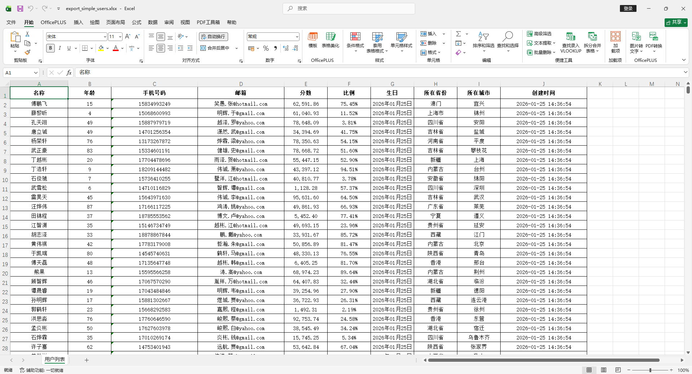

### `导入模版` 导出

导出一个只有表头或只有少量示例数据的一个模版，用于用户后续导入使用

```java
    @Test
    void testExportTemplate() {
        String fileName = "target/export_template_users.xlsx";
        FesodSheet
                .write(fileName, MyUser.class)
                .sheet("用户列表")
                .doWrite(Collections.emptyList());
    }
```

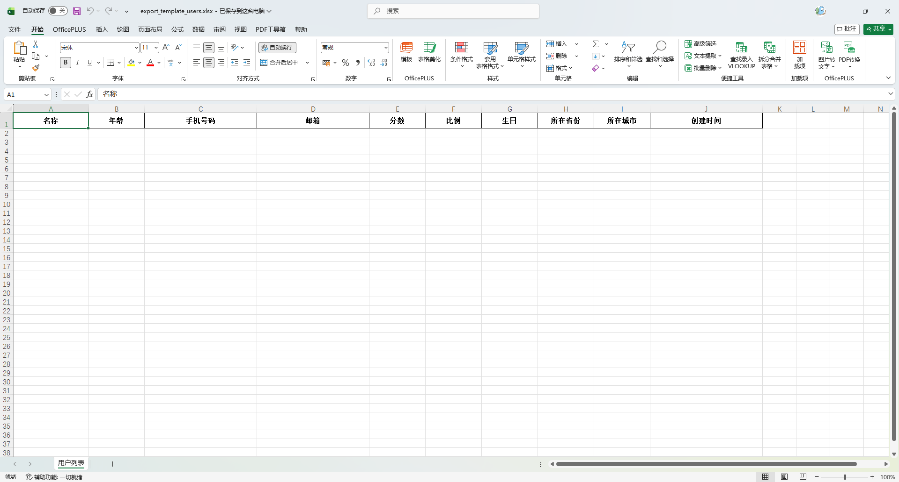

### 多级表头导出（合并单元格）

多级表头通过 `@ExcelProperty` 注解指定主标题和子标题，并自动合并单元格。

假设我们希望 Excel 表头结构如下：

```
| 基本信息        | 联系方式      | 成绩信息        | 地理位置   | 时间信息         |
| 用户ID | 姓名 | 年龄 | 手机号 | 邮箱 | 分数 | 比例 | 省份 | 城市 | 生日       | 创建时间           |点击复制错误复制
```

修改 `MyUser` 实体类，修改 `value` 和 `index`

> 如果不配置 index ，最终导出的数据分组数据会乱

```
@ExcelProperty(value = {"基本信息", "名称"}, index = 0)
```

**修改后的实体类**

```java
package io.github.atengk.entity;

import lombok.AllArgsConstructor;
import lombok.Builder;
import lombok.Data;
import lombok.NoArgsConstructor;
import org.apache.fesod.sheet.annotation.ExcelIgnore;
import org.apache.fesod.sheet.annotation.ExcelProperty;
import org.apache.fesod.sheet.annotation.format.DateTimeFormat;
import org.apache.fesod.sheet.annotation.format.NumberFormat;
import org.apache.fesod.sheet.annotation.write.style.*;
import org.apache.fesod.sheet.enums.BooleanEnum;
import org.apache.fesod.sheet.enums.poi.BorderStyleEnum;
import org.apache.fesod.sheet.enums.poi.HorizontalAlignmentEnum;
import org.apache.fesod.sheet.enums.poi.VerticalAlignmentEnum;

import java.io.Serializable;
import java.math.BigDecimal;
import java.math.RoundingMode;
import java.time.LocalDate;
import java.time.LocalDateTime;

@Data
@Builder
@NoArgsConstructor
@AllArgsConstructor
@HeadFontStyle(fontName = "宋体", fontHeightInPoints = 11, bold = BooleanEnum.TRUE)
@ContentFontStyle(fontName = "宋体", fontHeightInPoints = 11, bold = BooleanEnum.FALSE)
@HeadStyle(horizontalAlignment = HorizontalAlignmentEnum.CENTER, verticalAlignment = VerticalAlignmentEnum.CENTER, fillBackgroundColor = 9, fillForegroundColor = 9, borderLeft = BorderStyleEnum.THIN, borderRight = BorderStyleEnum.THIN, borderTop = BorderStyleEnum.THIN, borderBottom = BorderStyleEnum.THIN)
@ContentStyle(horizontalAlignment = HorizontalAlignmentEnum.CENTER, verticalAlignment = VerticalAlignmentEnum.CENTER, fillBackgroundColor = 9, fillForegroundColor = 9, borderLeft = BorderStyleEnum.THIN, borderRight = BorderStyleEnum.THIN, borderTop = BorderStyleEnum.THIN, borderBottom = BorderStyleEnum.THIN)
@HeadRowHeight(25)  // 设置表头行高
@ContentRowHeight(20)  // 设置数据内容行高
@ColumnWidth(15)       // 设置列宽
public class MyUser implements Serializable {

    private static final long serialVersionUID = 1L;

    /**
     * 主键id
     */
    @ExcelIgnore
    private Long id;

    /**
     * 名称
     */
    @ExcelProperty(value = {"基本信息", "名称"}, index = 0)
    @ColumnWidth(20) // 单独设置列宽
    private String name;

    /**
     * 年龄
     */
    @ExcelProperty(value = {"基本信息", "年龄"}, index = 1)
    private Integer age;

    /**
     * 手机号码
     */
    @ExcelProperty(value = {"联系方式", "手机号码"}, index = 2)
    @ColumnWidth(30) // 单独设置列宽
    private String phoneNumber;

    /**
     * 邮箱
     */
    @ExcelProperty(value = {"联系方式", "邮箱"}, index = 3)
    @ColumnWidth(30) // 单独设置列宽
    private String email;

    /**
     * 分数
     */
    @ExcelProperty(value = {"成绩信息", "分数"}, index = 4)
    @NumberFormat(value = "#,##0.00", roundingMode = RoundingMode.HALF_UP)
    private BigDecimal score;

    /**
     * 比例
     */
    @ExcelProperty(value = {"成绩信息", "比例"}, index = 5)
    @NumberFormat(value = "0.00%", roundingMode = RoundingMode.HALF_UP)
    private Double ratio;

    /**
     * 生日
     */
    @ExcelProperty(value = {"时间信息", "生日"}, index = 8)
    @DateTimeFormat("yyyy年MM月dd日")
    private LocalDate birthday;

    /**
     * 所在省份
     */
    @ExcelProperty(value = {"地理位置", "所在省份"}, index = 6)
    private String province;

    /**
     * 所在城市
     */
    @ExcelProperty(value = {"地理位置", "所在城市"}, index = 7)
    private String city;

    /**
     * 创建时间
     */
    @ExcelProperty(value = {"时间信息", "创建时间"}, index = 9)
    @DateTimeFormat("yyyy-MM-dd HH:mm:ss")
    @ColumnWidth(30) // 单独设置列宽
    private LocalDateTime createTime;

}
```

**使用方法**

```java
    @Test
    void testExportGroup() {
        List<MyUser> list = InitData.getDataList();
        String fileName = "target/export_group_users.xlsx";
        FesodSheet
                .write(fileName, MyUser.class)
                .sheet("用户列表")
                .doWrite(list);
    }
```

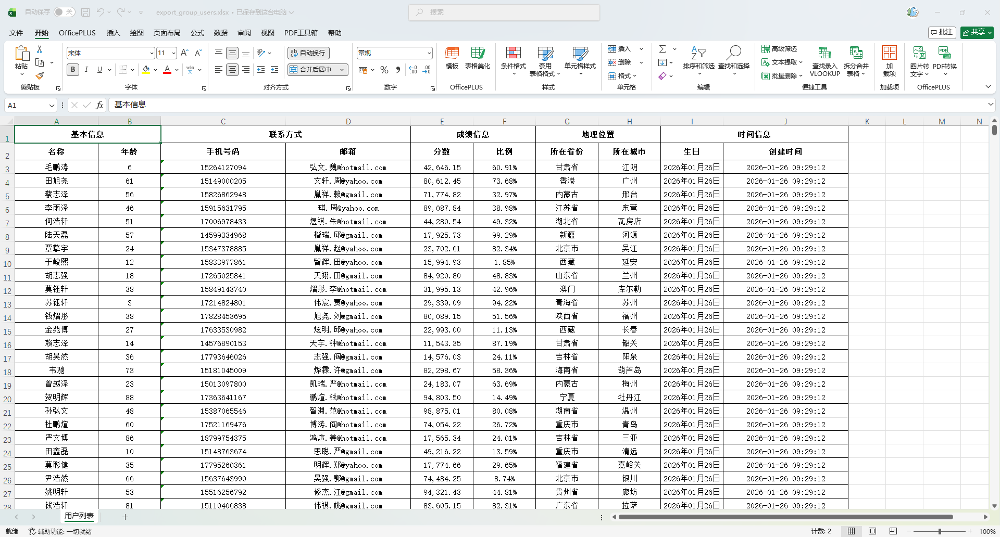

### 导出为多个 Sheet

**使用方法**

```java
    @Test
    void testExportMultiSheet() {
        String fileName = "target/export_multi_sheet_users.xlsx";
        try (ExcelWriter excelWriter = FesodSheet.write(fileName, MyUser.class).build()) {
            for (int i = 0; i < 5; i++) {
                WriteSheet writeSheet = FesodSheet.writerSheet(i, "用户列表" + i).build();
                excelWriter.write(InitData.getDataList(), writeSheet);
            }
        }
    }
```

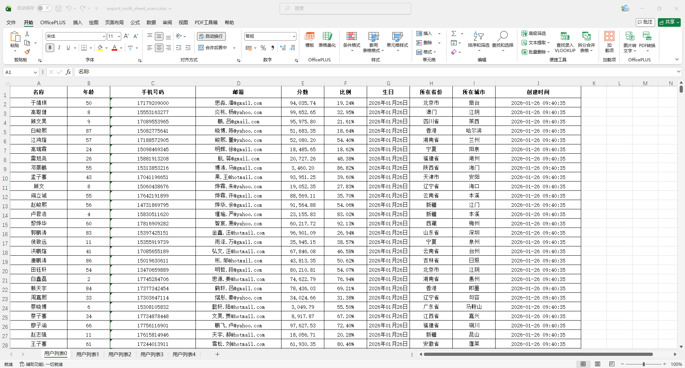

### 数据映射（Converter 转换器）

#### 创建Converter 

```java
package io.github.atengk.util;

import org.apache.fesod.sheet.converters.Converter;
import org.apache.fesod.sheet.enums.CellDataTypeEnum;
import org.apache.fesod.sheet.metadata.GlobalConfiguration;
import org.apache.fesod.sheet.metadata.data.ReadCellData;
import org.apache.fesod.sheet.metadata.data.WriteCellData;
import org.apache.fesod.sheet.metadata.property.ExcelContentProperty;

/**
 * 性别字段 Excel 映射转换器
 * <p>
 * 功能说明：
 * 1. 导出时：将 Java 中的性别编码转换为 Excel 可读文本
 * 2. 导入时：将 Excel 中的性别文本转换为 Java 性别编码
 * <p>
 * 映射规则：
 * Java -> Excel
 * 1  -> 男
 * 2  -> 女
 * 0  -> 未知
 * <p>
 * Excel -> Java
 * 男   -> 1
 * 女   -> 2
 * 未知 -> 0
 * <p>
 * 使用方式：
 * 在实体字段上配置：
 *
 * @author 孔余
 * @ExcelProperty(value = "性别", converter = GenderConverter.class)
 * <p>
 * 适用场景：
 * - 枚举字段导入导出
 * - 字典字段导入导出
 * - 固定映射规则字段
 * @since 2026-01-26
 */
public class GenderConverter implements Converter<Integer> {

    /**
     * 返回当前转换器支持的 Java 类型
     *
     * @return Java 字段类型
     */
    @Override
    public Class<?> supportJavaTypeKey() {
        return Integer.class;
    }

    /**
     * 返回当前转换器支持的 Excel 单元格类型
     *
     * @return Excel 单元格类型枚举
     */
    @Override
    public CellDataTypeEnum supportExcelTypeKey() {
        return CellDataTypeEnum.STRING;
    }

    /**
     * Excel -> Java 数据转换
     * <p>
     * 在 Excel 导入时执行：
     * 将单元格中的文本转换为 Java 字段值
     *
     * @param cellData            Excel 单元格数据
     * @param contentProperty     字段内容属性
     * @param globalConfiguration 全局配置
     * @return Java 字段值
     */
    @Override
    public Integer convertToJavaData(ReadCellData<?> cellData,
                                     ExcelContentProperty contentProperty,
                                     GlobalConfiguration globalConfiguration) {

        String value = cellData.getStringValue();

        if ("男".equals(value)) {
            return 1;
        }

        if ("女".equals(value)) {
            return 2;
        }

        if ("未知".equals(value)) {
            return 0;
        }

        return null;
    }

    /**
     * Java -> Excel 数据转换
     * <p>
     * 在 Excel 导出时执行：
     * 将 Java 字段值转换为 Excel 单元格显示文本
     *
     * @param value               Java 字段值
     * @param contentProperty     字段内容属性
     * @param globalConfiguration 全局配置
     * @return Excel 单元格数据对象
     */
    @Override
    public WriteCellData<?> convertToExcelData(Integer value,
                                               ExcelContentProperty contentProperty,
                                               GlobalConfiguration globalConfiguration) {

        String text;

        if (value == null) {
            text = "";
        } else if (value == 1) {
            text = "男";
        } else if (value == 2) {
            text = "女";
        } else if (value == 0) {
            text = "未知";
        } else {
            text = "未知";
        }

        return new WriteCellData<>(text);
    }
}
```

#### 添加字段

```java
    /**
     * 性别
     */
    @ExcelProperty(value = "性别", converter = GenderConverter.class)
    private Integer gender;
```

#### 使用方法

```java
    @Test
    void testExportConverter() {
        List<MyUser> list = InitData.getDataList();
        list.forEach(item -> item.setGender(RandomUtil.randomEle(Arrays.asList(0, 1, 2))));
        String fileName = "target/export_converter_users.xlsx";
        FesodSheet
                .write(fileName, MyUser.class)
                .sheet("用户列表")
                .doWrite(list);
    }
```

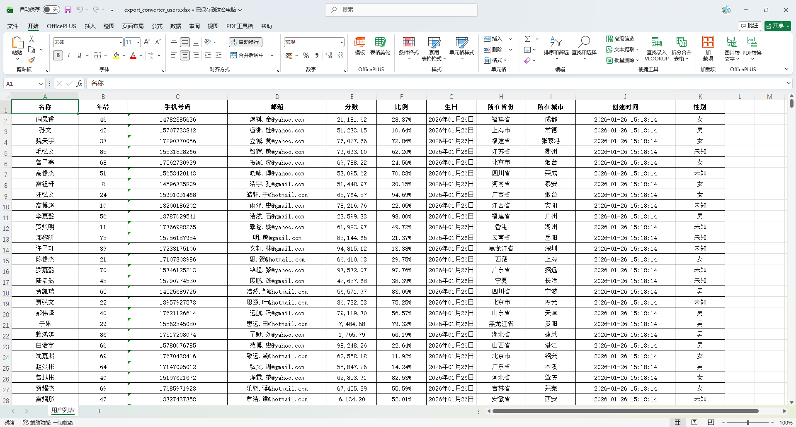


### 导出图片

如果图片的字段是String，可以按照本章节操作。如果是 文件、流、字节数组、URL 就直接使用，不用配置 Converter

参考文档：[链接](https://fesod.apache.org/zh-cn/docs/sheet/write/image)

#### 创建Converter

```java
package io.github.atengk.util;

import org.apache.fesod.common.util.IoUtils;
import org.apache.fesod.sheet.converters.Converter;
import org.apache.fesod.sheet.metadata.GlobalConfiguration;
import org.apache.fesod.sheet.metadata.data.WriteCellData;
import org.apache.fesod.sheet.metadata.property.ExcelContentProperty;
import org.slf4j.Logger;
import org.slf4j.LoggerFactory;

import java.io.IOException;
import java.io.InputStream;
import java.net.URL;

/**
 * 自定义 Excel 图片转换器，用于将 URL 字符串转换为 Excel 图片。
 * 该转换器支持：
 * 1. 通过 URL 下载图片并插入到 Excel 单元格中。
 * 2. 如果图片 URL 为空或无效，则使用默认图片 URL 进行替代。
 * 3. 保障 Excel 生成时不会因图片下载失败而导致异常。
 *
 * @author 孔余
 * @since 2026-01-26
 */
public class StringUrlImageConverter implements Converter<String> {

    /**
     * 默认图片 URL（当原始 URL 无效或下载失败时使用）
     */
    private static final String DEFAULT_IMAGE_URL = "https://placehold.co/100x100/png?text=Default";
    private static final Logger log = LoggerFactory.getLogger(StringUrlImageConverter.class);

    /**
     * 将 URL 字符串转换为 Excel 可用的图片数据。
     *
     * @param url                 图片的 URL 字符串
     * @param contentProperty     Excel 内容属性（未使用）
     * @param globalConfiguration 全局配置（未使用）
     * @return WriteCellData<?> 包含图片字节数组的 Excel 数据单元
     */
    @Override
    public WriteCellData<?> convertToExcelData(String url, ExcelContentProperty contentProperty, GlobalConfiguration globalConfiguration) {
        // 如果 URL 为空，则使用默认图片 URL
        String finalUrl = (url == null || url.trim().isEmpty()) ? DEFAULT_IMAGE_URL : url;

        // 下载图片（如果失败，则返回默认图片）
        byte[] imageBytes = downloadImage(finalUrl);
        if (imageBytes == null) {
            imageBytes = downloadImage(DEFAULT_IMAGE_URL);
        }

        return new WriteCellData<>(imageBytes);
    }

    /**
     * 从指定的 URL 下载图片并转换为字节数组。
     *
     * @param imageUrl 图片的 URL 地址
     * @return 图片的字节数组，如果下载失败则返回 null
     */
    private byte[] downloadImage(String imageUrl) {
        try (InputStream inputStream = new URL(imageUrl).openStream()) {
            return IoUtils.toByteArray(inputStream);
        } catch (IOException e) {
            log.error("图片下载失败：{}，使用默认图片替代", imageUrl, e);
        }
        // 失败时返回 null
        return null;
    }
}
```

#### 添加图片字段

- 添加图片字段并设置 converter
- 图片内容宽度行高比例推荐：1:5

```java
@ContentRowHeight(100)  // 设置数据内容行高
public class MyUser implements Serializable {

    /**
     * 图片
     */
    @ExcelProperty(value = "图片", converter = StringUrlImageConverter.class)
    @ColumnWidth(20)
    private String imageUrl;

}
```

#### 使用方法

```java
    @Test
    void testExportImage() {
        List<MyUser> list = InitData.getDataList(5);
        String[] images = {"https://placehold.co/100x100/png?text=Ateng", "error"};
        list.forEach(item -> {
            item.setImageUrl(RandomUtil.randomEle(images));
        });
        String fileName = "target/export_image_users.xlsx";
        FesodSheet
                .write(fileName, MyUser.class)
                .sheet("用户列表")
                .doWrite(list);
    }
```

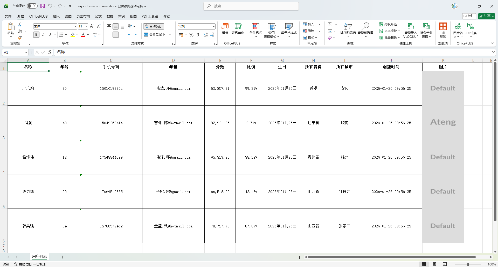

### 合并单元格

#### 创建处理器

```java
package io.github.atengk.handler;

import org.apache.fesod.sheet.write.handler.CellWriteHandler;
import org.apache.fesod.sheet.write.handler.context.CellWriteHandlerContext;
import org.apache.poi.ss.usermodel.*;
import org.apache.poi.ss.util.CellRangeAddress;

import java.text.SimpleDateFormat;
import java.util.*;

/**
 * Excel 单元格自动纵向合并策略（支持指定列或所有列）。
 * <p>
 * 功能特点：
 * <ul>
 *     <li>连续相邻行相同值自动合并（支持多列选择）</li>
 *     <li>合并后保留原单元格样式，仅增加水平垂直居中</li>
 *     <li>支持公式计算后的显示值比较，避免类型差异</li>
 *     <li>使用缓存减少重复样式创建</li>
 * </ul>
 * 使用场景：
 * <pre>
 * EasyExcel.write(file, Data.class)
 *     .registerWriteHandler(new CellMergeHandler(0, 1))
 *     .sheet().doWrite(dataList);
 * </pre>
 *
 * @author 孔余
 * @since 2026-01-26
 */
public class CellMergeHandler implements CellWriteHandler {

    private static final SimpleDateFormat DATE_TIME_FORMAT =
            new SimpleDateFormat("yyyy-MM-dd HH:mm:ss");

    /**
     * 需要合并的列索引（从 0 开始）。
     * 数组为空表示处理所有列。
     */
    private final int[] mergeColumns;

    /**
     * 是否合并所有列（根据 mergeColumns 判断）。
     */
    private final boolean mergeAllColumns;

    /**
     * 单元格值格式化工具，用于比较时统一格式。
     */
    private DataFormatter formatter;

    /**
     * 公式计算器（懒加载，按需创建）。
     */
    private FormulaEvaluator evaluator;

    /**
     * 样式缓存，key 为原样式，value 为添加了居中属性的新样式。
     * 避免频繁创建重复的 CellStyle 对象。
     */
    private final Map<CellStyle, CellStyle> styleCache = new HashMap<>();

    /**
     * 列合并区域缓存。
     * key 为列索引，value 为该列当前的最后一个合并区域。
     */
    private final Map<Integer, CellRangeAddress> lastMergedRegionByCol = new HashMap<>();

    /**
     * 构造方法，合并所有列。
     */
    public CellMergeHandler() {
        this.mergeColumns = new int[0];
        this.mergeAllColumns = true;
    }

    /**
     * 构造方法，仅合并指定列。
     *
     * @param mergeColumns 列索引（从 0 开始）；null 或空表示合并所有列
     */
    public CellMergeHandler(int... mergeColumns) {
        this.mergeColumns = mergeColumns == null ? new int[0] : Arrays.copyOf(mergeColumns, mergeColumns.length);
        this.mergeAllColumns = this.mergeColumns.length == 0;
    }

    @Override
    public void afterCellDispose(CellWriteHandlerContext context) {
        // 跳过表头行
        if (Boolean.TRUE.equals(context.getHead())) {
            return;
        }

        // 获取当前单元格与 Sheet
        final Cell cell = context.getCell();
        if (cell == null) {
            return;
        }
        final Sheet sheet = context.getWriteSheetHolder().getSheet();
        if (sheet == null) {
            return;
        }

        // 初始化工具类（懒加载）
        if (formatter == null) {
            formatter = new DataFormatter(Locale.getDefault());
        }
        if (evaluator == null) {
            evaluator = sheet.getWorkbook().getCreationHelper().createFormulaEvaluator();
        }

        final int rowIndex = cell.getRowIndex();
        final int colIndex = cell.getColumnIndex();

        // 检查是否需要处理该列
        if (!shouldMergeColumn(colIndex)) {
            return;
        }

        // 第一行不合并
        if (rowIndex <= 0) {
            return;
        }

        // 获取当前值与上一行值
        final String current = getCellText(cell);
        if (isBlank(current)) {
            return;
        }
        final String prev = getCellText(getCell(sheet, rowIndex - 1, colIndex));

        // 值不同则不合并
        if (!Objects.equals(current, prev)) {
            return;
        }

        // 查找或创建合并区域
        CellRangeAddress region = lastMergedRegionByCol.get(colIndex);
        if (region == null || region.getLastRow() != rowIndex - 1) {
            Integer idx = findMergedRegionIndex(sheet, rowIndex - 1, colIndex);
            if (idx != null) {
                region = sheet.getMergedRegion(idx);
                region = new CellRangeAddress(region.getFirstRow(), region.getLastRow(),
                        region.getFirstColumn(), region.getLastColumn());
            } else {
                CellRangeAddress newRegion = new CellRangeAddress(rowIndex - 1, rowIndex, colIndex, colIndex);
                sheet.addMergedRegion(newRegion);
                setRegionCenterStyle(sheet, newRegion);
                lastMergedRegionByCol.put(colIndex, newRegion);
                return;
            }
        }

        // 扩展已有合并区域
        removeRegionIfPresent(sheet, region);
        CellRangeAddress extended = new CellRangeAddress(region.getFirstRow(), rowIndex,
                colIndex, colIndex);
        sheet.addMergedRegion(extended);
        setRegionCenterStyle(sheet, extended);
        lastMergedRegionByCol.put(colIndex, extended);
    }

    /**
     * 判断当前列是否需要合并。
     *
     * @param colIndex 列索引
     * @return 是否需要处理
     */
    private boolean shouldMergeColumn(int colIndex) {
        if (mergeAllColumns) {
            return true;
        }
        for (int c : mergeColumns) {
            if (c == colIndex) {
                return true;
            }
        }
        return false;
    }

    /**
     * 获取单元格文本值。
     * 统一使用 DataFormatter 格式化，支持公式计算。
     *
     * @param cell 单元格
     * @return 格式化后的文本
     */
    private String getCellText(Cell cell) {
        if (cell == null) {
            return "";
        }

        CellType type = cell.getCellType();
        if (type == CellType.FORMULA) {
            type = cell.getCachedFormulaResultType();
        }

        switch (type) {
            case STRING:
                return trimToEmpty(cell.getStringCellValue());

            case NUMERIC:
                try {
                    Date date = cell.getDateCellValue();
                    return formatDate(date);
                } catch (Exception e) {
                    // 不是日期，才当普通数字处理
                    return trimToEmpty(formatter.formatCellValue(cell));
                }

            case BOOLEAN:
                return String.valueOf(cell.getBooleanCellValue());

            case BLANK:
                return "";

            default:
                return trimToEmpty(formatter.formatCellValue(cell));
        }
    }

    /**
     * 时间格式化
     *
     * @param date 时间
     * @return 格式化时间字符串
     */
    private String formatDate(Date date) {
        if (date == null) {
            return "";
        }
        return DATE_TIME_FORMAT.format(date);
    }

    /**
     * 获取指定位置的单元格。
     *
     * @param sheet Sheet
     * @param row   行号
     * @param col   列号
     * @return 单元格
     */
    private Cell getCell(Sheet sheet, int row, int col) {
        if (sheet == null || row < 0 || col < 0) {
            return null;
        }
        Row r = sheet.getRow(row);
        return (r == null) ? null : r.getCell(col);
    }

    /**
     * 查找包含指定行列的单列合并区域索引。
     *
     * @param sheet Sheet
     * @param row   行号
     * @param col   列号
     * @return 区域索引，找不到返回 null
     */
    private Integer findMergedRegionIndex(Sheet sheet, int row, int col) {
        int num = sheet.getNumMergedRegions();
        for (int i = 0; i < num; i++) {
            CellRangeAddress region = sheet.getMergedRegion(i);
            if (region.getFirstColumn() == col && region.getLastColumn() == col
                    && region.getFirstRow() <= row && row <= region.getLastRow()) {
                return i;
            }
        }
        return null;
    }

    /**
     * 删除指定的合并区域（按范围精确匹配）。
     *
     * @param sheet  Sheet
     * @param target 合并区域
     */
    private void removeRegionIfPresent(Sheet sheet, CellRangeAddress target) {
        if (sheet == null || target == null) {
            return;
        }
        for (int i = sheet.getNumMergedRegions() - 1; i >= 0; i--) {
            CellRangeAddress r = sheet.getMergedRegion(i);
            if (r.getFirstRow() == target.getFirstRow()
                    && r.getLastRow() == target.getLastRow()
                    && r.getFirstColumn() == target.getFirstColumn()
                    && r.getLastColumn() == target.getLastColumn()) {
                sheet.removeMergedRegion(i);
                return;
            }
        }
    }

    /**
     * 将合并区域设置为居中（保留原样式，使用缓存减少重复创建）。
     *
     * @param sheet  Sheet
     * @param region 合并区域
     */
    private void setRegionCenterStyle(Sheet sheet, CellRangeAddress region) {
        if (sheet == null || region == null) {
            return;
        }

        Workbook wb = sheet.getWorkbook();

        for (int row = region.getFirstRow(); row <= region.getLastRow(); row++) {
            Row r = sheet.getRow(row);
            if (r == null) {
                continue;
            }

            for (int col = region.getFirstColumn(); col <= region.getLastColumn(); col++) {
                Cell cell = r.getCell(col);
                if (cell == null) {
                    continue;
                }

                CellStyle oldStyle = cell.getCellStyle();
                CellStyle newStyle = styleCache.get(oldStyle);
                if (newStyle == null) {
                    newStyle = wb.createCellStyle();
                    if (oldStyle != null) {
                        newStyle.cloneStyleFrom(oldStyle);
                    }
                    newStyle.setAlignment(HorizontalAlignment.CENTER);
                    newStyle.setVerticalAlignment(VerticalAlignment.CENTER);
                    styleCache.put(oldStyle, newStyle);
                }
                cell.setCellStyle(newStyle);
            }
        }
    }

    /**
     * 判断字符串是否为空白。
     *
     * @param s 字符串
     * @return 是否为空白
     */
    private static boolean isBlank(String s) {
        return s == null || s.trim().isEmpty();
    }

    /**
     * 去除首尾空格，null 转为空串。
     *
     * @param s 字符串
     * @return 去空格后的字符串
     */
    private static String trimToEmpty(String s) {
        return s == null ? "" : s.trim();
    }
}
```

#### 使用方法

- 所有列相同的内容自动合并，不用传参：`new CellMergeStrategy()`
- 指定列相同的内容自动合并，传参列索引，从0开始，和 `@ExcelProperty(index = 9)` 保持一致：`new CellMergeStrategy(0,1,2,3,4,5,6, 7, 8, 9)`

```java
    @Test
    void testExportMerge() {
        List<MyUser> list = InitData.getDataList();
        // 数据按照省份+城市排序
        list.sort(Comparator
                .comparing(MyUser::getProvince)
                .thenComparing(MyUser::getCity));
        String fileName = "target/export_merge_users.xlsx";
        FesodSheet
                .write(fileName, MyUser.class)
                //.registerWriteHandler(new CellMergeHandler(0,1,2,3,4,5,6, 7, 8, 9))
                .registerWriteHandler(new CellMergeHandler())
                .sheet("用户列表")
                .doWrite(list);
    }
```

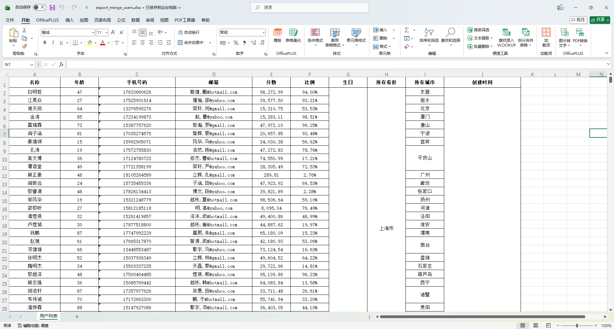

### 生成下拉

#### 创建处理器

```java
package io.github.atengk.handler;

import org.apache.fesod.sheet.write.handler.SheetWriteHandler;
import org.apache.fesod.sheet.write.handler.context.SheetWriteHandlerContext;
import org.apache.poi.ss.usermodel.*;
import org.apache.poi.ss.util.CellRangeAddressList;

import java.util.HashMap;
import java.util.Map;

/**
 * Excel 下拉框处理器（用于导入模板）
 *
 * 特点：
 * 1. 支持多列不同下拉框
 * 2. 默认从数据行开始，一直到 Excel 最大行
 * 3. 适用于“只有表头 / 只有一行示例数据”的模板场景
 *
 * 使用示例：
 * Map<Integer, String[]> dropdownMap = new HashMap<>();
 * dropdownMap.put(1, new String[]{"1", "2"});
 * dropdownMap.put(3, new String[]{"男", "女"});
 *
 * EasyExcel.write(file, User.class)
 *     .registerWriteHandler(new DropdownHandler(dropdownMap, 1))
 *     .sheet().doWrite(Collections.emptyList());
 *
 * 说明：
 * rowStart = 1 表示从第 2 行开始（第 1 行是表头）
 *
 * @author 孔余
 * @since 2026-01-26
 */
public class DropdownHandler implements SheetWriteHandler {

    /**
     * key：列索引（从 0 开始）
     * value：该列的下拉选项
     */
    private final Map<Integer, String[]> dropdownMap = new HashMap<>();

    /**
     * 下拉生效起始行（通常是 1，跳过表头）
     */
    private final int startRow;

    /**
     * Excel 最大行（XSSF 是 1048575）
     */
    private static final int EXCEL_MAX_ROW = 1_048_575;

    public DropdownHandler(Map<Integer, String[]> dropdownMap, int startRow) {
        if (dropdownMap != null) {
            this.dropdownMap.putAll(dropdownMap);
        }
        this.startRow = startRow < 0 ? 0 : startRow;
    }

    @Override
    public void afterSheetCreate(SheetWriteHandlerContext context) {
        Sheet sheet = context.getWriteSheetHolder().getSheet();
        if (sheet == null || dropdownMap.isEmpty()) {
            return;
        }

        DataValidationHelper helper = sheet.getDataValidationHelper();

        for (Map.Entry<Integer, String[]> entry : dropdownMap.entrySet()) {
            Integer colIndex = entry.getKey();
            String[] options = entry.getValue();

            if (colIndex == null || options == null || options.length == 0) {
                continue;
            }

            // 下拉框约束
            DataValidationConstraint constraint =
                    helper.createExplicitListConstraint(options);

            // 整列生效：从 startRow 到 Excel 最大行
            CellRangeAddressList addressList =
                    new CellRangeAddressList(startRow, EXCEL_MAX_ROW, colIndex, colIndex);

            DataValidation validation =
                    helper.createValidation(constraint, addressList);

            // 兼容 Excel 行为
            validation.setSuppressDropDownArrow(true);
            validation.setShowErrorBox(true);
            validation.setErrorStyle(DataValidation.ErrorStyle.STOP);
            validation.createErrorBox("输入错误", "请从下拉列表中选择合法值");

            sheet.addValidationData(validation);
        }
    }
}
```

#### 使用方法

```java
    @Test
    void testExportDropdown() {
        String fileName = "target/export_dropdown_users.xlsx";

        Map<Integer, String[]> dropdownMap = new HashMap<>();
        dropdownMap.put(1, new String[]{"1", "2"});           // 第 2 列
        dropdownMap.put(3, new String[]{"男", "女", "未知"});  // 第 4 列

        FesodSheet
                .write(fileName, MyUser.class)
                .registerWriteHandler(new DropdownHandler(dropdownMap, 1))
                .sheet("用户列表")
                .doWrite(Collections.emptyList());
    }
```

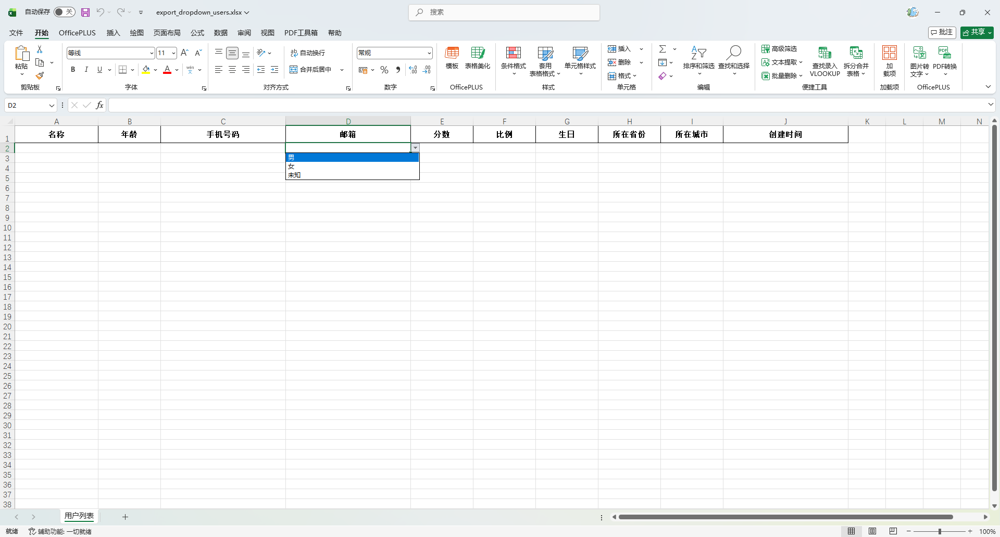

### 生成批注

#### 创建处理器

```java
package io.github.atengk.handler;

import org.apache.fesod.sheet.write.handler.SheetWriteHandler;
import org.apache.fesod.sheet.write.handler.context.SheetWriteHandlerContext;
import org.apache.poi.ss.usermodel.*;

import java.util.HashMap;
import java.util.Map;

/**
 * Excel 批注处理器（用于导入模板，自动适配多级表头）
 * <p>
 * 功能特点：
 * <ul>
 *     <li>支持多列不同批注</li>
 *     <li>自动识别表头层级，批注始终加在“最底层表头”</li>
 *     <li>兼容单级 / 多级表头</li>
 *     <li>非常适合 Excel 导入模板字段说明</li>
 * </ul>
 * <p>
 * 使用示例：
 * <pre>
 * Map<Integer, String> commentMap = new HashMap<>();
 * commentMap.put(0, "请输入用户姓名，必填");
 * commentMap.put(1, "年龄，必须是整数");
 * commentMap.put(3, "性别：男 / 女 / 未知");
 *
 * FesodSheet.write(file, User.class)
 *     .registerWriteHandler(new CommentHandler(commentMap))
 *     .sheet("用户列表")
 *     .doWrite(Collections.emptyList());
 * </pre>
 *
 * @author 孔余
 * @since 2026-01-26
 */
public class CommentHandler implements SheetWriteHandler {

    /**
     * key：列索引（从 0 开始）
     * value：批注内容
     */
    private final Map<Integer, String> commentMap = new HashMap<>();

    public CommentHandler(Map<Integer, String> commentMap) {
        if (commentMap != null) {
            this.commentMap.putAll(commentMap);
        }
    }

    @Override
    public void afterSheetCreate(SheetWriteHandlerContext context) {
        Sheet sheet = context.getWriteSheetHolder().getSheet();
        if (sheet == null || commentMap.isEmpty()) {
            return;
        }

        Workbook workbook = sheet.getWorkbook();
        CreationHelper factory = workbook.getCreationHelper();
        Drawing<?> drawing = sheet.createDrawingPatriarch();

        /*
         * 表头总行数：
         * 单级表头 = 1
         * 二级表头 = 2
         * 三级表头 = 3
         */
        int headRowNumber = context.getWriteSheetHolder()
                .getExcelWriteHeadProperty()
                .getHeadRowNumber();

        /*
         * 真正字段所在行 = 最后一行表头
         */
        int realHeadRowIndex = headRowNumber - 1;

        for (Map.Entry<Integer, String> entry : commentMap.entrySet()) {
            Integer colIndex = entry.getKey();
            String commentText = entry.getValue();

            if (colIndex == null || commentText == null || commentText.trim().isEmpty()) {
                continue;
            }

            Row row = sheet.getRow(realHeadRowIndex);
            if (row == null) {
                row = sheet.createRow(realHeadRowIndex);
            }

            Cell cell = row.getCell(colIndex);
            if (cell == null) {
                cell = row.createCell(colIndex);
            }

            // 批注显示区域（右下角弹出）
            ClientAnchor anchor = factory.createClientAnchor();
            anchor.setCol1(colIndex);
            anchor.setCol2(colIndex + 3);
            anchor.setRow1(realHeadRowIndex);
            anchor.setRow2(realHeadRowIndex + 4);

            Comment comment = drawing.createCellComment(anchor);
            comment.setString(factory.createRichTextString(commentText));
            comment.setAuthor("Ateng");

            cell.setCellComment(comment);
        }
    }
}
```

#### 使用方法

```java
    @Test
    void testExportComment() {
        String fileName = "target/export_comment_users.xlsx";

        Map<Integer, String> commentMap = new HashMap<>();
        commentMap.put(0, "请输入用户姓名，必填");
        commentMap.put(1, "请输入年龄，必须是正整数");
        commentMap.put(2, "手机号格式：11 位数字");
        commentMap.put(4, "分数范围：0 ~ 100");

        FesodSheet
                .write(fileName, MyUser.class)
                .registerWriteHandler(new CommentHandler(commentMap))
                .sheet("用户列表")
                .doWrite(Collections.emptyList());
    }
```

- 每个指定列的表头右上角都有一个红色小三角
- 鼠标悬停显示你写的说明文字

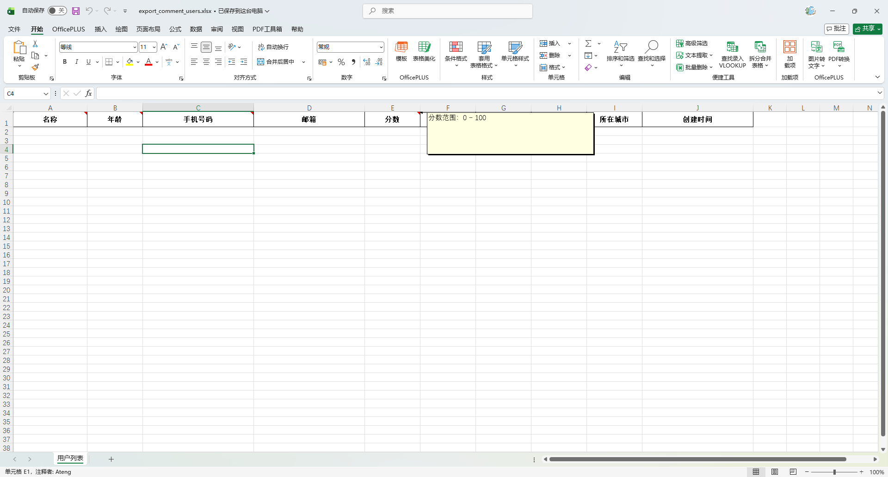

### 冻结表头

#### 创建处理器

```java
package io.github.atengk.handler;

import org.apache.fesod.sheet.write.handler.SheetWriteHandler;
import org.apache.fesod.sheet.write.handler.context.SheetWriteHandlerContext;
import org.apache.poi.ss.usermodel.Sheet;

/**
 * Excel 冻结表头处理器（自动适配多级表头）
 * <p>
 * 功能说明：
 * 1. 只冻结表头区域
 * 2. 自动识别多级表头（单级 / 二级 / 三级…）
 * 3. 不冻结任何列
 * <p>
 * 冻结规则：
 * - 冻结行数 = Fesod 自动计算出的表头总行数
 * - 冻结列数 = 0
 * <p>
 * 适用场景：
 * - 导出模板
 * - 导入模板
 * - 多级表头 Excel
 * <p>
 * 使用示例：
 * FesodSheet.write(fileName, MyUser.class)
 * .registerWriteHandler(new FreezeHeadHandler())
 * .sheet("用户列表")
 * .doWrite(data);
 *
 * @author 孔余
 * @since 2026-01-26
 */
public class FreezeHeadHandler implements SheetWriteHandler {

    @Override
    public void afterSheetCreate(SheetWriteHandlerContext context) {
        Sheet sheet = context.getWriteSheetHolder().getSheet();
        if (sheet == null) {
            return;
        }

        /*
         * Fesod 已经帮我们算好了真实表头行数：
         * 单级表头 → 1
         * 二级表头 → 2
         * 三级表头 → 3
         * …
         */
        int headRowNumber = context.getWriteSheetHolder()
                .getExcelWriteHeadProperty()
                .getHeadRowNumber();

        if (headRowNumber <= 0) {
            return;
        }

        /*
         * 只冻结行，不冻结列：
         * colSplit = 0
         * rowSplit = 表头总行数
         */
        sheet.createFreezePane(0, headRowNumber);
    }
}
```

#### 使用方法

```java
    @Test
    void testExportFreezeHead() {
        List<MyUser> list = InitData.getDataList();
        String fileName = "target/export_freeze_head_users.xlsx";
        FesodSheet
                .write(fileName, MyUser.class)
                .registerWriteHandler(new FreezeHeadHandler())
                .sheet("用户列表")
                .doWrite(list);
    }
```

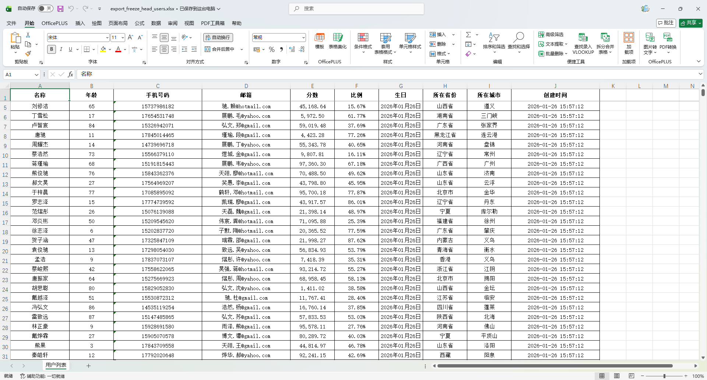

### 自定义样式

#### 创建样式工具类

```java
package io.github.atengk.util;

import org.apache.fesod.common.util.StringUtils;
import org.apache.fesod.sheet.write.metadata.style.WriteCellStyle;
import org.apache.fesod.sheet.write.metadata.style.WriteFont;
import org.apache.fesod.sheet.write.style.HorizontalCellStyleStrategy;
import org.apache.poi.ss.usermodel.*;

/**
 * Excel 样式工具类（基于 Apache Fesod）
 * <p>
 * 统一管理 Excel 导出中表头与内容的样式策略构建逻辑。
 * 对外只提供样式策略构建能力，内部实现全部封装。
 * </p>
 *
 * @author 孔余
 * @since 2026-01-26
 */
public final class ExcelStyleUtil {

    /**
     * 禁止实例化工具类
     */
    private ExcelStyleUtil() {
        throw new UnsupportedOperationException("工具类不可实例化");
    }

    /**
     * 默认表头字体大小（磅）
     */
    public static final short DEFAULT_HEADER_FONT_SIZE = 11;

    /**
     * 默认内容字体大小（磅）
     */
    public static final short DEFAULT_CONTENT_FONT_SIZE = 11;

    /**
     * 默认字体名称
     */
    public static final String DEFAULT_FONT_NAME = "宋体";

    /**
     * 构建默认样式策略（推荐直接使用）
     *
     * @return 默认的表头 + 内容样式策略
     */
    public static HorizontalCellStyleStrategy getDefaultStyleStrategy() {
        return buildCustomStyleStrategy(
                DEFAULT_HEADER_FONT_SIZE,
                true,
                false,
                IndexedColors.BLACK.getIndex(),
                DEFAULT_FONT_NAME,
                IndexedColors.WHITE.getIndex(),
                BorderStyle.THIN,
                HorizontalAlignment.CENTER,
                VerticalAlignment.CENTER,

                DEFAULT_CONTENT_FONT_SIZE,
                false,
                false,
                IndexedColors.BLACK.getIndex(),
                DEFAULT_FONT_NAME,
                null,
                BorderStyle.THIN,
                HorizontalAlignment.CENTER,
                VerticalAlignment.CENTER,
                false
        );
    }

    /**
     * 构建完全可配置的 Excel 样式策略。
     * <p>
     * 该方法用于一次性构建“表头样式 + 内容样式”的组合策略，
     * 支持字体、颜色、背景、边框、对齐方式、是否自动换行等所有常用样式配置，
     * 适用于导出 Excel 时对整体风格进行统一控制。
     * </p>
     *
     * @param headFontSize           表头字体大小（单位：磅）
     * @param headBold               表头字体是否加粗
     * @param headItalic             表头字体是否斜体
     * @param headFontColor          表头字体颜色（IndexedColors 枚举值）
     * @param headFontName           表头字体名称，如“微软雅黑”
     * @param headBackgroundColor    表头背景色（IndexedColors 枚举值），为 null 表示不设置背景色
     * @param headBorderStyle        表头单元格边框样式
     * @param headHorizontalAlign    表头水平对齐方式
     * @param headVerticalAlign      表头垂直对齐方式
     * @param contentFontSize        内容字体大小（单位：磅）
     * @param contentBold            内容字体是否加粗
     * @param contentItalic          内容字体是否斜体
     * @param contentFontColor       内容字体颜色（IndexedColors 枚举值）
     * @param contentFontName        内容字体名称
     * @param contentBackgroundColor 内容背景色（IndexedColors 枚举值），为 null 表示不设置背景色
     * @param contentBorderStyle     内容单元格边框样式
     * @param contentHorizontalAlign 内容水平对齐方式
     * @param contentVerticalAlign   内容垂直对齐方式
     * @param contentWrapped         内容是否自动换行
     * @return 水平样式策略对象（包含表头样式 + 内容样式）
     */
    public static HorizontalCellStyleStrategy buildCustomStyleStrategy(
            short headFontSize,
            boolean headBold,
            boolean headItalic,
            short headFontColor,
            String headFontName,
            Short headBackgroundColor,
            BorderStyle headBorderStyle,
            HorizontalAlignment headHorizontalAlign,
            VerticalAlignment headVerticalAlign,

            short contentFontSize,
            boolean contentBold,
            boolean contentItalic,
            short contentFontColor,
            String contentFontName,
            Short contentBackgroundColor,
            BorderStyle contentBorderStyle,
            HorizontalAlignment contentHorizontalAlign,
            VerticalAlignment contentVerticalAlign,
            boolean contentWrapped
    ) {

        WriteCellStyle headStyle = buildCellStyle(
                headHorizontalAlign,
                headVerticalAlign,
                headBackgroundColor,
                headFontSize,
                headBold,
                headItalic,
                headFontColor,
                headFontName,
                headBorderStyle,
                false
        );

        WriteCellStyle contentStyle = buildCellStyle(
                contentHorizontalAlign,
                contentVerticalAlign,
                contentBackgroundColor,
                contentFontSize,
                contentBold,
                contentItalic,
                contentFontColor,
                contentFontName,
                contentBorderStyle,
                contentWrapped
        );

        return new HorizontalCellStyleStrategy(headStyle, contentStyle);
    }

    /**
     * 构建单个单元格的写入样式对象。
     * <p>
     * 该方法为内部通用构建方法，用于根据参数组合生成 WriteCellStyle，
     * 同时完成对齐方式、背景色、字体样式、边框样式以及是否自动换行的统一设置。
     * </p>
     *
     * @param horizontalAlignment 水平对齐方式
     * @param verticalAlignment   垂直对齐方式
     * @param backgroundColor     背景色（IndexedColors 枚举值），为 null 表示不设置背景
     * @param fontSize            字体大小（磅）
     * @param bold                是否加粗
     * @param italic              是否斜体
     * @param fontColor           字体颜色（IndexedColors 枚举值）
     * @param fontName            字体名称
     * @param borderStyle         边框样式
     * @param wrapped             是否自动换行
     * @return 构建完成的 WriteCellStyle 对象
     */
    private static WriteCellStyle buildCellStyle(
            HorizontalAlignment horizontalAlignment,
            VerticalAlignment verticalAlignment,
            Short backgroundColor,
            short fontSize,
            boolean bold,
            boolean italic,
            short fontColor,
            String fontName,
            BorderStyle borderStyle,
            boolean wrapped
    ) {
        WriteCellStyle style = new WriteCellStyle();
        style.setHorizontalAlignment(horizontalAlignment);
        style.setVerticalAlignment(verticalAlignment);
        style.setWrapped(wrapped);

        applyBackground(style, backgroundColor);
        style.setWriteFont(buildFont(fontSize, bold, italic, fontColor, fontName));
        applyBorder(style, borderStyle);

        return style;
    }

    /**
     * 构建字体样式对象。
     * <p>
     * 统一封装字体大小、加粗、斜体、颜色及字体名称的设置逻辑，
     * 供单元格样式构建过程复用。
     * </p>
     *
     * @param fontSize  字体大小（磅）
     * @param bold      是否加粗
     * @param italic    是否斜体
     * @param fontColor 字体颜色（IndexedColors 枚举值）
     * @param fontName  字体名称
     * @return 构建完成的 WriteFont 对象
     */
    private static WriteFont buildFont(
            short fontSize,
            boolean bold,
            boolean italic,
            short fontColor,
            String fontName
    ) {
        WriteFont font = new WriteFont();
        font.setFontHeightInPoints(fontSize);
        font.setBold(bold);
        font.setItalic(italic);
        font.setColor(fontColor);

        if (StringUtils.isNotBlank(fontName)) {
            font.setFontName(fontName);
        }

        return font;
    }

    /**
     * 设置单元格背景色。
     * <p>
     * 若 backgroundColor 不为 null，则设置填充颜色并启用实心填充模式；
     * 若为 null，则表示不设置背景色，采用无填充模式。
     * </p>
     *
     * @param style           单元格写入样式对象
     * @param backgroundColor 背景色（IndexedColors 枚举值），可为 null
     */
    private static void applyBackground(WriteCellStyle style, Short backgroundColor) {
        if (backgroundColor != null) {
            style.setFillForegroundColor(backgroundColor);
            style.setFillPatternType(FillPatternType.SOLID_FOREGROUND);
        } else {
            style.setFillPatternType(FillPatternType.NO_FILL);
        }
    }

    /**
     * 设置单元格四个方向的边框样式。
     * <p>
     * 包括：上、下、左、右四条边统一使用同一种边框样式，
     * 用于快速构建风格统一的表格边框效果。
     * </p>
     *
     * @param style       单元格写入样式对象
     * @param borderStyle 边框样式枚举（如 THIN、MEDIUM、DASHED、DOUBLE 等）
     */
    private static void applyBorder(WriteCellStyle style, BorderStyle borderStyle) {
        style.setBorderTop(borderStyle);
        style.setBorderBottom(borderStyle);
        style.setBorderLeft(borderStyle);
        style.setBorderRight(borderStyle);
    }

}
```

#### 使用方法

**使用默认配置**

```java
    @Test
    void testExportStyle() {
        List<MyUser> list = InitData.getDataList();
        String fileName = "target/export_style_users.xlsx";
        FesodSheet
                .write(fileName, MyUser.class)
                .registerWriteHandler(ExcelStyleUtil.getDefaultStyleStrategy())
                .sheet("用户列表")
                .doWrite(list);
    }
```

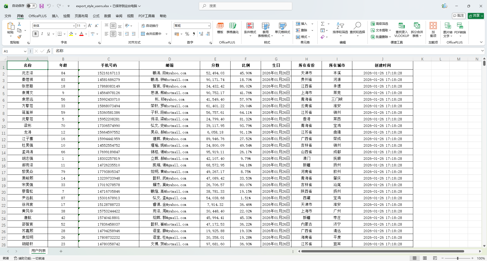

**自定义配置**

```java
    @Test
    void testExportCustomStyle() {
        List<MyUser> list = InitData.getDataList();

        // 默认表头字体大小（磅）
         Short DEFAULT_HEADER_FONT_SIZE = 14;
        // 默认内容字体大小（磅）
         Short DEFAULT_CONTENT_FONT_SIZE = 12;
        // 默认内容字体
         String DEFAULT_CONTENT_FONT_NAME = "微软雅黑";
        HorizontalCellStyleStrategy cellStyleStrategy = ExcelStyleUtil.buildCustomStyleStrategy(
                // 表头字体大小（单位：磅）
                DEFAULT_HEADER_FONT_SIZE,
                // 表头是否加粗
                false,
                // 表头是否斜体
                false,
                // 表头字体颜色（使用 IndexedColors 枚举值）
                IndexedColors.BLACK.getIndex(),
                // 表头字体名称
                DEFAULT_CONTENT_FONT_NAME,
                // 表头背景色（设置为浅灰色）
                IndexedColors.GREY_40_PERCENT.getIndex(),
                // 表头边框样式
                BorderStyle.DOUBLE,
                // 表头水平居中对齐
                HorizontalAlignment.CENTER,
                // 表头垂直居中对齐
                VerticalAlignment.CENTER,
                // 内容字体大小
                DEFAULT_CONTENT_FONT_SIZE,
                // 内容是否加粗
                false,
                // 内容是否斜体
                false,
                // 内容字体颜色（黑色）
                IndexedColors.BLACK.getIndex(),
                // 内容字体名称
                DEFAULT_CONTENT_FONT_NAME,
                // 内容背景色（为空表示不设置背景色）
                null,
                // 内容边框样式
                BorderStyle.DOUBLE,
                // 内容水平居中对齐
                HorizontalAlignment.CENTER,
                // 内容垂直居中对齐
                VerticalAlignment.CENTER,
                // 内容是否自动换行
                true
        );
        String fileName = "target/export_custom_style_users.xlsx";
        FesodSheet
                .write(fileName, MyUser.class)
                .registerWriteHandler(cellStyleStrategy)
                .sheet("用户列表")
                .doWrite(list);
    }
```

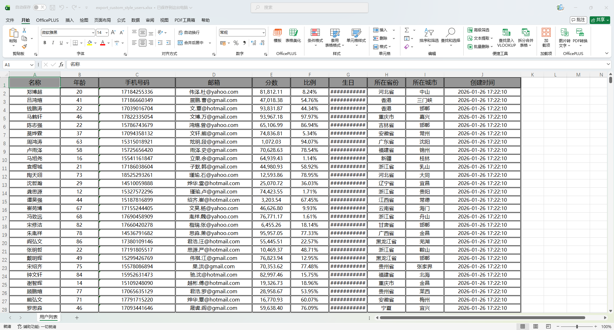

### 条件样式

#### 创建处理器

```java
package io.github.atengk.handler;

import org.apache.fesod.sheet.metadata.data.WriteCellData;
import org.apache.fesod.sheet.write.handler.CellWriteHandler;
import org.apache.fesod.sheet.write.handler.context.CellWriteHandlerContext;
import org.apache.fesod.sheet.write.metadata.style.WriteCellStyle;
import org.apache.fesod.sheet.write.metadata.style.WriteFont;
import org.apache.poi.ss.usermodel.*;

import java.util.HashMap;
import java.util.Map;
import java.util.function.Predicate;

/**
 * 条件样式处理器
 * <p>
 * 功能特性：
 * 1. 支持对指定列添加条件样式（列定位）
 * 2. 根据单元格值动态判定样式是否生效（条件断言）
 * 3. 样式与 Fesod 注解 / 默认样式可共存（基于 WriteCellData 模型）
 * <p>
 * 典型业务场景：
 * - 高分高亮（如分数 >= 90）
 * - 金额预警（如金额 > 10000）
 * - 状态标色（如状态 == "异常"）
 * - 风险数据标红
 * <p>
 * 样式合并机制说明：
 * Fesod 的样式最终由 WriteCellData 合并生成，因此必须通过：
 * WriteCellData -> WriteCellStyle -> WriteFont
 * 的链路注入，否则可能被覆盖。
 * <p>
 * 使用示例：
 * ConditionStyleHandler handler = new ConditionStyleHandler();
 * handler.addRule(3, new ConditionRule(v -> (Double) v > 10000)
 * .backgroundColor(IndexedColors.YELLOW.getIndex())
 * .fontColor(IndexedColors.RED.getIndex())
 * .bold(true));
 *
 * @author 孔余
 * @since 2026-01-26
 */
public class ConditionStyleHandler implements CellWriteHandler {

    /**
     * 条件规则映射：key = 列索引（从0开始），value = 条件规则
     */
    private final Map<Integer, ConditionRule> ruleMap = new HashMap<>();

    /**
     * 注册某一列的条件规则
     *
     * @param columnIndex 列索引（从0开始）
     * @param rule        条件规则
     */
    public void addRule(int columnIndex, ConditionRule rule) {
        ruleMap.put(columnIndex, rule);
    }

    @Override
    public void afterCellDispose(CellWriteHandlerContext context) {

        // 表头不处理
        if (Boolean.TRUE.equals(context.getHead())) {
            return;
        }

        Cell cell = context.getCell();
        if (cell == null) {
            return;
        }

        // 列命中规则才处理
        int columnIndex = cell.getColumnIndex();
        ConditionRule rule = ruleMap.get(columnIndex);
        if (rule == null) {
            return;
        }

        // 获取真实值用于条件判断
        Object value = getCellValue(cell);
        if (value == null || !rule.getPredicate().test(value)) {
            return;
        }

        // 必须通过 WriteCellData 来设置样式，否则可能被覆盖
        WriteCellData<?> cellData = context.getFirstCellData();
        if (cellData == null) {
            return;
        }

        // 获取或创建样式对象（不会覆盖注解样式）
        WriteCellStyle style = cellData.getOrCreateStyle();

        // 设置背景色
        if (rule.getBackgroundColor() != null) {
            style.setFillForegroundColor(rule.getBackgroundColor());
            style.setFillPatternType(FillPatternType.SOLID_FOREGROUND);
        }

        // 设置字体（颜色、加粗）
        if (rule.getFontColor() != null || rule.isBold()) {
            WriteFont font = style.getWriteFont();
            if (font == null) {
                font = new WriteFont();
                style.setWriteFont(font);
            }
            if (rule.isBold()) {
                font.setBold(true);
            }
            if (rule.getFontColor() != null) {
                font.setColor(rule.getFontColor());
            }
        }
    }

    /**
     * 读取单元格的实际值
     * <p>
     * 注意：
     * Excel 内部仅存储基本类型，例如：
     * - 字符串 -> STRING
     * - 数字/日期 -> NUMERIC
     * - 布尔值 -> BOOLEAN
     * <p>
     * 特别说明（非常重要）：
     * ================
     * Excel 没有 LocalDateTime / LocalDate 类型
     * 时间在存储时会被转换为 Double（序列号），例如：
     * 2026-01-26 10:30:00 -> 46048.4375
     * <p>
     * 所以如果你导出的实体字段是 LocalDateTime，读取时只能拿到 Double。
     *
     * @param cell 当前单元格
     * @return 单元格中的有效数据
     */
    private Object getCellValue(Cell cell) {
        switch (cell.getCellType()) {
            case STRING:
                return cell.getStringCellValue();
            case NUMERIC:
                // 日期也会走这里
                return cell.getNumericCellValue();
            case BOOLEAN:
                return cell.getBooleanCellValue();
            default:
                return null;
        }
    }

    /**
     * 条件规则定义（链式构建）
     */
    public static class ConditionRule {

        /**
         * 条件断言：用于判定是否触发样式
         */
        private final Predicate<Object> predicate;

        /**
         * 背景色（POI 的 IndexedColors 索引）
         */
        private Short backgroundColor;

        /**
         * 字体颜色（POI 的 IndexedColors 索引）
         */
        private Short fontColor;

        /**
         * 是否加粗
         */
        private boolean bold;

        public ConditionRule(Predicate<Object> predicate) {
            this.predicate = predicate;
        }

        public Predicate<Object> getPredicate() {
            return predicate;
        }

        public Short getBackgroundColor() {
            return backgroundColor;
        }

        public ConditionRule backgroundColor(Short backgroundColor) {
            this.backgroundColor = backgroundColor;
            return this;
        }

        public Short getFontColor() {
            return fontColor;
        }

        public ConditionRule fontColor(Short fontColor) {
            this.fontColor = fontColor;
            return this;
        }

        public boolean isBold() {
            return bold;
        }

        public ConditionRule bold(boolean bold) {
            this.bold = bold;
            return this;
        }
    }
}
```

#### 使用方法

```java

    @Test
    void testExportConditionStyle() {
        String fileName = "target/export_condition_style.xlsx";

        ConditionStyleHandler handler = new ConditionStyleHandler();

        // 数字判断，示例：第3列年龄 > 10000 则背景黄+字体红+加粗
        handler.addRule(1, new ConditionStyleHandler.ConditionRule(v -> {
                    if (v instanceof Number) {
                        return ((Number) v).doubleValue() > 60;
                    }
                    return false;
                }).backgroundColor(IndexedColors.YELLOW.getIndex())
                        .fontColor(IndexedColors.RED.getIndex())
                        .bold(true)
        );

        // 字符串判断
        handler.addRule(8, new ConditionStyleHandler.ConditionRule(v ->
                v instanceof String && "重庆".equals(v))
                .backgroundColor(IndexedColors.RED.getIndex())
                .fontColor(IndexedColors.WHITE.getIndex())
                .bold(true)
        );

        // 时间判断，示例：第 9 列是 LocalDateTime 类型，但 Excel 中会以 Double 存储
        handler.addRule(9, new ConditionStyleHandler.ConditionRule(v -> {
                    if (!(v instanceof Double)) {
                        return false;
                    }

                    LocalDateTime time = excelDateToLocalDateTime((Double) v);

                    // 判断逻辑
                    return time.isAfter(LocalDateTime.of(2026, 1, 26, 0, 0));
                }).backgroundColor(IndexedColors.BLUE.getIndex())
                        .fontColor(IndexedColors.GREEN.getIndex())
                        .bold(true)
        );

        FesodSheet
                .write(fileName, MyUser.class)
                .registerWriteHandler(handler)
                .sheet("用户列表")
                .doWrite(InitData.getDataList());
    }

    private static LocalDateTime excelDateToLocalDateTime(double excelDate) {
        // 25569 是 1970-01-01 和 1900-01-01 的天数差
        long epochSecond = (long) ((excelDate - 25569) * 86400);
        return LocalDateTime.ofInstant(Instant.ofEpochSecond(epochSecond), ZoneId.systemDefault());
    }
```

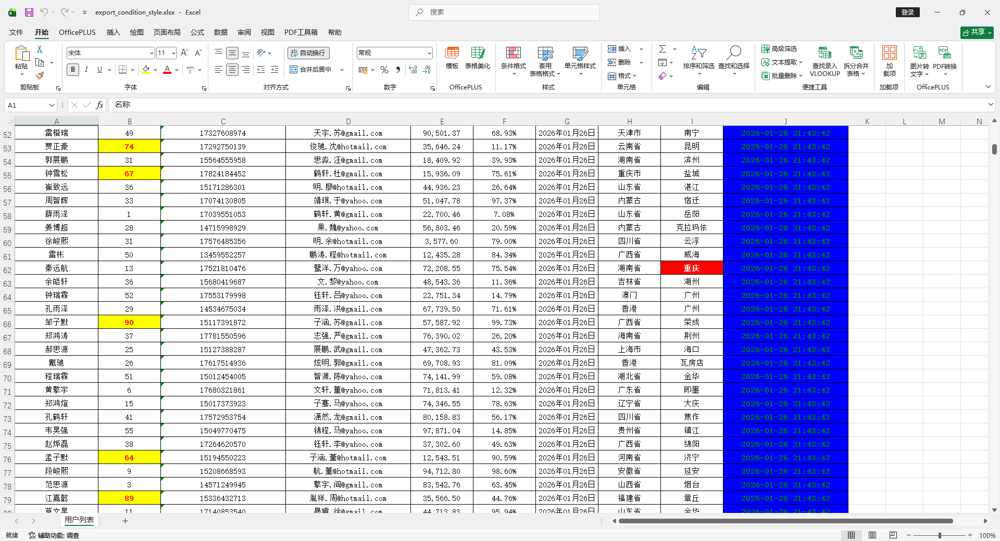

### 使用 `List<Map>` 导出（无实体类）

#### 简单动态数据

**使用方法**

```java
    @Test
    void testExportDynamic() {
        // 动态生成一级表头
        List<String> headers = new ArrayList<>();
        int randomInt = RandomUtil.randomInt(1, 20);
        for (int i = 0; i < randomInt; i++) {
            headers.add("表头" + (i + 1));
        }
        System.out.println(headers);

        // 动态生成 Map 数据
        List<Map<String, Object>> dataList = new ArrayList<>();
        for (int i = 0; i < 10; i++) {
            Map<String, Object> row = new HashMap<>();
            for (int j = 0; j < headers.size(); j++) {
                row.put(headers.get(j), "数据" + (i + 1) + "-" + (j + 1));
            }
            dataList.add(row);
        }
        System.out.println(dataList);

        // 导出
        ExcelUtil.exportDynamicSimple(
                ExcelUtil.toOutputStream("target/export_dynamic.xlsx"),
                headers,
                dataList,
                "用户列表"
        );
    }
```

> 输出：
>
> [表头1, 表头2, 表头3, 表头4, 表头5, 表头6, 表头7, 表头8, 表头9, 表头10]
> [{表头6=数据1-6, 表头7=数据1-7, 表头4=数据1-4, 表头5=数据1-5, 表头8=数据1-8, 表头9=数据1-9, 表头10=数据1-10, 表头2=数据1-2, 表头3=数据1-3, 表头1=数据1-1}, {表头6=数据2-6, 表头7=数据2-7, 表头4=数据2-4, 表头5=数据2-5, 表头8=数据2-8, 表头9=数据2-9, 表头10=数据2-10, 表头2=数据2-2, 表头3=数据2-3, 表头1=数据2-1}, {表头6=数据3-6, 表头7=数据3-7, 表头4=数据3-4, 表头5=数据3-5, 表头8=数据3-8, 表头9=数据3-9, 表头10=数据3-10, 表头2=数据3-2, 表头3=数据3-3, 表头1=数据3-1}, {表头6=数据4-6, 表头7=数据4-7, 表头4=数据4-4, 表头5=数据4-5, 表头8=数据4-8, 表头9=数据4-9, 表头10=数据4-10, 表头2=数据4-2, 表头3=数据4-3, 表头1=数据4-1}, {表头6=数据5-6, 表头7=数据5-7, 表头4=数据5-4, 表头5=数据5-5, 表头8=数据5-8, 表头9=数据5-9, 表头10=数据5-10, 表头2=数据5-2, 表头3=数据5-3, 表头1=数据5-1}, {表头6=数据6-6, 表头7=数据6-7, 表头4=数据6-4, 表头5=数据6-5, 表头8=数据6-8, 表头9=数据6-9, 表头10=数据6-10, 表头2=数据6-2, 表头3=数据6-3, 表头1=数据6-1}, {表头6=数据7-6, 表头7=数据7-7, 表头4=数据7-4, 表头5=数据7-5, 表头8=数据7-8, 表头9=数据7-9, 表头10=数据7-10, 表头2=数据7-2, 表头3=数据7-3, 表头1=数据7-1}, {表头6=数据8-6, 表头7=数据8-7, 表头4=数据8-4, 表头5=数据8-5, 表头8=数据8-8, 表头9=数据8-9, 表头10=数据8-10, 表头2=数据8-2, 表头3=数据8-3, 表头1=数据8-1}, {表头6=数据9-6, 表头7=数据9-7, 表头4=数据9-4, 表头5=数据9-5, 表头8=数据9-8, 表头9=数据9-9, 表头10=数据9-10, 表头2=数据9-2, 表头3=数据9-3, 表头1=数据9-1}, {表头6=数据10-6, 表头7=数据10-7, 表头4=数据10-4, 表头5=数据10-5, 表头8=数据10-8, 表头9=数据10-9, 表头10=数据10-10, 表头2=数据10-2, 表头3=数据10-3, 表头1=数据10-1}]

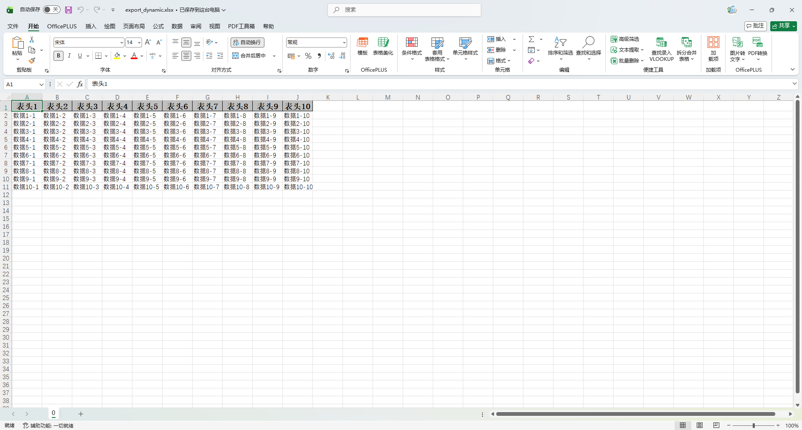

#### 导出图片

**使用方法**

字段是二进制就会转换成图片

```java
    @Test
    void testExportDynamicImage() {
        // 表头
        List<ExcelUtil.HeaderItem> headers = new ArrayList<>();
        headers.add(new ExcelUtil.HeaderItem(
                Collections.singletonList("姓名"), "name"));
        headers.add(new ExcelUtil.HeaderItem(
                Collections.singletonList("年龄"), "age"));
        headers.add(new ExcelUtil.HeaderItem(
                Collections.singletonList("图片"), "image"));
        System.out.println(JSONUtil.toJsonStr(headers));

        // 数据
        List<Map<String, Object>> dataList = new ArrayList<>();
        for (int i = 0; i < 5; i++) {
            Map<String, Object> row = new HashMap<>();
            row.put("name", "用户" + (i + 1));
            row.put("age", 20 + i);
            row.put("image", HttpUtil.downloadBytes("https://placehold.co/100x100/png"));
            dataList.add(row);
        }
        //System.out.println(JSONUtil.toJsonStr(dataList));

        // 导出
        ExcelUtil.exportDynamic(
                ExcelUtil.toOutputStream("target/export_dynamic_image.xlsx"),
                headers,
                dataList,
                "用户列表"
        );
    }
```

> 输出：
>
> [{"path":["姓名"],"field":"name"},{"path":["年龄"],"field":"age"},{"path":["图片"],"field":"image"}]

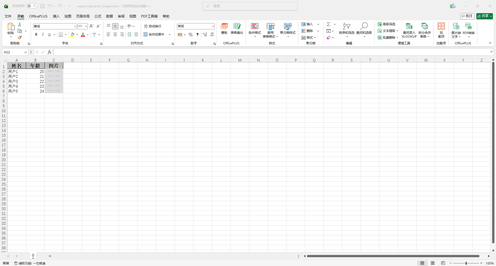

#### 多级表头

**使用方法**

```java
    @Test
    void testExportDynamicMultiHead() {
        // 多级表头（一级 + 二级）
        List<ExcelUtil.HeaderItem> headers = new ArrayList<>();
        headers.add(new ExcelUtil.HeaderItem(
                Arrays.asList("用户信息", "姓名"), "name"));
        headers.add(new ExcelUtil.HeaderItem(
                Arrays.asList("用户信息", "年龄"), "age"));
        headers.add(new ExcelUtil.HeaderItem(
                Arrays.asList("系统信息", "登录次数"), "loginCount"));
        System.out.println(JSONUtil.toJsonStr(headers));

        // 数据
        List<Map<String, Object>> dataList = new ArrayList<>();
        for (int i = 0; i < 10; i++) {
            Map<String, Object> row = new HashMap<>();
            row.put("name", "用户" + (i + 1));
            row.put("age", 20 + i);
            row.put("loginCount", 100 + i);
            dataList.add(row);
        }
        System.out.println(JSONUtil.toJsonStr(dataList));

        // 导出
        ExcelUtil.exportDynamicComplex(
                ExcelUtil.toOutputStream("target/export_dynamic_multi_head.xlsx"),
                headers,
                dataList,
                "用户列表"
        );
    }
```

> 输出：
>
> [{"path":["用户信息","姓名"],"field":"name"},{"path":["用户信息","年龄"],"field":"age"},{"path":["系统信息","登录次数"],"field":"loginCount"}]
> [{"name":"用户1","age":20,"loginCount":100},{"name":"用户2","age":21,"loginCount":101},{"name":"用户3","age":22,"loginCount":102},{"name":"用户4","age":23,"loginCount":103},{"name":"用户5","age":24,"loginCount":104},{"name":"用户6","age":25,"loginCount":105},{"name":"用户7","age":26,"loginCount":106},{"name":"用户8","age":27,"loginCount":107},{"name":"用户9","age":28,"loginCount":108},{"name":"用户10","age":29,"loginCount":109}]

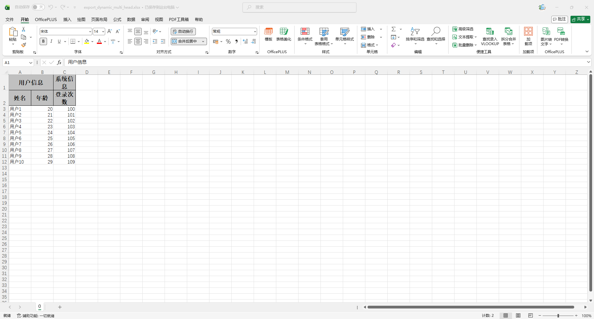

#### 多 Sheet

**使用方法**

```java
    @Test
    void testExportDynamicMultiSheet() {
        // 表头
        List<ExcelUtil.HeaderItem> headers = Arrays.asList(
                new ExcelUtil.HeaderItem(Collections.singletonList("姓名"), "name"),
                new ExcelUtil.HeaderItem(Collections.singletonList("年龄"), "age"),
                new ExcelUtil.HeaderItem(Collections.singletonList("登录次数"), "loginCount")
        );
        // 数据
        List<Map<String, Object>> rows = new ArrayList<>();
        for (int i = 0; i < 10; i++) {
            Map<String, Object> row = new HashMap<>();
            row.put("name", "用户" + (i + 1));
            row.put("age", 20 + i);
            row.put("loginCount", 100 + i);
            rows.add(row);
        }
        // Sheet
        List<ExcelUtil.SheetData> sheets = new ArrayList<>();
        for (int i = 0; i < 5; i++) {
            sheets.add(new ExcelUtil.SheetData("用户列表" + i, headers, rows));
        }
        System.out.println(sheets);
        // 导出
        ExcelUtil.exportDynamicMultiSheet(
                ExcelUtil.toOutputStream("target/export_dynamic_multi_sheet.xlsx"),
                sheets
        );
    }
```

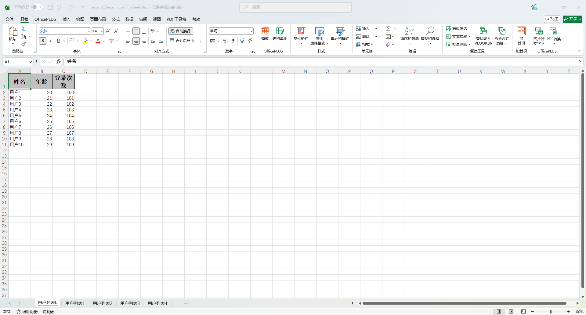

#### 调整列宽

##### 创建处理器

```java
package io.github.atengk.handler;

import org.apache.fesod.sheet.write.handler.SheetWriteHandler;
import org.apache.fesod.sheet.write.handler.context.SheetWriteHandlerContext;
import org.apache.fesod.sheet.write.metadata.holder.WriteSheetHolder;
import org.apache.fesod.sheet.write.metadata.holder.WriteWorkbookHolder;
import org.apache.poi.ss.usermodel.Row;
import org.apache.poi.ss.usermodel.Sheet;

import java.util.Collections;
import java.util.Map;

/**
 * Sheet 级别行高、列宽统一处理器。
 * <p>
 * 功能：
 * <ul>
 *     <li>自动识别表头行数（支持多级表头）</li>
 *     <li>设置表头行高</li>
 *     <li>设置内容行高</li>
 *     <li>设置指定列的列宽</li>
 * </ul>
 * <p>
 * 设计原则：
 * <ul>
 *     <li>列宽在 Sheet 创建时设置</li>
 *     <li>行高在 Sheet 写入完成后设置</li>
 *     <li>列宽单位使用“字符宽度”，内部自动 *256</li>
 *     <li>使用者不需要关心表头是几级</li>
 * </ul>
 *
 * @author 孔余
 * @since 2026-01-26
 */
public class RowColumnDimensionHandler implements SheetWriteHandler {

    /**
     * 表头行高（单位：磅）
     */
    private final short headRowHeight;

    /**
     * 内容行高（单位：磅）
     */
    private final short contentRowHeight;

    /**
     * 指定列宽配置
     * key：列索引（从 0 开始）
     * value：列宽（字符宽度，不需要乘 256）
     */
    private final Map<Integer, Integer> columnWidthMap;

    public RowColumnDimensionHandler(short headRowHeight,
                                     short contentRowHeight,
                                     Map<Integer, Integer> columnWidthMap) {
        this.headRowHeight = headRowHeight;
        this.contentRowHeight = contentRowHeight;
        this.columnWidthMap = columnWidthMap == null ? Collections.emptyMap() : columnWidthMap;
    }

    /**
     * Sheet 创建完成后回调。
     * <p>
     * 此时 Row 还未创建，只能做 Sheet 结构类操作：
     * <ul>
     *     <li>列宽</li>
     *     <li>冻结窗格</li>
     *     <li>打印设置</li>
     * </ul>
     */
    @Override
    public void afterSheetCreate(WriteWorkbookHolder writeWorkbookHolder,
                                 WriteSheetHolder writeSheetHolder) {

        Sheet sheet = writeSheetHolder.getSheet();
        setColumnWidth(sheet);
    }

    /**
     * Sheet 写入完成后的回调。
     * <p>
     * 此时：
     * <ul>
     *     <li>所有 Row 已存在</li>
     *     <li>可以安全设置行高</li>
     * </ul>
     */
    @Override
    public void afterSheetDispose(SheetWriteHandlerContext context) {
        Sheet sheet = context.getWriteSheetHolder().getSheet();
        setRowHeight(sheet, context.getWriteSheetHolder());
    }

    /**
     * 设置列宽（字符宽度 → Excel 单位 *256）
     */
    private void setColumnWidth(Sheet sheet) {
        if (columnWidthMap.isEmpty()) {
            return;
        }

        for (Map.Entry<Integer, Integer> entry : columnWidthMap.entrySet()) {
            Integer columnIndex = entry.getKey();
            Integer columnWidth = entry.getValue();

            if (columnIndex == null || columnWidth == null || columnWidth <= 0) {
                continue;
            }

            sheet.setColumnWidth(columnIndex, columnWidth * 256);
        }
    }

    /**
     * 设置行高，自动区分表头行和内容行。
     */
    private void setRowHeight(Sheet sheet, WriteSheetHolder writeSheetHolder) {

        int headRowCount = writeSheetHolder
                .getExcelWriteHeadProperty()
                .getHeadRowNumber();

        int lastRowNum = sheet.getLastRowNum();

        for (int rowIndex = 0; rowIndex <= lastRowNum; rowIndex++) {
            Row row = sheet.getRow(rowIndex);
            if (row == null) {
                continue;
            }

            if (rowIndex < headRowCount) {
                row.setHeightInPoints(headRowHeight);
            } else {
                row.setHeightInPoints(contentRowHeight);
            }
        }
    }
}
```

##### 使用方法

```java
    @Test
    void testExportDynamicRowColumn() {
        // 动态生成一级表头
        List<String> headers = new ArrayList<>();
        int randomInt = RandomUtil.randomInt(1, 20);
        for (int i = 0; i < randomInt; i++) {
            headers.add("表头" + (i + 1));
        }
        System.out.println(headers);

        // 动态生成 Map 数据
        List<Map<String, Object>> dataList = new ArrayList<>();
        for (int i = 0; i < 10; i++) {
            Map<String, Object> row = new HashMap<>();
            for (int j = 0; j < headers.size(); j++) {
                row.put(headers.get(j), "数据" + (i + 1) + "-" + (j + 1));
            }
            dataList.add(row);
        }
        System.out.println(dataList);

        // 设置列宽
        Map<Integer, Integer> columnWidthMap = new HashMap<>();
        columnWidthMap.put(0, 20);
        columnWidthMap.put(1, 30);
        columnWidthMap.put(2, 25);

        // 设置表头、内容高度
        RowColumnDimensionHandler handler = new RowColumnDimensionHandler(
                (short) 50,
                (short) 30,
                columnWidthMap
        );

        // 导出
        ExcelUtil.exportDynamicSimple(
                ExcelUtil.toOutputStream("target/export_dynamic_row_column.xlsx"),
                headers,
                dataList,
                "用户列表",
                handler,
                ExcelStyleUtil.getDefaultStyleStrategy()
        );
    }
```


### 导出CSV

详情参考官网文档：[链接](https://fesod.apache.org/zh-cn/docs/sheet/write/csv)

#### 实体导出

```java
    @Test
    void testExportSimple() {
        List<MyUser> list = InitData.getDataList();
        String fileName = "target/export_simple_users.csv";
        FesodSheet
                .write(fileName, MyUser.class)
                .csv()
                .doWrite(list);
    }
```

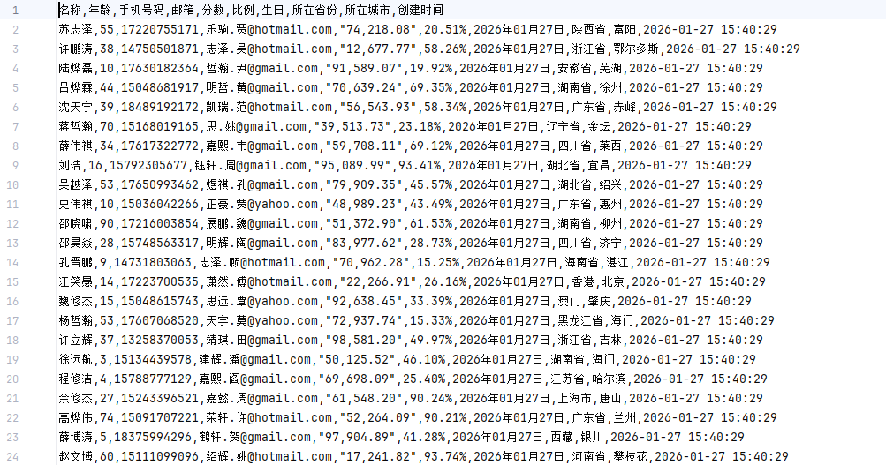

#### 动态数据导出

```java
    @Test
    void testExportDynamic() {
        // 表头
        List<ExcelUtil.HeaderItem> headers = Arrays.asList(
                new ExcelUtil.HeaderItem(Collections.singletonList("姓名"), "name"),
                new ExcelUtil.HeaderItem(Collections.singletonList("年龄"), "age"),
                new ExcelUtil.HeaderItem(Collections.singletonList("登录次数"), "loginCount")
        );
        // 数据
        List<Map<String, Object>> dataList = new ArrayList<>();
        for (int i = 0; i < 10; i++) {
            Map<String, Object> row = new HashMap<>();
            row.put("name", "用户" + (i + 1));
            row.put("age", 20 + i);
            row.put("loginCount", 100 + i);
            dataList.add(row);
        }
        System.out.println(JSONUtil.toJsonStr(dataList));
        // 导出
        String fileName = "target/export_dynamic_users.csv";
        FesodSheet
                .write(fileName)
                .head(ExcelUtil.buildHead(headers))
                .csv()
                .doWrite(ExcelUtil.buildRows(headers, dataList));
    }
```

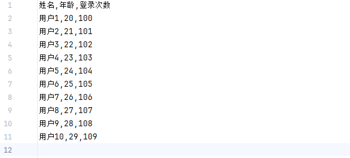

#### 分批次导出

```java
    @Test
    void testExportBatch() {
        String fileName = "target/export_batch_users.csv";

        try (ExcelWriter excelWriter = FesodSheet
                .write(fileName, MyUser.class)
                .excelType(ExcelTypeEnum.CSV)
                .build()) {
            WriteSheet writeSheet = FastExcel.writerSheet().build();
            // 第一批数据
            excelWriter.write(InitData.getDataList(2), writeSheet);
            // 第二批数据
            excelWriter.write(InitData.getDataList(2), writeSheet);
        }
    }
```

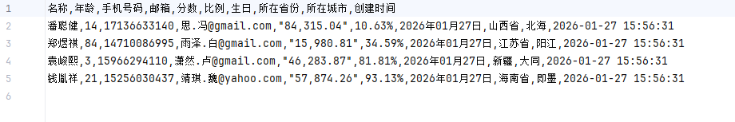

## 模板导出（Template Export）

**模版语法**

| 语法类型             | 模版占位符写法                  | 说明                                       | 示例数据结构                            | 使用场景                     |
| -------------------- | ------------------------------- | ------------------------------------------ | --------------------------------------- | ---------------------------- |
| 普通变量             | `{name}`                        | 填充一个普通对象或 Map 中的字段值          | `Map.put("name","Ateng")`               | 表头信息、作者、时间、标题等 |
| 普通变量（嵌套对象） | `{user.name}`                   | 通过对象属性路径取值                       | `data.put("user", userObj)`             | 对象结构化数据填充           |
| 匿名列表             | `{.name}`                       | 填充单一 List，当前行作为列表模板行        | `List<MyUser>`                          | 只有一个列表数据时最简写法   |
| 指定列表             | `{userList.name}`               | 指定 List 名称，多列表同时存在时必须使用   | `new FillWrapper("userList", userList)` | 多集合并存填充               |
| Map 列表             | `{list.key}`                    | List 中每个元素为 Map 时通过 key 取值      | `List<Map<String,Object>>`              | 动态字段结构数据             |
| 普通 + 列表混合      | `{author}` + `{userList.name}`  | 普通变量与列表变量同时存在                 | Map + 多个 FillWrapper                  | 报表头 + 明细数据            |
| 横向填充             | `{list.type}`                   | 配合 HORIZONTAL 实现按列扩展               | `FillConfig.direction(HORIZONTAL)`      | 指标横向展开                 |

### 填充普通变量数据

**创建模版**

```
src
 └─ main
    └─ resources
       └─ doc
          └─ template_user_simple.xlsx
```

**模版内容**

```
用户信息	姓名：	{name}
	年龄：	{age}
```


**使用方法**

```java
    @Test
    void testTemplateExport() {
        Map<String, Object> data = new HashMap<>();
        data.put("name", "Ateng");
        data.put("age", "25");

        FesodSheet
                .write("target/export_template_user_simple.xlsx")
                .withTemplate(ExcelUtil.toInputStreamFromClasspath("doc/template_user_simple.xlsx"))
                .sheet()
                .doFill(data);
    }
```

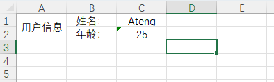

### 填充列表变量数据

**创建模版**

```
src
 └─ main
    └─ resources
       └─ doc
          └─ user_list_template.xlsx
```

**模版内容**

```
姓名	年龄	手机号码	邮箱	分数	比例	生日	所在省份	所在城市	创建时间
{.name}	{.age}	{.phoneNumber}	{.email}	{.score}	{.ratio}	{.birthday}	{.province}	{.city}	{.createTime}
```

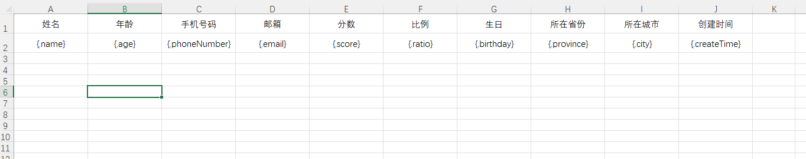

**使用方法**

```java
    @Test
    void testTemplateListExport() {
        List<MyUser> dataList = InitData.getDataList();

        FesodSheet
                .write("target/export_template_user_list.xlsx")
                .withTemplate(ExcelUtil.toInputStreamFromClasspath("doc/template_user_list.xlsx"))
                .sheet()
                .doFill(dataList);
    }
```

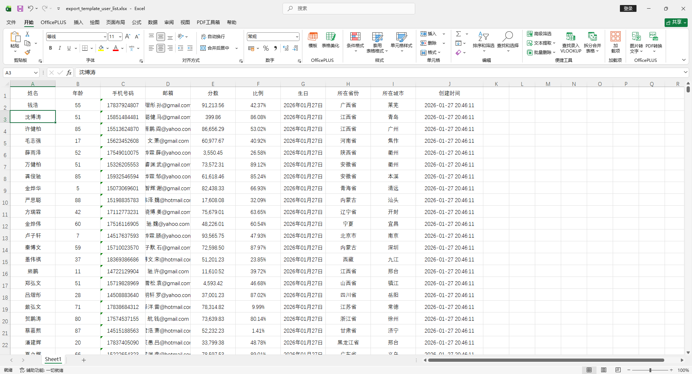

### 填充多个列表变量数据

**创建模版**

```
src
 └─ main
    └─ resources
       └─ doc
          └─ template_user_multi_list.xlsx
```

**模版内容**

```
姓名	年龄	手机号码	邮箱	分数	比例	生日	所在省份	所在城市	创建时间
{userList.name}	{userList.age}	{userList.phoneNumber}	{userList.email}	{userList.score}	{userList.ratio}	{userList.birthday}	{userList.province}	{userList.city}	{userList.createTime}
									
									
类型	数量								
{otherList.type}	{otherList.count}								

```

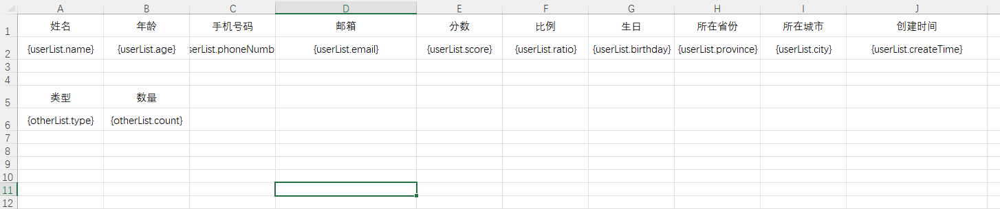

**使用方法**

```java
    @Test
    void testTemplateMultiListExport() {
        // 准备数据
        List<MyUser> userList = InitData.getDataList(2);
        List<Map<String, Object>> otherList = new ArrayList<>();
        otherList.add(new HashMap<String, Object>(){{
            put("type", "类型1");
            put("count", 10);
        }});
        otherList.add(new HashMap<String, Object>(){{
            put("type", "类型2");
            put("count", 20);
        }});

        // 导出多列
        try (ExcelWriter writer = FesodSheet
                .write("target/export_template_multi_user_list.xlsx")
                .withTemplate(ExcelUtil.toInputStreamFromClasspath("doc/template_user_multi_list.xlsx")).build()
        ) {
            WriteSheet writeSheet = FesodSheet.writerSheet().build();
            // 使用 FillWrapper 进行多列表填充
            writer.fill(new FillWrapper("userList", userList), writeSheet);
            writer.fill(new FillWrapper("otherList", otherList), writeSheet);
        }
    }
```

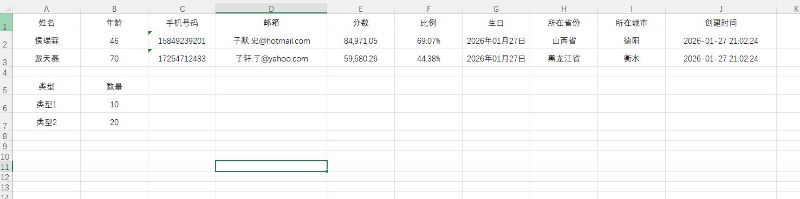

### 填充普通和列表变量数据（混合）

**创建模版**

```
src
 └─ main
    └─ resources
       └─ doc
          └─ template_user_mix.xlsx
```

**模版内容**

```
姓名	年龄	手机号码	邮箱	分数	比例	生日	所在省份	所在城市	创建时间
{userList.name}	{userList.age}	{userList.phoneNumber}	{userList.email}	{userList.score}	{userList.ratio}	{userList.birthday}	{userList.province}	{userList.city}	{userList.createTime}
									
									
类型	数量								
{otherList.type}	{otherList.count}								
									
			作者：	{author}					
			作者（中文）：	{authorZh}					
			创建时间：	{createTime}					
			创建时间（字符串）：	{createTimeStr}					

```

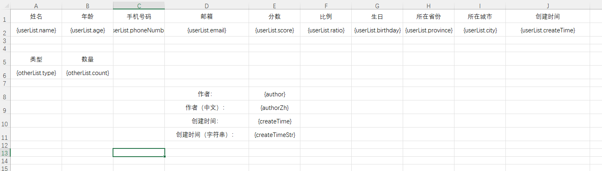

**使用方法**

```java
    @Test
    void testTemplateMixExport() {
        // 准备数据
        List<MyUser> userList = InitData.getDataList(2);
        List<Map<String, Object>> otherList = new ArrayList<>();
        otherList.add(new HashMap<String, Object>(){{
            put("type", "类型1");
            put("count", 10);
        }});
        otherList.add(new HashMap<String, Object>(){{
            put("type", "类型2");
            put("count", 20);
        }});
        HashMap<String, Object> data = new HashMap<>();
        data.put("createTime", LocalDateTime.now());
        data.put("createTimeStr", LocalDateTime.now().format(DateTimeFormatter.ofPattern("yyyy-MM-dd HH:mm:ss")));
        data.put("author", "Ateng");
        data.put("authorZh", "阿腾");

        // 导出多列
        try (ExcelWriter writer = FesodSheet
                .write("target/export_template_mix.xlsx")
                .withTemplate(ExcelUtil.toInputStreamFromClasspath("doc/template_user_mix.xlsx")).build()
        ) {
            WriteSheet writeSheet = FesodSheet.writerSheet().build();
            // 使用 FillWrapper 进行多列表填充
            writer.fill(new FillWrapper("userList", userList), writeSheet);
            writer.fill(new FillWrapper("otherList", otherList), writeSheet);
            // 填充普通变量数据
            writer.fill(data, writeSheet);
        }
    }
```

- 注意时间类型的数据格式会变

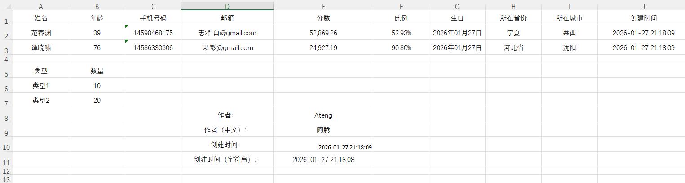


### 填充多 Sheet

好的，我来按照你的风格补充 **Apache Fesod 填充多 Sheet 数据** 的完整示例，包含模板结构、代码和效果说明。

### 填充多Sheet数据

**创建模版**

```
src
 └─ main
    └─ resources
       └─ doc
          └─ multi_sheet_template.xlsx
```

**模版结构说明**
这个Excel模板文件包含两个预设的Sheet页：

*   **第一个Sheet (默认名称为 `Sheet1`)**：
    ```
    部门销售数据
    部门：	{department}
    季度：	{quarter}
    
    产品名称	销售额（万元）	完成率
    {salesList.productName}	{salesList.amount}	{salesList.completionRate}
    ```
    *用途：填充某个部门的季度销售明细列表。*

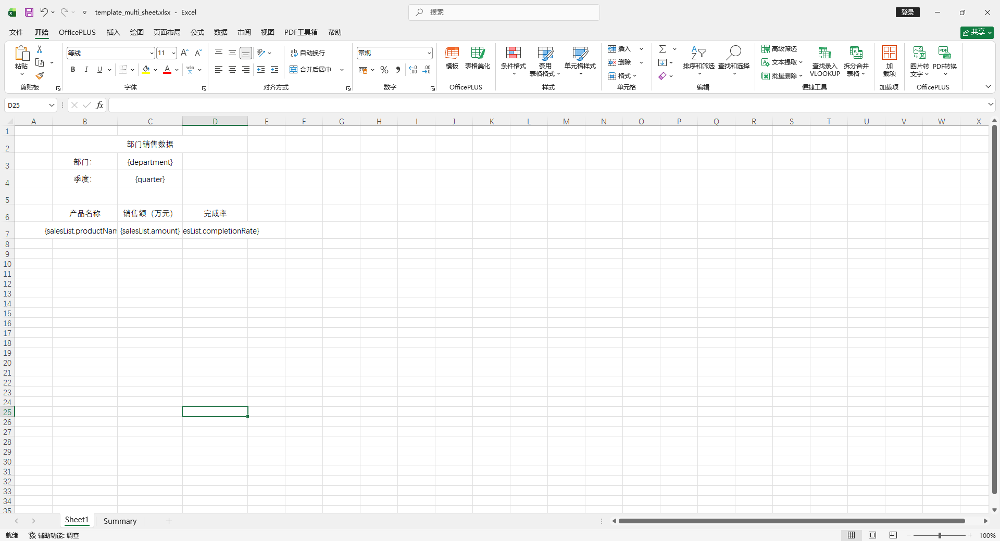

* **第二个Sheet (我们将手动将其名称改为 `Summary`)**：

  ```
  部门季度汇总
  总计销售额（万元）：	{totalAmount}
  平均完成率：	{averageRate}
  
  排名	部门	综合得分
  {summaryList.rank}	{summaryList.department}	{summaryList.score}
  ```
  *用途：填充各部门的汇总数据和排名列表。*

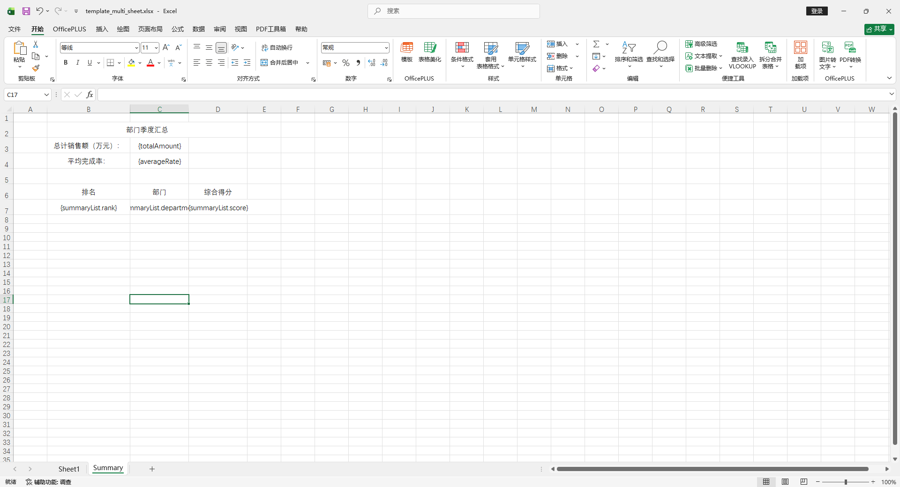

**辅助数据类**

```java
    // 第一个Sheet的列表数据对象
    @Data
    @AllArgsConstructor
    @NoArgsConstructor
    public class SalesData {
        private String productName;
        private Double amount;
        private String completionRate;
    }

    // 第二个Sheet的列表数据对象
    @Data
    @AllArgsConstructor
    @NoArgsConstructor
    public class SummaryData {
        private Integer rank;
        private String department;
        private Double score;
    }
```

**使用方法**

```java
@Test
void testTemplateMultiSheetExport() {
    // ---------- 准备第一个Sheet的数据 ----------
    // 1. 普通变量数据
    Map<String, Object> sheet1Data = new HashMap<>();
    sheet1Data.put("department", "华东大区");
    sheet1Data.put("quarter", "2025年第四季度");
    
    // 2. 列表数据
    List<SalesData> salesList = new ArrayList<>();
    salesList.add(new SalesData("产品A", 450.5, "112.6%"));
    salesList.add(new SalesData("产品B", 380.0, "95.0%"));
    salesList.add(new SalesData("产品C", 520.3, "130.1%"));
    
    // ---------- 准备第二个Sheet的数据 ----------
    // 1. 普通变量数据
    Map<String, Object> sheet2Data = new HashMap<>();
    sheet2Data.put("totalAmount", 1350.8);
    sheet2Data.put("averageRate", "112.6%");
    
    // 2. 列表数据
    List<SummaryData> summaryList = new ArrayList<>();
    summaryList.add(new SummaryData(1, "华东大区", 98.5));
    summaryList.add(new SummaryData(2, "华北大区", 92.0));
    summaryList.add(new SummaryData(3, "华南大区", 88.5));
    
    // ---------- 执行多Sheet填充 ----------
    String templatePath = "doc/multi_sheet_template.xlsx";
    String outputPath = "target/export_multi_sheet.xlsx";
    
    try (ExcelWriter writer = FesodSheet
            .write(outputPath)
            .withTemplate(ExcelUtil.toInputStreamFromClasspath(templatePath))
            .build()
    ) {
        // 1. 填充第一个Sheet (使用默认的sheet索引0或名称"Sheet1")
        WriteSheet writeSheet1 = FesodSheet.writerSheet().build(); // 默认指向第一个Sheet
        writer.fill(sheet1Data, writeSheet1); // 填充普通变量
        writer.fill(new FillWrapper("salesList", salesList), writeSheet1); // 填充列表
        
        // 2. 填充第二个Sheet (指定sheet名称或索引)
        // 方式一：通过索引（从0开始）
        // WriteSheet writeSheet2 = FesodSheet.writerSheet(1).build();
        // 方式二：通过名称（推荐，更清晰）
        WriteSheet writeSheet2 = FesodSheet.writerSheet("Summary").build();
        
        writer.fill(sheet2Data, writeSheet2); // 填充普通变量
        writer.fill(new FillWrapper("summaryList", summaryList), writeSheet2); // 填充列表
        
    } // try-with-resources 自动关闭 writer
}
```

注意这里 Sheet 页顺序发生了变化 

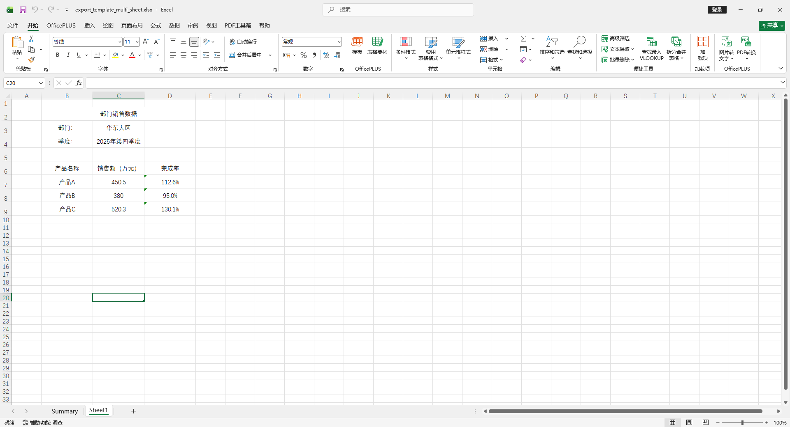

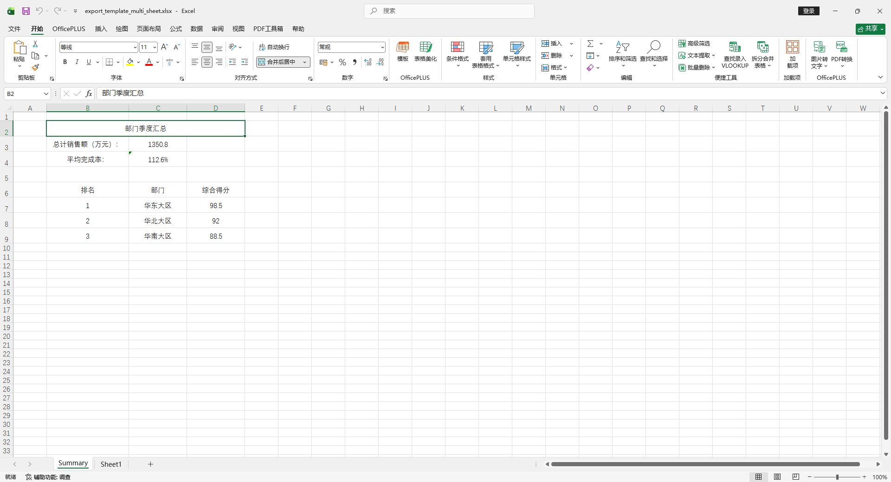

### 横向遍历

**创建模版**

```
src
 └─ main
    └─ resources
       └─ doc
          └─ template_horizontal.xlsx
```

**模版内容**

```
数据	类型	{list.type}
	数量	{list.count}
		
创建时间	{createTime}	
作者	{author}	

```

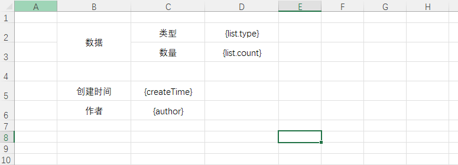

**使用方法**

```java
    @Test
    void testTemplateHorizontalExport() {
        // 准备数据
        List<Map<String, Object>> list = new ArrayList<>();
        list.add(new HashMap<String, Object>(){{
            put("type", "类型1");
            put("count", 10);
        }});
        list.add(new HashMap<String, Object>(){{
            put("type", "类型2");
            put("count", 20);
        }});
        HashMap<String, Object> data = new HashMap<>();
        data.put("createTime", LocalDateTime.now().format(DateTimeFormatter.ofPattern("yyyy-MM-dd HH:mm:ss")));
        data.put("author", "Ateng");

        // 填充导出
        try (ExcelWriter writer = FesodSheet
                .write("target/export_template_horizontal.xlsx")
                .withTemplate(ExcelUtil.toInputStreamFromClasspath("doc/template_horizontal.xlsx")).build()
        ) {
            WriteSheet writeSheet = FesodSheet.writerSheet().build();
            // 使用 FillWrapper 进行多列表填充，配置为横向填充
            FillConfig fillConfig = FillConfig.builder().direction(WriteDirectionEnum.HORIZONTAL).build();
            writer.fill(new FillWrapper("list", list), fillConfig, writeSheet);
            // 填充普通变量数据
            writer.fill(data, writeSheet);
        }
    }
```

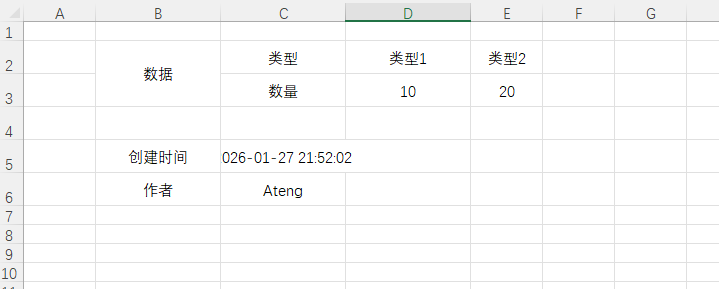

### 模版中图片动态插入

#### 单张图片插入

**创建模版**

```
src
 └─ main
    └─ resources
       └─ doc
          └─ template_image.xlsx
```

**模版内容**

```
姓名    头像
{name}    {photo}

```

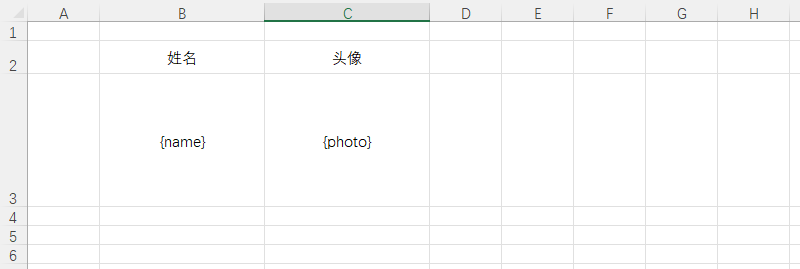

**使用方法**

图片数据直接传二级制数组

```java
    @Test
    void testTemplateImage() {
        Map<String, Object> data = new HashMap<>();
        data.put("name", "Ateng");

        byte[] imageBytes = HttpUtil.downloadBytes("https://placehold.co/100x100/png");
        data.put("photo", imageBytes);

        // 填充导出
        try (ExcelWriter writer = FesodSheet
                .write("target/export_template_image.xlsx")
                .withTemplate(ExcelUtil.toInputStreamFromClasspath("doc/template_image.xlsx")).build()
        ) {
            WriteSheet writeSheet = FesodSheet.writerSheet().build();
            // 填充普通变量数据
            writer.fill(data, writeSheet);
        }
    }
```

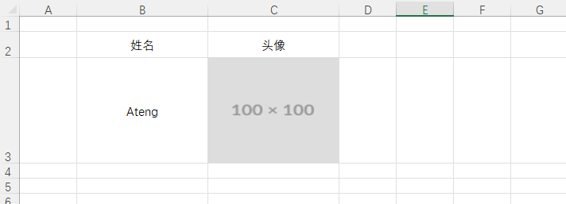

#### 列表图片插入

**创建模版**

```
src
 └─ main
    └─ resources
       └─ doc
          └─ template_image_list.xlsx
```

**模版内容**

```
名称	图片
{list.name}	{list.photo}

```

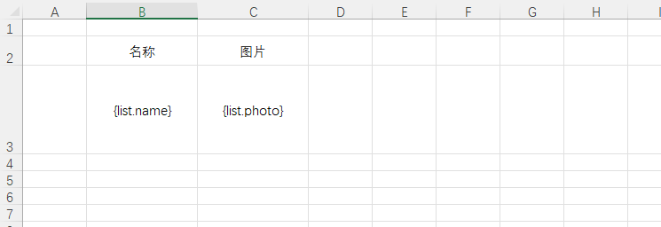

**使用方法**

```java
    @Test
    void testTemplateImageList() {
        List<Map<String, Object>> list = new ArrayList<>();
        for (int i = 1; i <= 5; i++) {
            Map<String, Object> row = new HashMap<>();
            row.put("name", "User-" + i);
            byte[] imageBytes = HttpUtil.downloadBytes("https://placehold.co/100x100/png");
            row.put("photo", imageBytes);
            list.add(row);
        }

        Map<String, Object> data = new HashMap<>();
        data.put("list", list);

        // 填充导出
        try (ExcelWriter writer = FesodSheet
                .write("target/export_template_image_list.xlsx")
                .withTemplate(ExcelUtil.toInputStreamFromClasspath("doc/template_image_list.xlsx")).build()
        ) {
            WriteSheet writeSheet = FesodSheet.writerSheet().build();
            // 使用 FillWrapper 进行多列表填充
            writer.fill(new FillWrapper("list", list), writeSheet);
        }
    }
```

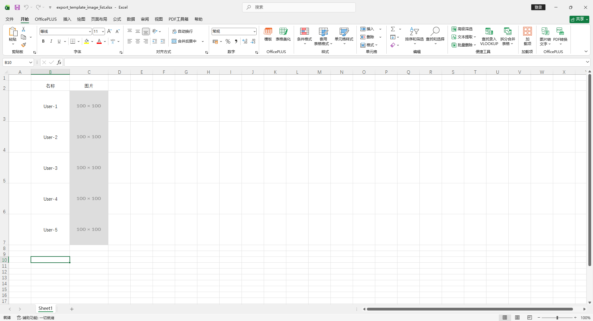


## 导入 Excel（Import）


### 读取为实体类

**Excel 文件**


**实体类**

```java
package io.github.atengk.entity;

import lombok.AllArgsConstructor;
import lombok.Builder;
import lombok.Data;
import lombok.NoArgsConstructor;
import org.apache.fesod.sheet.annotation.ExcelIgnore;
import org.apache.fesod.sheet.annotation.ExcelProperty;
import org.apache.fesod.sheet.annotation.format.DateTimeFormat;
import org.apache.fesod.sheet.annotation.format.NumberFormat;
import org.apache.fesod.sheet.annotation.write.style.*;
import org.apache.fesod.sheet.enums.BooleanEnum;
import org.apache.fesod.sheet.enums.poi.BorderStyleEnum;
import org.apache.fesod.sheet.enums.poi.HorizontalAlignmentEnum;
import org.apache.fesod.sheet.enums.poi.VerticalAlignmentEnum;

import java.io.Serializable;
import java.math.BigDecimal;
import java.math.RoundingMode;
import java.time.LocalDate;
import java.time.LocalDateTime;

@Data
@Builder
@NoArgsConstructor
@AllArgsConstructor
@HeadFontStyle(fontName = "宋体", fontHeightInPoints = 11, bold = BooleanEnum.TRUE)
@ContentFontStyle(fontName = "宋体", fontHeightInPoints = 11, bold = BooleanEnum.FALSE)
@HeadStyle(wrapped = BooleanEnum.TRUE, horizontalAlignment = HorizontalAlignmentEnum.CENTER, verticalAlignment = VerticalAlignmentEnum.CENTER, fillBackgroundColor = 9, fillForegroundColor = 9, borderLeft = BorderStyleEnum.THIN, borderRight = BorderStyleEnum.THIN, borderTop = BorderStyleEnum.THIN, borderBottom = BorderStyleEnum.THIN)
@ContentStyle(wrapped = BooleanEnum.TRUE, horizontalAlignment = HorizontalAlignmentEnum.CENTER, verticalAlignment = VerticalAlignmentEnum.CENTER, fillBackgroundColor = 9, fillForegroundColor = 9, borderLeft = BorderStyleEnum.THIN, borderRight = BorderStyleEnum.THIN, borderTop = BorderStyleEnum.THIN, borderBottom = BorderStyleEnum.THIN)
@HeadRowHeight(25)  // 设置表头行高
@ContentRowHeight(20)  // 设置数据内容行高
@ColumnWidth(15)       // 设置列宽
public class MyUser implements Serializable {

    private static final long serialVersionUID = 1L;

    /**
     * 主键id
     */
    @ExcelIgnore
    private Long id;

    /**
     * 名称
     */
    @ExcelProperty(value = "名称", index = 0)
    @ColumnWidth(20) // 单独设置列宽
    private String name;

    /**
     * 年龄
     */
    @ExcelProperty(value = "年龄", index = 1)
    private Integer age;

    /**
     * 手机号码
     */
    @ExcelProperty(value = "手机号码", index = 2)
    @ColumnWidth(30) // 单独设置列宽
    private String phoneNumber;

    /**
     * 邮箱
     */
    @ExcelProperty(value = "邮箱", index = 3)
    @ColumnWidth(30) // 单独设置列宽
    private String email;

    /**
     * 分数
     */
    @ExcelProperty(value = "分数", index = 4)
    @NumberFormat(value = "#,##0.00", roundingMode = RoundingMode.HALF_UP)
    private BigDecimal score;

    /**
     * 比例
     */
    @ExcelProperty(value = "比例", index = 5)
    @NumberFormat(value = "0.00%", roundingMode = RoundingMode.HALF_UP)
    private Double ratio;

    /**
     * 生日
     */
    @ExcelProperty(value = "生日", index = 6)
    @DateTimeFormat("yyyy年MM月dd日")
    private LocalDate birthday;

    /**
     * 所在省份
     */
    @ExcelProperty(value = "所在省份", index = 7)
    private String province;

    /**
     * 所在城市
     */
    @ExcelProperty(value = "所在城市", index = 8)
    private String city;

    /**
     * 创建时间
     */
    @ExcelProperty(value = "创建时间", index = 9)
    @DateTimeFormat("yyyy-MM-dd HH:mm:ss")
    @ColumnWidth(30) // 单独设置列宽
    private LocalDateTime createTime;

}
```

**使用方法**

```java
    @Test
    public void testImportEntitySimple() {
        List<MyUser> list = FesodSheet
                .read(ExcelUtil.toInputStreamFromClasspath("doc/import_simple_users.xlsx"))
                .head(MyUser.class)
                .sheet()
                .doReadSync();
        System.out.println(list);
        System.out.println(list.get(0).getName());
    }
```

> 输出：
>
> [MyUser(id=null, name=任昊焱, age=22, phoneNumber=15911890172, email=昊然.贾@yahoo.com, score=62753.25, ratio=0.93061, birthday=2026-01-28, province=湖南省, city=惠州, createTime=2026-01-28T09:05:51, imageUrl=null, gender=null), MyUser(id=null, name=石嘉熙, age=72, phoneNumber=15539104243, email=思远.姜@hotmail.com, score=58840.94, ratio=0.56496, birthday=2026-01-28, province=广东省, city=章丘, createTime=2026-01-28T09:05:51, imageUrl=null, gender=null), MyUser(id=null, name=严琪, age=62, phoneNumber=15778145233, email=晓啸.孔@hotmail.com, score=93748.53, ratio=0.61555, birthday=2026-01-28, province=四川省, city=西安, createTime=2026-01-28T09:05:51, imageUrl=null, gender=null), MyUser(id=null, name=夏弘文, age=84, phoneNumber=15512542300, email=涛.薛@gmail.com, score=6989.5, ratio=0.41597, birthday=2026-01-28, province=山西省, city=遵义, createTime=2026-01-28T09:05:51, imageUrl=null, gender=null), MyUser(id=null, name=王思远, age=73, phoneNumber=14595696437, email=越泽.阎@gmail.com, score=65829.7, ratio=0.77095, birthday=2026-01-28, province=澳门, city=衡水, createTime=2026-01-28T09:05:51, imageUrl=null, gender=null)]
> 任昊焱


### 读取为Map

**Excel 文件**


**使用方法**

```java
    @Test
    public void testImportMapSimple() {
        // key 是列索引，value 是单元格内容
        List<Map<Integer, String>> list = FesodSheet
                .read(ExcelUtil.toInputStreamFromClasspath("doc/import_simple_users.xlsx"))
                .sheet()
                .doReadSync();
        System.out.println(list);
    }
```

> 输出：
>
> [{0=任昊焱, 1=22, 2=15911890172, 3=昊然.贾@yahoo.com, 4=62,753.25, 5=93.06%, 6=2026年01月28日, 7=湖南省, 8=惠州, 9=2026-01-28 09:05:51}, {0=石嘉熙, 1=72, 2=15539104243, 3=思远.姜@hotmail.com, 4=58,840.94, 5=56.50%, 6=2026年01月28日, 7=广东省, 8=章丘, 9=2026-01-28 09:05:51}, {0=严琪, 1=62, 2=15778145233, 3=晓啸.孔@hotmail.com, 4=93,748.53, 5=61.56%, 6=2026年01月28日, 7=四川省, 8=西安, 9=2026-01-28 09:05:51}, {0=夏弘文, 1=84, 2=15512542300, 3=涛.薛@gmail.com, 4=6,989.50, 5=41.60%, 6=2026年01月28日, 7=山西省, 8=遵义, 9=2026-01-28 09:05:51}, {0=王思远, 1=73, 2=14595696437, 3=越泽.阎@gmail.com, 4=65,829.70, 5=77.10%, 6=2026年01月28日, 7=澳门, 8=衡水, 9=2026-01-28 09:05:51}]


### 效验数据（直接抛出错误）

**Excel 文件**

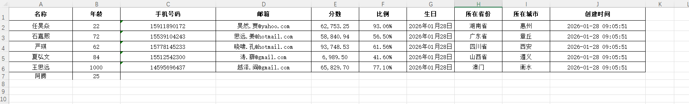

**创建监听器**

```java
package io.github.atengk.listener;

import io.github.atengk.entity.MyUser;
import org.apache.fesod.sheet.context.AnalysisContext;
import org.apache.fesod.sheet.event.AnalysisEventListener;
import org.springframework.util.ObjectUtils;

public class ValidationUserListener extends AnalysisEventListener<MyUser> {
    @Override
    public void onException(Exception exception, AnalysisContext context) throws Exception {
        super.onException(exception, context);
    }

    @Override
    public void invoke(MyUser myUser, AnalysisContext context) {
        Integer rowIndex = context.readRowHolder().getRowIndex();
        validate(myUser, rowIndex);
    }

    /**
     * 用户导入数据校验逻辑
     *
     * @param data     当前行解析后的数据对象
     * @param rowIndex Excel 行号，从 0 开始
     */
    private void validate(MyUser data, Integer rowIndex) {

        Integer excelRowNum = rowIndex + 1;

        if (ObjectUtils.isEmpty(data.getName())) {
            throw new IllegalArgumentException("第" + excelRowNum + "行：姓名不能为空");
        }

        if (data.getName().length() > 50) {
            throw new IllegalArgumentException("第" + excelRowNum + "行：姓名长度不能超过 50");
        }

        if (data.getAge() == null) {
            throw new IllegalArgumentException("第" + excelRowNum + "行：年龄不能为空");
        }

        if (data.getAge() < 0 || data.getAge() > 150) {
            throw new IllegalArgumentException("第" + excelRowNum + "行：年龄必须在 0 到 150 之间");
        }

        if (ObjectUtils.isEmpty(data.getPhoneNumber())) {
            throw new IllegalArgumentException("第" + excelRowNum + "行：手机号不能为空");
        }

    }

    @Override
    public void doAfterAllAnalysed(AnalysisContext analysisContext) {

    }

}
```

**使用方法**

```java
    @Test
    public void testImportValidation() {
        List<MyUser> list = FesodSheet
                .read(ExcelUtil.toInputStreamFromClasspath("doc/import_error_users.xlsx"), new ValidationUserListener())
                .head(MyUser.class)
                .sheet()
                .doReadSync();
        System.out.println(list);
        System.out.println(list.get(0).getName());
    }
```

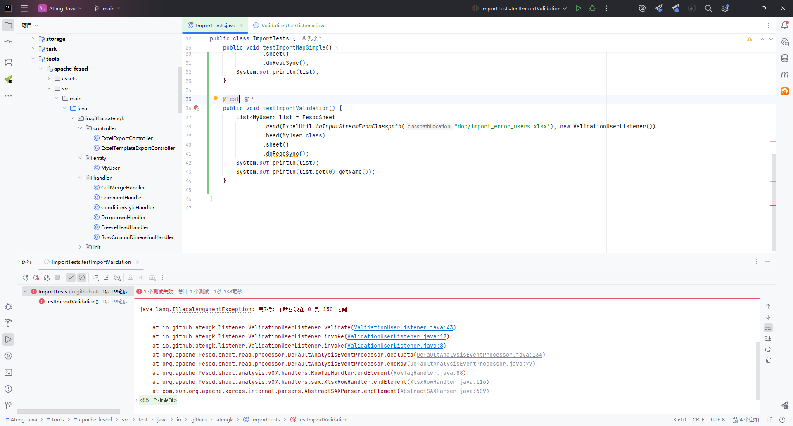


### 效验数据（收集所有错误）

**Excel 文件**


**创建监听器**

```java
package io.github.atengk.listener;

import io.github.atengk.entity.MyUser;
import org.apache.fesod.sheet.context.AnalysisContext;
import org.apache.fesod.sheet.event.AnalysisEventListener;
import org.springframework.util.ObjectUtils;

import java.util.ArrayList;
import java.util.List;

public class ValidationAllUserListener extends AnalysisEventListener<MyUser> {

    /**
     * 校验通过的数据
     */
    private final List<MyUser> successList = new ArrayList<>();

    /**
     * 校验失败的错误信息
     */
    private final List<String> errorList = new ArrayList<>();

    @Override
    public void onException(Exception exception, AnalysisContext context) {
        Integer rowIndex = context.readRowHolder().getRowIndex();
        Integer excelRowNum = rowIndex + 1;
        errorList.add("第" + excelRowNum + "行数据解析失败：" + exception.getMessage());
    }

    @Override
    public void invoke(MyUser myUser, AnalysisContext context) {
        Integer rowIndex = context.readRowHolder().getRowIndex();
        validate(myUser, rowIndex);
        successList.add(myUser);
    }

    /**
     * 用户导入数据校验逻辑
     *
     * @param data     当前行解析后的数据对象
     * @param rowIndex Excel 行号，从 0 开始
     */
    private void validate(MyUser data, Integer rowIndex) {

        Integer excelRowNum = rowIndex + 1;

        if (ObjectUtils.isEmpty(data.getName())) {
            throw new IllegalArgumentException("第" + excelRowNum + "行：姓名不能为空");
        }

        if (data.getName().length() > 50) {
            throw new IllegalArgumentException("第" + excelRowNum + "行：姓名长度不能超过 50");
        }

        if (data.getAge() == null) {
            throw new IllegalArgumentException("第" + excelRowNum + "行：年龄不能为空");
        }

        if (data.getAge() < 0 || data.getAge() > 150) {
            throw new IllegalArgumentException("第" + excelRowNum + "行：年龄必须在 0 到 150 之间");
        }

        if (ObjectUtils.isEmpty(data.getPhoneNumber())) {
            throw new IllegalArgumentException("第" + excelRowNum + "行：手机号不能为空");
        }
    }

    @Override
    public void doAfterAllAnalysed(AnalysisContext analysisContext) {
    }

    public List<MyUser> getSuccessList() {
        return successList;
    }

    public List<String> getErrorList() {
        return errorList;
    }

    public boolean hasError() {
        return !errorList.isEmpty();
    }

}

```

**使用方法**

```java
    @Test
    public void testImportValidationAll() {
        ValidationAllUserListener listener = new ValidationAllUserListener();
        FesodSheet
                .read(ExcelUtil.toInputStreamFromClasspath("doc/import_error_users.xlsx"), listener)
                .head(MyUser.class)
                .sheet()
                .doRead();
        // 获取效验数据
        List<MyUser> successList = listener.getSuccessList();
        List<String> errorList = listener.getErrorList();
        boolean hasError = listener.hasError();
        // 错误信息
        if (hasError) {
            System.out.println("错误信息：" + errorList);
        }
        // 正确数据
        System.out.println("正确数据：" + successList);
    }
```

> 输出：
>
> 错误信息：[第6行数据解析失败：第6行：年龄必须在 0 到 150 之间, 第7行数据解析失败：第7行：手机号不能为空]
> 正确数据：[MyUser(id=null, name=任昊焱, age=22, phoneNumber=15911890172, email=昊然.贾@yahoo.com, score=62753.25, ratio=0.93061, birthday=2026-01-28, province=湖南省, city=惠州, createTime=2026-01-28T09:05:51, imageUrl=null, gender=null), MyUser(id=null, name=石嘉熙, age=72, phoneNumber=15539104243, email=思远.姜@hotmail.com, score=58840.94, ratio=0.56496, birthday=2026-01-28, province=广东省, city=章丘, createTime=2026-01-28T09:05:51, imageUrl=null, gender=null), MyUser(id=null, name=严琪, age=62, phoneNumber=15778145233, email=晓啸.孔@hotmail.com, score=93748.53, ratio=0.61555, birthday=2026-01-28, province=四川省, city=西安, createTime=2026-01-28T09:05:51, imageUrl=null, gender=null), MyUser(id=null, name=夏弘文, age=84, phoneNumber=15512542300, email=涛.薛@gmail.com, score=6989.5, ratio=0.41597, birthday=2026-01-28, province=山西省, city=遵义, createTime=2026-01-28T09:05:51, imageUrl=null, gender=null)]


### 图片导入（框架不支持!!!）

**Excel 文件**

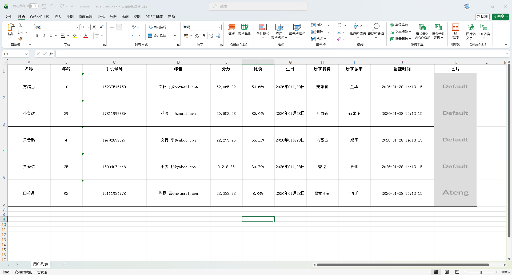

**添加图片字段**

```java
    /**
     * 图片
     */
    @ExcelProperty(value = "图片", converter = StringUrlImageConverter.class)
    @ColumnWidth(20)
    private String imageUrl;
```

**使用方法**

```java
    @Test
    public void testImportImage() {
        List<MyUser> list = FesodSheet
                .read(ExcelUtil.toInputStreamFromClasspath("doc/import_image_users.xlsx"))
                .head(MyUser.class)
                .sheet()
                .doReadSync();
        System.out.println(list);
        System.out.println(list.get(0).getName());
    }
```

> 输出：
>
> 


### 图片导入（使用POI）

**Excel 文件**


**添加图片字段**

```java
    /**
     * 图片
     */
    @ExcelProperty(value = "图片", converter = StringUrlImageConverter.class)
    @ColumnWidth(20)
    private String imageUrl;
```

**创建POI获取图片的方法**

```java
    /**
     * 读取 Excel 中的所有图片
     *
     * @param inputStream Excel 输入流
     * @param columnIndex 图片所在列
     * @return key = 行号(0-based)，value = 图片文件路径（或 URL）
     */
    public static Map<Integer, String> readImages(InputStream inputStream, int columnIndex) {
        Map<Integer, String> imageMap = new HashMap<>();

        try (Workbook workbook = WorkbookFactory.create(inputStream)) {
            Sheet sheet = workbook.getSheetAt(0);

            if (!(sheet instanceof XSSFSheet)) {
                return imageMap;
            }

            XSSFSheet xssfSheet = (XSSFSheet) sheet;
            XSSFDrawing drawing = xssfSheet.getDrawingPatriarch();
            if (drawing == null) {
                return imageMap;
            }

            for (XSSFShape shape : drawing.getShapes()) {
                if (!(shape instanceof XSSFPicture)) {
                    continue;
                }

                XSSFPicture picture = (XSSFPicture) shape;
                XSSFClientAnchor anchor = picture.getPreferredSize();

                int row = anchor.getRow1();
                int col = anchor.getCol1();

                // 只处理“图片列”的图片
                if (col != columnIndex) {
                    continue;
                }

                XSSFPictureData pictureData = picture.getPictureData();
                byte[] bytes = pictureData.getData();
                String ext = pictureData.suggestFileExtension();

                String fileName = "img_" + row + "." + ext;
                File file = new File("target/excel-images/" + fileName);
                file.getParentFile().mkdirs();

                try (FileOutputStream fos = new FileOutputStream(file)) {
                    fos.write(bytes);
                }

                imageMap.put(row, file.getAbsolutePath());
            }
        } catch (Exception e) {
            throw new RuntimeException("读取 Excel 图片失败", e);
        }

        return imageMap;
    }
```

**使用方法**

```java
    @Test
    public void testImportImagePoi() {
        // 1. 先用 Fesod 读取结构化数据
        List<MyUser> list = FesodSheet
                .read(ExcelUtil.toInputStreamFromClasspath("doc/import_image_users.xlsx"))
                .head(MyUser.class)
                .sheet()
                .doReadSync();

        // 2. 再用 POI 读取图片
        Map<Integer, String> imageMap = readImages(
                ExcelUtil.toInputStreamFromClasspath("doc/import_image_users.xlsx"), 10);

        // 3. 把图片 URL 填充回 MyUser
        for (int i = 0; i < list.size(); i++) {
            MyUser user = list.get(i);
            String imagePath = imageMap.get(i + 1);
            // 注意：通常 Excel 第一行是表头，所以图片行号要 +1
            user.setImageUrl(imagePath);
        }

        // 4. 验证结果
        System.out.println(list);
        System.out.println(list.get(0).getName());
        System.out.println(list.get(0).getImageUrl());
    }
```

> 输出：
>
> [MyUser(id=null, name=方熠彤, age=10, phoneNumber=15237545759, email=文轩.孔@hotmail.com, score=52065.22, ratio=0.54658, birthday=2026-01-28, province=安徽省, city=金华, createTime=2026-01-28T14:13:15, imageUrl=D:\My\dev\Ateng-Java\tools\apache-fesod\target\excel-images\img_1.png, gender=null), MyUser(id=null, name=孙立辉, age=29, phoneNumber=17811999389, email=鸿涛.叶@gmail.com, score=20952.43, ratio=0.80635, birthday=2026-01-28, province=江西省, city=石家庄, createTime=2026-01-28T14:13:15, imageUrl=D:\My\dev\Ateng-Java\tools\apache-fesod\target\excel-images\img_2.png, gender=null), MyUser(id=null, name=黄晋鹏, age=4, phoneNumber=14792892027, email=文博.李@yahoo.com, score=22293.26, ratio=0.55105, birthday=2026-01-28, province=内蒙古, city=咸阳, createTime=2026-01-28T14:13:15, imageUrl=D:\My\dev\Ateng-Java\tools\apache-fesod\target\excel-images\img_3.png, gender=null), MyUser(id=null, name=贾修洁, age=25, phoneNumber=15004074446, email=思淼.杨@yahoo.com, score=9218.35, ratio=0.30789, birthday=2026-01-28, province=香港, city=泉州, createTime=2026-01-28T14:13:15, imageUrl=D:\My\dev\Ateng-Java\tools\apache-fesod\target\excel-images\img_4.png, gender=null), MyUser(id=null, name=田梓晨, age=62, phoneNumber=15111934778, email=烨霖.曹@hotmail.com, score=23338.83, ratio=0.08037, birthday=2026-01-28, province=黑龙江省, city=宿迁, createTime=2026-01-28T14:13:15, imageUrl=D:\My\dev\Ateng-Java\tools\apache-fesod\target\excel-images\img_5.png, gender=null)]
> 方熠彤
> D:\My\dev\Ateng-Java\tools\apache-fesod\target\excel-images\img_1.png


### 数据映射（Converter 转换器）

**Excel 文件**

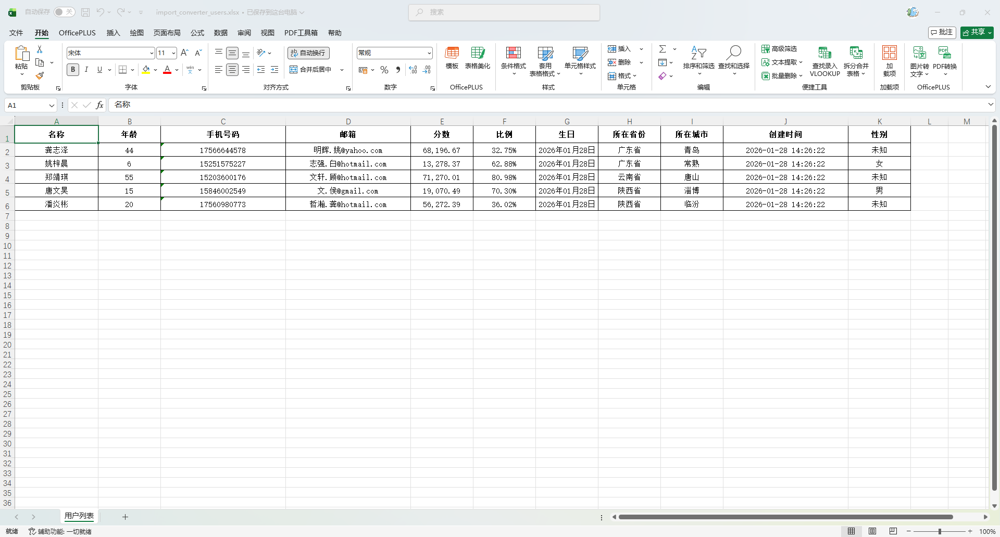

**创建Converter** 

```java
package io.github.atengk.util;

import org.apache.fesod.sheet.converters.Converter;
import org.apache.fesod.sheet.enums.CellDataTypeEnum;
import org.apache.fesod.sheet.metadata.GlobalConfiguration;
import org.apache.fesod.sheet.metadata.data.ReadCellData;
import org.apache.fesod.sheet.metadata.data.WriteCellData;
import org.apache.fesod.sheet.metadata.property.ExcelContentProperty;

/**
 * 性别字段 Excel 映射转换器
 * <p>
 * 功能说明：
 * 1. 导出时：将 Java 中的性别编码转换为 Excel 可读文本
 * 2. 导入时：将 Excel 中的性别文本转换为 Java 性别编码
 * <p>
 * 映射规则：
 * Java -> Excel
 * 1  -> 男
 * 2  -> 女
 * 0  -> 未知
 * <p>
 * Excel -> Java
 * 男   -> 1
 * 女   -> 2
 * 未知 -> 0
 * <p>
 * 使用方式：
 * 在实体字段上配置：
 *
 * @author 孔余
 * @ExcelProperty(value = "性别", converter = GenderConverter.class)
 * <p>
 * 适用场景：
 * - 枚举字段导入导出
 * - 字典字段导入导出
 * - 固定映射规则字段
 * @since 2026-01-26
 */
public class GenderConverter implements Converter<Integer> {

    /**
     * 返回当前转换器支持的 Java 类型
     *
     * @return Java 字段类型
     */
    @Override
    public Class<?> supportJavaTypeKey() {
        return Integer.class;
    }

    /**
     * 返回当前转换器支持的 Excel 单元格类型
     *
     * @return Excel 单元格类型枚举
     */
    @Override
    public CellDataTypeEnum supportExcelTypeKey() {
        return CellDataTypeEnum.STRING;
    }

    /**
     * Excel -> Java 数据转换
     * <p>
     * 在 Excel 导入时执行：
     * 将单元格中的文本转换为 Java 字段值
     *
     * @param cellData            Excel 单元格数据
     * @param contentProperty     字段内容属性
     * @param globalConfiguration 全局配置
     * @return Java 字段值
     */
    @Override
    public Integer convertToJavaData(ReadCellData<?> cellData,
                                     ExcelContentProperty contentProperty,
                                     GlobalConfiguration globalConfiguration) {

        String value = cellData.getStringValue();

        if ("男".equals(value)) {
            return 1;
        }

        if ("女".equals(value)) {
            return 2;
        }

        if ("未知".equals(value)) {
            return 0;
        }

        return null;
    }

    /**
     * Java -> Excel 数据转换
     * <p>
     * 在 Excel 导出时执行：
     * 将 Java 字段值转换为 Excel 单元格显示文本
     *
     * @param value               Java 字段值
     * @param contentProperty     字段内容属性
     * @param globalConfiguration 全局配置
     * @return Excel 单元格数据对象
     */
    @Override
    public WriteCellData<?> convertToExcelData(Integer value,
                                               ExcelContentProperty contentProperty,
                                               GlobalConfiguration globalConfiguration) {

        String text;

        if (value == null) {
            text = "";
        } else if (value == 1) {
            text = "男";
        } else if (value == 2) {
            text = "女";
        } else if (value == 0) {
            text = "未知";
        } else {
            text = "未知";
        }

        return new WriteCellData<>(text);
    }
}
```

**添加字段**

```java
    /**
     * 性别
     */
    @ExcelProperty(value = "性别", converter = GenderConverter.class)
    private Integer gender;
```

**使用方法**

```java
    @Test
    public void testImportConverter() {
        List<MyUser> list = FesodSheet
                .read(ExcelUtil.toInputStreamFromClasspath("doc/import_converter_users.xlsx"))
                .head(MyUser.class)
                .sheet()
                .doReadSync();
        System.out.println(list);
        System.out.println(list.get(0).getName());
    }
```

> 输出：
>
> [MyUser(id=null, name=龚志泽, age=44, phoneNumber=17566644578, email=明辉.姚@yahoo.com, score=68196.67, ratio=0.32753, birthday=2026-01-28, province=广东省, city=青岛, createTime=2026-01-28T14:26:22, imageUrl=null, gender=0), MyUser(id=null, name=姚梓晨, age=6, phoneNumber=15251575227, email=志强.白@hotmail.com, score=13278.37, ratio=0.62875, birthday=2026-01-28, province=广东省, city=常熟, createTime=2026-01-28T14:26:22, imageUrl=null, gender=2), MyUser(id=null, name=郑靖琪, age=55, phoneNumber=15203600176, email=文轩.顾@hotmail.com, score=71270.01, ratio=0.80977, birthday=2026-01-28, province=云南省, city=唐山, createTime=2026-01-28T14:26:22, imageUrl=null, gender=0), MyUser(id=null, name=唐文昊, age=15, phoneNumber=15846002549, email=文.侯@gmail.com, score=19070.49, ratio=0.70297, birthday=2026-01-28, province=陕西省, city=淄博, createTime=2026-01-28T14:26:22, imageUrl=null, gender=1), MyUser(id=null, name=潘炎彬, age=20, phoneNumber=17560980773, email=哲瀚.龚@hotmail.com, score=56272.39, ratio=0.36022, birthday=2026-01-28, province=陕西省, city=临汾, createTime=2026-01-28T14:26:22, imageUrl=null, gender=0)]
> 龚志泽


### 流式回调读取（大量数据）

使用 Listener 流式回调，适用于大文件、导入入库、带校验、分批处理

**Excel 文件**

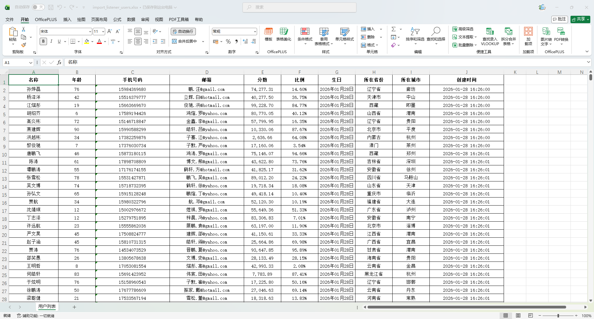

**创建 Listener**

```java
package io.github.atengk.listener;

import io.github.atengk.entity.MyUser;
import org.apache.fesod.sheet.context.AnalysisContext;
import org.apache.fesod.sheet.read.listener.ReadListener;
import org.slf4j.Logger;
import org.slf4j.LoggerFactory;

import java.util.ArrayList;
import java.util.List;

public class MyUserBatchReadListener implements ReadListener<MyUser> {

    private static final Logger log = LoggerFactory.getLogger(MyUserBatchReadListener.class);

    /**
     * 单批次最大数据量
     */
    private static final int BATCH_SIZE = 400;

    /**
     * 当前批次缓存数据
     */
    private final List<MyUser> batchList = new ArrayList<>(BATCH_SIZE);

    /**
     * 成功处理的数据总量，仅用于测试统计
     */
    private int totalCount = 0;

    @Override
    public void invoke(MyUser myUser, AnalysisContext analysisContext) {
        batchList.add(myUser);

        if (batchList.size() >= BATCH_SIZE) {
            saveBatch();
            batchList.clear();
        }
    }

    @Override
    public void doAfterAllAnalysed(AnalysisContext analysisContext) {
        if (!batchList.isEmpty()) {
            saveBatch();
            batchList.clear();
        }

        log.info("Excel 导入完成，总处理数据量：{}", totalCount);
    }

    /**
     * 模拟批量入库
     */
    private void saveBatch() {
        int size = batchList.size();
        totalCount += size;

        log.info("模拟入库，当前批次大小：{}，累计处理：{}", size, totalCount);

        try {
            Thread.sleep(50);
        } catch (InterruptedException e) {
            Thread.currentThread().interrupt();
        }
    }

}
```

**使用方法**

```java
    @Test
    public void testImportListener() {
        FesodSheet
                .read(ExcelUtil.toInputStreamFromClasspath("doc/import_listener_users.xlsx"))
                .head(MyUser.class)
                .registerReadListener(new MyUserBatchReadListener())
                .sheet()
                .doRead();
    }
```

> 输出：
>
> 16:34:43.878 [main] INFO io.github.atengk.listener.MyUserBatchReadListener - 模拟入库，当前批次大小：400，累计处理：400
> 16:34:43.965 [main] INFO io.github.atengk.listener.MyUserBatchReadListener - 模拟入库，当前批次大小：400，累计处理：800
> 16:34:44.051 [main] INFO io.github.atengk.listener.MyUserBatchReadListener - 模拟入库，当前批次大小：200，累计处理：1000
> 16:34:44.110 [main] INFO io.github.atengk.listener.MyUserBatchReadListener - Excel 导入完成，总处理数据量：1000


### 多 Sheet 导入

使用多个 Listener 流式回调，从 Listener 获取到数据

**Excel 文件**

Sheet 1

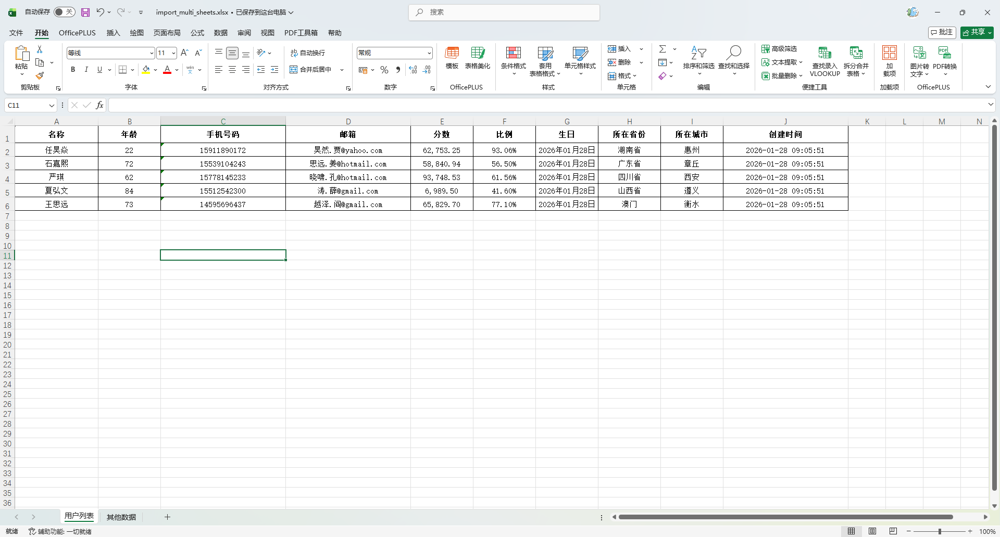

Sheet 2

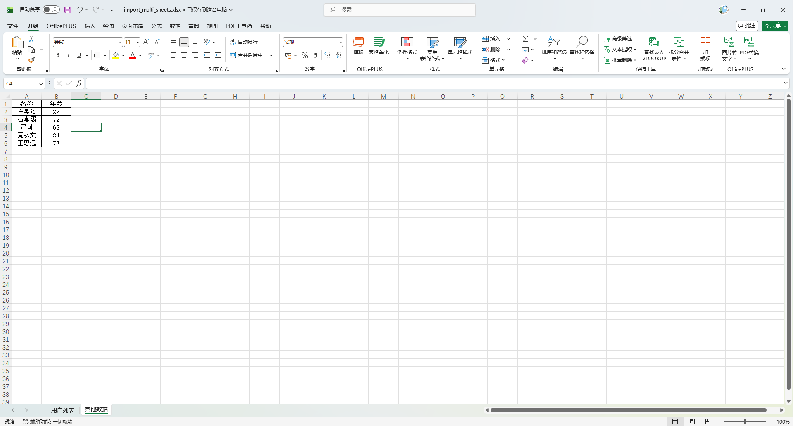

**创建 Listener** 

MyUserReadListener

```java
package io.github.atengk.listener;

import io.github.atengk.entity.MyUser;
import org.apache.fesod.sheet.context.AnalysisContext;
import org.apache.fesod.sheet.read.listener.ReadListener;

import java.util.ArrayList;
import java.util.List;

public class MyUserReadListener implements ReadListener<MyUser> {

    private final List<MyUser> dataList = new ArrayList<>();

    @Override
    public void invoke(MyUser myUser, AnalysisContext analysisContext) {
        dataList.add(myUser);
    }

    @Override
    public void doAfterAllAnalysed(AnalysisContext analysisContext) {
    }

    public List<MyUser> getDataList() {
        return dataList;
    }

}
```

OtherReadListener

```java
package io.github.atengk.listener;

import io.github.atengk.entity.Other;
import org.apache.fesod.sheet.context.AnalysisContext;
import org.apache.fesod.sheet.read.listener.ReadListener;

import java.util.ArrayList;
import java.util.List;

public class OtherReadListener implements ReadListener<Other> {

    private final List<Other> dataList = new ArrayList<>();

    @Override
    public void invoke(Other other, AnalysisContext analysisContext) {
        dataList.add(other);
    }

    @Override
    public void doAfterAllAnalysed(AnalysisContext analysisContext) {
    }

    public List<Other> getDataList() {
        return dataList;
    }

}
```


**使用方法**

```java
    @Test
    public void testImportMultiSheet() {
        MyUserReadListener userListener = new MyUserReadListener();
        OtherReadListener otherListener = new OtherReadListener();

        try (ExcelReader excelReader = FesodSheet
                .read(ExcelUtil.toInputStreamFromClasspath("doc/import_multi_sheets.xlsx"))
                .build()) {

            ReadSheet readSheet1 = FesodSheet
                    .readSheet(0)
                    .head(MyUser.class)
                    .registerReadListener(userListener)
                    .build();

            ReadSheet readSheet2 = FesodSheet
                    .readSheet("其他数据")
                    .head(Other.class)
                    .registerReadListener(otherListener)
                    .build();

            excelReader.read(readSheet1, readSheet2);
            excelReader.finish();
        }

        // 读取结果
        System.out.println("Sheet0 用户数据：");
        System.out.println(userListener.getDataList());

        System.out.println("“其他数据” Sheet 数据：");
        System.out.println(otherListener.getDataList());
    }
```

> 输出：
>
> Sheet0 用户数据：
> [MyUser(id=null, name=任昊焱, age=22, phoneNumber=15911890172, email=昊然.贾@yahoo.com, score=62753.25, ratio=0.93061, birthday=2026-01-28, province=湖南省, city=惠州, createTime=2026-01-28T09:05:51, imageUrl=null, gender=null), MyUser(id=null, name=石嘉熙, age=72, phoneNumber=15539104243, email=思远.姜@hotmail.com, score=58840.94, ratio=0.56496, birthday=2026-01-28, province=广东省, city=章丘, createTime=2026-01-28T09:05:51, imageUrl=null, gender=null), MyUser(id=null, name=严琪, age=62, phoneNumber=15778145233, email=晓啸.孔@hotmail.com, score=93748.53, ratio=0.61555, birthday=2026-01-28, province=四川省, city=西安, createTime=2026-01-28T09:05:51, imageUrl=null, gender=null), MyUser(id=null, name=夏弘文, age=84, phoneNumber=15512542300, email=涛.薛@gmail.com, score=6989.5, ratio=0.41597, birthday=2026-01-28, province=山西省, city=遵义, createTime=2026-01-28T09:05:51, imageUrl=null, gender=null), MyUser(id=null, name=王思远, age=73, phoneNumber=14595696437, email=越泽.阎@gmail.com, score=65829.7, ratio=0.77095, birthday=2026-01-28, province=澳门, city=衡水, createTime=2026-01-28T09:05:51, imageUrl=null, gender=null)]
> “其他数据” Sheet 数据：
> [Other(name=任昊焱, age=22), Other(name=石嘉熙, age=72), Other(name=严琪, age=62), Other(name=夏弘文, age=84), Other(name=王思远, age=73)]


## SpringBoot 使用

### 导出数据

**使用方法**

```java
    /**
     * 导出Excel
     */
    @GetMapping("/entity")
    public void exportEntity(HttpServletResponse response) {
        List<MyUser> list = InitData.getDataList();
        String fileName = "用户列表.xlsx";
        ExcelUtil.exportExcelToResponse(
                response,
                fileName,
                list,
                MyUser.class,
                "用户列表"
        );
    }
```

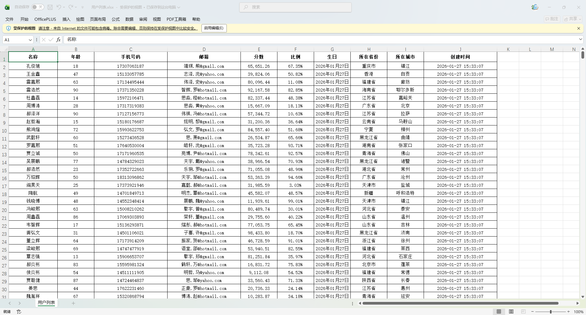

### 导出动态数据

**使用方法**

```java
    /**
     * 动态导出 Excel
     */
    @GetMapping("/dynamic")
    public void exportDynamic(HttpServletResponse response) {

        // 生成随机表头
        List<String> headers = new ArrayList<>();
        int randomInt = new Random().nextInt(20) + 1;
        for (int i = 0; i < randomInt; i++) {
            headers.add("表头" + (i + 1));
        }

        // 生成随机数据
        List<Map<String, Object>> dataList = new ArrayList<>();
        for (int i = 0; i < 10; i++) {
            Map<String, Object> row = new HashMap<>();
            for (int j = 0; j < headers.size(); j++) {
                row.put(headers.get(j), "数据" + (i + 1) + "-" + (j + 1));
            }
            dataList.add(row);
        }

        // 导出文件
        String fileName = "动态导出.xlsx";
        ExcelUtil.exportExcelDynamicSimpleToResponse(
                response,
                fileName,
                headers,
                dataList,
                "用户列表"
        );
    }
```

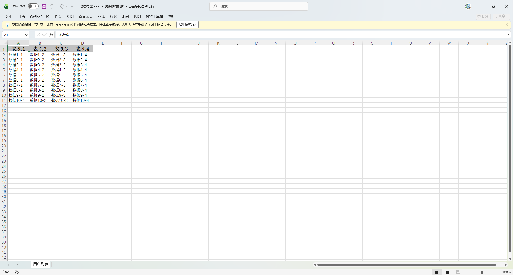

### 模版导出

**使用方法**

```java
    /**
     * 模版导出Excel
     */
    @GetMapping("/simple")
    public void simple(HttpServletResponse response) {
        // 准备数据
        // 列表变量
        List<MyUser> userList = InitData.getDataList(2);
        List<Map<String, Object>> otherList = new ArrayList<>();
        otherList.add(new HashMap<String, Object>() {{
            put("type", "类型1");
            put("count", 10);
        }});
        otherList.add(new HashMap<String, Object>() {{
            put("type", "类型2");
            put("count", 20);
        }});
        Map<String, List<?>> listMap = new HashMap<>();
        listMap.put("userList", userList);
        listMap.put("otherList", otherList);
        // 普通变量
        HashMap<String, Object> data = new HashMap<>();
        data.put("createTime", LocalDateTime.now());
        data.put("createTimeStr", LocalDateTime.now().format(DateTimeFormatter.ofPattern("yyyy-MM-dd HH:mm:ss")));
        data.put("author", "Ateng");
        data.put("authorZh", "阿腾");

        // 导出多列
        ExcelUtil.exportExcelTemplateToResponse(
                response,
                "用户列表.xlsx",
                ExcelUtil.toInputStreamFromClasspath("doc/template_user_mix.xlsx"),
                data,
                listMap
                );
    }
```

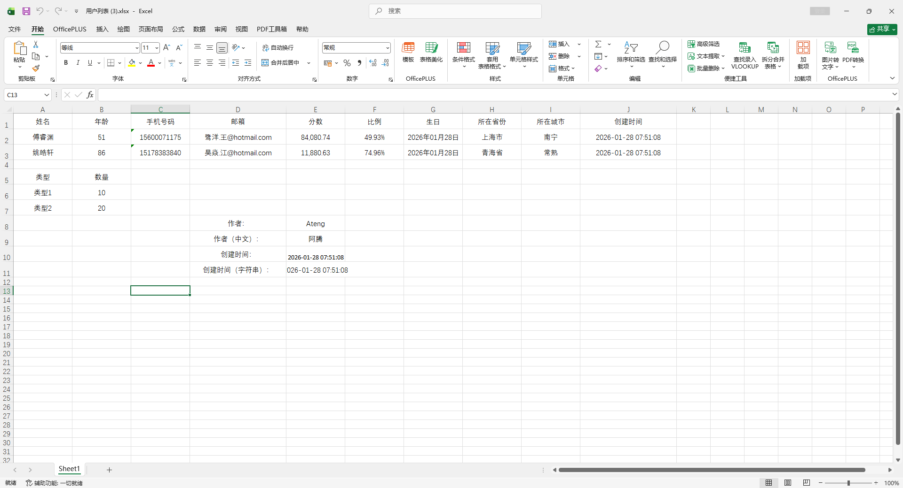

### 导入数据

**导入数据**

`resources/doc/import_simple_users.xlsx`

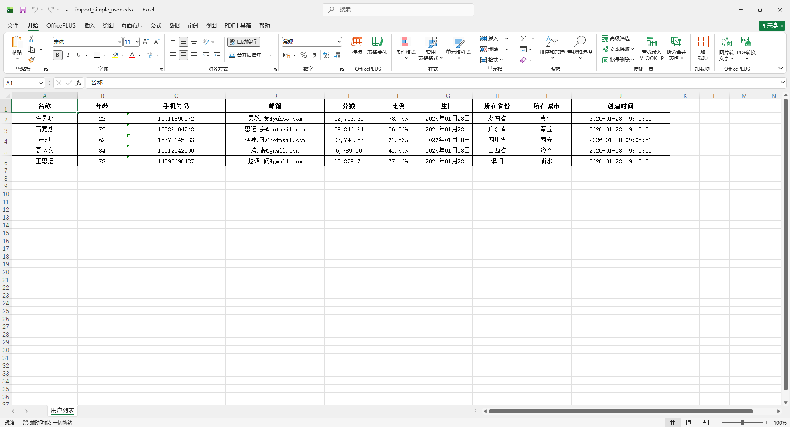

**使用方法**

```java
    /**
     * 导入Excel
     */
    @PostMapping("/simple")
    public List<MyUser> simple(MultipartFile file) {
        List<MyUser> userList = ExcelUtil.importExcel(ExcelUtil.toInputStream(file), MyUser.class);
        return userList;
    }
```

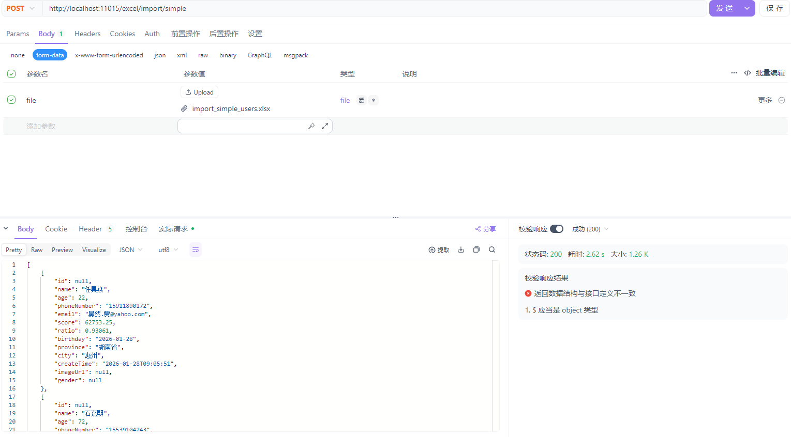
