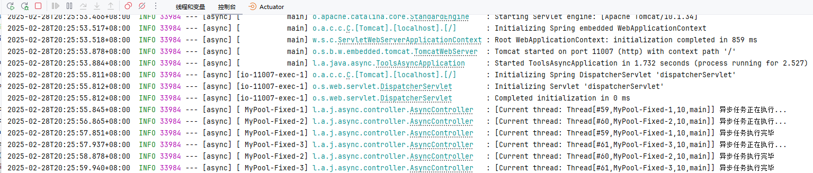
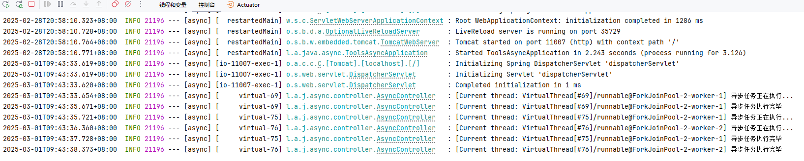

# 异步编程


## CompletableFuture

`CompletableFuture` 是 JDK 中用于处理异步任务的一个非常强大的工具类，它在 JDK 8 引入，能够极大简化异步编程，支持非阻塞式操作，并且提供了多种方法来组合、等待、处理异常等。其主要特点是支持回调、链式操作和异常处理等。

### 创建异步任务

这里使用 `runAsync` 方法启动一个无返回值的异步任务。默认使用 `ForkJoinPool.commonPool()` 线程池执行任务。

`ForkJoinPool.commonPool()` 是 **JVM 全局共享**的 `ForkJoinPool`，用于 **`parallelStream()` 和 `CompletableFuture`** 的并行任务执行。它**默认线程数为 `CPU 核心数 - 1`**，基于**工作窃取算法**优化多线程计算。虽然 `commonPool()` 适用于短时并行任务，但对**长时间阻塞任务不友好**，可通过 `-Djava.util.concurrent.ForkJoinPool.common.parallelism=N` 调整并行度。如果需要**独立控制线程池**，建议手动创建 `ForkJoinPool`。

```java
@GetMapping("/async1")
public String async1() {
    CompletableFuture<Void> future = CompletableFuture.runAsync(() -> {
        String threadInfo = Thread.currentThread().toString();
        log.info("[Current thread: {}] 异步任务正在执行...", threadInfo);
        ThreadUtil.safeSleep(2000);
        log.info("[Current thread: {}] 异步任务执行完毕", threadInfo);
    });
    return DateUtil.now();
}
```

### 有返回值的异步任务

使用 supplyAsync 可以执行返回值的异步操作。CompletableFuture 提供了 get() 和 join() 方法来获取异步任务的结果，get() 会抛出检查型异常，而 join() 会抛出运行时异常，两者功能相似，区别在于异常处理的方式。

```java
@GetMapping("/async11")
public String async11() throws ExecutionException, InterruptedException {
    CompletableFuture<Integer> future = CompletableFuture.supplyAsync(() -> {
        String threadInfo = Thread.currentThread().toString();
        log.info("[Current thread: {}] 异步任务正在执行...", threadInfo);
        ThreadUtil.safeSleep(2000);
        log.info("[Current thread: {}] 异步任务执行完毕", threadInfo);
        return RandomUtil.randomInt(0, 10000);
    });
    Integer result = future.get();  // 阻塞式等待
    return DateUtil.now() + "-" + result;
}
```

**组合多个异步任务**

`CompletableFuture` 支持多种方式来组合异步任务，以提高执行效率和代码的可读性。

- **`thenApply` / `thenApplyAsync`**：对结果进行转换

    ```java
    CompletableFuture<Integer> future = CompletableFuture.supplyAsync(() -> 2)
        .thenApplyAsync(result -> result * 3);
    Integer result = future.get();  // 结果是 6
    ```

    `thenApply` 是同步的转换操作，而 `thenApplyAsync` 则是异步执行转换操作。

- **`thenCombine` / `thenCombineAsync`**：组合两个异步结果

    ```java
    CompletableFuture<Integer> future1 = CompletableFuture.supplyAsync(() -> 2);
    CompletableFuture<Integer> future2 = CompletableFuture.supplyAsync(() -> 3);
    
    CompletableFuture<Integer> resultFuture = future1.thenCombine(future2, (f1, f2) -> f1 + f2);
    Integer result = resultFuture.get();  // 结果是 5
    ```

    这里，`thenCombine` 将两个异步任务的结果合并。

- **`thenCompose` / `thenComposeAsync`**：链式调用（执行依赖于前一个任务的操作）

    ```java
    CompletableFuture<Integer> future = CompletableFuture.supplyAsync(() -> 2)
        .thenComposeAsync(result -> CompletableFuture.supplyAsync(() -> result * 3));
    Integer result = future.get();  // 结果是 6
    ```

    `thenCompose` 用于处理依赖于前一个任务结果的下一个异步任务。

### 异常处理

`CompletableFuture` 提供了几种方法来处理异步任务中的异常：

- **`handle`**：在任务完成时，无论是正常完成还是异常完成，都会执行。

    ```java
    CompletableFuture<Integer> future = CompletableFuture.supplyAsync(() -> {
        if (true) throw new RuntimeException("Something went wrong");
        return 42;
    }).handle((result, ex) -> {
        if (ex != null) {
            System.out.println("出现异常: " + ex.getMessage());
            return -1;
        }
        return result;
    });
    Integer result = future.get();  // 结果是 -1
    ```

- **`exceptionally`**：当任务发生异常时，可以提供一个回调函数。

    ```java
    CompletableFuture<Integer> future = CompletableFuture.supplyAsync(() -> {
        if (true) throw new RuntimeException("Something went wrong");
        return 42;
    }).exceptionally(ex -> {
        System.out.println("异常发生: " + ex.getMessage());
        return -1;
    });
    Integer result = future.get();  // 结果是 -1
    ```

    `exceptionally` 只会处理异常，且提供默认值。

- **`whenComplete`**：任务完成时执行，无论是正常还是异常。

    ```java
    CompletableFuture<Integer> future = CompletableFuture.supplyAsync(() -> 42)
        .whenComplete((result, ex) -> {
            if (ex != null) {
                System.out.println("任务异常: " + ex.getMessage());
            } else {
                System.out.println("任务结果: " + result);
            }
        });
    future.get();
    ```

### 等待多个异步任务

- **`allOf`**：等待所有任务完成。

    ```java
        @GetMapping("/async12")
        public String async12() throws ExecutionException, InterruptedException {
            CompletableFuture<Integer> future1 = CompletableFuture.supplyAsync(() -> {
                ThreadUtil.safeSleep(RandomUtil.randomInt(0, 10000));
                return 1;
            });
            CompletableFuture<Integer> future2 = CompletableFuture.supplyAsync(() -> {
                ThreadUtil.safeSleep(RandomUtil.randomInt(0, 10000));
                return 2;
            });
            CompletableFuture<Void> allOf = CompletableFuture.allOf(future1, future2);
            allOf.get();  // 等待所有任务完成
    
            return DateUtil.now();
        }
    ```

- **`anyOf`**：等待任意一个任务完成。

    ```java
        @GetMapping("/async13")
        public String async13() throws ExecutionException, InterruptedException {
            CompletableFuture<Integer> future1 = CompletableFuture.supplyAsync(() -> {
                ThreadUtil.safeSleep(RandomUtil.randomInt(0, 10000));
                return 1;
            });
            CompletableFuture<Integer> future2 = CompletableFuture.supplyAsync(() -> {
                ThreadUtil.safeSleep(RandomUtil.randomInt(0, 10000));
                return 2;
            });
            CompletableFuture<Object> anyOf = CompletableFuture.anyOf(future1, future2);
            Object result = anyOf.get();  // 获取第一个完成的任务结果
            return DateUtil.now() + "-" + result;
        }
    ```

### 取消异步任务

可以通过 `cancel` 方法来取消一个尚未完成的任务。

```java
CompletableFuture<Void> future = CompletableFuture.runAsync(() -> {
    try {
        Thread.sleep(5000);
    } catch (InterruptedException e) {
        e.printStackTrace();
    }
});
future.cancel(true);  // 取消任务
```


## 线程池

线程池（`ThreadPool`）是一种**线程管理机制**，它**预创建并维护多个线程**，用于执行多个任务，而不是为每个任务单独创建新线程。

✅ **降低资源消耗**：线程池**复用已创建的线程**，避免频繁创建/销毁线程带来的性能开销。
✅ **提高响应速度**：任务可以直接从线程池获取可用线程执行，而不用等待新线程创建。
✅ **提高系统稳定性**：线程池可以**限制最大线程数**，防止过多线程导致 CPU 过载。
✅ **管理线程生命周期**：线程池提供**任务队列、超时控制、异常处理等**功能，方便管理多线程程序。

### Fixed线程池

newFixedThreadPool(int nThreads) 创建一个固定大小的线程池，线程池中的线程数量是固定的。即使线程处于空闲状态，也不会被销毁。这个线程池适用于负载相对均匀的情况。该线程池会创建最多 `nThreads` 个线程来处理任务，当有更多任务提交时，它们会被排队等待执行。

```java
// 固定大小的线程池
ExecutorService fixedExecutor = Executors.newFixedThreadPool(Runtime.getRuntime().availableProcessors());

@GetMapping("/async2")
public String async2() {
    CompletableFuture<Void> future = CompletableFuture.runAsync(() -> {
        String threadInfo = Thread.currentThread().toString();
        log.info("[Current thread: {}] 异步任务正在执行...", threadInfo);
        ThreadUtil.safeSleep(2000);
        log.info("[Current thread: {}] 异步任务执行完毕", threadInfo);
    }, fixedExecutor);
    return DateUtil.now();
}
```

自定义线程工厂

```java
    // 固定大小的线程池
    ExecutorService fixedExecutor = Executors.newFixedThreadPool(Runtime.getRuntime().availableProcessors(), new ThreadFactory() {
        private int count = 1;
        @Override
        public Thread newThread(Runnable r) {
            Thread thread = new Thread(r, "MyPool-Fixed-" + count++);
            thread.setDaemon(false); // true=守护线程, false=用户线程
            thread.setPriority(Thread.MAX_PRIORITY); // 设置最大优先级
            return thread;
        }
    });
```




### Cached线程池

创建一个可缓存的线程池。这个线程池会根据需求创建新线程，并且空闲线程会在60秒后被回收。适用于执行很多短期异步任务的场景。

它的特点是：如果有空闲线程，任务会立即分配给这些空闲线程；如果没有空闲线程，线程池会动态创建新线程来执行任务；如果线程在60秒内没有被使用，它将被终止并从池中移除。

```java
    // 可缓存的线程池
    ExecutorService cachedExecutor = Executors.newCachedThreadPool(new ThreadFactory() {
        private int count = 1;
        @Override
        public Thread newThread(Runnable r) {
            Thread thread = new Thread(r, "MyPool-Cached-" + count++);
            thread.setDaemon(false); // true=守护线程, false=用户线程
            thread.setPriority(Thread.MAX_PRIORITY); // 设置最大优先级
            return thread;
        }
    });
```

### WorkStealing线程池

创建一个具有工作窃取算法的线程池。这个线程池会自动根据系统负载调整线程数量，它适合于执行计算密集型的任务，能有效分配任务到多个线程，并且线程池中的线程会尝试窃取其他线程的任务，从而提高系统的吞吐量。

这个线程池通常适用于需要大量并行计算的任务，在某些情况下能够提高性能，因为它可以更高效地利用 CPU 核心。

```java
// 工作窃取算法的线程池
ExecutorService workStealingExecutor = Executors.newWorkStealingPool(4);
```

### 虚拟线程池

虚拟线程是 Java **Project Loom** 的一项新特性，目的是显著简化并发编程并提高资源的利用效率。虚拟线程是轻量级的线程，它们的创建和销毁成本远低于传统的操作系统线程。虚拟线程是由 **Java 虚拟机（JVM）** 调度和管理的，而不是操作系统的内核，允许开发者更轻松地创建大量的并发任务。

JDK 21（包括 Project Loom 的实现）已经对虚拟线程进行了正式支持，提供了极大的并发能力而不会对系统资源产生过大的压力。

```java
// 虚拟线程池
ExecutorService VirtualExecutor = Executors.newVirtualThreadPerTaskExecutor();
```

自定义线程名称

```java
ExecutorService virtualExecutorCustom = Executors.newThreadPerTaskExecutor(
        Thread.ofVirtual().name("MyVirtual-", 0).factory()
);
```

使用虚拟线程池

```java
    @GetMapping("/async5")
    public String async5() {
        CompletableFuture<Void> future = CompletableFuture.runAsync(() -> {
            String threadInfo = Thread.currentThread().toString();
            log.info("[Current thread: {}] 异步任务正在执行...", threadInfo);
            ThreadUtil.safeSleep(2000);
            log.info("[Current thread: {}] 异步任务执行完毕", threadInfo);
        }, virtualExecutor);
        return DateUtil.now();
    }
```



### 自定义线程池

`ThreadPoolExecutor` 是 Java 线程池的核心实现，它允许我们**自定义线程池的行为**（如线程数、任务队列、拒绝策略等）。

`Executors` 虽然方便，但不够灵活，**推荐直接使用 `ThreadPoolExecutor` 进行自定义**：

```java
ExecutorService customPool = new ThreadPoolExecutor(
    2, // 核心线程数
    5, // 最大线程数
    10, // 线程空闲存活时间
    TimeUnit.SECONDS, // 存活时间单位
    new LinkedBlockingQueue<>(10), // 任务队列
    Executors.defaultThreadFactory(), // 线程工厂
    new ThreadPoolExecutor.AbortPolicy() // 拒绝策略
);
```

**`ThreadPoolExecutor` 关键参数**

| 参数              | 作用                                               |
| ----------------- | -------------------------------------------------- |
| `corePoolSize`    | **核心线程数**（始终存活，即使空闲）               |
| `maximumPoolSize` | **最大线程数**（包含核心线程 + 临时线程）          |
| `keepAliveTime`   | **非核心线程的存活时间**（空闲超过该时间会被销毁） |
| `unit`            | `keepAliveTime` 的时间单位（如 `SECONDS`）         |
| `workQueue`       | **任务队列**（存放待执行任务）                     |
| `threadFactory`   | **线程工厂**（用于创建新线程）                     |
| `handler`         | **拒绝策略**（当线程池和队列都满时的处理方式）     |

当线程池达到 `maximumPoolSize` 并且任务队列满了时，会触发**拒绝策略**：

| 拒绝策略              | 作用                                           |
| --------------------- | ---------------------------------------------- |
| `AbortPolicy`（默认） | **抛出异常**，丢弃任务（适用于重要任务）       |
| `DiscardPolicy`       | **直接丢弃任务**，但不抛异常                   |
| `DiscardOldestPolicy` | **丢弃最早的任务**，然后尝试执行新任务         |
| `CallerRunsPolicy`    | **调用线程（主线程）执行任务**，减轻线程池负担 |


## 线程安全

### 介绍

**线程安全是什么？**

线程安全（Thread Safety）指的是在**多线程环境**下，程序能够**正确执行**，不会出现数据竞争、死锁或不一致问题。

当多个线程**同时**访问**共享资源**（如变量、对象、文件等）时，如果没有适当的同步措施，就可能导致数据错误或程序崩溃。**线程安全的代码能够保证多个线程访问时，结果是可预期的、正确的。**

------

**为什么会出现线程不安全？**

线程不安全主要由**多个线程并发访问共享数据**导致。常见的线程安全问题包括：

1. 数据竞争（Race Condition）
    - 多个线程同时访问和修改共享变量，导致数据不一致。
2. 可见性问题
    - 线程修改了变量的值，但其他线程**看不到**最新值（因 CPU 缓存导致）。
3. 原子性问题
    - 例如 `count++` 不是原子操作，可能多个线程同时执行，导致结果错误。
4. 指令重排
    - 编译器或 CPU 可能优化指令执行顺序，导致线程间执行结果不可预测。

------

**如何保证线程安全？**

可以使用以下方法：

- 同步机制（`synchronized`、`Lock`）
    - 让多个线程有序访问共享资源。
- 无锁机制（`Atomic`、`volatile`）
    - 适用于简单变量的原子性操作。
- 线程独立变量（`ThreadLocal`）
    - 每个线程有自己的数据副本，避免竞争。
- 使用并发集合（`ConcurrentHashMap` 等）
    - 代替 `HashMap`、`ArrayList`，防止并发修改问题。
- 并行计算（`ForkJoinPool`、`ParallelStream`）
    - 用于任务拆分，提高执行效率。

线程安全是**并发编程的核心**，合理选择适当的方法可以保证程序的正确性和高效运行。🚀

在 Java 中，涉及线程安全的方式主要有以下几种：

### 1. **使用 `synchronized` 关键字**

- 可以用于**方法**或**代码块**，保证同一时间只有一个线程访问同步代码。
- 适用于**少量共享资源的同步访问**，但可能导致性能下降。

**示例：**

```java
public class SynchronizedExample {
    private int count = 0;

    public synchronized void increment() { // 同步方法
        count++;
    }

    public void decrement() {
        synchronized (this) { // 同步代码块
            count--;
        }
    }
}
```

------

### 2. **使用 `volatile` 关键字**

- 确保变量的**可见性**（每次读取都直接从主内存读取，避免缓存不一致问题）。
- **不能保证原子性**（多个线程仍可能同时修改值）。
- 适用于**状态标识变量**，例如**双重检查锁单例**。

**示例：**

```java
public class VolatileExample {
    private volatile boolean flag = true;

    public void stop() {
        flag = false;
    }
}
```

------

### 3. **使用 `Lock`（如 `ReentrantLock`）**

- `Lock` 提供更灵活的锁控制，比如**可重入锁、尝试获取锁、定时等待、读写分离**等。
- 适用于**高并发场景**，避免 `synchronized` 的一些限制。

**示例：**

```java
import java.util.concurrent.locks.ReentrantLock;

public class LockExample {
    private final ReentrantLock lock = new ReentrantLock();
    private int count = 0;

    public void increment() {
        lock.lock();
        try {
            count++;
        } finally {
            lock.unlock();
        }
    }
}
```

------

### 4. **使用 `Atomic` 原子类**

`java.util.concurrent.atomic` 提供了**无锁的线程安全**操作，底层使用 **CAS（Compare-And-Swap）** 机制，适用于**高并发环境下的计数、累加、引用更新等操作**。

#### **常见的 `Atomic` 类**

| 类名                        | 作用                      |
| --------------------------- | ------------------------- |
| `AtomicInteger`             | 线程安全的 `int` 变量     |
| `AtomicLong`                | 线程安全的 `long` 变量    |
| `AtomicBoolean`             | 线程安全的 `boolean` 变量 |
| `AtomicReference<T>`        | 线程安全的对象引用        |
| `AtomicStampedReference<T>` | 解决 ABA 问题的对象引用   |
| `AtomicIntegerArray`        | 线程安全的 `int` 数组     |
| `AtomicLongArray`           | 线程安全的 `long` 数组    |

#### **1. AtomicInteger（原子整数）**

`AtomicInteger` 用于**线程安全地操作 `int` 变量**，适用于**计数器、累加器等场景**。

**示例：原子递增与递减**

```java
import java.util.concurrent.atomic.AtomicInteger;

public class AtomicIntegerExample {
    private static AtomicInteger count = new AtomicInteger(0);

    public static void main(String[] args) {
        // 线程 1 递增
        new Thread(() -> {
            for (int i = 0; i < 5; i++) {
                System.out.println("Thread 1 - count: " + count.incrementAndGet());
            }
        }).start();

        // 线程 2 递减
        new Thread(() -> {
            for (int i = 0; i < 5; i++) {
                System.out.println("Thread 2 - count: " + count.decrementAndGet());
            }
        }).start();
    }
}
```

**常用方法：**

- `incrementAndGet()`：自增并返回新值
- `decrementAndGet()`：自减并返回新值
- `getAndIncrement()`：先返回旧值，再自增
- `getAndDecrement()`：先返回旧值，再自减
- `addAndGet(int delta)`：加 `delta` 并返回新值

------

#### **2. AtomicLong（原子长整数）**

`AtomicLong` 适用于**大数值的计数或累加**，用法类似 `AtomicInteger`。

**示例：高并发计数器**

```java
import java.util.concurrent.atomic.AtomicLong;

public class AtomicLongExample {
    private static AtomicLong count = new AtomicLong(0);

    public static void main(String[] args) {
        Runnable task = () -> {
            for (int i = 0; i < 10; i++) {
                System.out.println(Thread.currentThread().getName() + " - count: " + count.incrementAndGet());
            }
        };

        Thread t1 = new Thread(task);
        Thread t2 = new Thread(task);
        t1.start();
        t2.start();
    }
}
```

**常用方法：**

- `incrementAndGet()` / `getAndIncrement()`
- `decrementAndGet()` / `getAndDecrement()`
- `addAndGet(long delta)`
- `compareAndSet(long expect, long update)`

------

#### **3. AtomicBoolean（原子布尔值）**

`AtomicBoolean` 用于**线程安全的布尔状态控制**，适合**开关、状态标志**等。

**示例：实现线程安全的开关**

```java
import java.util.concurrent.atomic.AtomicBoolean;

public class AtomicBooleanExample {
    private static AtomicBoolean flag = new AtomicBoolean(false);

    public static void main(String[] args) {
        Runnable task = () -> {
            if (flag.compareAndSet(false, true)) {
                System.out.println(Thread.currentThread().getName() + " - 执行任务...");
            } else {
                System.out.println(Thread.currentThread().getName() + " - 任务已执行，跳过...");
            }
        };

        Thread t1 = new Thread(task);
        Thread t2 = new Thread(task);
        t1.start();
        t2.start();
    }
}
```

**常用方法：**

- `getAndSet(boolean newValue)`: 先返回旧值，再设置新值
- `compareAndSet(boolean expect, boolean update)`: 如果当前值是 `expect`，则更新为 `update`
- `lazySet(boolean newValue)`: 线程安全地设置值（但可能会有短暂的可见性问题）

------

#### **4. AtomicReference（原子对象引用）**

`AtomicReference<T>` 用于**线程安全地存储和更新对象**，适用于**CAS 方式更新对象引用**。

**示例：原子更新对象**

```java
import java.util.concurrent.atomic.AtomicReference;

class User {
    String name;
    public User(String name) {
        this.name = name;
    }
}

public class AtomicReferenceExample {
    private static AtomicReference<User> atomicUser = new AtomicReference<>(new User("Alice"));

    public static void main(String[] args) {
        User newUser = new User("Bob");
        atomicUser.compareAndSet(atomicUser.get(), newUser);
        System.out.println("Current User: " + atomicUser.get().name);
    }
}
```

**常用方法：**

- `get()`：获取当前对象
- `set(T newValue)`：设置新对象
- `compareAndSet(T expect, T update)`：如果当前值是 `expect`，则更新为 `update`
- `getAndSet(T newValue)`：先返回旧对象，再设置新对象

------

#### **5. AtomicStampedReference（解决 ABA 问题）**

`AtomicStampedReference<T>` 解决**ABA 问题**，添加了**版本号**，适用于**并发修改同一对象但不能重复使用旧值的情况**。

**示例：解决 ABA 问题**

```java
import java.util.concurrent.atomic.AtomicStampedReference;

public class AtomicStampedReferenceExample {
    private static AtomicStampedReference<Integer> atomicStampedRef = new AtomicStampedReference<>(100, 1);

    public static void main(String[] args) {
        new Thread(() -> {
            int stamp = atomicStampedRef.getStamp();
            atomicStampedRef.compareAndSet(100, 101, stamp, stamp + 1);
            atomicStampedRef.compareAndSet(101, 100, atomicStampedRef.getStamp(), atomicStampedRef.getStamp() + 1);
        }).start();

        new Thread(() -> {
            int stamp = atomicStampedRef.getStamp();
            try {
                Thread.sleep(1000);
            } catch (InterruptedException e) {}

            boolean success = atomicStampedRef.compareAndSet(100, 102, stamp, stamp + 1);
            System.out.println("更新成功？ " + success);
        }).start();
    }
}
```

**常用方法：**

- `getReference()`：获取当前对象
- `getStamp()`：获取当前版本号
- `compareAndSet(T expect, T update, int expectedStamp, int newStamp)`：如果对象和版本号都匹配，则更新
- `set(T newReference, int newStamp)`：更新对象和版本号

------

#### **6. AtomicIntegerArray（原子整数数组）**

`AtomicIntegerArray` 使 `int[]` 数组的每个元素都线程安全。

**示例：线程安全的数组**

```java
import java.util.concurrent.atomic.AtomicIntegerArray;

public class AtomicIntegerArrayExample {
    private static AtomicIntegerArray array = new AtomicIntegerArray(new int[]{1, 2, 3, 4, 5});

    public static void main(String[] args) {
        array.incrementAndGet(2);
        System.out.println("索引 2 的新值: " + array.get(2));
    }
}
```

**常用方法：**

- `get(int index)`: 获取索引 `index` 的值
- `set(int index, int newValue)`: 设置索引 `index` 的值
- `incrementAndGet(int index)`: 自增索引 `index` 位置的值
- `compareAndSet(int index, int expect, int update)`: CAS 操作

------

### 5. **使用 `ThreadLocal`**

`ThreadLocal` 提供**每个线程独立的变量副本**，不同线程访问 `ThreadLocal` 时不会影响彼此的数据。

#### **`ThreadLocal` 使用场景**

- **数据库连接管理（每个线程一个 `Connection`）**
- **用户会话管理（每个线程存储自己的 `Session` 信息）**
- **线程安全的格式化工具（如 `SimpleDateFormat`）**

**示例：**

```java
public class ThreadLocalExample {
    private static ThreadLocal<Integer> threadLocal = ThreadLocal.withInitial(() -> 0);

    public void set(int value) {
        threadLocal.set(value);
    }

    public int get() {
        return threadLocal.get();
    }

    public static void main(String[] args) {
        ThreadLocalExample example = new ThreadLocalExample();

        new Thread(() -> {
            example.set(100);
            System.out.println("Thread 1: " + example.get());
        }).start();

        new Thread(() -> {
            example.set(200);
            System.out.println("Thread 2: " + example.get());
        }).start();
    }
}
```

> **输出（每个线程独立变量）**
> Thread 1: 100
> Thread 2: 200

#### **`ThreadLocal` 使用注意事项**

1. **避免内存泄漏**（使用 `remove()` 释放变量）
2. **适用于线程隔离数据，不适合线程共享数据**

------

### 6. **使用并发容器（`java.util.concurrent`）**

Java 提供了一系列线程安全的并发容器，用于高效处理多线程数据共享问题。

#### **常见并发容器**

| 并发容器                | 作用                   | 线程安全性 | 适用场景                |
| ----------------------- | ---------------------- | ---------- | ----------------------- |
| `ConcurrentHashMap`     | 线程安全的 `HashMap`   | ✅          | 适用于高并发读写        |
| `ConcurrentLinkedQueue` | 线程安全的队列（无界） | ✅          | 适用于高并发任务队列    |
| `CopyOnWriteArrayList`  | 线程安全的 `ArrayList` | ✅          | 适用于读多写少的场景    |
| `CopyOnWriteArraySet`   | 线程安全的 `Set`       | ✅          | 适用于读多写少的场景    |
| `BlockingQueue`         | 线程安全的阻塞队列     | ✅          | 适用于生产者-消费者模型 |

#### **（1）ConcurrentHashMap**

`ConcurrentHashMap` 是 `HashMap` 的线程安全版本，内部使用 **分段锁**（Java 8 后改为 CAS + `synchronized`）。

**示例**

```java
import java.util.concurrent.ConcurrentHashMap;

public class ConcurrentHashMapExample {
    private static ConcurrentHashMap<String, Integer> map = new ConcurrentHashMap<>();

    public static void main(String[] args) {
        map.put("Java", 100);
        map.put("Python", 200);

        System.out.println(map.get("Java")); // 输出 100
    }
}
```

**特点：**

- **读写并行**（比 `synchronized HashMap` 更高效）
- **无锁读取，局部加锁写入**
- **支持 `computeIfAbsent()` 等高效操作**

#### **（2）ConcurrentLinkedQueue**

`ConcurrentLinkedQueue` 是**无界队列**，基于 **非阻塞的 CAS 操作**，适用于**高并发环境**。

**示例**

```java
import java.util.concurrent.ConcurrentLinkedQueue;

public class ConcurrentQueueExample {
    public static void main(String[] args) {
        ConcurrentLinkedQueue<Integer> queue = new ConcurrentLinkedQueue<>();

        queue.offer(1);
        queue.offer(2);

        System.out.println(queue.poll()); // 输出 1
        System.out.println(queue.peek()); // 输出 2
    }
}
```

**特点：**

- 适用于**生产者-消费者模型**
- **非阻塞队列**，无界

#### **（3）CopyOnWriteArrayList**

`CopyOnWriteArrayList` 适用于**读多写少**的场景，每次写入时会**复制整个数组**。

**示例**

```java
import java.util.concurrent.CopyOnWriteArrayList;

public class CopyOnWriteExample {
    public static void main(String[] args) {
        CopyOnWriteArrayList<String> list = new CopyOnWriteArrayList<>();

        list.add("Hello");
        list.add("World");

        for (String s : list) {
            System.out.println(s);
        }
    }
}
```

**特点：**

- **读操作无锁，高效**
- **写操作开销大**（复制数组）

#### **（4）BlockingQueue**

`BlockingQueue` 用于**生产者-消费者模型**，支持**阻塞操作**。

**示例**

```java
import java.util.concurrent.ArrayBlockingQueue;

public class BlockingQueueExample {
    public static void main(String[] args) throws InterruptedException {
        ArrayBlockingQueue<Integer> queue = new ArrayBlockingQueue<>(3);

        queue.put(1);
        queue.put(2);
        queue.put(3);

        System.out.println(queue.take()); // 输出 1
    }
}
```

**特点：**

- **支持阻塞方法 `put()` / `take()`**
- 适用于**线程池、任务队列**

------

### 7. **使用 `ForkJoinPool` 或 `Parallel Stream`**

- 适用于**大规模并行计算**（如递归任务、集合处理）。
- `ForkJoinPool` 用于**任务拆分和并行执行**，`Parallel Stream` 用于**数据流的并行处理**。

**示例（Parallel Stream）：**

```java
import java.util.Arrays;
import java.util.List;

public class ParallelStreamExample {
    public static void main(String[] args) {
        List<Integer> list = Arrays.asList(1, 2, 3, 4, 5);
        int sum = list.parallelStream().mapToInt(Integer::intValue).sum();
        System.out.println("Sum: " + sum);
    }
}
```

------


## SpringBoot线程池

**`ThreadPoolTaskExecutor`** 是 Spring 提供的一个线程池实现，它通过 **`java.util.concurrent.ThreadPoolExecutor`** 来管理任务的执行。`ThreadPoolTaskExecutor` 允许你通过配置核心线程数、最大线程数、队列容量等参数来调优任务的执行策略。

### 配置线程池

#### 基础配置

```java
package local.ateng.java.async.config;

import jakarta.annotation.PreDestroy;
import lombok.extern.slf4j.Slf4j;
import org.springframework.aop.interceptor.AsyncUncaughtExceptionHandler;
import org.springframework.context.annotation.Bean;
import org.springframework.context.annotation.Configuration;
import org.springframework.context.annotation.Primary;
import org.springframework.scheduling.annotation.AsyncConfigurer;
import org.springframework.scheduling.concurrent.ThreadPoolTaskExecutor;

import java.lang.reflect.Method;
import java.util.concurrent.ThreadPoolExecutor;

/**
 * 通用线程池配置（企业级）
 * <p>
 * 说明：
 * 1. 适用于 SpringBoot2 的所有 @Async 异步任务
 * 2. 兼顾 CPU / IO 混合型任务的常规业务场景
 * 3. 包含安全关闭、线程超时回收、拒绝策略、异常日志捕获等功能
 *
 * @author Ateng
 * @since 2025-03-03
 */
@Slf4j
@Configuration
public class ThreadPoolConfig implements AsyncConfigurer {

    /**
     * CPU 核数，用于计算线程池默认大小。
     */
    private final int cpu = Runtime.getRuntime().availableProcessors();

    private ThreadPoolTaskExecutor executor;

    /**
     * 通用业务线程池。
     *
     * @return ThreadPoolTaskExecutor
     */
    @Bean
    @Primary
    public ThreadPoolTaskExecutor taskExecutor() {
        executor = new ThreadPoolTaskExecutor();

        /*
         * 线程数量配置
         * 通用线程池通常包含 IO 任务，因此适度放大核心线程数。
         */
        executor.setCorePoolSize(cpu * 2);
        executor.setMaxPoolSize(cpu * 4);

        /*
         * 队列容量
         * 容量可根据业务量调整，2000 足以覆盖大多数场景。
         */
        executor.setQueueCapacity(2000);

        /*
         * 空闲线程存活时间（秒）
         * 允许核心线程超时销毁，可降低系统闲时资源占用。
         */
        executor.setKeepAliveSeconds(60);
        executor.setAllowCoreThreadTimeOut(true);

        /*
         * 线程名称前缀，方便排查线程池问题。
         */
        executor.setThreadNamePrefix("async-common-");

        /*
         * 拒绝策略
         * CallerRunsPolicy：任务由调用线程执行，保证不丢任务。
         */
        executor.setRejectedExecutionHandler(new ThreadPoolExecutor.CallerRunsPolicy());

        /*
         * 线程池关闭策略
         */
        executor.setWaitForTasksToCompleteOnShutdown(true);
        executor.setAwaitTerminationSeconds(60);

        executor.initialize();
        log.info("【ThreadPool】通用线程池初始化完成，核心线程：{}，最大线程：{}", cpu * 2, cpu * 4);

        return executor;
    }

    /**
     * 捕获 @Async void 方法的未捕获异常。
     */
    @Override
    public AsyncUncaughtExceptionHandler getAsyncUncaughtExceptionHandler() {
        return new AsyncUncaughtExceptionHandler() {
            @Override
            public void handleUncaughtException(Throwable ex, Method method, Object... params) {
                log.error("【Async Exception】方法：{}，异常：{}", method.getName(), ex.getMessage(), ex);
            }
        };
    }

    /**
     * 应用关闭时安全销毁线程池。
     */
    @PreDestroy
    public void destroy() {
        if (executor != null) {
            log.info("【ThreadPool】通用线程池正在关闭...");
            executor.shutdown();
        }
    }
}

```

#### 更多配置

```java
package local.ateng.java.async.config;

import jakarta.annotation.PreDestroy;
import lombok.extern.slf4j.Slf4j;
import org.springframework.aop.interceptor.AsyncUncaughtExceptionHandler;
import org.springframework.context.annotation.Bean;
import org.springframework.context.annotation.Configuration;
import org.springframework.context.annotation.Primary;
import org.springframework.scheduling.annotation.AsyncConfigurer;
import org.springframework.scheduling.concurrent.ThreadPoolTaskExecutor;

import java.lang.reflect.Method;
import java.util.concurrent.ThreadPoolExecutor;

/**
 * 通用线程池配置（企业级）
 * <p>
 * 说明：
 * 1. 适用于 SpringBoot2 的所有 @Async 异步任务
 * 2. 兼顾 CPU / IO 混合型任务的常规业务场景
 * 3. 包含安全关闭、线程超时回收、拒绝策略、异常日志捕获等功能
 *
 * @author Ateng
 * @since 2025-03-03
 */
@Slf4j
@Configuration
public class ThreadPoolConfig implements AsyncConfigurer {

    /**
     * CPU 核数，用于计算线程池默认大小。
     */
    private final int cpu = Runtime.getRuntime().availableProcessors();

    private ThreadPoolTaskExecutor executor;

    /**
     * 通用业务线程池。
     *
     * @return ThreadPoolTaskExecutor
     */
    @Bean
    @Primary
    public ThreadPoolTaskExecutor taskExecutor() {
        executor = new ThreadPoolTaskExecutor();

        /*
         * 线程数量配置
         * 通用线程池通常包含 IO 任务，因此适度放大核心线程数。
         */
        executor.setCorePoolSize(cpu * 2);
        executor.setMaxPoolSize(cpu * 4);

        /*
         * 队列容量
         * 容量可根据业务量调整，2000 足以覆盖大多数场景。
         */
        executor.setQueueCapacity(2000);

        /*
         * 空闲线程存活时间（秒）
         * 允许核心线程超时销毁，可降低系统闲时资源占用。
         */
        executor.setKeepAliveSeconds(60);
        executor.setAllowCoreThreadTimeOut(true);

        /*
         * 线程名称前缀，方便排查线程池问题。
         */
        executor.setThreadNamePrefix("async-common-");

        /*
         * 拒绝策略
         * CallerRunsPolicy：任务由调用线程执行，保证不丢任务。
         */
        executor.setRejectedExecutionHandler(new ThreadPoolExecutor.CallerRunsPolicy());

        /*
         * 任务装饰器：统一执行前后日志输出
         */
        executor.setTaskDecorator(runnable -> () -> {
            long start = System.currentTimeMillis();
            String threadName = Thread.currentThread().getName();

            log.info("【Task Start】线程={}，开始时间={}", threadName, start);
            try {
                runnable.run();
            } catch (Exception e) {
                log.error("【Task Error】线程={}，异常={}", threadName, e.getMessage(), e);
            } finally {
                long cost = System.currentTimeMillis() - start;
                log.info("【Task End】线程={}，耗时={} ms", threadName, cost);
            }
        });

        /*
         * 线程池关闭策略
         */
        executor.setWaitForTasksToCompleteOnShutdown(true);
        executor.setAwaitTerminationSeconds(60);

        executor.initialize();
        log.info("【ThreadPool】通用线程池初始化完成，核心线程：{}，最大线程：{}", cpu * 2, cpu * 4);

        return executor;
    }

    /**
     * 捕获 @Async void 方法的未捕获异常。
     */
    @Override
    public AsyncUncaughtExceptionHandler getAsyncUncaughtExceptionHandler() {
        return new AsyncUncaughtExceptionHandler() {
            @Override
            public void handleUncaughtException(Throwable ex, Method method, Object... params) {
                log.error("【Async Exception】方法：{}，异常：{}", method.getName(), ex.getMessage(), ex);
            }
        };
    }

    /**
     * 应用关闭时安全销毁线程池。
     */
    @PreDestroy
    public void destroy() {
        if (executor != null) {
            log.info("【ThreadPool】通用线程池正在关闭...");
            executor.shutdown();
        }
    }
}

```

### 使用ThreadPoolTaskExecutor

- **将任务提交给线程池**，线程池会从线程池中的空闲线程中选取一个线程来执行这个任务。
- **异步执行**：任务会在独立的线程中执行，而不会阻塞当前调用线程。

#### 注入ThreadPoolTaskExecutor

```java
@Autowired
private ThreadPoolTaskExecutor taskExecutor;
```

#### 使用execute

```java
    @GetMapping("/executor1")
    public void execute1() {
        taskExecutor.execute(() -> {
            logger.info("执行异步任务，线程：{}", Thread.currentThread().toString());
            ThreadUtil.sleep(5000);
        });
    }
```

#### 使用submit

```java
    @GetMapping("/executor2")
    public void execute2() {
        Future<String> future = taskExecutor.submit(() -> {
            logger.info("执行异步任务，线程：{}", Thread.currentThread().toString());
            ThreadUtil.sleep(5000);
            return "任务执行完成: " + Thread.currentThread().getName();
        });
        // 获取任务执行结果
        try {
            String result = future.get(); // 阻塞等待结果
            System.out.println(result);
        } catch (Exception e) {
            e.printStackTrace();
        }
    }
```

#### 使用submitCompletable

`submitCompletable` 提交 **`Runnable`** 任务，返回 **`CompletableFuture<Void>`**，支持 Java 原生的 `CompletableFuture` 机制。

```java
    @GetMapping("/executor3")
    public void execute3() {
        CompletableFuture<String> future = taskExecutor.submitCompletable(() -> {
            logger.info("执行异步任务，线程：{}", Thread.currentThread().toString());
            ThreadUtil.sleep(5000);
            return "任务执行完成: " + Thread.currentThread().getName();
        });
        // 监听任务状态
        future.thenAccept(result -> System.out.println("任务成功执行，结果：" + result))
                .exceptionally(ex -> {
                    System.out.println("任务执行失败：" + ex.getMessage());
                    return null;
                });
    }
```


### 在 `@Async` 方法中使用

**在 Spring Boot 的 `@Async` 方法里，自动使用 `taskExecutor` 线程池**

**✅ 在某个 Service 里使用**

```java
import org.springframework.scheduling.annotation.Async;
import org.springframework.stereotype.Service;

@Service
public class AsyncService {

    @Async
    public void asyncMethod() {
        System.out.println("执行异步任务：" + Thread.currentThread().getName());
    }
}
```

**📌 需要开启 `@EnableAsync`**

```java
import org.springframework.context.annotation.Configuration;
import org.springframework.scheduling.annotation.EnableAsync;

@Configuration
@EnableAsync
public class AsyncConfig {
}
```

**调用**

```java
asyncService.asyncMethod();
```

**这样 `asyncMethod()` 方法会在 `taskExecutor` 线程池中执行！**

### 结合 `@Async("taskExecutor")` 使用

如果你有多个线程池，你可以指定 `taskExecutor`：

```java
@Async("taskExecutor")
public void asyncMethod() {
    System.out.println("指定线程池执行：" + Thread.currentThread().getName());
}
```

### 监控线程池状态

**你可以在 Controller 里提供一个接口，查看线程池的状态**

```java
@RestController
@RequestMapping("/thread-pool")
public class ThreadPoolController {

    private static final Logger logger = LoggerFactory.getLogger(ThreadPoolController.class);

    @Autowired
    private ThreadPoolTaskExecutor taskExecutor;

    @GetMapping("/status")
    public Map<String, Object> getThreadPoolStatus() {
        ThreadPoolExecutor executor = taskExecutor.getThreadPoolExecutor();

        Map<String, Object> status = new HashMap<>();
        status.put("CorePoolSize", executor.getCorePoolSize());   // 核心线程数
        status.put("MaximumPoolSize", executor.getMaximumPoolSize()); // 最大线程数
        status.put("PoolSize", executor.getPoolSize());  // 当前线程池中的线程数
        status.put("ActiveCount", executor.getActiveCount()); // 正在执行任务的线程数
        status.put("QueueSize", executor.getQueue().size());  // 任务队列中的任务数
        status.put("CompletedTaskCount", executor.getCompletedTaskCount()); // 已完成任务数
        status.put("TaskCount", executor.getTaskCount()); // 线程池曾经执行过的任务总数
        status.put("LargestPoolSize", executor.getLargestPoolSize()); // 线程池曾经达到的最大线程数

        // 记录日志，方便监控
        logger.info("线程池状态: {}", status);

        return status;
    }
}
```


## SpringBoot虚拟线程

Java 21 引入了 **虚拟线程（Virtual Threads）**，它们是**轻量级线程**，由 JVM 管理，不直接映射到操作系统线程。相比传统线程池，**虚拟线程池更适用于高并发任务**，能减少上下文切换的开销。

详情参考：[使用SpringBoot3虚拟线程](/work/Ateng-Java/springboot3/virtual/)

### 前提条件

- SpringBoot3.4
- JDK 21（长期支持版，LTS）
- 如果配置了ThreadPoolTaskExecutor相关线程池的，请全部删除或者注释

### 开启虚拟线程

```yaml
---
# 开启虚拟线程
spring:
  threads:
    virtual:
      enabled: true
```

### 开启异步

```java
@Configuration
@EnableScheduling
@EnableAsync
public class AsyncConfig {

}
```

