# EasyPoi

EasyPOI 是一个基于 Apache POI 的 Java Excel 工具框架，封装了导入、导出和模板填充等常用功能。它通过注解和模板方式大幅简化 Excel 操作，支持复杂表头、样式继承、图片、多 Sheet 以及大数据量处理，特别适合报表、对账单和固定格式文档的快速开发。

- [参考文档链接](https://www.yuque.com/guomingde/easypoi/pc8qzzvkqbvsq5v0)


## 基础配置

**添加依赖**

```xml
<!-- Easy Poi -->
<dependency>
    <groupId>cn.afterturn</groupId>
    <artifactId>easypoi-spring-boot-starter</artifactId>
    <version>4.5.0</version>
</dependency>
```


## 数据准备

### 创建实体类

```java
package io.github.atengk.entity;

import lombok.AllArgsConstructor;
import lombok.Builder;
import lombok.Data;
import lombok.NoArgsConstructor;

import java.io.Serializable;
import java.math.BigDecimal;
import java.time.LocalDate;
import java.time.LocalDateTime;

@Data
@Builder
@NoArgsConstructor
@AllArgsConstructor
public class MyUser implements Serializable {

    private static final long serialVersionUID = 1L;

    /**
     * 主键id
     */
    private Long id;

    /**
     * 名称
     */
    private String name;

    /**
     * 年龄
     */
    private Integer age;

    /**
     * 手机号码
     */
    private String phoneNumber;

    /**
     * 邮箱
     */
    private String email;

    /**
     * 分数
     */
    private BigDecimal score;

    /**
     * 比例
     */
    private Double ratio;

    /**
     * 生日
     */
    private LocalDate birthday;

    /**
     * 所在省份
     */
    private String province;

    /**
     * 所在城市
     */
    private String city;

    /**
     * 创建时间
     */
    private LocalDateTime createTime;

}
```

### 给实体类添加 `@Excel` 注解

EasyPoi 默认**不会自动映射字段**，必须通过 `@Excel` 显式标注需要导出的字段。

| 参数名                | 类型     | 默认值                | 示例                    | 功能说明                                |
| --------------------- | -------- | --------------------- | ----------------------- | --------------------------------------- |
| `name`                | String   | —                     | `"姓名"`                | Excel 列名（必填）                      |
| `orderNum`            | String   | `"0"`                 | `"1"`                   | 列排序，支持 `a_id` 方式                |
| `width`               | double   | `10`                  | `20`                    | 列宽（字符单位，1中文=2字符）           |
| `type`                | int      | `1`                   | `2`                     | 1文本，2图片，3函数，10数字，11特殊符号 |
| `groupName`           | String   | `""`                  | `"基本信息"`            | 表头分组（双行显示）                    |
| `suffix`              | String   | `""`                  | `"%"`                   | 显示后缀，如 `90 → 90%`                 |
| `isWrap`              | boolean  | `true`                | `false`                 | 是否换行（支持`\n`）                    |
| `mergeVertical`       | boolean  | `false`               | `true`                  | 相同内容自动纵向合并                    |
| `mergeRely`           | int[]    | `{}`                  | `{1}`                   | 依赖列自动合并                          |
| `needMerge`           | boolean  | `false`               | `true`                  | List模式下纵向合并                      |
| `isColumnHidden`      | boolean  | `false`               | `true`                  | 隐藏该列                                |
| `fixedIndex`          | int      | `-1`                  | `0`                     | 固定列位置                              |
| `numFormat`           | String   | `""`                  | `"#.##"`                | 数字格式化（DecimalFormat）             |
| `databaseFormat`      | String   | `"yyyyMMddHHmmss"`    | `"yyyy-MM-dd"`          | DB 字符串日期转换格式                   |
| `exportFormat`        | String   | `""`                  | `"yyyy-MM-dd"`          | 导出日期格式                            |
| `importFormat`        | String   | `""`                  | `"yyyy-MM-dd HH:mm:ss"` | 导入日期格式                            |
| `format`              | String   | `""`                  | `"yyyy-MM-dd"`          | 同时指定 `export+import`                |
| `timezone`            | String   | `""`                  | `"GMT+8"`               | 日期时区                                |
| `replace`             | String[] | `{}`                  | `{"男_1","女_2"}`       | 字段替换（导入导出双向）                |
| `dict`                | String   | `""`                  | `"sex"`                 | 数据字典名称                            |
| `addressList`         | boolean  | `false`               | `true`                  | 下拉（使用 replace 或 dict）            |
| `isStatistics`        | boolean  | `false`               | `true`                  | 自动统计数字列（最后一行求和）          |
| `isHyperlink`         | boolean  | `false`               | `true`                  | 是否超链接，需要实现接口                |
| `imageType`           | int      | `1`                   | `2`                     | 图片来源：1文件，2数据库                |
| `savePath`            | String   | `"/excel/upload/img"` | `"/img/save"`           | 图片导入保存路径                        |
| `isImportField`       | String   | `"false"`             | `"true"`                | 导入字段检查是否存在                    |
| `enumExportField`     | String   | `""`                  | `"value"`               | 枚举导出字段                            |
| `enumImportMethod`    | String   | `""`                  | `"getByValue"`          | 枚举导入方法                            |
| `desensitizationRule` | String   | `""`                  | `"6_4"`                 | 数据脱敏规则（身份证、手机号等）        |
| `height`              | double   | `10`                  | `15`                    | （Deprecated）建议用样式设置行高        |

```java
package io.github.atengk.entity;

import cn.afterturn.easypoi.excel.annotation.Excel;
import lombok.AllArgsConstructor;
import lombok.Builder;
import lombok.Data;
import lombok.NoArgsConstructor;

import java.io.Serializable;
import java.math.BigDecimal;
import java.time.LocalDate;
import java.time.LocalDateTime;

@Data
@Builder
@NoArgsConstructor
@AllArgsConstructor
public class MyUser implements Serializable {

    private static final long serialVersionUID = 1L;

    /**
     * 主键id
     */
    @Excel(name = "用户ID", width = 15, type = 10) // type=10 表示数字（Long）
    private Long id;

    /**
     * 名称
     */
    @Excel(name = "姓名", width = 12)
    private String name;

    /**
     * 年龄
     */
    @Excel(name = "年龄", width = 8, type = 10)
    private Integer age;

    /**
     * 手机号码
     */
    @Excel(name = "手机号", width = 15)
    private String phoneNumber;

    /**
     * 邮箱
     */
    @Excel(name = "邮箱", width = 20)
    private String email;

    /**
     * 分数
     */
    @Excel(name = "分数", width = 10, type = 10, format = "#,##0.00")
    private BigDecimal score;

    /**
     * 比例
     */
    @Excel(name = "比例", width = 12, type = 10, format = "0.00000%")
    private Double ratio;

    /**
     * 生日
     */
    @Excel(name = "生日", width = 12, format = "yyyy-MM-dd")
    private LocalDate birthday;

    /**
     * 所在省份
     */
    @Excel(name = "省份", width = 10)
    private String province;

    /**
     * 所在城市
     */
    @Excel(name = "城市", width = 10)
    private String city;

    /**
     * 创建时间
     */
    @Excel(name = "创建时间", width = 20, format = "yyyy-MM-dd HH:mm:ss")
    private LocalDateTime createTime;

}
```

### 初始化数据

```java
package io.github.atengk.init;

import com.github.javafaker.Faker;
import io.github.atengk.entity.MyUser;
import lombok.Getter;

import java.math.BigDecimal;
import java.time.LocalDate;
import java.time.LocalDateTime;
import java.util.ArrayList;
import java.util.List;
import java.util.Locale;

/**
 * 初始化数据
 *
 * @author 孔余
 * @email 2385569970@qq.com
 * @since 2025-01-09
 */
@Getter
public class InitData {

    public static List<MyUser> getDataList() {
        //生成测试数据
        // 创建一个Java Faker实例，指定Locale为中文
        Faker faker = new Faker(new Locale("zh-CN"));
        List<MyUser> userList = new ArrayList();
        for (int i = 1; i <= 1000; i++) {
            MyUser user = new MyUser();
            user.setId((long) i);
            user.setName(faker.name().fullName());
            user.setAge(faker.number().numberBetween(0, 1));
            user.setPhoneNumber(faker.phoneNumber().cellPhone());
            user.setEmail(faker.internet().emailAddress());
            user.setScore(BigDecimal.valueOf(faker.number().randomDouble(2, 0, 100)));
            user.setRatio(faker.number().randomDouble(5, 0, 1));
            user.setBirthday(LocalDate.now());
            user.setProvince(faker.address().state());
            user.setCity(faker.address().cityName());
            user.setCreateTime(LocalDateTime.now());
            userList.add(user);
        }
        return userList;
    }

}
```

## 创建工具类

### 创建函数接口

**导出函数接口**

```java
package io.github.atengk.util;

import cn.afterturn.easypoi.excel.entity.ExportParams;

/**
 * Excel 导出参数配置回调接口
 *
 * @author 孔余
 * @since 2026-01-22
 */
@FunctionalInterface
public interface ExportParamsConfigurer {

    /**
     * 对 EasyPOI 的 {@link ExportParams} 进行个性化配置
     *
     * @param params EasyPOI 导入参数对象
     */
    void configure(ExportParams params);

}
```

**模版导出函数接口**

```java
package io.github.atengk.util;

import cn.afterturn.easypoi.excel.entity.ExportParams;

/**
 * Excel 导出参数配置回调接口
 *
 * @author 孔余
 * @since 2026-01-22
 */
@FunctionalInterface
public interface ExportParamsConfigurer {

    /**
     * 对 EasyPOI 的 {@link ExportParams} 进行个性化配置
     *
     * @param params EasyPOI 导入参数对象
     */
    void configure(ExportParams params);

}
```

**导入函数接口**

```java
package io.github.atengk.util;

import cn.afterturn.easypoi.excel.entity.ImportParams;

/**
 * Excel 导入参数配置回调接口
 *
 * @author 孔余
 * @since 2026-01-22
 */
@FunctionalInterface
public interface ImportParamsConfigurer {

    /**
     * 对 EasyPOI 的 {@link ImportParams} 进行个性化配置
     *
     * @param params EasyPOI 导入参数对象
     */
    void configure(ImportParams params);

}
```


### 创建 ExcelUtil 工具类

```java
package io.github.atengk.util;

import cn.afterturn.easypoi.excel.ExcelExportUtil;
import cn.afterturn.easypoi.excel.ExcelImportUtil;
import cn.afterturn.easypoi.excel.entity.ExportParams;
import cn.afterturn.easypoi.excel.entity.ImportParams;
import cn.afterturn.easypoi.excel.entity.TemplateExportParams;
import cn.afterturn.easypoi.excel.entity.result.ExcelImportResult;
import org.apache.poi.ss.usermodel.Workbook;
import org.springframework.core.io.ClassPathResource;
import org.springframework.core.io.Resource;
import org.springframework.http.HttpHeaders;
import org.springframework.web.multipart.MultipartFile;

import javax.servlet.http.HttpServletResponse;
import java.io.*;
import java.net.URLEncoder;
import java.nio.charset.StandardCharsets;
import java.nio.file.Files;
import java.nio.file.Path;
import java.nio.file.Paths;
import java.util.List;
import java.util.Map;

/**
 * Excel 工具类（基于 EasyPOI + Apache POI 封装）
 *
 * <p>
 * 提供企业级 Excel 处理能力的统一入口，主要用于：
 * </p>
 *
 * <ul>
 *     <li>基于模板（.xlsx）填充数据并生成 Workbook</li>
 *     <li>支持从 classpath、本地文件、对象存储、网络流等多种来源读取模板</li>
 *     <li>支持 Workbook 导出到本地文件、HTTP 响应流、文件流等多种场景</li>
 *     <li>支持对导出完成后的 Workbook 进行二次样式加工（指定列、条件样式、斑马纹、表头高亮等）</li>
 * </ul>
 *
 * <p>
 * 设计目标：
 * </p>
 *
 * <ul>
 *     <li>屏蔽 EasyPOI 与 POI 的底层复杂度，对外提供简单、稳定的 API</li>
 *     <li>所有方法均为静态方法，符合工具类的使用语义</li>
 *     <li>适用于报表系统、数据导出、运营数据分析、模板化 Excel 生成等企业级场景</li>
 * </ul>
 *
 * <p>
 * 典型使用流程：
 * </p>
 *
 * <pre>
 * Workbook workbook = ExcelUtil.exportExcelByTemplate("doc/user_template.xlsx", data);
 *
 * ExcelUtil.applyByTitle(workbook, 0, "分数", 1, (wb, cell) -> {
 *     // 自定义样式处理
 * });
 *
 * ExcelUtil.exportToResponse(workbook, "用户数据.xlsx", response);
 * </pre>
 *
 * <p>
 * 该类为纯工具类：
 * </p>
 * <ul>
 *     <li>禁止实例化（私有构造方法）</li>
 *     <li>不保存任何状态，线程安全</li>
 * </ul>
 *
 * @author 孔余
 * @since 2026-01-22
 */
public final class ExcelUtil {

    private ExcelUtil() {
    }

    /**
     * 基于实体注解导出数据（默认参数），返回 Workbook。
     *
     * <p>该方法适用于使用 @Excel 注解映射的实体类，将对象列表转换为 Excel Workbook，
     * 调用方可选择自行保存文件或进一步加工。</p>
     *
     * <p>注意：返回的 Workbook 由调用方负责关闭，或使用 {@link #write(Workbook, File)} /
     * {@link #write(Workbook, Path)} / {@link #write(Workbook, String, HttpServletResponse)}
     * 等方法统一输出并关闭。</p>
     *
     * @param clazz 实体类型（需使用 @Excel 注解）
     * @param data  数据集合，不能为空
     * @param <T>   实体类型泛型
     * @return 填充后的 Workbook 对象（未关闭）
     */
    public static <T> Workbook exportExcel(Class<T> clazz, List<T> data) {
        return exportExcel(clazz, data, null);
    }

    /**
     * 基于实体注解导出数据（支持函数式配置 ExportParams），返回 Workbook。
     *
     * <p>该方法允许通过 Lambda 对 {@link ExportParams} 进行个性化配置，例如：</p>
     *
     * <pre>{@code
     * Workbook wb = ExcelUtil.exportExcel(User.class, list, p -> {
     *     p.setTitle("用户报表");
     *     p.setSheetName("用户列表");
     * });
     * }</pre>
     *
     * <p>注意：返回的 Workbook 由调用方负责关闭或通过统一 write 方法输出并关闭。</p>
     *
     * @param clazz      实体类型（需使用 @Excel 注解）
     * @param data       数据集合，不能为空
     * @param configurer 导出参数配置回调，允许为 null
     * @param <T>        实体类型泛型
     * @return 填充后的 Workbook 对象（未关闭）
     */
    public static <T> Workbook exportExcel(Class<T> clazz,
                                           List<T> data,
                                           ExportParamsConfigurer configurer) {

        if (clazz == null) {
            throw new IllegalArgumentException("clazz 不能为空");
        }
        if (data == null) {
            throw new IllegalArgumentException("data 不能为空");
        }

        ExportParams params = new ExportParams();
        if (configurer != null) {
            configurer.configure(params);
        }

        try {
            return ExcelExportUtil.exportExcel(params, clazz, data);
        } catch (Exception e) {
            throw new IllegalStateException("Excel 导出失败（对象注解模式）", e);
        }
    }

    /**
     * 基于实体注解导出数据到本地文件（基于字符串文件路径，支持函数式配置 ExportParams）。
     *
     * <p>适用于以下场景：</p>
     * <ul>
     *     <li>从配置文件或运行参数中传入文件路径</li>
     *     <li>无需手动构建 File / Path 对象的快速落盘场景</li>
     *     <li>单元测试、定时任务、数据归档等业务逻辑</li>
     * </ul>
     *
     * <p>内部会自动创建父目录，并调用 {@link #write(Workbook, Path)} 写入并关闭 Workbook。</p>
     *
     * @param clazz      实体类型（需使用 @Excel 注解）
     * @param data       数据集合
     * @param filePath   本地文件路径（相对或绝对），例如："target/users.xlsx"
     * @param configurer 导出参数配置回调，可为 null
     * @param <T>        泛型类型
     */
    public static <T> void exportExcel(Class<T> clazz,
                                       List<T> data,
                                       String filePath,
                                       ExportParamsConfigurer configurer) {

        if (filePath == null || filePath.trim().isEmpty()) {
            throw new IllegalArgumentException("filePath 不能为空");
        }

        Workbook workbook = exportExcel(clazz, data, configurer);
        write(workbook, Paths.get(filePath));
    }

    /**
     * 基于实体注解导出数据到本地文件（支持函数式配置 ExportParams）。
     *
     * <p>适用于以下场景：</p>
     * <ul>
     *     <li>单元测试导出验证</li>
     *     <li>服务器本地报表生成</li>
     *     <li>定时任务落盘归档</li>
     * </ul>
     *
     * <p>内部会调用 {@link #write(Workbook, File)} 写入并关闭 Workbook。</p>
     *
     * @param clazz      实体类型（需使用 @Excel 注解）
     * @param data       数据集合
     * @param file       导出目标文件对象，例如：new File("user.xlsx")
     * @param configurer 导出参数配置回调，允许为 null
     * @param <T>        泛型类型
     */
    public static <T> void exportExcel(Class<T> clazz,
                                       List<T> data,
                                       File file,
                                       ExportParamsConfigurer configurer) {

        Workbook workbook = exportExcel(clazz, data, configurer);
        write(workbook, file);
    }

    /**
     * 基于实体注解导出数据到本地路径（支持函数式配置 ExportParams）。
     *
     * <p>适用于基于 NIO 的本地磁盘操作，与本工具类的 File 写法保持一致。</p>
     *
     * <p>内部会调用 {@link #write(Workbook, Path)} 写入并关闭 Workbook。</p>
     *
     * @param clazz      实体类型（需使用 @Excel 注解）
     * @param data       数据集合
     * @param filePath   导出文件路径，例如：Paths.get("target/user.xlsx")
     * @param configurer 导出参数配置回调，允许为 null
     * @param <T>        泛型类型
     */
    public static <T> void exportExcel(Class<T> clazz,
                                       List<T> data,
                                       Path filePath,
                                       ExportParamsConfigurer configurer) {

        Workbook workbook = exportExcel(clazz, data, configurer);
        write(workbook, filePath);
    }

    /**
     * 基于实体注解导出数据到浏览器（支持函数式配置 ExportParams）。
     *
     * <p>适用于以下场景：</p>
     * <ul>
     *     <li>前端点击“导出 Excel”按钮</li>
     *     <li>SaaS 系统在线数据下载</li>
     *     <li>报表服务 HTTP 文件输出</li>
     * </ul>
     *
     * <p>内部会调用 {@link #write(Workbook, String, HttpServletResponse)} 写入并关闭 Workbook。</p>
     *
     * @param clazz      实体类型（需使用 @Excel 注解）
     * @param data       数据集合
     * @param fileName   下载文件名，例如：“用户列表.xlsx”
     * @param response   HttpServletResponse
     * @param configurer 导出参数配置回调，允许为 null
     * @param <T>        泛型类型
     */
    public static <T> void exportExcel(Class<T> clazz,
                                       List<T> data,
                                       String fileName,
                                       HttpServletResponse response,
                                       ExportParamsConfigurer configurer) {

        Workbook workbook = exportExcel(clazz, data, configurer);
        write(workbook, fileName, response);
    }

    /**
     * 基于实体注解导出数据（支持函数式配置 ExportParams），输出为 byte[] 数组。
     *
     * <p>适用于以下场景：</p>
     * <ul>
     *     <li>微服务之间通过接口返回 Excel 二进制</li>
     *     <li>Redis / 缓存存储 Excel 数据</li>
     *     <li>上传 OSS / MinIO / COS 对象存储</li>
     *     <li>消息队列（MQ）通过二进制传输 Excel 文件</li>
     * </ul>
     *
     * <p>内部使用内存缓冲，不会产生磁盘 IO，性能高且适用于云原生环境。</p>
     *
     * @param clazz      实体类型（需使用 @Excel 注解）
     * @param data       数据集合
     * @param configurer 导出参数配置回调，可为 null
     * @param <T>        泛型类型
     * @return Excel 文件的二进制数据 byte[]
     */
    public static <T> byte[] exportExcelToBytes(Class<T> clazz,
                                                List<T> data,
                                                ExportParamsConfigurer configurer) {
        Workbook workbook = exportExcel(clazz, data, configurer);
        try (ByteArrayOutputStream bos = new ByteArrayOutputStream()) {
            workbook.write(bos);
            return bos.toByteArray();
        } catch (IOException e) {
            throw new IllegalStateException("Excel 导出为 byte[] 失败", e);
        } finally {
            try {
                workbook.close();
            } catch (IOException ignored) {
            }
        }
    }

    /**
     * 基于实体注解导出数据（支持函数式配置 ExportParams），输出为 InputStream。
     *
     * <p>适用于以下场景：</p>
     * <ul>
     *     <li>上传 OSS / MinIO / COS（大多要求 InputStream）</li>
     *     <li>第三方 SDK 接收流式数据处理</li>
     *     <li>HTTP 响应中作为 Streaming 输出</li>
     *     <li>云原生无磁盘环境</li>
     * </ul>
     *
     * <p>输出为字节流包装的 {@link ByteArrayInputStream}，
     * 调用方负责关闭 InputStream。</p>
     *
     * @param clazz      实体类型（需使用 @Excel 注解）
     * @param data       数据集合
     * @param configurer 导出参数配置回调，可为 null
     * @param <T>        泛型类型
     * @return Excel 内容的输入流对象（调用方负责关闭）
     */
    public static <T> InputStream exportExcelToStream(Class<T> clazz,
                                                      List<T> data,
                                                      ExportParamsConfigurer configurer) {

        byte[] bytes = exportExcelToBytes(clazz, data, configurer);
        return new ByteArrayInputStream(bytes);
    }

    /**
     * 将 Workbook 导出为本地 Excel 文件
     *
     * <p>
     * 适用于：
     * - 单元测试
     * - 本地调试
     * - 定时任务批量生成文件
     * - 数据归档
     * </p>
     *
     * @param workbook 已生成的 Workbook 对象
     * @param filePath 目标文件完整路径，例如：target/user.xlsx
     */
    public static void write(Workbook workbook, Path filePath) {
        if (workbook == null) {
            throw new IllegalArgumentException("Workbook 不能为空");
        }
        if (filePath == null) {
            throw new IllegalArgumentException("filePath 不能为空");
        }

        try {
            // 确保父目录存在
            Files.createDirectories(filePath.getParent());

            try (OutputStream outputStream = Files.newOutputStream(filePath)) {
                workbook.write(outputStream);
            } finally {
                workbook.close();
            }
        } catch (IOException e) {
            throw new IllegalStateException("导出 Excel 文件失败: " + filePath, e);
        }
    }

    /**
     * 将 Workbook 导出为本地 Excel 文件（基于 File）
     *
     * <p>
     * 适用于：
     * </p>
     *
     * <ul>
     *     <li>单元测试直接落盘验证</li>
     *     <li>本地调试生成中间文件</li>
     *     <li>定时任务批量生成 Excel 报表</li>
     *     <li>历史数据归档</li>
     * </ul>
     *
     * <p>
     * 如果目标文件所在目录不存在，会自动创建父目录。
     * </p>
     *
     * @param workbook 已生成的 Workbook 对象
     * @param file     目标文件对象，例如：new File("target/user.xlsx")
     */
    public static void write(Workbook workbook, File file) {
        if (workbook == null) {
            throw new IllegalArgumentException("Workbook 不能为空");
        }
        if (file == null) {
            throw new IllegalArgumentException("file 不能为空");
        }

        try {
            File parentDir = file.getParentFile();
            if (parentDir != null && !parentDir.exists()) {
                boolean created = parentDir.mkdirs();
                if (!created) {
                    throw new IllegalStateException("创建目录失败: " + parentDir.getAbsolutePath());
                }
            }

            try (OutputStream outputStream = new FileOutputStream(file)) {
                workbook.write(outputStream);
            } finally {
                workbook.close();
            }
        } catch (IOException e) {
            throw new IllegalStateException("导出 Excel 文件失败: " + file.getAbsolutePath(), e);
        }
    }

    /**
     * 将 Workbook 通过 Spring Boot 接口直接输出给前端下载
     *
     * <p>
     * Content-Type: application/vnd.openxmlformats-officedocument.spreadsheetml.sheet
     * Content-Disposition: attachment; filename="xxx.xlsx"
     * </p>
     * <p>
     * 适用于：
     * - 浏览器下载 Excel
     * - 前端点击“导出”按钮
     * - SaaS 系统在线报表导出
     *
     * @param workbook 已生成的 Workbook
     * @param fileName 下载文件名，例如：用户数据.xlsx
     * @param response HttpServletResponse
     */
    public static void write(
            Workbook workbook,
            String fileName,
            HttpServletResponse response) {

        if (workbook == null) {
            throw new IllegalArgumentException("Workbook 不能为空");
        }
        if (fileName == null || fileName.isEmpty()) {
            throw new IllegalArgumentException("fileName 不能为空");
        }
        if (response == null) {
            throw new IllegalArgumentException("HttpServletResponse 不能为空");
        }

        try {
            String encodedFileName = URLEncoder.encode(fileName, StandardCharsets.UTF_8.name())
                    .replaceAll("\\+", "%20");

            response.setCharacterEncoding(StandardCharsets.UTF_8.name());
            response.setContentType(
                    "application/vnd.openxmlformats-officedocument.spreadsheetml.sheet");
            response.setHeader(
                    HttpHeaders.CONTENT_DISPOSITION,
                    "attachment; filename=\"" + encodedFileName + "\"");

            try (OutputStream outputStream = response.getOutputStream()) {
                workbook.write(outputStream);
                outputStream.flush();
            } finally {
                workbook.close();
            }
        } catch (IOException e) {
            throw new IllegalStateException("通过接口导出 Excel 失败", e);
        }
    }

    /**
     * 使用 classpath 模板导出（默认配置）
     *
     * @param templatePath 模板路径，例如：doc/user_template.xlsx
     * @param data         模板参数数据
     * @return 填充完成的 Workbook
     */
    public static Workbook exportExcelByTemplate(String templatePath, Map<String, Object> data) {
        return exportExcelByTemplate(templatePath, data, null);
    }

    /**
     * 使用 classpath 模板导出（开放 TemplateExportParams 配置）
     *
     * @param templatePath 模板路径，相对 classpath
     * @param data         模板数据
     * @param configurer   参数配置回调，可为 null
     * @return 填充完成的 Workbook
     */
    public static Workbook exportExcelByTemplate(String templatePath,
                                            Map<String, Object> data,
                                            TemplateParamsConfigurer configurer) {

        if (templatePath == null || templatePath.trim().isEmpty()) {
            throw new IllegalArgumentException("模板路径不能为空");
        }
        if (data == null) {
            throw new IllegalArgumentException("模板数据 data 不能为空");
        }

        Resource resource = new ClassPathResource(templatePath);

        if (!resource.exists()) {
            throw new IllegalStateException("Excel 模板不存在 (请检查路径或资源是否已打包)：路径=" + templatePath);
        }

        try (InputStream inputStream = resource.getInputStream()) {
            return doExportExcelByTemplate(inputStream, data, configurer);
        } catch (IOException e) {
            throw new IllegalStateException("Excel 模板读取失败(文件 IO 异常)：路径=" + templatePath, e);
        }
    }

    /**
     * 使用模板流导出（默认配置）
     * <p>
     * 场景示例：
     * - OSS/MinIO 下载输入流
     * - 远程 HTTP 下载流
     * - 数据库存储模板
     * <p>
     * 注意：不会关闭传入流，由调用方管理。
     *
     * @param templateInputStream 模板输入流
     * @param data                模板数据
     */
    public static Workbook exportExcelByTemplate(InputStream templateInputStream, Map<String, Object> data) {
        return exportExcelByTemplate(templateInputStream, data, null);
    }

    /**
     * 使用模板流导出（开放 TemplateExportParams 配置）
     *
     * @param templateInputStream 模板输入流（不会被关闭）
     * @param data                模板数据
     * @param configurer          配置回调，可为 null
     */
    public static Workbook exportExcelByTemplate(InputStream templateInputStream,
                                            Map<String, Object> data,
                                            TemplateParamsConfigurer configurer) {

        if (templateInputStream == null) {
            throw new IllegalArgumentException("templateInputStream 不能为空");
        }
        if (data == null) {
            throw new IllegalArgumentException("模板数据 data 不能为空");
        }

        try {
            return doExportExcelByTemplate(templateInputStream, data, configurer);
        } catch (Exception e) {
            throw new IllegalStateException("Excel 模板导出失败(模板流处理异常)", e);
        }
    }

    /**
     * 核心执行逻辑（统一出口）
     *
     * @param templateInputStream 模板流
     * @param data                模板数据
     * @param configurer          可选参数配置器
     */
    private static Workbook doExportExcelByTemplate(InputStream templateInputStream,
                                                    Map<String, Object> data,
                                                    TemplateParamsConfigurer configurer) throws IOException {

        TemplateExportParams params = new TemplateExportParams(templateInputStream);

        if (configurer != null) {
            configurer.configure(params);
        }

        return ExcelExportUtil.exportExcel(params, data);
    }

    /**
     * 从本地文件读取为 InputStream
     *
     * <p>
     * 适用于：
     * </p>
     *
     * <ul>
     *     <li>磁盘模板文件读取</li>
     *     <li>历史文件二次处理</li>
     *     <li>定时任务读取已生成 Excel</li>
     * </ul>
     *
     * <p>
     * 返回的 InputStream 需要由调用方负责关闭。
     * </p>
     *
     * @param file 本地文件对象
     * @return 文件输入流
     */
    public static InputStream getInputStream(File file) {
        if (file == null) {
            throw new IllegalArgumentException("file 不能为空");
        }
        if (!file.exists()) {
            throw new IllegalStateException("文件不存在: " + file.getAbsolutePath());
        }
        if (!file.isFile()) {
            throw new IllegalStateException("不是有效的文件: " + file.getAbsolutePath());
        }

        try {
            return new FileInputStream(file);
        } catch (IOException e) {
            throw new IllegalStateException("读取本地文件失败: " + file.getAbsolutePath(), e);
        }
    }

    /**
     * 从本地 Path 读取为 InputStream
     *
     * <p>
     * 适用于：
     * </p>
     *
     * <ul>
     *     <li>基于 NIO 的文件系统操作</li>
     *     <li>统一 Path 与 File 风格的文件读取方式</li>
     *     <li>与 exportToFile(Workbook, Path) 形成完整闭环</li>
     * </ul>
     *
     * <p>
     * 返回的 InputStream 需要由调用方负责关闭。
     * </p>
     *
     * @param path 本地文件路径，例如：Paths.get("target/user.xlsx")
     * @return 文件输入流
     */
    public static InputStream getInputStream(Path path) {
        if (path == null) {
            throw new IllegalArgumentException("path 不能为空");
        }
        if (!Files.exists(path)) {
            throw new IllegalStateException("文件不存在: " + path.toAbsolutePath());
        }
        if (!Files.isRegularFile(path)) {
            throw new IllegalStateException("不是有效的文件: " + path.toAbsolutePath());
        }

        try {
            return Files.newInputStream(path);
        } catch (IOException e) {
            throw new IllegalStateException("读取本地 Path 文件失败: " + path.toAbsolutePath(), e);
        }
    }

    /**
     * 从 classpath 读取资源文件为 InputStream
     *
     * <p>
     * 适用于：
     * </p>
     *
     * <ul>
     *     <li>resources 目录下 Excel 模板</li>
     *     <li>打包到 jar 内的模板文件</li>
     *     <li>固定模板文件读取</li>
     * </ul>
     *
     * <p>
     * 返回的 InputStream 需要由调用方负责关闭。
     * </p>
     *
     * @param classPath 资源路径，例如：doc/user_template.xlsx
     * @return 资源输入流
     */
    public static InputStream getInputStreamFromClasspath(String classPath) {
        if (classPath == null || classPath.trim().isEmpty()) {
            throw new IllegalArgumentException("classPath 不能为空");
        }

        Resource resource = new ClassPathResource(classPath);
        if (!resource.exists()) {
            throw new IllegalStateException("classpath 资源不存在: " + classPath);
        }

        try {
            return resource.getInputStream();
        } catch (IOException e) {
            throw new IllegalStateException("读取 classpath 资源失败: " + classPath, e);
        }
    }

    /**
     * 从 MultipartFile 读取为 InputStream
     *
     * <p>
     * 适用于：
     * </p>
     *
     * <ul>
     *     <li>前端上传 Excel 文件</li>
     *     <li>HTTP 接口导入场景</li>
     *     <li>Excel 导入统一入口</li>
     * </ul>
     *
     * <p>
     * 返回的 InputStream 需要由调用方负责关闭。
     * </p>
     *
     * @param multipartFile 前端上传文件对象
     * @return 文件输入流
     */
    public static InputStream getInputStream(MultipartFile multipartFile) {
        if (multipartFile == null) {
            throw new IllegalArgumentException("multipartFile 不能为空");
        }
        if (multipartFile.isEmpty()) {
            throw new IllegalStateException("上传文件为空");
        }

        try {
            return multipartFile.getInputStream();
        } catch (IOException e) {
            throw new IllegalStateException("读取 MultipartFile 输入流失败", e);
        }
    }

    /**
     * 将 Excel 二进制数据转换为 {@link InputStream}
     *
     * <p>
     * 适用于以下场景：
     * </p>
     *
     * <ul>
     *     <li>Excel 文件内容已提前读取为 byte[]</li>
     *     <li>从数据库、Redis、对象存储（OSS / MinIO）中直接获取文件字节数据</li>
     *     <li>微服务之间通过 RPC 或 MQ 传递 Excel 二进制内容</li>
     * </ul>
     *
     * <p>
     * 内部基于 {@link java.io.ByteArrayInputStream} 实现，
     * 不涉及磁盘 IO，完全在内存中操作，性能高且适合云原生环境。
     * </p>
     *
     * <p>
     * 返回的 {@link InputStream} 由调用方负责关闭。
     * </p>
     *
     * @param bytes Excel 文件二进制数据
     * @return 对应的输入流对象
     */
    public static InputStream getInputStream(byte[] bytes) {
        if (bytes == null || bytes.length == 0) {
            throw new IllegalArgumentException("bytes 不能为空");
        }
        return new ByteArrayInputStream(bytes);
    }

    /**
     * 使用 Excel 文件导入为对象列表（默认参数）
     *
     * @param file  Excel 文件
     * @param clazz 目标实体类型
     * @param <T>   泛型类型
     * @return 导入后的数据集合
     */
    public static <T> List<T> importExcel(File file, Class<T> clazz) {
        return importExcel(file, clazz, null);
    }

    /**
     * 使用 Excel 文件导入为对象列表（支持参数函数式配置）
     *
     * @param file       Excel 文件
     * @param clazz      目标实体类型
     * @param configurer 参数配置回调，可为 null
     * @param <T>        泛型类型
     * @return 导入后的数据集合
     */
    public static <T> List<T> importExcel(File file,
                                          Class<T> clazz,
                                          ImportParamsConfigurer configurer) {

        if (file == null) {
            throw new IllegalArgumentException("file 不能为空");
        }
        if (clazz == null) {
            throw new IllegalArgumentException("clazz 不能为空");
        }

        ImportParams params = new ImportParams();
        if (configurer != null) {
            configurer.configure(params);
        }

        try {
            return ExcelImportUtil.importExcel(file, clazz, params);
        } catch (Exception e) {
            throw new IllegalStateException("Excel 文件导入失败: " + file.getAbsolutePath(), e);
        }
    }

    /**
     * 从本地 Path 文件导入 Excel 为对象列表（默认参数）
     *
     * <p>
     * 适用于：
     * </p>
     *
     * <ul>
     *     <li>本地磁盘 Excel 文件导入</li>
     *     <li>定时任务批量导入数据</li>
     *     <li>测试环境快速验证 Excel 数据结构</li>
     * </ul>
     *
     * <p>
     * 该方法使用 EasyPOI 默认 {@link ImportParams} 配置，
     * 适合结构简单、无需复杂控制的 Excel 文件。
     * </p>
     *
     * @param path  本地 Excel 文件路径，例如：Paths.get("target/users.xlsx")
     * @param clazz 目标实体类型
     * @param <T>   泛型类型
     * @return 导入后的对象集合
     */
    public static <T> List<T> importExcel(Path path, Class<T> clazz) {
        return importExcel(path, clazz, null);
    }

    /**
     * 从本地 Path 文件导入 Excel 为对象列表（支持函数式配置 ImportParams）
     *
     * <p>
     * 适用于：
     * </p>
     *
     * <ul>
     *     <li>需要设置标题行、表头行、数据起始行的复杂 Excel</li>
     *     <li>需要开启校验、并行解析等高级功能的导入场景</li>
     *     <li>企业级 Excel 导入统一入口</li>
     * </ul>
     *
     * <p>
     * 通过 {@link ImportParamsConfigurer} 可以灵活配置：
     * </p>
     *
     * <ul>
     *     <li>titleRows / headRows / startRows</li>
     *     <li>needVerify / verifyHandler</li>
     *     <li>sheetIndex / sheetNum / sheetName</li>
     *     <li>concurrentTask / critical</li>
     *     <li>importFields / needCheckOrder</li>
     * </ul>
     *
     * @param path       本地 Excel 文件路径
     * @param clazz      目标实体类型
     * @param configurer ImportParams 参数配置回调，可为 null
     * @param <T>        泛型类型
     * @return 导入后的对象集合
     */
    public static <T> List<T> importExcel(Path path,
                                          Class<T> clazz,
                                          ImportParamsConfigurer configurer) {

        if (path == null) {
            throw new IllegalArgumentException("path 不能为空");
        }
        if (clazz == null) {
            throw new IllegalArgumentException("clazz 不能为空");
        }

        ImportParams params = new ImportParams();
        if (configurer != null) {
            configurer.configure(params);
        }

        try {
            return ExcelImportUtil.importExcel(path.toFile(), clazz, params);
        } catch (Exception e) {
            throw new IllegalStateException("Excel Path 导入失败: " + path.toAbsolutePath(), e);
        }
    }

    /**
     * 从 MultipartFile 导入 Excel 为对象列表（默认参数）
     *
     * <p>
     * 适用于：
     * </p>
     *
     * <ul>
     *     <li>前端上传 Excel 文件导入</li>
     *     <li>Spring Boot 接口文件上传解析</li>
     *     <li>最基础的 Excel 数据接收场景</li>
     * </ul>
     *
     * <p>
     * 该方法使用 EasyPOI 默认 {@link ImportParams} 配置，
     * 适合不需要复杂校验和特殊处理的快速导入。
     * </p>
     *
     * @param file  前端上传的 Excel 文件
     * @param clazz 目标实体类型
     * @param <T>   泛型类型
     * @return 导入后的对象集合
     */
    public static <T> List<T> importExcel(MultipartFile file,
                                          Class<T> clazz) {
        return importExcel(file, clazz, null);
    }

    /**
     * 从 MultipartFile 导入 Excel 为对象列表（支持函数式配置 ImportParams）
     *
     * <p>
     * 适用于：
     * </p>
     *
     * <ul>
     *     <li>接口上传 Excel 并进行业务校验的场景</li>
     *     <li>需要校验模板合法性、字段完整性的企业系统</li>
     *     <li>需要并行解析、大数据量导入的高性能场景</li>
     * </ul>
     *
     * <p>
     * 通过 {@link ImportParamsConfigurer} 可以灵活配置：
     * </p>
     *
     * <ul>
     *     <li>Excel 结构参数（titleRows、headRows、startRows）</li>
     *     <li>校验参数（needVerify、verifyHandler、verifyGroup）</li>
     *     <li>模板校验（importFields、needCheckOrder）</li>
     *     <li>多 Sheet 导入（startSheetIndex、sheetNum、sheetName）</li>
     *     <li>性能优化（concurrentTask、critical）</li>
     * </ul>
     *
     * @param file       前端上传的 Excel 文件
     * @param clazz      目标实体类型
     * @param configurer ImportParams 参数配置回调，可为 null
     * @param <T>        泛型类型
     * @return 导入后的对象集合
     */
    public static <T> List<T> importExcel(MultipartFile file,
                                          Class<T> clazz,
                                          ImportParamsConfigurer configurer) {

        if (file == null) {
            throw new IllegalArgumentException("multipartFile 不能为空");
        }
        if (file.isEmpty()) {
            throw new IllegalStateException("上传文件为空");
        }
        if (clazz == null) {
            throw new IllegalArgumentException("clazz 不能为空");
        }

        ImportParams params = new ImportParams();
        if (configurer != null) {
            configurer.configure(params);
        }

        try {
            return ExcelImportUtil.importExcel(file.getInputStream(), clazz, params);
        } catch (Exception e) {
            throw new IllegalStateException("Excel MultipartFile 导入失败", e);
        }
    }

    /**
     * 基于二进制数组导入 Excel 为对象列表（默认参数）
     *
     * <p>
     * 适用于：
     * </p>
     *
     * <ul>
     *     <li>文件内容已提前读取为 byte[] 的场景</li>
     *     <li>从数据库、缓存、对象存储中直接获取 Excel 二进制数据</li>
     *     <li>远程服务通过 RPC 传递 Excel 文件字节流</li>
     * </ul>
     *
     * <p>
     * 该方法使用 EasyPOI 默认 {@link ImportParams} 配置，
     * 适合结构简单、无需复杂控制的 Excel 文件。
     * </p>
     *
     * @param bytes Excel 文件二进制数据
     * @param clazz 目标实体类型
     * @param <T>   泛型类型
     * @return 导入后的对象集合
     */
    public static <T> List<T> importExcel(byte[] bytes, Class<T> clazz) {
        return importExcel(bytes, clazz, null);
    }

    /**
     * 基于二进制数组导入 Excel 为对象列表（支持函数式配置 ImportParams）
     *
     * <p>
     * 适用于：
     * </p>
     *
     * <ul>
     *     <li>从对象存储（OSS / MinIO / COS）直接下载为 byte[] 后导入</li>
     *     <li>无需落盘即可完成 Excel 导入的高性能场景</li>
     *     <li>微服务间通过消息或接口传输 Excel 数据</li>
     * </ul>
     *
     * <p>
     * 通过 {@link ImportParamsConfigurer} 可以灵活配置：
     * </p>
     *
     * <ul>
     *     <li>Excel 结构参数（titleRows、headRows、startRows）</li>
     *     <li>校验参数（needVerify、verifyHandler、verifyGroup）</li>
     *     <li>模板校验（importFields、needCheckOrder）</li>
     *     <li>多 Sheet 导入（startSheetIndex、sheetNum、sheetName）</li>
     *     <li>性能优化（concurrentTask、critical）</li>
     * </ul>
     *
     * <p>
     * 内部会将 byte[] 包装为 {@link java.io.ByteArrayInputStream}，
     * 不涉及任何本地文件读写，适合无磁盘依赖的云原生环境。
     * </p>
     *
     * @param bytes      Excel 文件二进制数据
     * @param clazz      目标实体类型
     * @param configurer ImportParams 参数配置回调，可为 null
     * @param <T>        泛型类型
     * @return 导入后的对象集合
     */
    public static <T> List<T> importExcel(byte[] bytes,
                                          Class<T> clazz,
                                          ImportParamsConfigurer configurer) {

        if (bytes == null || bytes.length == 0) {
            throw new IllegalArgumentException("bytes 不能为空");
        }
        if (clazz == null) {
            throw new IllegalArgumentException("clazz 不能为空");
        }

        ImportParams params = new ImportParams();
        if (configurer != null) {
            configurer.configure(params);
        }

        try (InputStream inputStream = new ByteArrayInputStream(bytes)) {
            return ExcelImportUtil.importExcel(inputStream, clazz, params);
        } catch (Exception e) {
            throw new IllegalStateException("Excel 二进制数据导入失败", e);
        }
    }

    /**
     * 基于 InputStream 导入 Excel 数据
     *
     * <p>
     * 这是最底层、最通用的一种导入方式，所有 File / Path / MultipartFile / ClassPath / byte[]
     * 最终都可以统一转换为 InputStream 后调用该方法。
     * </p>
     *
     * <p>
     * 适用场景：
     * </p>
     * <ul>
     *     <li>文件来源不确定（网络流、OSS、MinIO、FTP 等）</li>
     *     <li>统一封装导入入口，降低调用方复杂度</li>
     *     <li>微服务、云原生、无本地文件系统环境</li>
     * </ul>
     *
     * @param inputStream Excel 文件输入流
     * @param clazz       Excel 映射的实体类类型
     * @param <T>         泛型类型
     * @return 导入后的数据列表
     */
    public static <T> List<T> importExcel(InputStream inputStream,
                                          Class<T> clazz) {
        return importExcel(inputStream, clazz, null);
    }

    /**
     * 基于 InputStream 导入 Excel 数据，并支持自定义导入参数配置
     *
     * <p>
     * 推荐所有导入最终都走这个方法，是整个 Excel 导入体系的“核心入口”。
     * </p>
     *
     * <p>
     * 通过 {@link ImportParamsConfigurer} 可以灵活配置 {@link ImportParams}，例如：
     * </p>
     *
     * <ul>
     *     <li>设置标题行数：{@code params.setTitleRows(1)}</li>
     *     <li>设置表头行数：{@code params.setHeadRows(1)}</li>
     *     <li>开启校验：{@code params.setNeedVerify(true)}</li>
     *     <li>配置图片保存路径：{@code params.setSaveUrl("/excel/upload/excelUpload")}</li>
     *     <li>设置读取 Sheet 范围：{@code params.setStartSheetIndex(0)}</li>
     *     <li>设置读取 Sheet 数量：{@code params.setSheetNum(2)}</li>
     * </ul>
     *
     * <p>
     * 注意：
     * </p>
     * <ul>
     *     <li>InputStream 由调用方负责关闭，或在外层使用 try-with-resources 管理</li>
     *     <li>该方法不会主动关闭流，保证流的可控性</li>
     * </ul>
     *
     * @param inputStream Excel 文件输入流
     * @param clazz       Excel 映射的实体类类型
     * @param configurer  导入参数配置回调，可为 null
     * @param <T>         泛型类型
     * @return 导入后的数据列表
     */
    public static <T> List<T> importExcel(InputStream inputStream,
                                          Class<T> clazz,
                                          ImportParamsConfigurer configurer) {

        if (inputStream == null) {
            throw new IllegalArgumentException("inputStream 不能为空");
        }
        if (clazz == null) {
            throw new IllegalArgumentException("clazz 不能为空");
        }

        ImportParams params = new ImportParams();
        if (configurer != null) {
            configurer.configure(params);
        }

        try {
            return ExcelImportUtil.importExcel(inputStream, clazz, params);
        } catch (Exception e) {
            throw new IllegalStateException("Excel InputStream 导入失败", e);
        }
    }

    /**
     * 从 ClassPath 路径导入 Excel 数据
     *
     * <p>
     * 适用于以下场景：
     * </p>
     *
     * <ul>
     *     <li>Excel 模板或测试数据文件位于 resources 目录下</li>
     *     <li>单元测试、集成测试环境下读取内置 Excel 文件</li>
     *     <li>随应用一起打包发布的固定 Excel 资源文件</li>
     * </ul>
     *
     * <p>
     * 例如：
     * </p>
     *
     * <pre>
     * importFromClasspath("excel/import_users.xlsx", MyUser.class);
     * </pre>
     *
     * @param classpathLocation classpath 下的文件路径，例如：excel/import_users.xlsx
     * @param clazz             Excel 映射的实体类类型
     * @param <T>               泛型类型
     * @return 导入后的数据列表
     */
    public static <T> List<T> importExcelFromClasspath(String classpathLocation,
                                                       Class<T> clazz) {
        return importExcelFromClasspath(classpathLocation, clazz, null);
    }

    /**
     * 从 ClassPath 路径导入 Excel 数据，并支持自定义导入参数配置
     *
     * <p>
     * 通过 {@link ImportParamsConfigurer} 可对 {@link ImportParams} 进行灵活配置，例如：
     * </p>
     *
     * <ul>
     *     <li>是否需要校验：setNeedVerify(true)</li>
     *     <li>是否保存图片：setSaveUrl(...)</li>
     *     <li>标题行数：setTitleRows(...)</li>
     *     <li>表头行数：setHeadRows(...)</li>
     *     <li>开始导入行号：setStartRows(...)</li>
     *     <li>是否开启多 Sheet 导入：setNeedAllSheets(true)</li>
     * </ul>
     *
     * <p>
     * 该方法内部基于 InputStream 读取，不依赖真实文件路径，
     * 非常适合云原生与容器化环境。
     * </p>
     *
     * @param classpathLocation classpath 下的文件路径，例如：excel/import_users.xlsx
     * @param clazz             Excel 映射的实体类类型
     * @param configurer        导入参数配置回调，可为 null
     * @param <T>               泛型类型
     * @return 导入后的数据列表
     */
    public static <T> List<T> importExcelFromClasspath(String classpathLocation,
                                                       Class<T> clazz,
                                                       ImportParamsConfigurer configurer) {

        if (classpathLocation == null || classpathLocation.trim().isEmpty()) {
            throw new IllegalArgumentException("classpathLocation 不能为空");
        }
        if (clazz == null) {
            throw new IllegalArgumentException("clazz 不能为空");
        }

        ImportParams params = new ImportParams();
        if (configurer != null) {
            configurer.configure(params);
        }

        try (InputStream inputStream = getInputStreamFromClasspath(classpathLocation)) {
            return ExcelImportUtil.importExcel(inputStream, clazz, params);
        } catch (Exception e) {
            throw new IllegalStateException("Excel ClassPath 导入失败: " + classpathLocation, e);
        }
    }

    /**
     * 基于 InputStream 导入 Excel 数据（高级模式）
     *
     * <p>
     * 返回 {@link ExcelImportResult}，可获取：
     * </p>
     *
     * <ul>
     *     <li>成功数据列表：{@link ExcelImportResult#getList()}</li>
     *     <li>失败数据列表：{@link ExcelImportResult#getFailList()}</li>
     *     <li>是否存在校验失败：{@link ExcelImportResult#isVerifyFail()}</li>
     *     <li>失败数据 Excel：{@link ExcelImportResult#getFailWorkbook()}</li>
     * </ul>
     *
     * <p>
     * 适用于需要错误收集、失败行导出、失败原因回溯等完整导入场景。
     * </p>
     *
     * @param inputStream Excel 文件输入流
     * @param clazz       Excel 映射的实体类类型
     * @param <T>         泛型类型
     * @return Excel 导入完整结果对象
     */
    public static <T> ExcelImportResult<T> importExcelMore(InputStream inputStream,
                                                           Class<T> clazz) {
        return importExcelMore(inputStream, clazz, null);
    }

    /**
     * 基于 InputStream 导入 Excel 数据（高级模式），并支持完整导入结果返回
     *
     * <p>
     * 推荐所有需要错误收集、失败行导出、失败原因定位的导入统一走该方法，
     * 是整个 Excel 高级导入体系的“核心入口”。
     * </p>
     *
     * <p>
     * 通过 {@link ImportParamsConfigurer} 可以灵活配置 {@link ImportParams}，例如：
     * </p>
     *
     * <ul>
     *     <li>开启校验：{@code params.setNeedVerify(true)}</li>
     *     <li>设置校验处理器：{@code params.setVerifyHandler(new MyUserVerifyHandler())}</li>
     *     <li>是否忽略空行：{@code params.setIgnoreEmptyRow(true)}</li>
     *     <li>是否生成失败 Excel：{@code params.setNeedSave(true)}</li>
     *     <li>设置图片保存路径：{@code params.setSaveUrl("/excel/upload/excelUpload")}</li>
     * </ul>
     *
     * <p>
     * 注意：
     * </p>
     *
     * <ul>
     *     <li>InputStream 由调用方负责关闭</li>
     *     <li>该方法不会主动关闭流，保证流生命周期可控</li>
     * </ul>
     *
     * @param inputStream Excel 文件输入流
     * @param clazz       Excel 映射的实体类类型
     * @param configurer  导入参数配置回调，可为 null
     * @param <T>         泛型类型
     * @return Excel 导入完整结果对象
     */
    public static <T> ExcelImportResult<T> importExcelMore(InputStream inputStream,
                                                           Class<T> clazz,
                                                           ImportParamsConfigurer configurer) {

        if (inputStream == null) {
            throw new IllegalArgumentException("inputStream 不能为空");
        }
        if (clazz == null) {
            throw new IllegalArgumentException("clazz 不能为空");
        }

        ImportParams params = new ImportParams();
        if (configurer != null) {
            configurer.configure(params);
        }

        try {
            return ExcelImportUtil.importExcelMore(inputStream, clazz, params);
        } catch (Exception e) {
            throw new IllegalStateException("Excel InputStream 高级导入失败", e);
        }
    }

}
```


## 导出 Excel（Export）

### 简单对象导出（单表头）

```java
    @Test
    public void testSimpleExport() {
        List<MyUser> userList = InitData.getDataList();
        ExcelUtil.exportExcel(
                MyUser.class,
                userList,
                "target/simple_export_users.xlsx",
                params -> params.setSheetName("用户列表")
        );
    }
```


### 多级表头导出（合并单元格）

在 EasyPoi 中，多级表头通过 `@Excel` 注解的 `groupName` 属性实现。同一 `groupName` 的字段会被归到一个父级表头下，并自动合并单元格。

假设我们希望 Excel 表头结构如下：

```
| 基本信息        | 联系方式      | 成绩信息        | 地理位置   | 时间信息         |
| 用户ID | 姓名 | 年龄 | 手机号 | 邮箱 | 分数 | 比例 | 省份 | 城市 | 生日       | 创建时间           |
```

修改 `MyUser` 实体类，添加 `groupName` 和 `orderNum`

> 如果不配置 orderNum ，最终导出的数据分组数据会乱

```java
package io.github.atengk.entity;

import cn.afterturn.easypoi.excel.annotation.Excel;
import lombok.AllArgsConstructor;
import lombok.Builder;
import lombok.Data;
import lombok.NoArgsConstructor;

import java.io.Serializable;
import java.math.BigDecimal;
import java.time.LocalDate;
import java.time.LocalDateTime;

@Data
@Builder
@NoArgsConstructor
@AllArgsConstructor
public class MyUser implements Serializable {

    private static final long serialVersionUID = 1L;

    /**
     * 主键id
     */
    @Excel(name = "用户ID", width = 15, type = 10, groupName = "基本信息", orderNum = "1")
    private Long id;

    /**
     * 名称
     */
    @Excel(name = "姓名", width = 12, groupName = "基本信息", orderNum = "2")
    private String name;

    /**
     * 年龄
     */
    @Excel(name = "年龄", width = 8, type = 10, groupName = "基本信息", orderNum = "3")
    private Integer age;

    /**
     * 手机号码
     */
    @Excel(name = "手机号", width = 15, groupName = "联系方式", orderNum = "4")
    private String phoneNumber;

    /**
     * 邮箱
     */
    @Excel(name = "邮箱", width = 20, groupName = "联系方式", orderNum = "5")
    private String email;

    /**
     * 分数
     */
    @Excel(name = "分数", width = 10, type = 10, format = "#,##0.00", groupName = "成绩信息", orderNum = "6")
    private BigDecimal score;

    /**
     * 比例
     */
    @Excel(name = "比例", width = 12, type = 10, format = "0.00000%", groupName = "成绩信息", orderNum = "7")
    private Double ratio;

    /**
     * 生日
     */
    @Excel(name = "生日", width = 12, format = "yyyy-MM-dd", groupName = "时间信息", orderNum = "8")
    private LocalDate birthday;

    /**
     * 所在省份
     */
    @Excel(name = "省份", width = 10, groupName = "地理位置", orderNum = "9")
    private String province;

    /**
     * 所在城市
     */
    @Excel(name = "城市", width = 10, groupName = "地理位置", orderNum = "10")
    private String city;

    /**
     * 创建时间
     */
    @Excel(name = "创建时间", width = 20, format = "yyyy-MM-dd HH:mm:ss", groupName = "时间信息", orderNum = "11")
    private LocalDateTime createTime;

}
```

使用方法

```java
    @Test
    public void testMultiHeaderExport() {
        List<MyUser> userList = InitData.getDataList();
        ExcelUtil.exportExcel(
                MyUser.class,
                userList,
                "target/multi_header_users.xlsx",
                params -> params.setSheetName("用户数据（多级表头）")
        );
    }
```


### 合并单元格

| 合并方式             | 使用的注解参数         | 行为说明                       |
| -------------------- | ---------------------- | ------------------------------ |
| 基于内容相同纵向合并 | `mergeVertical = true` | 同一列连续相同内容自动纵向合并 |
| 依赖其他列合并       | `mergeRely = {列索引}` | 只有当依赖列也相同时才合并     |

#### 纵向单列合并

- 相同省份 → 合并
- 相同城市 → 合并

**实体注解添加参数**

```java
@Excel(name = "省份", width = 10, groupName = "地理位置", orderNum = "9", mergeVertical = true)
private String province;

@Excel(name = "城市", width = 10, groupName = "地理位置", orderNum = "10", mergeVertical = true)
private String city;
```

**使用方法**

```java
    @Test
    public void testSimpleMergeExport() {
        List<MyUser> userList = InitData.getDataList();
        // 数据按照省份+城市排序
        userList.sort(Comparator
                .comparing(MyUser::getProvince)
                .thenComparing(MyUser::getCity));

        ExcelUtil.exportExcel(
                MyUser.class,
                userList,
                "target/simple_export_merge_users.xlsx",
                params -> params.setSheetName("用户列表")
        );
    }
```


### 自定义样式

#### 基础使用

**创建自定义样式处理器**

```java
package io.github.atengk.style;

import cn.afterturn.easypoi.excel.entity.params.ExcelExportEntity;
import cn.afterturn.easypoi.excel.entity.params.ExcelForEachParams;
import cn.afterturn.easypoi.excel.export.styler.AbstractExcelExportStyler;
import org.apache.poi.ss.usermodel.*;

/**
 * 自定义 Excel 样式处理器
 * 支持：
 * - 表头样式（加粗、居中、背景色）
 * - 普通单元格样式（左/中/右对齐）
 * - 数字/特殊字段样式
 * - 斑马纹行（可扩展）
 *
 * @author 孔余
 * @since 2026-01-22
 */
public class MyExcelStyle extends AbstractExcelExportStyler {

    public MyExcelStyle(Workbook workbook) {
        super.createStyles(workbook);
    }

    /**
     * 表头样式（默认居中、加粗、灰色背景）
     */
    @Override
    public CellStyle getTitleStyle(short colorIndex) {
        CellStyle style = workbook.createCellStyle();
        Font font = workbook.createFont();
        font.setFontName("宋体");
        font.setFontHeightInPoints((short) 11);
        font.setBold(true);
        style.setFont(font);

        style.setAlignment(HorizontalAlignment.CENTER);
        style.setVerticalAlignment(VerticalAlignment.CENTER);

        style.setFillForegroundColor(colorIndex);
        style.setFillPattern(FillPatternType.SOLID_FOREGROUND);

        setBorderThin(style);
        return style;
    }

    /**
     * 表头多级样式复用 getTitleStyle
     */
    @Override
    public CellStyle getHeaderStyle(short colorIndex) {
        return getTitleStyle(colorIndex);
    }

    /**
     * 普通单元格（左对齐）
     */
    @Override
    public CellStyle stringNoneStyle(Workbook workbook, boolean isWrap) {
        CellStyle style = workbook.createCellStyle();
        Font font = workbook.createFont();
        font.setFontName("宋体");
        font.setFontHeightInPoints((short) 11);
        style.setFont(font);

        style.setAlignment(HorizontalAlignment.LEFT);
        style.setVerticalAlignment(VerticalAlignment.CENTER);
        style.setWrapText(isWrap);

        setBorderThin(style);
        return style;
    }

    /**
     * 数字/特殊字段样式（右对齐）
     */
    @Override
    public CellStyle stringSeptailStyle(Workbook workbook, boolean isWrap) {
        CellStyle style = workbook.createCellStyle();
        Font font = workbook.createFont();
        font.setFontName("宋体");
        font.setFontHeightInPoints((short) 11);
        style.setFont(font);

        style.setAlignment(HorizontalAlignment.RIGHT);
        style.setVerticalAlignment(VerticalAlignment.CENTER);
        style.setWrapText(isWrap);

        setBorderThin(style);
        return style;
    }

    /**
     * 居中样式（可直接用于数字或文字列）
     */
    public CellStyle stringCenterStyle(Workbook workbook, boolean isWrap) {
        CellStyle style = workbook.createCellStyle();
        Font font = workbook.createFont();
        font.setFontName("宋体");
        font.setFontHeightInPoints((short) 11);
        style.setFont(font);

        style.setAlignment(HorizontalAlignment.CENTER);
        style.setVerticalAlignment(VerticalAlignment.CENTER);
        style.setWrapText(isWrap);

        setBorderThin(style);
        return style;
    }

    /**
     * 设置单元格细边框
     */
    private void setBorderThin(CellStyle style) {
        style.setBorderTop(BorderStyle.THIN);
        style.setBorderBottom(BorderStyle.THIN);
        style.setBorderLeft(BorderStyle.THIN);
        style.setBorderRight(BorderStyle.THIN);
    }

    /**
     * 模板 foreach 场景，直接复用普通样式
     */
    @Override
    public CellStyle getTemplateStyles(boolean isSingle, ExcelForEachParams excelForEachParams) {
        return this.stringNoneStyle;
    }

    /**
     * 覆盖默认奇偶行逻辑，全部使用普通样式
     */
    @Override
    public CellStyle getStyles(boolean noneStyler, ExcelExportEntity entity) {
        return this.stringNoneStyle;
    }

    /**
     * 根据单元格内容返回最终样式，默认全部左对齐
     */
    @Override
    public CellStyle getStyles(Cell cell, int dataRow, ExcelExportEntity entity, Object obj, Object data) {
        return this.stringNoneStyle;
    }
}
```

**使用方法**

```java
    @Test
    public void testStyledExport() {
        List<MyUser> userList = InitData.getDataList();
        ExcelUtil.exportExcel(
                MyUser.class,
                userList,
                "target/styled_users.xlsx",
                params -> {
                    params.setSheetName("用户数据（带样式）");
                    // 设置自定义样式处理器
                    params.setStyle(CustomConciseExcelExportStyler.class);
                }
        );
    }
```

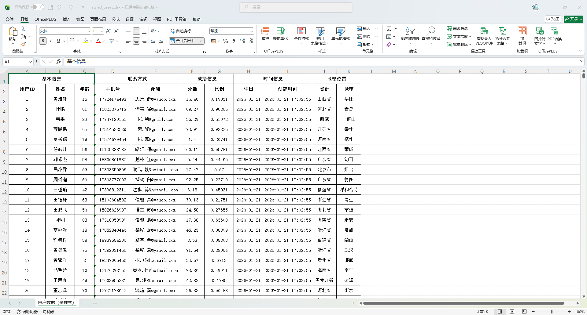

------

#### 居中样式（表格整齐、美观）

```java
package io.github.atengk.style;

import cn.afterturn.easypoi.excel.entity.params.ExcelExportEntity;
import cn.afterturn.easypoi.excel.entity.params.ExcelForEachParams;
import cn.afterturn.easypoi.excel.export.styler.AbstractExcelExportStyler;
import org.apache.poi.ss.usermodel.*;

/**
 * 全部内容居中对齐的 Excel 样式处理器
 * 特点：
 * 1. 表头居中 + 加粗 + 背景色
 * 2. 所有数据列（文本、数字、日期等）全部水平、垂直居中
 * 3. 不使用 EasyPOI 默认的奇偶行斑马纹逻辑
 * 4. 常用于报表型、展示型 Excel，视觉最规整
 *
 * @author 孔余
 * @since 2026-01-22
 */
public class CenterAlignExcelStyle extends AbstractExcelExportStyler {

    /**
     * 构造器中必须调用 createStyles
     */
    public CenterAlignExcelStyle(Workbook workbook) {
        super.createStyles(workbook);
    }

    /**
     * 表头样式（居中、加粗、背景色）
     */
    @Override
    public CellStyle getTitleStyle(short colorIndex) {
        CellStyle style = workbook.createCellStyle();
        Font font = workbook.createFont();
        font.setFontName("宋体");
        font.setFontHeightInPoints((short) 11);
        font.setBold(true);
        style.setFont(font);

        style.setAlignment(HorizontalAlignment.CENTER);
        style.setVerticalAlignment(VerticalAlignment.CENTER);

        style.setFillForegroundColor(colorIndex);
        style.setFillPattern(FillPatternType.SOLID_FOREGROUND);

        setBorderThin(style);
        return style;
    }

    /**
     * 多级表头样式，直接复用表头样式
     */
    @Override
    public CellStyle getHeaderStyle(short colorIndex) {
        return getTitleStyle(colorIndex);
    }

    /**
     * 普通字符串样式（全部居中）
     */
    @Override
    public CellStyle stringNoneStyle(Workbook workbook, boolean isWrap) {
        CellStyle style = workbook.createCellStyle();
        Font font = workbook.createFont();
        font.setFontName("宋体");
        font.setFontHeightInPoints((short) 11);
        style.setFont(font);

        style.setAlignment(HorizontalAlignment.CENTER);
        style.setVerticalAlignment(VerticalAlignment.CENTER);
        style.setWrapText(isWrap);

        setBorderThin(style);
        return style;
    }

    /**
     * 数字/特殊字段样式（同样全部居中）
     */
    @Override
    public CellStyle stringSeptailStyle(Workbook workbook, boolean isWrap) {
        CellStyle style = workbook.createCellStyle();
        Font font = workbook.createFont();
        font.setFontName("宋体");
        font.setFontHeightInPoints((short) 11);
        style.setFont(font);

        style.setAlignment(HorizontalAlignment.CENTER);
        style.setVerticalAlignment(VerticalAlignment.CENTER);
        style.setWrapText(isWrap);

        setBorderThin(style);
        return style;
    }

    /**
     * 模板 foreach 场景，复用普通居中样式
     */
    @Override
    public CellStyle getTemplateStyles(boolean isSingle, ExcelForEachParams excelForEachParams) {
        return this.stringNoneStyle;
    }

    /**
     * 覆盖 EasyPOI 默认的奇偶行样式逻辑，全部统一为居中样式
     */
    @Override
    public CellStyle getStyles(boolean noneStyler, ExcelExportEntity entity) {
        return this.stringNoneStyle;
    }

    /**
     * 根据单元格内容返回最终样式，强制所有内容居中
     */
    @Override
    public CellStyle getStyles(Cell cell,
                               int dataRow,
                               ExcelExportEntity entity,
                               Object obj,
                               Object data) {
        return this.stringNoneStyle;
    }

    /**
     * 统一设置细边框
     */
    private void setBorderThin(CellStyle style) {
        style.setBorderTop(BorderStyle.THIN);
        style.setBorderBottom(BorderStyle.THIN);
        style.setBorderLeft(BorderStyle.THIN);
        style.setBorderRight(BorderStyle.THIN);
    }
}
```


------

#### 斑马纹样式（奇偶行交替底色）

```java
package io.github.atengk.style;

import cn.afterturn.easypoi.excel.entity.params.ExcelExportEntity;
import cn.afterturn.easypoi.excel.entity.params.ExcelForEachParams;
import cn.afterturn.easypoi.excel.export.styler.AbstractExcelExportStyler;
import org.apache.poi.ss.usermodel.*;

/**
 * 斑马纹 Excel 样式处理器（奇偶行交替背景色）
 *
 * 特点：
 * 1. 表头：加粗 + 居中 + 深灰色背景
 * 2. 数据行：
 *    - 偶数行：白色背景
 *    - 奇数行：浅灰色背景
 * 3. 所有内容统一居中显示
 * 4. 适合数据量大、需要快速区分行的表格
 *
 * @author 孔余
 * @since 2026-01-22
 */
public class ZebraStripeExcelStyle extends AbstractExcelExportStyler {

    /**
     * 构造器必须调用 createStyles
     */
    public ZebraStripeExcelStyle(Workbook workbook) {
        super.createStyles(workbook);
    }

    /**
     * 表头样式
     */
    @Override
    public CellStyle getTitleStyle(short colorIndex) {
        CellStyle style = workbook.createCellStyle();
        Font font = workbook.createFont();
        font.setFontName("宋体");
        font.setFontHeightInPoints((short) 11);
        font.setBold(true);
        style.setFont(font);

        style.setAlignment(HorizontalAlignment.CENTER);
        style.setVerticalAlignment(VerticalAlignment.CENTER);

        style.setFillForegroundColor(colorIndex);
        style.setFillPattern(FillPatternType.SOLID_FOREGROUND);

        setBorderThin(style);
        return style;
    }

    /**
     * 多级表头复用
     */
    @Override
    public CellStyle getHeaderStyle(short colorIndex) {
        return getTitleStyle(colorIndex);
    }

    /**
     * 偶数行样式（白色背景，居中）
     */
    @Override
    public CellStyle stringNoneStyle(Workbook workbook, boolean isWrap) {
        CellStyle style = workbook.createCellStyle();
        Font font = workbook.createFont();
        font.setFontName("宋体");
        font.setFontHeightInPoints((short) 11);
        style.setFont(font);

        style.setAlignment(HorizontalAlignment.CENTER);
        style.setVerticalAlignment(VerticalAlignment.CENTER);
        style.setWrapText(isWrap);

        style.setFillForegroundColor(IndexedColors.WHITE.getIndex());
        style.setFillPattern(FillPatternType.SOLID_FOREGROUND);

        setBorderThin(style);
        return style;
    }

    /**
     * 奇数行样式（浅灰色背景，居中）
     */
    @Override
    public CellStyle stringSeptailStyle(Workbook workbook, boolean isWrap) {
        CellStyle style = workbook.createCellStyle();
        Font font = workbook.createFont();
        font.setFontName("宋体");
        font.setFontHeightInPoints((short) 11);
        style.setFont(font);

        style.setAlignment(HorizontalAlignment.CENTER);
        style.setVerticalAlignment(VerticalAlignment.CENTER);
        style.setWrapText(isWrap);

        style.setFillForegroundColor(IndexedColors.GREY_25_PERCENT.getIndex());
        style.setFillPattern(FillPatternType.SOLID_FOREGROUND);

        setBorderThin(style);
        return style;
    }

    /**
     * 模板 foreach 直接用偶数行样式
     */
    @Override
    public CellStyle getTemplateStyles(boolean isSingle, ExcelForEachParams excelForEachParams) {
        return this.stringNoneStyle;
    }

    /**
     * 覆盖默认奇偶逻辑：
     * true  → 使用 stringNoneStyle（偶数行）
     * false → 使用 stringSeptailStyle（奇数行）
     */
    @Override
    public CellStyle getStyles(boolean noneStyler, ExcelExportEntity entity) {
        return noneStyler ? this.stringNoneStyle : this.stringSeptailStyle;
    }

    /**
     * 根据数据行号决定斑马纹
     * dataRow 从 0 开始：
     *  - 偶数行 → 白色
     *  - 奇数行 → 灰色
     */
    @Override
    public CellStyle getStyles(Cell cell,
                               int dataRow,
                               ExcelExportEntity entity,
                               Object obj,
                               Object data) {
        if (dataRow % 2 == 0) {
            return this.stringNoneStyle;
        }
        return this.stringSeptailStyle;
    }

    /**
     * 统一细边框
     */
    private void setBorderThin(CellStyle style) {
        style.setBorderTop(BorderStyle.THIN);
        style.setBorderBottom(BorderStyle.THIN);
        style.setBorderLeft(BorderStyle.THIN);
        style.setBorderRight(BorderStyle.THIN);
    }
}
```

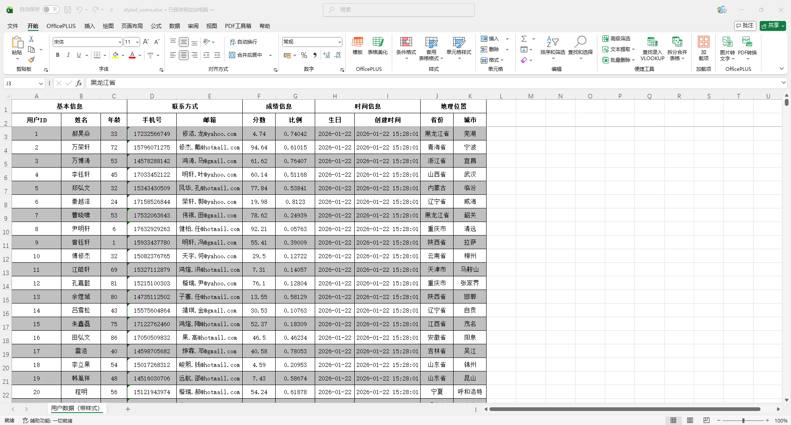

------

#### 表头高亮 + 数据居中

```java
package io.github.atengk.style;

import cn.afterturn.easypoi.excel.entity.params.ExcelExportEntity;
import cn.afterturn.easypoi.excel.entity.params.ExcelForEachParams;
import cn.afterturn.easypoi.excel.export.styler.AbstractExcelExportStyler;
import org.apache.poi.ss.usermodel.*;

/**
 * 表头高亮 + 数据全部居中 样式处理器
 *
 * 特点：
 * 1. 表头：
 *    - 加粗
 *    - 居中
 *    - 金黄色背景（醒目、偏“报表系统风格”）
 * 2. 数据行：
 *    - 所有列统一居中
 *    - 无斑马纹（纯净、规整）
 * 3. 适合：
 *    - 统计报表
 *    - 汇总数据
 *    - 领导查看型 Excel
 *
 * @author 孔余
 * @since 2026-01-22
 */
public class HeaderHighlightCenterAlignExcelStyle extends AbstractExcelExportStyler {

    public HeaderHighlightCenterAlignExcelStyle(Workbook workbook) {
        super.createStyles(workbook);
    }

    /**
     * 表头样式：高亮背景 + 加粗 + 居中
     */
    @Override
    public CellStyle getTitleStyle(short colorIndex) {
        CellStyle style = workbook.createCellStyle();
        Font font = workbook.createFont();
        font.setFontName("宋体");
        font.setFontHeightInPoints((short) 11);
        font.setBold(true);
        style.setFont(font);

        style.setAlignment(HorizontalAlignment.CENTER);
        style.setVerticalAlignment(VerticalAlignment.CENTER);

        // 高亮：金黄色背景
        style.setFillForegroundColor(IndexedColors.LIGHT_YELLOW.getIndex());
        style.setFillPattern(FillPatternType.SOLID_FOREGROUND);

        setBorderThin(style);
        return style;
    }

    /**
     * 多级表头复用同一套高亮样式
     */
    @Override
    public CellStyle getHeaderStyle(short colorIndex) {
        return getTitleStyle(colorIndex);
    }

    /**
     * 普通数据样式：全部居中
     */
    @Override
    public CellStyle stringNoneStyle(Workbook workbook, boolean isWrap) {
        CellStyle style = workbook.createCellStyle();
        Font font = workbook.createFont();
        font.setFontName("宋体");
        font.setFontHeightInPoints((short) 11);
        style.setFont(font);

        style.setAlignment(HorizontalAlignment.CENTER);
        style.setVerticalAlignment(VerticalAlignment.CENTER);
        style.setWrapText(isWrap);

        setBorderThin(style);
        return style;
    }

    /**
     * 数字/特殊字段样式：同样全部居中
     */
    @Override
    public CellStyle stringSeptailStyle(Workbook workbook, boolean isWrap) {
        return stringNoneStyle(workbook, isWrap);
    }

    /**
     * 模板 foreach 直接复用普通样式
     */
    @Override
    public CellStyle getTemplateStyles(boolean isSingle, ExcelForEachParams excelForEachParams) {
        return this.stringNoneStyle;
    }

    /**
     * 关闭 EasyPOI 默认的奇偶行处理，全部使用同一套样式
     */
    @Override
    public CellStyle getStyles(boolean noneStyler, ExcelExportEntity entity) {
        return this.stringNoneStyle;
    }

    /**
     * 所有数据单元格统一居中
     */
    @Override
    public CellStyle getStyles(Cell cell,
                               int dataRow,
                               ExcelExportEntity entity,
                               Object obj,
                               Object data) {
        return this.stringNoneStyle;
    }

    /**
     * 统一细边框
     */
    private void setBorderThin(CellStyle style) {
        style.setBorderTop(BorderStyle.THIN);
        style.setBorderBottom(BorderStyle.THIN);
        style.setBorderLeft(BorderStyle.THIN);
        style.setBorderRight(BorderStyle.THIN);
    }
}
```

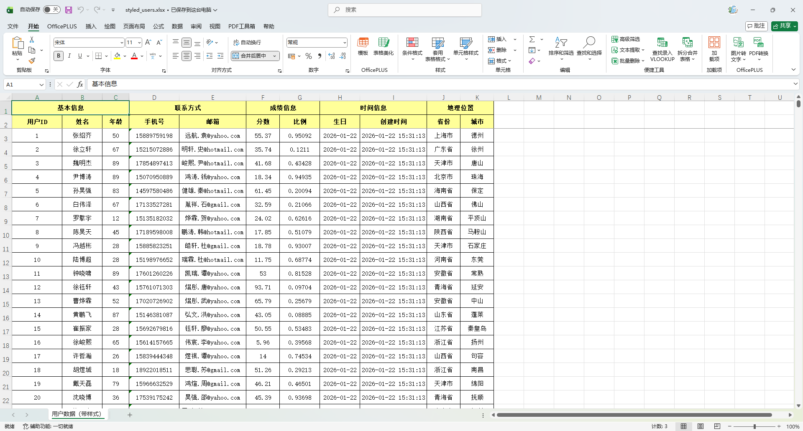

#### 通用样式

```java
package io.github.atengk.style;

import cn.afterturn.easypoi.entity.BaseTypeConstants;
import cn.afterturn.easypoi.excel.entity.params.ExcelExportEntity;
import cn.afterturn.easypoi.excel.entity.params.ExcelForEachParams;
import cn.afterturn.easypoi.excel.export.styler.AbstractExcelExportStyler;
import org.apache.poi.ss.usermodel.*;

/**
 * Excel 导出样式策略实现类。
 *
 * <p>样式适用范围：</p>
 * <ul>
 *     <li>普通导出场景</li>
 *     <li>模板渲染场景（Foreach）</li>
 * </ul>
 *
 * <p>样式策略说明：</p>
 * <ul>
 *     <li>表头类单元格：加粗、灰底、水平垂直居中</li>
 *     <li>文本类单元格：左对齐</li>
 *     <li>数字类单元格：右对齐</li>
 *     <li>日期类单元格：居中</li>
 *     <li>图片类型单元格：居中</li>
 *     <li>所有单元格统一配置细边框</li>
 * </ul>
 *
 * <p>基于 EasyPOI 类型常量 {@link BaseTypeConstants} 映射样式。</p>
 *
 * @author 孔余
 * @since 2026-01-22
 */
public class CustomExcelExportStyler extends AbstractExcelExportStyler {

    /**
     * 表头单元格样式（灰底、加粗、居中对齐）
     */
    private final CellStyle headerCenterStyle;

    /**
     * 文本单元格样式（左对齐）
     */
    private final CellStyle textLeftStyle;

    /**
     * 数字单元格样式（右对齐）
     */
    private final CellStyle numberRightStyle;

    /**
     * 日期单元格样式（居中对齐）
     */
    private final CellStyle dateCenterStyle;

    /**
     * 图片单元格样式（居中对齐）
     */
    private final CellStyle imageCenterStyle;

    /**
     * 构造函数。
     *
     * @param workbook Excel 工作簿实例
     */
    public CustomExcelExportStyler(Workbook workbook) {
        super.createStyles(workbook);
        this.headerCenterStyle = createHeaderStyle();
        this.textLeftStyle = createTextStyle();
        this.numberRightStyle = createNumberStyle();
        this.dateCenterStyle = createDateStyle();
        this.imageCenterStyle = createImageStyle();
    }

    /**
     * 创建表头样式。
     * <p>配置内容：</p>
     * <ul>
     *     <li>字体加粗</li>
     *     <li>灰色背景填充</li>
     *     <li>水平垂直居中</li>
     *     <li>细边框</li>
     * </ul>
     *
     * @return 表头样式
     */
    private CellStyle createHeaderStyle() {
        CellStyle style = workbook.createCellStyle();

        Font font = workbook.createFont();
        font.setFontName("宋体");
        font.setFontHeightInPoints((short) 11);
        font.setBold(true);
        style.setFont(font);

        style.setAlignment(HorizontalAlignment.CENTER);
        style.setVerticalAlignment(VerticalAlignment.CENTER);

        style.setFillForegroundColor(IndexedColors.GREY_25_PERCENT.getIndex());
        style.setFillPattern(FillPatternType.SOLID_FOREGROUND);

        setThinBorder(style);

        return style;
    }

    /**
     * 创建文本类型样式（左对齐）。
     *
     * @return 文本样式
     */
    private CellStyle createTextStyle() {
        CellStyle style = workbook.createCellStyle();

        Font font = workbook.createFont();
        font.setFontName("宋体");
        font.setFontHeightInPoints((short) 11);
        style.setFont(font);

        style.setAlignment(HorizontalAlignment.LEFT);
        style.setVerticalAlignment(VerticalAlignment.CENTER);

        setThinBorder(style);

        return style;
    }

    /**
     * 创建数字类型样式（右对齐）。
     *
     * @return 数字样式
     */
    private CellStyle createNumberStyle() {
        CellStyle style = workbook.createCellStyle();

        Font font = workbook.createFont();
        font.setFontName("宋体");
        font.setFontHeightInPoints((short) 11);
        style.setFont(font);

        style.setAlignment(HorizontalAlignment.RIGHT);
        style.setVerticalAlignment(VerticalAlignment.CENTER);

        setThinBorder(style);

        return style;
    }

    /**
     * 创建日期类型样式（居中）。
     *
     * @return 日期样式
     */
    private CellStyle createDateStyle() {
        CellStyle style = workbook.createCellStyle();

        Font font = workbook.createFont();
        font.setFontName("宋体");
        font.setFontHeightInPoints((short) 11);
        style.setFont(font);

        style.setAlignment(HorizontalAlignment.CENTER);
        style.setVerticalAlignment(VerticalAlignment.CENTER);

        setThinBorder(style);

        return style;
    }

    /**
     * 创建图片样式
     *
     * @return 图片样式
     */
    private CellStyle createImageStyle() {
        CellStyle style = workbook.createCellStyle();
        style.setAlignment(HorizontalAlignment.CENTER);
        style.setVerticalAlignment(VerticalAlignment.CENTER);
        setThinBorder(style);
        return style;
    }

    /**
     * 表头样式适配（调用自定义样式）。
     *
     * @param color 表头颜色（框架传入）
     * @return 表头样式
     */
    @Override
    public CellStyle getTitleStyle(short color) {
        return headerCenterStyle;
    }

    /**
     * 多级表头样式适配。
     *
     * @param color 表头颜色
     * @return 表头样式
     */
    @Override
    public CellStyle getHeaderStyle(short color) {
        return headerCenterStyle;
    }

    /**
     * 样式选择入口（无 Cell 上下文版本）。
     *
     * <p>该方法用于注解模式导出，框架只提供字段元数据 entity。
     * 根据源码 type 值判断样式：</p>
     * <ul>
     *     <li>1 → 文本</li>
     *     <li>2 → 图片</li>
     *     <li>3 → 函数</li>
     *     <li>10 → 数字</li>
     *     <li>11 → 特殊符号</li>
     *     <li>其他/空 → 默认文本</li>
     * </ul>
     *
     * @param noneStyler 是否忽略框架默认样式
     * @param entity     字段元数据对象
     * @return CellStyle 样式实例
     */
    @Override
    public CellStyle getStyles(boolean noneStyler, ExcelExportEntity entity) {
        if (entity == null) {
            return textLeftStyle;
        }

        Integer type = entity.getType();

        // 定义字段类型常量（替代魔法值）
        final int TYPE_TEXT = 1;
        final int TYPE_IMAGE = 2;
        final int TYPE_FUNCTION = 3;
        final int TYPE_NUMBER = 10;
        final int TYPE_SPECIAL = 11;

        if (type == null || type == TYPE_TEXT) {
            // 文本类型
            return textLeftStyle;
        } else if (type == TYPE_IMAGE) {
            // 图片类型
            return imageCenterStyle;
        } else if (type == TYPE_FUNCTION) {
            // 函数类型（可居中或文本）
            return textLeftStyle;
        } else if (type == TYPE_NUMBER) {
            // 数字类型
            return numberRightStyle;
        } else if (type == TYPE_SPECIAL) {
            // 特殊符号
            return textLeftStyle;
        } else {
            // 默认文本
            return textLeftStyle;
        }
    }

    /**
     * 样式选择入口（带 Cell 上下文版本）。
     *
     * <p>该方法在动态渲染、Foreach 模板或模板填充模式下触发，
     * 框架会提供 Cell、行号、值等上下文信息。
     * 样式决策基于 Java 数据类型进行，不再依赖框架内部常量。</p>
     *
     * <p>样式映射规则：</p>
     * <ul>
     *     <li>表头行：headerCenterStyle</li>
     *     <li>Number 类型 → numberRightStyle（右对齐）</li>
     *     <li>Date / Calendar → dateCenterStyle（居中）</li>
     *     <li>Boolean → textLeftStyle（左对齐）</li>
     *     <li>Byte[] / InputStream → dateCenterStyle（居中，可用于图片）</li>
     *     <li>其他类型 → textLeftStyle（左对齐）</li>
     * </ul>
     *
     * @param cell   当前 POI Cell 对象
     * @param row    数据行行号（不含表头）
     * @param entity 字段元数据对象
     * @param obj    当前整行数据对象
     * @param value  字段对应的原始值
     * @return CellStyle 样式实例
     */
    @Override
    public CellStyle getStyles(Cell cell, int row, ExcelExportEntity entity, Object obj, Object value) {
        // 如果当前行是表头或表头级别（可通过行号判断）
        if (row < 0) {
            return headerCenterStyle;
        }

        // 根据 Java 类型决定样式
        if (value == null) {
            return textLeftStyle;
        }
        if (value instanceof Number) {
            return numberRightStyle;
        }
        if (value instanceof java.util.Date || value instanceof java.util.Calendar) {
            return dateCenterStyle;
        }
        if (value instanceof Boolean) {
            return textLeftStyle;
        }
        if (value instanceof byte[] || value instanceof java.io.InputStream) {
            return dateCenterStyle;
        }

        // 默认文本
        return textLeftStyle;
    }

    /**
     * Foreach 模板渲染使用的样式选择。
     *
     * <p>该方法在处理 `{{$fe:list t.name}}` 等模板语法时触发，
     * 字段元数据需从 ExcelForEachParams 中提取，因此与注解模式入口分离。</p>
     *
     * @param isSingle 是否为单列渲染（框架内部字段）
     * @param params   Foreach 参数对象，包含字段元数据
     * @return CellStyle 样式实例
     */
    @Override
    public CellStyle getTemplateStyles(boolean isSingle, ExcelForEachParams params) {
        // 只能基于模板的 CellStyle 或字段类型来返回样式
        // 因为模板渲染不会传入实际对象值
        if (params.getCellStyle() != null) {
            // 优先使用模板自带样式
            return params.getCellStyle();
        }
        // 默认文本左对齐
        return textLeftStyle;
    }

    /**
     * 设置细边框，增强单元格视觉边界。
     *
     * @param style 单元格样式对象
     */
    private void setThinBorder(CellStyle style) {
        style.setBorderTop(BorderStyle.THIN);
        style.setBorderBottom(BorderStyle.THIN);
        style.setBorderLeft(BorderStyle.THIN);
        style.setBorderRight(BorderStyle.THIN);
    }
}
```

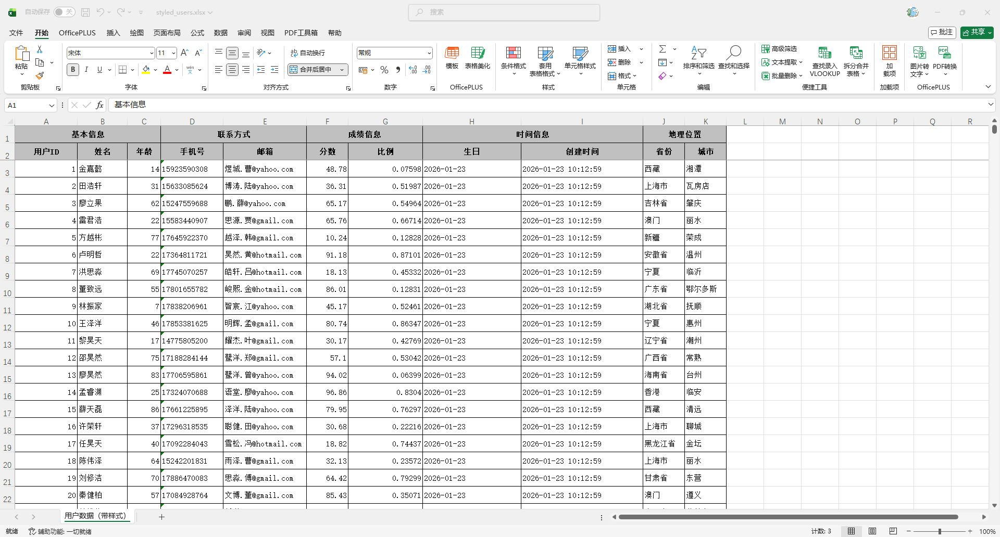

#### 通用样式（简洁版）

```java
package io.github.atengk.style;

import cn.afterturn.easypoi.excel.entity.params.ExcelExportEntity;
import cn.afterturn.easypoi.excel.entity.params.ExcelForEachParams;
import cn.afterturn.easypoi.excel.export.styler.AbstractExcelExportStyler;
import org.apache.poi.ss.usermodel.*;

/**
 * Excel 导出样式策略实现类。
 *
 * <p>样式适配场景：</p>
 * <ul>
 *     <li>注解模式导出（基于 {@link ExcelExportEntity} 元数据）</li>
 *     <li>模板渲染模式（Foreach 模板 {@link ExcelForEachParams}）</li>
 *     <li>普通 Java 数据模式（基于单元格值进行样式映射）</li>
 * </ul>
 *
 * <p>样式策略说明：</p>
 * <ul>
 *     <li>表头单元格：白色背景、加粗黑体、居中、细边框</li>
 *     <li>普通内容单元格：宋体、居中、细边框</li>
 *     <li>无类型区分逻辑，所有内容样式一律居中处理</li>
 * </ul>
 *
 * <p>效果特性：</p>
 * <ul>
 *     <li>提高视觉统一性</li>
 *     <li>适合列表类型导出展示</li>
 *     <li>适用于无复杂类型差异的场景</li>
 * </ul>
 *
 * @author 孔余
 * @since 2026-01-23
 */
public class CustomConciseExcelExportStyler extends AbstractExcelExportStyler {

    /**
     * 表头单元格样式（白色背景 + 加粗 + 居中）
     */
    private final CellStyle headerCenterStyle;

    /**
     * 内容单元格样式（居中）
     */
    private final CellStyle centerStyle;

    /**
     * 构造函数。
     *
     * <p>框架在创建工作簿时注入 Workbook 实例，
     * 并要求调用者在该类构造中进行样式初始化。</p>
     *
     * @param workbook Excel 工作簿实例
     */
    public CustomConciseExcelExportStyler(Workbook workbook) {
        super.createStyles(workbook);
        this.headerCenterStyle = createHeaderStyle();
        this.centerStyle = createCenterStyle();
    }

    /**
     * 创建表头样式。
     *
     * <p>配置内容：</p>
     * <ul>
     *     <li>字体加粗（黑体）</li>
     *     <li>白色背景填充</li>
     *     <li>水平 / 垂直居中</li>
     *     <li>细边框增强视觉结构</li>
     * </ul>
     *
     * @return 表头样式实例
     */
    private CellStyle createHeaderStyle() {
        CellStyle style = workbook.createCellStyle();

        Font font = workbook.createFont();
        font.setFontName("宋体");
        font.setFontHeightInPoints((short) 11);
        font.setBold(true);
        style.setFont(font);

        style.setAlignment(HorizontalAlignment.CENTER);
        style.setVerticalAlignment(VerticalAlignment.CENTER);

        style.setFillForegroundColor(IndexedColors.WHITE.getIndex());
        style.setFillPattern(FillPatternType.SOLID_FOREGROUND);

        setThinBorder(style);
        return style;
    }

    /**
     * 创建内容样式（全局居中）。
     *
     * <p>配置内容：</p>
     * <ul>
     *     <li>宋体字体</li>
     *     <li>水平 / 垂直居中</li>
     *     <li>细边框增强表格结构</li>
     * </ul>
     *
     * @return 内容单元格样式实例
     */
    private CellStyle createCenterStyle() {
        CellStyle style = workbook.createCellStyle();

        Font font = workbook.createFont();
        font.setFontName("宋体");
        font.setFontHeightInPoints((short) 11);
        style.setFont(font);

        style.setAlignment(HorizontalAlignment.CENTER);
        style.setVerticalAlignment(VerticalAlignment.CENTER);

        setThinBorder(style);
        return style;
    }

    /**
     * 表头样式适配（一级表头）。
     *
     * <p>框架会在导出表头时调用此方法。</p>
     *
     * @param color 框架内部传递的表头色值（忽略）
     * @return 表头样式实例
     */
    @Override
    public CellStyle getTitleStyle(short color) {
        return headerCenterStyle;
    }

    /**
     * 表头样式适配（多级表头）。
     *
     * <p>作用与 {@link #getTitleStyle(short)} 基本一致。</p>
     *
     * @param color 框架内部传递颜色（忽略）
     * @return 表头样式实例
     */
    @Override
    public CellStyle getHeaderStyle(short color) {
        return headerCenterStyle;
    }

    /**
     * 样式选择入口（注解模式）。
     *
     * <p>框架仅提供 {@link ExcelExportEntity} 元数据，
     * 无具体 Cell 和数据上下文。</p>
     *
     * @param noneStyler 是否忽略默认样式（忽略）
     * @param entity     字段元数据对象
     * @return 内容单元格样式实例
     */
    @Override
    public CellStyle getStyles(boolean noneStyler, ExcelExportEntity entity) {
        return centerStyle;
    }

    /**
     * 样式选择入口（带 Cell 上下文版本）。
     *
     * <p>框架在模板渲染 / Foreach / 普通导出时调用，
     * 提供了当前 cell、行号、字段、对象与原始值信息。</p>
     *
     * @param cell   当前 POI 单元格实例
     * @param row    数据行行号（不包含表头）
     * @param entity 字段元数据对象
     * @param obj    当前整行对象
     * @param value  字段值
     * @return 样式实例
     */
    @Override
    public CellStyle getStyles(Cell cell, int row, ExcelExportEntity entity, Object obj, Object value) {
        if (row < 0) {
            return headerCenterStyle;
        }
        return centerStyle;
    }

    /**
     * Foreach 模板渲染样式适配。
     *
     * <p>模板模式中不会传实际数据对象，因此优先使用模板内定义样式。</p>
     *
     * @param isSingle 是否为单列渲染
     * @param params   Foreach 参数对象（包含模板样式信息）
     * @return 样式实例
     */
    @Override
    public CellStyle getTemplateStyles(boolean isSingle, ExcelForEachParams params) {
        if (params.getCellStyle() != null) {
            return params.getCellStyle();
        }
        return centerStyle;
    }

    /**
     * 设置统一细边框。
     *
     * @param style POI 单元格样式对象
     */
    private void setThinBorder(CellStyle style) {
        style.setBorderTop(BorderStyle.THIN);
        style.setBorderBottom(BorderStyle.THIN);
        style.setBorderLeft(BorderStyle.THIN);
        style.setBorderRight(BorderStyle.THIN);
    }
}
```


------

### 条件样式

#### 创建函数接口

```java
package io.github.atengk.util;

import org.apache.poi.ss.usermodel.Cell;
import org.apache.poi.ss.usermodel.Workbook;

/**
 * 单元格样式处理器函数接口
 *
 * @author 孔余
 * @since 2026-01-22
 */
@FunctionalInterface
public interface CellStyleHandler {

    /**
     * 对单个单元格执行样式处理逻辑。
     *
     * @param workbook 当前工作簿对象，用于创建和复用 CellStyle
     * @param cell     当前需要处理的单元格
     */
    void handle(Workbook workbook, Cell cell);
}
```

#### 创建样式工具类

```java
package io.github.atengk.util;

import org.apache.poi.ss.usermodel.*;

/**
 * Excel 样式后处理工具类。
 * <p>
 * 适用于 EasyPOI 导出完成后的 Workbook 二次加工场景，
 * 通过“表头名称”定位指定列，对该列下所有数据单元格统一应用自定义样式规则。
 * </p>
 * <p>
 * 设计思想：
 * <ul>
 *     <li>不依赖 EasyPOI 内部样式回调机制，避免样式不生效问题</li>
 *     <li>直接基于 Apache POI 对 Workbook 进行后处理，稳定可控</li>
 *     <li>以“表头名称”为唯一定位依据，避免列顺序变动导致样式失效</li>
 * </ul>
 * <p>
 * 主要能力：
 * <ul>
 *     <li>支持通过 Sheet 下标或 Sheet 名称定位工作表</li>
 *     <li>支持自动扫描多行表头（1 行 / 2 行 / 3 行…）</li>
 *     <li>自动从表头下一行作为数据起始行</li>
 *     <li>支持为指定列批量应用任意样式策略</li>
 * </ul>
 * <p>
 * 典型使用示例：
 * <pre>
 * ExcelStyleUtil.applyByTitle(workbook, 0, "分数", 5, (wb, cell) -> {
 *     int score = (int) cell.getNumericCellValue();
 *     if (score < 60) {
 *         CellStyle style = wb.createCellStyle();
 *         style.setFillForegroundColor(IndexedColors.ROSE.getIndex());
 *         style.setFillPattern(FillPatternType.SOLID_FOREGROUND);
 *         style.setAlignment(HorizontalAlignment.CENTER);
 *         cell.setCellStyle(style);
 *     }
 * });
 * </pre>
 * <p>
 * 该类是一个纯工具类，不允许被实例化。
 *
 * @author 孔余
 * @since 2026-01-22
 */
public final class ExcelStyleUtil {

    private ExcelStyleUtil() {
    }

    /**
     * 通过表头名称，对指定列应用样式处理。
     * 默认 Sheet 第 1 个，最大扫描表头行数为 3
     *
     * @param workbook  工作簿对象
     * @param titleName 表头名称，例如：分数、年龄、状态
     * @param handler   单元格样式处理器
     */
    public static void applyByTitle(
            Workbook workbook,
            String titleName,
            CellStyleHandler handler) {

        Sheet sheet = workbook.getSheetAt(0);
        applyInternal(workbook, sheet, titleName, 3, handler);
    }

    /**
     * 通过 Sheet 下标 + 表头名称，对指定列应用样式处理。
     *
     * @param workbook         工作簿对象
     * @param sheetIndex       Sheet 下标，从 0 开始
     * @param titleName        表头名称，例如：分数、年龄、状态
     * @param maxHeaderRowScan 最大扫描表头行数，用于适配多行表头结构
     *                         通常取值 3~5 即可
     * @param handler          单元格样式处理器
     */
    public static void applyByTitle(
            Workbook workbook,
            int sheetIndex,
            String titleName,
            int maxHeaderRowScan,
            CellStyleHandler handler) {

        Sheet sheet = workbook.getSheetAt(sheetIndex);
        applyInternal(workbook, sheet, titleName, maxHeaderRowScan, handler);
    }

    /**
     * 通过 Sheet 名称 + 表头名称，对指定列应用样式处理。
     *
     * @param workbook         工作簿对象
     * @param sheetName        Sheet 名称
     * @param titleName        表头名称，例如：分数、年龄、状态
     * @param maxHeaderRowScan 最大扫描表头行数，用于适配多行表头结构
     * @param handler          单元格样式处理器
     */
    public static void applyByTitle(
            Workbook workbook,
            String sheetName,
            String titleName,
            int maxHeaderRowScan,
            CellStyleHandler handler) {

        Sheet sheet = workbook.getSheet(sheetName);
        if (sheet == null) {
            return;
        }
        applyInternal(workbook, sheet, titleName, maxHeaderRowScan, handler);
    }

    /**
     * 内部统一处理逻辑。
     * <p>
     * 主要流程：
     * <ol>
     *     <li>在前 N 行中定位表头所在行与列</li>
     *     <li>以表头行的下一行作为数据起始行</li>
     *     <li>对目标列的所有单元格逐个执行样式处理器</li>
     * </ol>
     */
    private static void applyInternal(
            Workbook workbook,
            Sheet sheet,
            String titleName,
            int maxHeaderRowScan,
            CellStyleHandler handler) {

        HeaderLocation location = findHeader(sheet, titleName, maxHeaderRowScan);
        if (location == null) {
            return;
        }

        int headerRowIndex = location.headerRowIndex;
        int colIndex = location.colIndex;

        int firstDataRowIndex = headerRowIndex + 1;

        for (int rowIndex = firstDataRowIndex; rowIndex <= sheet.getLastRowNum(); rowIndex++) {
            Row row = sheet.getRow(rowIndex);
            if (row == null) {
                continue;
            }

            Cell cell = row.getCell(colIndex);
            if (cell == null) {
                continue;
            }

            handler.handle(workbook, cell);
        }
    }

    /**
     * 在指定的前 N 行中扫描表头名称，返回表头所在的行号与列号。
     *
     * @param sheet            当前 Sheet
     * @param titleName        表头名称
     * @param maxHeaderRowScan 最大扫描行数
     * @return 表头位置信息，未找到返回 null
     */
    private static HeaderLocation findHeader(
            Sheet sheet,
            String titleName,
            int maxHeaderRowScan) {

        int scanLimit = Math.min(maxHeaderRowScan, sheet.getLastRowNum() + 1);

        for (int rowIndex = 0; rowIndex < scanLimit; rowIndex++) {
            Row row = sheet.getRow(rowIndex);
            if (row == null) {
                continue;
            }

            for (int colIndex = 0; colIndex < row.getLastCellNum(); colIndex++) {
                Cell cell = row.getCell(colIndex);
                if (cell == null) {
                    continue;
                }

                if (cell.getCellType() == CellType.STRING
                        && titleName.equals(cell.getStringCellValue().trim())) {
                    return new HeaderLocation(rowIndex, colIndex);
                }
            }
        }
        return null;
    }

    /**
     * 表头定位结果封装对象。
     * <p>
     * 用于同时返回：
     * <ul>
     *     <li>表头所在行号</li>
     *     <li>表头所在列号</li>
     * </ul>
     */
    private static final class HeaderLocation {

        private final int headerRowIndex;
        private final int colIndex;

        private HeaderLocation(int headerRowIndex, int colIndex) {
            this.headerRowIndex = headerRowIndex;
            this.colIndex = colIndex;
        }
    }
}
```

#### 使用示例

##### 基本使用

```java
    @Test
    public void testConditionStyledExport() {
        List<MyUser> userList = InitData.getDataList();
        Workbook workbook =  ExcelUtil.exportExcel(
                MyUser.class,
                userList,
                params -> params.setSheetName("用户数据（带样式）")
        );
        // 条件样式
        ExcelStyleUtil.applyByTitle(workbook, "分数", (wb, cell) -> {
            int score;
            try {
                if (cell.getCellType() == CellType.NUMERIC) {
                    score = (int) cell.getNumericCellValue();
                } else {
                    score = Integer.parseInt(cell.getStringCellValue());
                }
            } catch (Exception e) {
                return;
            }

            CellStyle style = wb.createCellStyle();
            style.setAlignment(HorizontalAlignment.CENTER);
            style.setVerticalAlignment(VerticalAlignment.CENTER);
            style.setBorderTop(BorderStyle.THIN);
            style.setBorderBottom(BorderStyle.THIN);
            style.setBorderLeft(BorderStyle.THIN);
            style.setBorderRight(BorderStyle.THIN);

            if (score < 60) {
                style.setFillForegroundColor(IndexedColors.ROSE.getIndex());
            } else if (score > 90) {
                style.setFillForegroundColor(IndexedColors.LIGHT_GREEN.getIndex());
            } else {
                style.setFillForegroundColor(IndexedColors.BLUE_GREY.getIndex());
            }

            style.setFillPattern(FillPatternType.SOLID_FOREGROUND);
            cell.setCellStyle(style);
        });
        // 导出
        ExcelUtil.write(workbook, "target/condition_styled_users.xlsx");
    }
```


##### 使用 Sheet 下标

```java
    @Test
    public void testConditionStyledExport() {
        List<MyUser> userList = InitData.getDataList();
        Workbook workbook =  ExcelUtil.exportExcel(
                MyUser.class,
                userList,
                params -> params.setSheetName("用户数据（带样式）")
        );
        // 条件样式
        ExcelStyleUtil.applyByTitle(workbook, 0, "分数", 3,(wb, cell) -> {
            int score;
            try {
                if (cell.getCellType() == CellType.NUMERIC) {
                    score = (int) cell.getNumericCellValue();
                } else {
                    score = Integer.parseInt(cell.getStringCellValue());
                }
            } catch (Exception e) {
                return;
            }

            CellStyle style = wb.createCellStyle();
            style.setAlignment(HorizontalAlignment.CENTER);
            style.setVerticalAlignment(VerticalAlignment.CENTER);
            style.setBorderTop(BorderStyle.THIN);
            style.setBorderBottom(BorderStyle.THIN);
            style.setBorderLeft(BorderStyle.THIN);
            style.setBorderRight(BorderStyle.THIN);

            if (score < 60) {
                style.setFillForegroundColor(IndexedColors.ROSE.getIndex());
            } else if (score > 90) {
                style.setFillForegroundColor(IndexedColors.LIGHT_GREEN.getIndex());
            } else {
                style.setFillForegroundColor(IndexedColors.BLUE_GREY.getIndex());
            }

            style.setFillPattern(FillPatternType.SOLID_FOREGROUND);
            cell.setCellStyle(style);
        });
        // 导出
        ExcelUtil.write(workbook, "target/condition_styled_users.xlsx");
    }
```


##### 使用 Sheet 名称

```java
    @Test
    public void testConditionStyledExport() {
        List<MyUser> userList = InitData.getDataList();
        String sheetName = "用户数据（带样式）";
        Workbook workbook =  ExcelUtil.exportExcel(
                MyUser.class,
                userList,
                params -> params.setSheetName(sheetName)
        );
        // 条件样式
        ExcelStyleUtil.applyByTitle(workbook, sheetName, "分数", 3,(wb, cell) -> {
            int score;
            try {
                if (cell.getCellType() == CellType.NUMERIC) {
                    score = (int) cell.getNumericCellValue();
                } else {
                    score = Integer.parseInt(cell.getStringCellValue());
                }
            } catch (Exception e) {
                return;
            }

            CellStyle style = wb.createCellStyle();
            style.setAlignment(HorizontalAlignment.CENTER);
            style.setVerticalAlignment(VerticalAlignment.CENTER);
            style.setBorderTop(BorderStyle.THIN);
            style.setBorderBottom(BorderStyle.THIN);
            style.setBorderLeft(BorderStyle.THIN);
            style.setBorderRight(BorderStyle.THIN);

            if (score < 60) {
                style.setFillForegroundColor(IndexedColors.ROSE.getIndex());
            } else if (score > 90) {
                style.setFillForegroundColor(IndexedColors.LIGHT_GREEN.getIndex());
            } else {
                style.setFillForegroundColor(IndexedColors.BLUE_GREY.getIndex());
            }

            style.setFillPattern(FillPatternType.SOLID_FOREGROUND);
            cell.setCellStyle(style);
        });
        // 导出
        ExcelUtil.write(workbook, "target/condition_styled_users.xlsx");
    }
```


##### 统一某一列全部居左

```java
ExcelStyleUtil.applyByTitle(workbook, 0, "年龄", 3, (wb, cell) -> {
    CellStyle style = wb.createCellStyle();
    style.setAlignment(HorizontalAlignment.LEFT);
    style.setVerticalAlignment(VerticalAlignment.CENTER);
    style.setBorderTop(BorderStyle.THIN);
    style.setBorderBottom(BorderStyle.THIN);
    style.setBorderLeft(BorderStyle.THIN);
    style.setBorderRight(BorderStyle.THIN);
    cell.setCellStyle(style);
});
```


------

##### 手机号脱敏显示（后处理脱敏）

```java
ExcelStyleUtil.applyByTitle(workbook, 0, "手机号", 3, (wb, cell) -> {
    String value = cell.getStringCellValue();
    if (value.length() >= 7) {
        String masked = value.substring(0, 3) + "****" + value.substring(value.length() - 4);
        cell.setCellValue(masked);
    }
});
```

用途：

- 手机号
- 身份证
- 银行卡

比 EasyPOI 自带脱敏规则更灵活。

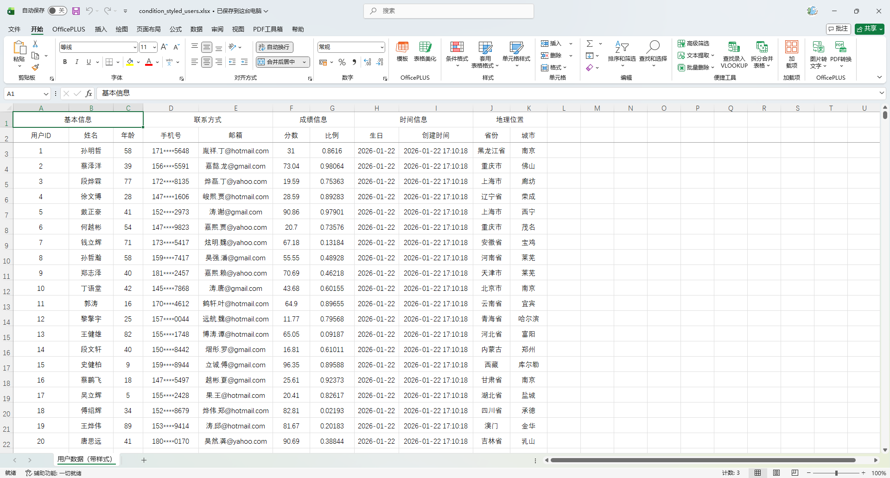

------

##### 状态字段颜色标识（业务系统最常见）

```java
ExcelStyleUtil.applyByTitle(workbook, 0, "省份", 3, (wb, cell) -> {
    String status = cell.getStringCellValue();

    CellStyle style = wb.createCellStyle();
    style.setAlignment(HorizontalAlignment.CENTER);
    style.setBorderTop(BorderStyle.THIN);
    style.setBorderBottom(BorderStyle.THIN);
    style.setBorderLeft(BorderStyle.THIN);
    style.setBorderRight(BorderStyle.THIN);

    if ("重庆市".equals(status)) {
        style.setFillForegroundColor(IndexedColors.LIGHT_GREEN.getIndex());
    } else if ("成都省".equals(status)) {
        style.setFillForegroundColor(IndexedColors.ROSE.getIndex());
    } else {
        style.setFillForegroundColor(IndexedColors.LIGHT_YELLOW.getIndex());
    }

    style.setFillPattern(FillPatternType.SOLID_FOREGROUND);
    cell.setCellStyle(style);
});
```

报表系统非常爱用这一套。

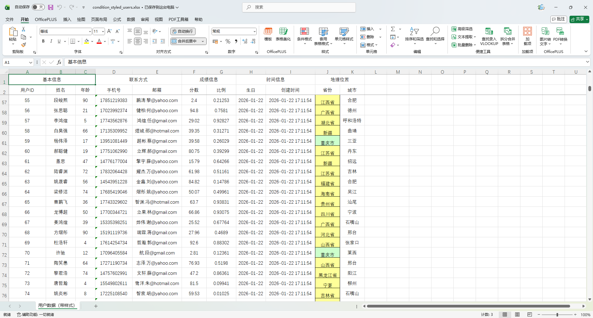

------

##### 金额列高亮（财务报表经典）

```java
ExcelStyleUtil.applyByTitle(workbook, 0, "分数", 3, (wb, cell) -> {
    double amount;
    try {
        amount = cell.getNumericCellValue();
    } catch (Exception e) {
        return;
    }

    CellStyle style = wb.createCellStyle();
    style.setAlignment(HorizontalAlignment.RIGHT);
    style.setBorderTop(BorderStyle.THIN);
    style.setBorderBottom(BorderStyle.THIN);
    style.setBorderLeft(BorderStyle.THIN);
    style.setBorderRight(BorderStyle.THIN);

    if (amount < 0.5) {
        style.setFillForegroundColor(IndexedColors.ROSE.getIndex());      // 亏损
    } else if (amount < 0.9) {
        style.setFillForegroundColor(IndexedColors.LIGHT_GREEN.getIndex()); // 大额
    }

    style.setFillPattern(FillPatternType.SOLID_FOREGROUND);
    cell.setCellStyle(style);
});
```

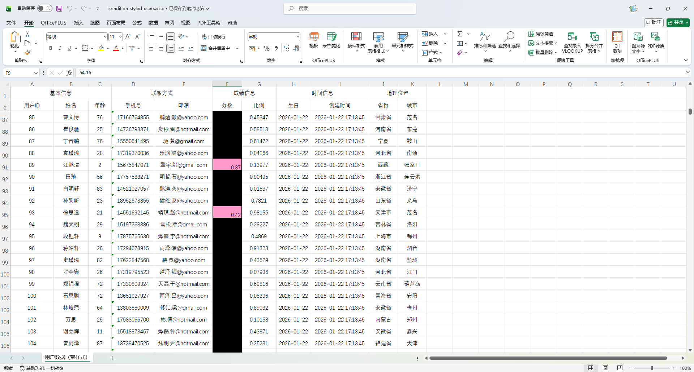

------

##### 时间列高亮

```java
// 条件样式
ExcelStyleUtil.applyByTitle(workbook, 0, "生日", 3, (wb, cell) -> {
    LocalDate birthday;
    try {
        birthday = LocalDate.parse(cell.getStringCellValue());
    } catch (Exception e) {
        return;
    }

    CellStyle style = wb.createCellStyle();
    style.setAlignment(HorizontalAlignment.RIGHT);
    style.setBorderTop(BorderStyle.THIN);
    style.setBorderBottom(BorderStyle.THIN);
    style.setBorderLeft(BorderStyle.THIN);
    style.setBorderRight(BorderStyle.THIN);

    if (LocalDate.parse("2000-01-01").compareTo(birthday) <= 0) {
        style.setFillForegroundColor(IndexedColors.ROSE.getIndex());
    } else {
        style.setFillForegroundColor(IndexedColors.LIGHT_YELLOW.getIndex());
    }

    style.setFillPattern(FillPatternType.SOLID_FOREGROUND);
    cell.setCellStyle(style);
});
```

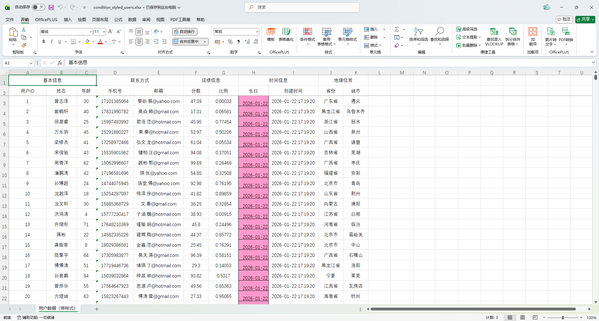

##### 空值标红（数据质量校验神器）

```java
ExcelStyleUtil.applyByTitle(workbook, 0, "身份证", 3, (wb, cell) -> {
    String value = cell.getStringCellValue();
    if (value == null || value.trim().isEmpty()) {
        CellStyle style = wb.createCellStyle();
        style.setFillForegroundColor(IndexedColors.ROSE.getIndex());
        style.setFillPattern(FillPatternType.SOLID_FOREGROUND);
        cell.setCellStyle(style);
    }
});
```

导出来就是“数据质量检查表”。

------

##### 分数分级渲染（你现在这个的加强版）

```java
ExcelStyleUtil.applyByTitle(workbook, 0, "分数", 3, (wb, cell) -> {
    int score;
    try {
        score = (int) cell.getNumericCellValue();
    } catch (Exception e) {
        return;
    }

    CellStyle style = wb.createCellStyle();
    style.setAlignment(HorizontalAlignment.CENTER);
    style.setBorderTop(BorderStyle.THIN);
    style.setBorderBottom(BorderStyle.THIN);
    style.setBorderLeft(BorderStyle.THIN);
    style.setBorderRight(BorderStyle.THIN);

    if (score < 60) {
        style.setFillForegroundColor(IndexedColors.ROSE.getIndex());
    } else if (score < 80) {
        style.setFillForegroundColor(IndexedColors.LIGHT_YELLOW.getIndex());
    } else {
        style.setFillForegroundColor(IndexedColors.LIGHT_GREEN.getIndex());
    }

    style.setFillPattern(FillPatternType.SOLID_FOREGROUND);
    cell.setCellStyle(style);
});
```

------

##### 等级型数据（风险 / 优先级）

```java
ExcelStyleUtil.applyByTitle(workbook, 0, "风险等级", 3, (wb, cell) -> {
    String level = cell.getStringCellValue();

    CellStyle style = wb.createCellStyle();
    style.setAlignment(HorizontalAlignment.CENTER);
    style.setBorderTop(BorderStyle.THIN);
    style.setBorderBottom(BorderStyle.THIN);
    style.setBorderLeft(BorderStyle.THIN);
    style.setBorderRight(BorderStyle.THIN);

    switch (level) {
        case "高":
            style.setFillForegroundColor(IndexedColors.RED.getIndex());
            break;
        case "中":
            style.setFillForegroundColor(IndexedColors.ORANGE.getIndex());
            break;
        case "低":
            style.setFillForegroundColor(IndexedColors.LIGHT_GREEN.getIndex());
            break;
        default:
            return;
    }

    style.setFillPattern(FillPatternType.SOLID_FOREGROUND);
    cell.setCellStyle(style);
});
```

------


### 数据映射

#### 用 `replace` 属性做固定字典映射

**实体类定义**

注意：`replace` 数组格式必须是："显示值_实际值"

```
    // 1→青年 2→中年 3→老年
    @Excel(name = "年龄段", replace = {"青年_1", "中年_2", "老年_3"})
    private Integer number;
```

**导出代码保持不变**


#### 使用`IExcelDictHandler` 自定义处理

**在字段上加字典标识**

重点是 `dict = "ageDict"` ，这个 key 要和 handler 里保持一致。

```
@Excel(name = "年龄段", dict = "ageDict")
private Integer number;
```

**实现 `IExcelDictHandler`**

```java
package io.github.atengk.handler;

import cn.afterturn.easypoi.handler.inter.IExcelDictHandler;

public class NumberDictHandler implements IExcelDictHandler {

    @Override
    public String toName(String dict, Object obj, String name, Object value) {
        if ("ageDict".equals(dict)) {
            if (value == null) {
                return "";
            }
            switch (value.toString()) {
                case "1": return "青年";
                case "2": return "中年";
                case "3": return "老年";
            }
        }
        return null;
    }

    @Override
    public String toValue(String dict, Object obj, String name, Object value) {
        if ("ageDict".equals(dict)) {
            if (value == null) {
                return null;
            }
            switch (value.toString()) {
                case "青年": return "1";
                case "中年": return "2";
                case "老年": return "3";
            }
        }
        return null;
    }
}
```

**在 ExportParams 中注册 Handler**

```java
    @Test
    public void testExportWithDict() {
        List<MyUser> userList = InitData.getDataList();
        ExcelUtil.exportExcel(
                MyUser.class,
                userList,
                "target/dict_export_users.xlsx",
                params -> {
                    params.setSheetName("sheet1");
                    params.setTitle("用户列表");
                    params.setDictHandler(new NumberDictHandler());
                }
        );
    }
```


#### 使用 `IExcelDataHandler` 自定义处理

**字段配置**

```
@Excel(name = "年龄段")
private Integer number;
```

**实现 `IExcelDataHandler`**

```java
package io.github.atengk.handler;

import cn.afterturn.easypoi.handler.inter.IExcelDataHandler;
import org.apache.poi.ss.usermodel.CreationHelper;
import org.apache.poi.ss.usermodel.Hyperlink;

import java.util.HashMap;
import java.util.Map;

/**
 * number 字段导入导出的自定义处理器
 *
 * 功能：
 * - 导出：1 -> 一号、2 -> 二号、3 -> 三号
 * - 导入：一号 -> 1、二号 -> 2、三号 -> 3
 *
 * 注意点：
 * - 实现 IExcelDataHandler 全部方法
 */
public class NumberDataHandler implements IExcelDataHandler<Object> {

    private String[] needHandlerFields;

    /**
     * 字典映射（可改）
     */
    private static final Map<String, String> EXPORT_MAP = new HashMap<>();
    private static final Map<String, String> IMPORT_MAP = new HashMap<>();

    static {
        EXPORT_MAP.put("1", "一号");
        EXPORT_MAP.put("2", "二号");
        EXPORT_MAP.put("3", "三号");

        IMPORT_MAP.put("一号", "1");
        IMPORT_MAP.put("二号", "2");
        IMPORT_MAP.put("三号", "3");
    }

    @Override
    public Object exportHandler(Object obj, String name, Object value) {
        if (!match(name)) {
            return value;
        }
        if (value == null) {
            return null;
        }
        String raw = String.valueOf(value);
        return EXPORT_MAP.getOrDefault(raw, raw);
    }

    @Override
    public Object importHandler(Object obj, String name, Object value) {
        if (!match(name)) {
            return value;
        }
        if (value == null) {
            return null;
        }
        String raw = String.valueOf(value);
        return IMPORT_MAP.getOrDefault(raw, raw);
    }

    @Override
    public String[] getNeedHandlerFields() {
        return needHandlerFields;
    }

    @Override
    public void setNeedHandlerFields(String[] fields) {
        this.needHandlerFields = fields;
    }

    @Override
    public void setMapValue(Map<String, Object> map, String originKey, Object value) {
        if (!match(originKey)) {
            map.put(originKey, value);
            return;
        }

        if (value != null) {
            String raw = String.valueOf(value);
            map.put(originKey, IMPORT_MAP.getOrDefault(raw, raw));
        } else {
            map.put(originKey, null);
        }
    }

    @Override
    public Hyperlink getHyperlink(CreationHelper creationHelper, Object obj, String name, Object value) {
        // 这里通常不用超链接，返回 null 即可
        return null;
    }

    /**
     * 判断字段是否在处理范围
     */
    private boolean match(String name) {
        if (needHandlerFields == null) {
            return false;
        }
        for (String field : needHandlerFields) {
            if (field.equals(name)) {
                return true;
            }
        }
        return false;
    }
}
```

**使用方法**

```java
    @Test
    public void testSimpleExportWithHandler() {
        List<MyUser> userList = InitData.getDataList();

        NumberDataHandler handler = new NumberDataHandler();
        // 指定要处理的字段，注意是Excel的字段名（表头）
        handler.setNeedHandlerFields(new String[]{"年龄段"});

        ExcelUtil.exportExcel(
                MyUser.class,
                userList,
                "target/data_export_users.xlsx",
                params -> {
                    params.setSheetName("sheet1");
                    params.setTitle("用户列表");
                    // 设置给导出参数
                    params.setDataHandler(handler);
                }
        );
    }
```


#### 枚举处理

**创建枚举**

```java
package io.github.atengk.enums;

public enum UserStatus {
    NORMAL(0, "正常"),
    FROZEN(1, "冻结"),
    DELETED(2, "已删除");

    private final int code;
    private final String name;

    UserStatus(int code, String name) {
        this.code = code;
        this.name = name;
    }

    public int getCode() {
        return code;
    }

    public String getName() {
        return name;
    }

    /**
     * 根据 code 获取 name
     */
    public static String getNameByCode(int code) {
        for (UserStatus status : values()) {
            if (status.code == code) {
                return status.name;
            }
        }
        return null;
    }

    /**
     * 根据 name 获取枚举
     */
    public static UserStatus getByName(String name) {
        for (UserStatus status : values()) {
            if (status.name.equals(name)) {
                return status;
            }
        }
        return null;
    }
}
```

**添加字段**

```java
    /**
     * 用户状态
     * enumExportField: 导出 Excel 显示哪个字段
     * enumImportMethod: 导入 Excel 时通过静态方法将值转换为枚举
     */
    @Excel(name = "状态", enumExportField = "name", enumImportMethod = "getByName")
    private UserStatus status;
```

**使用方法**

```java
    @Test
    public void testSimpleExportWithEnumField() {
        List<MyUser> userList = InitData.getDataList();
        // 随机分配状态
        UserStatus[] statuses = UserStatus.values();
        for (int i = 0; i < userList.size(); i++) {
            userList.get(i).setStatus(statuses[i % statuses.length]);
        }

        ExcelUtil.exportExcel(
                MyUser.class,
                userList,
                "target/simple_export_users_enum.xlsx",
                params -> params.setTitle("用户列表")
        );
    }
```


### 生成下拉 `addressList`

@Excel 加入 addressList 是否生成下拉的选项，默认false。目前下拉只支持`replace`和`dict`两个取值地方生成。

#### 用 `replace`

**实体类定义**

注意：`replace` 数组格式必须是："显示值_实际值"

```
    // 1→青年 2→中年 3→老年
    @Excel(name = "年龄段", replace = {"青年_1", "中年_2", "老年_3"}, addressList = true)
    private Integer number;
```

**导出代码保持不变**


#### 使用`IExcelDictHandler` 

**在字段上加字典标识**

重点是 `dict = "ageDict"` ，这个 key 要和 handler 里保持一致。

```
@Excel(name = "年龄段", dict = "ageDict", addressList = true)
private Integer number;
```

**实现 `IExcelDictHandler`**

```java
package io.github.atengk.handler;

import cn.afterturn.easypoi.handler.inter.IExcelDictHandler;

import java.util.ArrayList;
import java.util.HashMap;
import java.util.List;
import java.util.Map;

public class NumberDictHandler implements IExcelDictHandler {
    @Override
    public List<Map> getList(String dict) {
        List<Map> list = new ArrayList<>();
        Map<String, String> dictMap = new HashMap<>(2);
        dictMap.put("dictKey", "1");
        dictMap.put("dictValue", "青年");
        list.add(dictMap);
        dictMap = new HashMap<>(2);
        dictMap.put("dictKey", "2");
        dictMap.put("dictValue", "中年");
        list.add(dictMap);
        dictMap = new HashMap<>(2);
        dictMap.put("dictKey", "3");
        dictMap.put("dictValue", "老年");
        list.add(dictMap);
        return list;
    }

    @Override
    public String toName(String dict, Object obj, String name, Object value) {
        if ("ageDict".equals(dict)) {
            if (value == null) {
                return "";
            }
            switch (value.toString()) {
                case "1":
                    return "青年";
                case "2":
                    return "中年";
                case "3":
                    return "老年";
            }
        }
        return null;
    }

    @Override
    public String toValue(String dict, Object obj, String name, Object value) {
        if ("ageDict".equals(dict)) {
            if (value == null) {
                return null;
            }
            switch (value.toString()) {
                case "青年":
                    return "1";
                case "中年":
                    return "2";
                case "老年":
                    return "3";
            }
        }
        return null;
    }
}
```

**在 ExportParams 中注册 Handler**

```java
    @Test
    public void testExportWithDict() {
        List<MyUser> userList = InitData.getDataList();
        ExcelUtil.exportExcel(
                MyUser.class,
                userList,
                "target/dict_export_users.xlsx",
                params -> {
                    params.setSheetName("sheet1");
                    params.setTitle("用户列表");
                    params.setDictHandler(new NumberDictHandler());
                }
        );
    }
```


### 数据脱敏

#### 注解脱敏（简单规则）

```java
@Excel(name = "姓名", desensitizationRule = "1,6")  // 规则2：保留头1，尾6，其余用*
private String name;

@Excel(name = "身份证", desensitizationRule = "6_4") // 规则1：保留头6，尾4，中间*
private String idCard;

@Excel(name = "手机号", desensitizationRule = "3_4") // 规则1：保留头3，尾4
private String phoneNumber;

@Excel(name = "邮箱", desensitizationRule = "1~@")  // 规则3：保留第一位和@之后的内容
private String email;
```

- 6_4` → 保留头6位、尾4位，中间用 `*

- `3_4` → 保留头3位、尾4位
- `1,6` → 保留头1位、尾6位
- `1~@` → 特殊符号规则，保留第一位和 `@` 之后

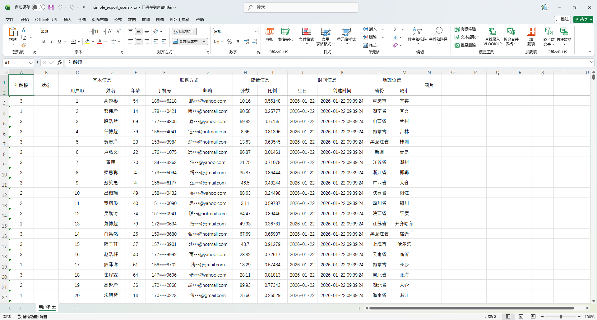

#### Map / 自定义表头脱敏

```
ExcelExportEntity phoneEntity = new ExcelExportEntity("手机号", "phoneNumber");
phoneEntity.setDesensitizationRule("3_4");

ExcelExportEntity emailEntity = new ExcelExportEntity("邮箱", "email");
emailEntity.setDesensitizationRule("1~@");
```

#### 自定义脱敏逻辑

参考章节：数据映射 / 使用 `IExcelDataHandler` 自定义处理

### 一对多集合导出 @ExcelCollection

`@ExcelCollection` 是 EasyPoi 中用于实现 **一对多集合导出** 的核心注解，适用于以下业务场景：

- 一个订单包含多个商品
- 一个课程包含多个学生
- 一张发票包含多条明细
- 一份采购单包含多个采购项

#### 创建主对象

```java
package io.github.atengk.entity;

import cn.afterturn.easypoi.excel.annotation.Excel;
import cn.afterturn.easypoi.excel.annotation.ExcelCollection;
import lombok.Data;

import java.util.List;

@Data
public class CourseExcel {
    @Excel(name = "课程名称", width = 15, needMerge = true, orderNum = "1")
    private String courseName;

    @ExcelCollection(name = "学生列表", orderNum = "4")
    private List<Student> students;
}

```

#### 创建子对象

```java
package io.github.atengk.entity;

import cn.afterturn.easypoi.excel.annotation.Excel;
import lombok.Data;

@Data
public class Student {
    @Excel(name = "学生姓名", width = 12, orderNum = "1")
    private String name;

    @Excel(name = "学生年龄", width = 12, orderNum = "2")
    private Integer age;
}

```

#### 导出数据创建

```java
public static List<CourseExcel> getDataList() {
        List<CourseExcel> list = new ArrayList<>();

        // === 课程 1 ===
        CourseExcel course1 = new CourseExcel();
        course1.setCourseName("Java 开发课程");
        course1.setStudents(Arrays.asList(
                newStudent("张三", 18),
                newStudent("李四", 19),
                newStudent("王五", 20)
        ));

        // === 课程 2 ===
        CourseExcel course2 = new CourseExcel();
        course2.setCourseName("Python 入门课程");
        course2.setStudents(Arrays.asList(
                newStudent("小明", 16),
                newStudent("小红", 17)
        ));

        // === 课程 3 ===
        CourseExcel course3 = new CourseExcel();
        course3.setCourseName("Go 实战课程");
        course3.setStudents(Arrays.asList(
                newStudent("Tom", 21),
                newStudent("Jerry", 22),
                newStudent("Alice", 23),
                newStudent("Bob", 24)
        ));

        list.add(course1);
        list.add(course2);
        list.add(course3);

        return list;
    }

    private static Student newStudent(String name, int age) {
        Student s = new Student();
        s.setName(name);
        s.setAge(age);
        return s;
    }
```

#### 使用示例

```
    @Test
    public void testCourseExport() {
        List<CourseExcel> courseList = getDataList();
        ExcelUtil.exportExcel(
                CourseExcel.class,
                courseList,
                "target/export_course_with_students.xlsx",
                params -> params.setTitle("课程数据")
        );
    }
```

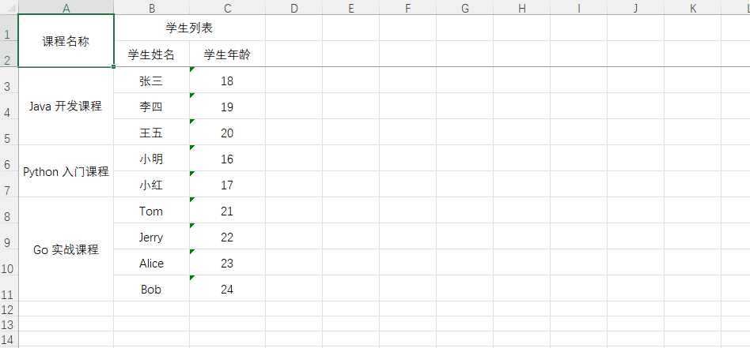

### 嵌套对象支持 @ExcelEntity

`@ExcelEntity` 用于导出对象中 **嵌套的单个子对象属性**，适用于以下业务场景：

- 用户 → 地址信息（省、市、区）
- 项目 → 公司信息（名称、统一信用代码）
- 订单 → 收货人信息（姓名、电话、邮编）
- 课程 → 创建人信息（姓名、邮箱）

区别于 `@ExcelCollection` 的集合展开，`@ExcelEntity` 用于 **一对一对象的字段扁平化导出**。

------

#### 创建主对象

```java
package io.github.atengk.entity;

import cn.afterturn.easypoi.excel.annotation.Excel;
import cn.afterturn.easypoi.excel.annotation.ExcelEntity;
import lombok.Data;

@Data
public class OrderExcel {

    @Excel(name = "订单编号", width = 18, orderNum = "1")
    private String orderNo;

    @ExcelEntity(name = "收件人信息")
    private Receiver receiver;
}
```

------

#### 创建嵌套对象

```java
package io.github.atengk.entity;

import cn.afterturn.easypoi.excel.annotation.Excel;
import lombok.Data;

@Data
public class Receiver {

    @Excel(name = "收件人姓名", width = 15, orderNum = "2")
    private String name;

    @Excel(name = "联系电话", width = 15, orderNum = "3")
    private String phone;

    @Excel(name = "收件城市", width = 15, orderNum = "4")
    private String city;
}
```

> `@ExcelEntity(name = "...")` 会作为 **表头分组名** 自动插入，但不会影响字段扁平化展开。

------

#### 导出数据创建

```java
public static List<OrderExcel> buildOrderData() {
    List<OrderExcel> list = new ArrayList<>();

    list.add(newOrder("NO202601001", "张三", "18800001111", "北京"));
    list.add(newOrder("NO202601002", "李四", "18800002222", "上海"));
    list.add(newOrder("NO202601003", "王五", "18800003333", "广州"));

    return list;
}

private static OrderExcel newOrder(String orderNo, String name, String phone, String city) {
    OrderExcel order = new OrderExcel();
    order.setOrderNo(orderNo);

    Receiver r = new Receiver();
    r.setName(name);
    r.setPhone(phone);
    r.setCity(city);

    order.setReceiver(r);
    return order;
}
```

------

#### 使用示例

```java
    @Test
    public void testOrderExport() {
        List<OrderExcel> list = buildOrderData();
        ExcelUtil.exportExcel(
                OrderExcel.class,
                list,
                "target/export_orders.xlsx",
                params -> params.setTitle("订单数据")
        );
    }
```


------

### 导出图片

更新 `MyUser` 实体类，添加图片字段

- `type = 2` 表示这是一个图片类型。
- 支持：`String 本地路径`、`String http URL`、`base64 字符串`、
- 类型也可以是 `byte[]`、`InputStream`、`File`、`URL`、`classpath 资源流`
- 也可以直接Object，所有类型都支持

#### 基本使用

```java
    /**
     * 图片
     */
    @Excel(name = "图片", type = 2, orderNum = "12")
    private Object image;
```

使用方法

```java
    @Test
    public void testImageExport() {
        List<Object> imagePool = Arrays.asList(
                "D:/Temp/images/1.jpg",                               // 本地
                "https://fuss10.elemecdn.com/e/5d/4a731a90594a4af544c0c25941171jpeg.jpeg",   // 网络
                new File("D:/Temp/images/3.jpg")                      // File
        );

        List<MyUser> userList = InitData.getDataList();
        for (int i = 0; i < userList.size(); i++) {
            userList.get(i).setImage(imagePool.get(i % imagePool.size()));
        }

        ExcelUtil.exportExcel(
                MyUser.class,
                userList,
                "target/image_export_users.xlsx",
                params -> params.setTitle("用户数据（含图片）")
        );
    }
```

#### 设置高宽

经过测试，正方形的图片宽高保持 1:2 的比例效果最好，长方形的宽高不定自行调节

```java
    /**
     * 图片
     */
    @Excel(name = "图片", type = 2, width = 15, height = 30, orderNum = "12")
    private Object image;
```

使用方法

```java
    @Test
    public void testImage2Export() {
        List<MyUser> userList = InitData.getDataList(5);
        for (int i = 0; i < userList.size(); i++) {
            userList.get(i).setImage("https://placehold.co/100x100/png");
        }

        ExcelUtil.exportExcel(
                MyUser.class,
                userList,
                "target/image_export_users.xlsx",
                params -> params.setTitle("用户数据（含图片）")
        );
    }
```


### 导出为多个 Sheet

```java
    @Test
    public void testMultiSheetExport() {
        // 1. 获取原始数据
        List<MyUser> userList = InitData.getDataList();

        // 2. 按省份分组（保留插入顺序，用 LinkedHashMap）
        Map<String, List<MyUser>> provinceGroups = userList.stream()
                .collect(Collectors.groupingBy(
                        MyUser::getProvince,
                        LinkedHashMap::new,
                        Collectors.toList()
                ));

        // 3. 构造多 Sheet 数据：List<Map<String, Object>>
        List<Map<String, Object>> sheets = new ArrayList<>();
        for (Map.Entry<String, List<MyUser>> entry : provinceGroups.entrySet()) {
            String sheetName = entry.getKey();
            List<MyUser> data = entry.getValue();

            ExportParams exportParams = new ExportParams();
            exportParams.setSheetName(sheetName);
            exportParams.setTitle(sheetName + " 用户数据");

            // 每个 Sheet 用一个 Map 表示：<sheetName, dataList>
            Map<String, Object> sheet = new LinkedHashMap<>();
            sheet.put("title", exportParams);       // 顶级表头 和 Sheet 名称
            sheet.put("entity", MyUser.class);     // 表头
            sheet.put("data", data);               // 数据列表
            sheets.add(sheet);
        }

        // 4. 使用多 Sheet 导出方法
        Workbook workbook = ExcelExportUtil.exportExcel(sheets, ExcelType.XSSF);

        // 5. 写入文件
        ExcelUtil.write(workbook, "target/multi_sheet_users.xlsx");
    }
```

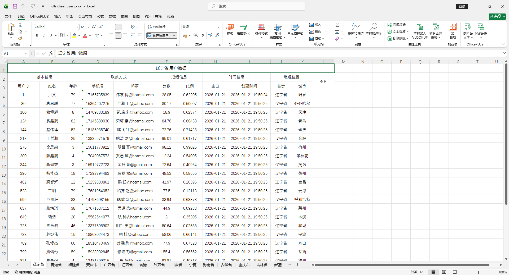

### 大数据量导出（分批写入）

```java
    @Test
    public void testBigDataExport() {
        // 1. 写入多少次
        int total = 500;

        // 2. 创建 IWriter
        ExportParams params = new ExportParams();
        params.setSheetName("大数据用户");

        // 3. 获取 writer
        IWriter<Workbook> writer = ExcelExportUtil.exportBigExcel(params, MyUser.class);

        // 4. 分批写入
        int batchSize = 1000;
        for (int i = 0; i < total; i++) {
            List<MyUser> batch = InitData.getDataList(batchSize);

            writer.write(batch);

            System.out.printf("已写入 %d / %d 行%n", batchSize * (i + 1), total * batchSize);
        }

        // 5. 获取Workbook 并写入文件
        Workbook workbook = writer.get();
        ExcelUtil.write(workbook, "target/big_data_users.xlsx");
    }
```


### 使用 `List<Map>` 导出（无实体类）

#### 常规使用

```java
    @Test
    public void testSimpleExportWithMap() {
        List<MyUser> userList = InitData.getDataList();

        // 转成 List<Map>
        List<Map<String, Object>> dataList = new ArrayList<>();
        for (MyUser user : userList) {
            Map<String, Object> map = new LinkedHashMap<>();
            map.put("id", user.getId());
            map.put("name", user.getName());
            map.put("age", user.getAge());
            map.put("city", user.getCity());
            dataList.add(map);
        }

        // 定义表头（key 对应 map 的 key，name 是显示在 Excel 的标题）
        List<ExcelExportEntity> entityList = new ArrayList<>();
        ExcelExportEntity id = new ExcelExportEntity("ID", "id");
        id.setWidth(20);
        entityList.add(id);
        ExcelExportEntity name = new ExcelExportEntity("姓名", "name");
        name.setWidth(30);
        entityList.add(name);
        ExcelExportEntity age = new ExcelExportEntity("年龄", "age");
        age.setWidth(20);
        entityList.add(age);
        ExcelExportEntity city = new ExcelExportEntity("城市", "city");
        city.setWidth(40);
        entityList.add(city);

        ExportParams params = new ExportParams();
        params.setSheetName("用户列表");

        Workbook workbook = ExcelExportUtil.exportExcel(params, entityList, dataList);
        ExcelUtil.write(workbook, "target/simple_export_users_map.xlsx");
    }
```

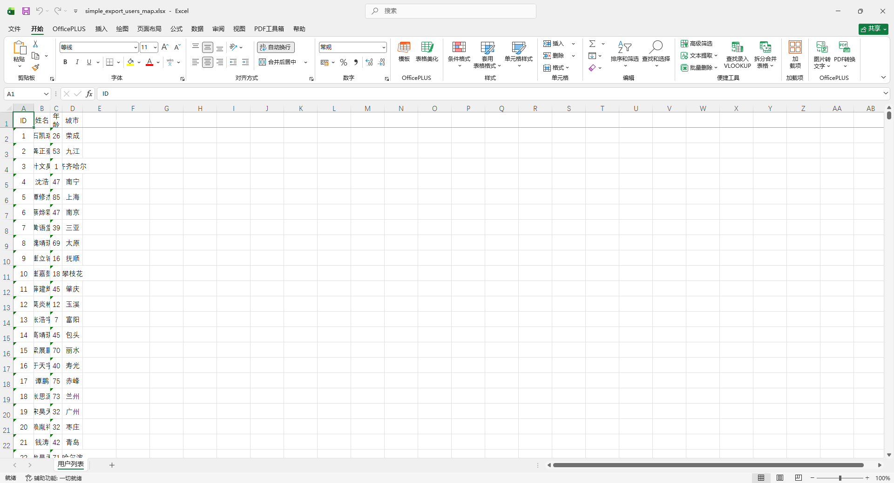

#### 调整列宽

```java
    @Test
    public void testSimpleMergeExportWithMap() {
        List<MyUser> userList = InitData.getDataList();

        userList.sort(
                Comparator.comparing(MyUser::getProvince)
                        .thenComparing(MyUser::getCity)
        );

        // 转成 List<Map>
        List<Map<String, Object>> dataList = new ArrayList<>();
        for (MyUser user : userList) {
            Map<String, Object> map = new LinkedHashMap<>();
            map.put("id", user.getId());
            map.put("name", user.getName());
            map.put("age", user.getAge());
            map.put("city", user.getCity());
            dataList.add(map);
        }

        // 定义表头（key 对应 map 的 key，name 是显示在 Excel 的标题）
        List<ExcelExportEntity> entityList = new ArrayList<>();
        ExcelExportEntity id = new ExcelExportEntity("ID", "id");
        id.setWidth(20);
        entityList.add(id);
        ExcelExportEntity name = new ExcelExportEntity("姓名", "name");
        name.setWidth(30);
        entityList.add(name);
        ExcelExportEntity age = new ExcelExportEntity("年龄", "age");
        age.setWidth(20);
        entityList.add(age);
        ExcelExportEntity city = new ExcelExportEntity("城市", "city");
        city.setWidth(40);
        city.setMergeVertical(true);
        entityList.add(city);

        ExportParams params = new ExportParams();
        params.setSheetName("用户列表");

        Workbook workbook = ExcelExportUtil.exportExcel(params, entityList, dataList);
        ExcelUtil.write(workbook, "target/simple_export_merge_users_map.xlsx");
    }
```

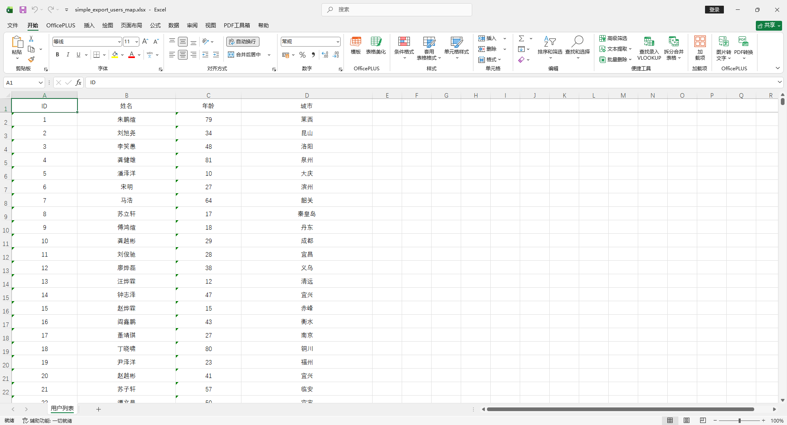

#### 多 Sheet

```java
    @Test
    public void testMultiSheetDifferentHeadersSingleMethod() {
        // ====== 准备数据 ======
        List<MyUser> userList1 = InitData.getDataList();
        List<MyUser> userList2 = InitData.getDataList();

        // ====== Sheet1 表头 ======
        List<ExcelExportEntity> entityList1 = new ArrayList<>();
        ExcelExportEntity id1 = new ExcelExportEntity("ID", "id");
        id1.setWidth(20);
        entityList1.add(id1);
        ExcelExportEntity name1 = new ExcelExportEntity("姓名", "name");
        name1.setWidth(30);
        entityList1.add(name1);
        ExcelExportEntity age1 = new ExcelExportEntity("年龄", "age");
        age1.setWidth(20);
        entityList1.add(age1);
        ExcelExportEntity city1 = new ExcelExportEntity("城市", "city");
        city1.setWidth(40);
        entityList1.add(city1);

        // ====== Sheet1 数据 ======
        List<Map<String, Object>> dataList1 = new ArrayList<>();
        for (MyUser u : userList1) {
            Map<String, Object> map = new LinkedHashMap<>();
            map.put("id", u.getId());
            map.put("name", u.getName());
            map.put("age", u.getAge());
            map.put("city", u.getCity());
            dataList1.add(map);
        }

        // ====== Sheet2 表头 ======
        List<ExcelExportEntity> entityList2 = new ArrayList<>();
        ExcelExportEntity id2 = new ExcelExportEntity("用户ID", "id");
        id2.setWidth(25);
        entityList2.add(id2);
        ExcelExportEntity name2 = new ExcelExportEntity("用户姓名", "name");
        name2.setWidth(35);
        entityList2.add(name2);

        // ====== Sheet2 数据 ======
        List<Map<String, Object>> dataList2 = new ArrayList<>();
        for (MyUser u : userList2) {
            Map<String, Object> map = new LinkedHashMap<>();
            map.put("id", u.getId());
            map.put("name", u.getName());
            dataList2.add(map);
        }

        // ====== 打包多 Sheet ======
        List<Map<String, Object>> sheets = new ArrayList<>();

        Map<String, Object> sheet1 = new HashMap<>();
        sheet1.put("title", new ExportParams("完整用户列表", null, "Sheet1"));
        sheet1.put("entity", entityList1); // List<ExcelExportEntity>
        sheet1.put("data", dataList1);     // List<Map>
        sheets.add(sheet1);

        Map<String, Object> sheet2 = new HashMap<>();
        sheet2.put("title", new ExportParams("简化用户列表", null, "Sheet2"));
        sheet2.put("entity", entityList2);
        sheet2.put("data", dataList2);
        sheets.add(sheet2);

        // ====== 创建 Workbook（关键） ======
        Workbook workbook = createWorkbookForMapSheets(sheets, ExcelType.XSSF);

        // ====== 写入文件 ======
        ExcelUtil.write(workbook, "target/multi_sheet_diff_headers.xlsx");
    }

    /**
     * 多 Sheet + Map + 不同表头导出
     */
    private Workbook createWorkbookForMapSheets(List<Map<String, Object>> sheets, ExcelType type) {
        Workbook workbook = type == ExcelType.HSSF ? new HSSFWorkbook() : new XSSFWorkbook();
        for (Map<String, Object> sheetMap : sheets) {
            ExportParams params = (ExportParams) sheetMap.get("title");
            List<ExcelExportEntity> entityList = (List<ExcelExportEntity>) sheetMap.get("entity");
            Collection<?> dataSet = (Collection<?>) sheetMap.get("data");
            new ExcelExportService().createSheetForMap(workbook, params, entityList, dataSet);
        }
        return workbook;
    }
```


#### 合并单元格

使用 `ExcelExportEntity.setMergeVertical(true)` 自动合并内容相同的单元格

```java
    @Test
    public void testSimpleMergeExportWithMap() {
        List<MyUser> userList = InitData.getDataList();

        userList.sort(
                Comparator.comparing(MyUser::getProvince)
                        .thenComparing(MyUser::getCity)
        );

        // 转成 List<Map>
        List<Map<String, Object>> dataList = new ArrayList<>();
        for (MyUser user : userList) {
            Map<String, Object> map = new LinkedHashMap<>();
            map.put("id", user.getId());
            map.put("name", user.getName());
            map.put("age", user.getAge());
            map.put("city", user.getCity());
            dataList.add(map);
        }

        // 定义表头（key 对应 map 的 key，name 是显示在 Excel 的标题）
        List<ExcelExportEntity> entityList = new ArrayList<>();
        ExcelExportEntity id = new ExcelExportEntity("ID", "id");
        id.setWidth(20);
        entityList.add(id);
        ExcelExportEntity name = new ExcelExportEntity("姓名", "name");
        name.setWidth(30);
        entityList.add(name);
        ExcelExportEntity age = new ExcelExportEntity("年龄", "age");
        age.setWidth(20);
        entityList.add(age);
        ExcelExportEntity city = new ExcelExportEntity("城市", "city");
        city.setWidth(40);
        city.setMergeVertical(true);
        entityList.add(city);

        ExportParams params = new ExportParams();
        params.setSheetName("用户列表");

        Workbook workbook = ExcelExportUtil.exportExcel(params, entityList, dataList);
        ExcelUtil.write(workbook, "target/simple_export_merge_users_map.xlsx");
    }
```


#### 导出图片

图片列需要先下载成 byte[]

```java
    @Test
    public void testSimpleExportWithMapAndImage() {
        List<MyUser> userList = InitData.getDataList(10);

        // 图片 URL
        String imageUrl = "https://fuss10.elemecdn.com/e/5d/4a731a90594a4af544c0c25941171jpeg.jpeg";

        // ====== 转成 List<Map> ======
        List<Map<String, Object>> dataList = new ArrayList<>();
        for (MyUser user : userList) {
            Map<String, Object> map = new LinkedHashMap<>();
            map.put("id", user.getId());
            map.put("name", user.getName());
            map.put("age", user.getAge());
            map.put("city", user.getCity());

            // 图片列：先下载成 byte[]
            byte[] imageBytes = HttpUtil.downloadBytes(imageUrl);
            map.put("avatar", imageBytes);

            dataList.add(map);
        }

        // ====== 定义表头 ======
        List<ExcelExportEntity> entityList = new ArrayList<>();
        entityList.add(new ExcelExportEntity("ID", "id"));
        entityList.add(new ExcelExportEntity("姓名", "name"));
        entityList.add(new ExcelExportEntity("年龄", "age"));
        entityList.add(new ExcelExportEntity("城市", "city"));

        // 图片列
        ExcelExportEntity avatarEntity = new ExcelExportEntity("头像", "avatar");
        avatarEntity.setType(BaseTypeConstants.IMAGE_TYPE);
        avatarEntity.setHeight(100); // 高度
        avatarEntity.setWidth(100);  // 宽度
        entityList.add(avatarEntity);

        // ====== 导出 Excel ======
        ExportParams params = new ExportParams();
        params.setSheetName("用户列表");

        Workbook workbook = ExcelExportUtil.exportExcel(params, entityList, dataList);

        // ====== 写入文件 ======
        ExcelUtil.write(workbook, "target/simple_export_users_map_with_image.xlsx");
    }
```

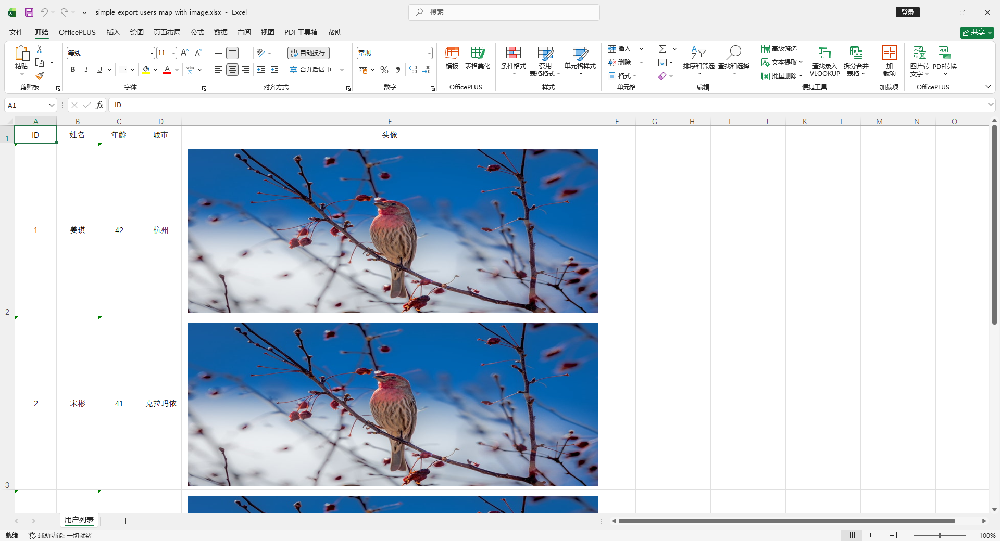

#### 字典映射 replace

使用ExcelExportEntity.setReplace构建映射：显示值_原始值（String）

```java
    @Test
    public void testSimpleExportWithMap_Dict() {
        List<MyUser> userList = InitData.getDataList();

        // 转成 List<Map>
        List<Map<String, Object>> dataList = new ArrayList<>();
        for (MyUser user : userList) {
            Map<String, Object> map = new LinkedHashMap<>();
            map.put("id", user.getId());
            map.put("name", user.getName());

            // 假设 number 是数字，后面用字典映射
            map.put("number", RandomUtil.randomEle(Arrays.asList(1, 2, 3)));

            // 假设 city 是编码，后面用 handler 处理
            map.put("city", user.getCity());

            dataList.add(map);
        }

        // 定义表头（key 对应 map 的 key，name 是显示在 Excel 的标题）
        List<ExcelExportEntity> entityList = new ArrayList<>();
        entityList.add(new ExcelExportEntity("ID", "id"));
        entityList.add(new ExcelExportEntity("姓名", "name"));

        // 年龄字典映射
        ExcelExportEntity ageEntity = new ExcelExportEntity("年龄段", "number");
        // 映射：显示值_原始值
        ageEntity.setReplace(new String[]{
                "青年_1",
                "中年_2",
                "老年_3"
        });
        entityList.add(ageEntity);

        ExportParams params = new ExportParams();
        params.setSheetName("用户列表");

        Workbook workbook = ExcelExportUtil.exportExcel(params, entityList, dataList);
        ExcelUtil.write(workbook, "target/simple_export_users_map_dict.xlsx");
    }
```


#### 生成下拉

```java
    @Test
    public void testSimpleExportWithMap_DictAndDropdown() {
        List<MyUser> userList = InitData.getDataList();

        // 1. 转成 List<Map>
        List<Map<String, Object>> dataList = new ArrayList<>();
        for (MyUser user : userList) {
            Map<String, Object> map = new LinkedHashMap<>();
            map.put("id", user.getId());
            map.put("name", user.getName());

            // 假设 number 是数字，后面用字典映射
            map.put("number", RandomUtil.randomEle(Arrays.asList(1, 2, 3)));

            // 假设 city 是编码，后面用 handler 处理
            map.put("city", user.getCity());

            dataList.add(map);
        }

        // 2. 定义表头（key 对应 map 的 key，name 是显示在 Excel 的标题）
        List<ExcelExportEntity> entityList = new ArrayList<>();
        entityList.add(new ExcelExportEntity("ID", "id"));
        entityList.add(new ExcelExportEntity("姓名", "name"));

        // 年龄段列，字典映射 + 下拉
        ExcelExportEntity ageEntity = new ExcelExportEntity("年龄段", "number");
        // 显示值_原始值
        ageEntity.setReplace(new String[]{
                "青年_1",
                "中年_2",
                "老年_3"
        });
        // 下拉框，根据 Replace 的值生成
        ageEntity.setAddressList(true);
        entityList.add(ageEntity);

        ExportParams params = new ExportParams();
        params.setSheetName("用户列表");

        // 3. 导出 Excel
        Workbook workbook = ExcelExportUtil.exportExcel(params, entityList, dataList);

        // 4. 写入本地文件
        ExcelUtil.write(workbook, "target/simple_export_users_map_dict_dropdown.xlsx");
    }
```

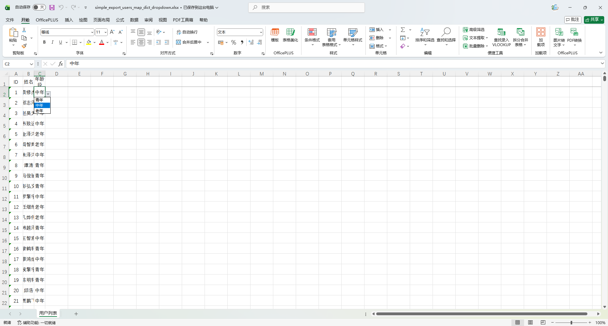

#### 使用 `IExcelDataHandler` 自定义处理

**实现 `IExcelDataHandler`**

```java
package io.github.atengk.handler;

import cn.afterturn.easypoi.handler.inter.IExcelDataHandler;
import org.apache.poi.ss.usermodel.CreationHelper;
import org.apache.poi.ss.usermodel.Hyperlink;

import java.util.HashMap;
import java.util.Map;

/**
 * number 字段导入导出的自定义处理器
 *
 * 功能：
 * - 导出：1 -> 一号、2 -> 二号、3 -> 三号
 * - 导入：一号 -> 1、二号 -> 2、三号 -> 3
 *
 * 注意点：
 * - 实现 IExcelDataHandler 全部方法
 */
public class NumberDataHandler implements IExcelDataHandler<Object> {

    private String[] needHandlerFields;

    /**
     * 字典映射（可改）
     */
    private static final Map<String, String> EXPORT_MAP = new HashMap<>();
    private static final Map<String, String> IMPORT_MAP = new HashMap<>();

    static {
        EXPORT_MAP.put("1", "一号");
        EXPORT_MAP.put("2", "二号");
        EXPORT_MAP.put("3", "三号");

        IMPORT_MAP.put("一号", "1");
        IMPORT_MAP.put("二号", "2");
        IMPORT_MAP.put("三号", "3");
    }

    @Override
    public Object exportHandler(Object obj, String name, Object value) {
        if (!match(name)) {
            return value;
        }
        if (value == null) {
            return null;
        }
        String raw = String.valueOf(value);
        return EXPORT_MAP.getOrDefault(raw, raw);
    }

    @Override
    public Object importHandler(Object obj, String name, Object value) {
        if (!match(name)) {
            return value;
        }
        if (value == null) {
            return null;
        }
        String raw = String.valueOf(value);
        return IMPORT_MAP.getOrDefault(raw, raw);
    }

    @Override
    public String[] getNeedHandlerFields() {
        return needHandlerFields;
    }

    @Override
    public void setNeedHandlerFields(String[] fields) {
        this.needHandlerFields = fields;
    }

    @Override
    public void setMapValue(Map<String, Object> map, String originKey, Object value) {
        if (!match(originKey)) {
            map.put(originKey, value);
            return;
        }

        if (value != null) {
            String raw = String.valueOf(value);
            map.put(originKey, IMPORT_MAP.getOrDefault(raw, raw));
        } else {
            map.put(originKey, null);
        }
    }

    @Override
    public Hyperlink getHyperlink(CreationHelper creationHelper, Object obj, String name, Object value) {
        // 这里通常不用超链接，返回 null 即可
        return null;
    }

    /**
     * 判断字段是否在处理范围
     */
    private boolean match(String name) {
        if (needHandlerFields == null) {
            return false;
        }
        for (String field : needHandlerFields) {
            if (field.equals(name)) {
                return true;
            }
        }
        return false;
    }
}
```

**使用方法**

```java
    @Test
    public void testSimpleExportWithMap_DataHandler() {
        List<MyUser> userList = InitData.getDataList();

        // 转成 List<Map>
        List<Map<String, Object>> dataList = new ArrayList<>();
        for (MyUser user : userList) {
            Map<String, Object> map = new LinkedHashMap<>();
            map.put("id", user.getId());
            map.put("name", user.getName());
            map.put("number", RandomUtil.randomEle(Arrays.asList(1, 2, 3)));
            map.put("city", user.getCity());
            dataList.add(map);
        }

        // 定义表头（key 对应 map 的 key，name 是显示在 Excel 的标题）
        List<ExcelExportEntity> entityList = new ArrayList<>();
        entityList.add(new ExcelExportEntity("ID", "id"));
        entityList.add(new ExcelExportEntity("姓名", "name"));
        entityList.add(new ExcelExportEntity("年龄段", "number"));
        entityList.add(new ExcelExportEntity("城市", "city"));

        // 创建自定义 DataHandler
        NumberDataHandler handler = new NumberDataHandler();
        handler.setNeedHandlerFields(new String[]{"年龄段"}); // 注意这里写 Map 的 name

        ExportParams params = new ExportParams();
        params.setSheetName("用户列表");
        params.setDataHandler(handler); // 设置 handler

        Workbook workbook = ExcelExportUtil.exportExcel(params, entityList, dataList);
        ExcelUtil.write(workbook, "target/simple_export_users_map_datahandler.xlsx");
    }
```


## 模板导出（Template Export）

| 功能                   | 指令      | 普通变量示例                              | 列表变量示例（$fe 中使用）              |
| ---------------------- | --------- | ----------------------------------------- | --------------------------------------- |
| 普通取值               | 无指令    | `{{name}}`                                | `t.name`                                |
| 数值单元格             | `n:`      | `{{n:age}}`                               | `n:t.age`                               |
| 时间格式化             | `fd:`     | `{{fd:(createTime;yyyy-MM-dd HH:mm:ss)}}` | `fd:(t.createTime;yyyy-MM-dd HH:mm:ss)` |
| 数字格式化             | `fn:`     | `{{fn:(score;###.00)}}`                   | `fn:(t.score;###.00)`                   |
| 字符串长度             | `le:`     | `{{le:(name)}}`                           | `le:(t.name)`                           |
| 三目运算               | `?:`      | `{{age > 18 ? '成年' : '未成年'}}`        | `t.age > 18 ? '成年' : '未成年'`        |
| 遍历并新建行           | `fe:`     | 不适用                                    | `{{fe:list t t.name t.age}}`            |
| 遍历但不新建行         | `!fe:`    | 不适用                                    | `{{!fe:list t t.name}}`                 |
| 下移插入遍历（最常用） | `$fe:`    | 不适用                                    | `{{ $fe:list t.name t.age t.phone }}`   |
| 横向遍历（带模板）     | `#fe:`    | 不适用                                    | `{{#fe: colList t.name}}`               |
| 横向取值（纯数据）     | `v_fe:`   | 不适用                                    | `{{v_fe: colList t.data}}`              |
| 删除当前列             | `!if:`    | `{{!if:(age < 18)}}`                      | `!if:(t.age < 18)`                      |
| 字典转换               | `dict:`   | `{{dict:gender;gender}}`                  | `dict:gender;t.gender`                  |
| 国际化                 | `i18n:`   | `{{i18n:key}}`                            | `i18n:key`                              |
| 循环序号               | `&INDEX&` | 不适用                                    | `&INDEX&`                               |
| 空值占位               | `&NULL&`  | `{{&NULL&}}`                              | `&NULL&`                                |
| 换行导出               | `]]`      | `{{name]]age}}`                           | `t.name]]t.age`                         |
| 统计求和               | `sum:`    | `{{sum:score}}`                           | `sum:t.score`                           |
| 计算表达式             | `cal:`    | `{{cal:(price*count)}}`                   | `cal:(t.price*t.count)`                 |
| 常量输出               | `'常量'`  | `{{'正常'}}`                              | `'正常'`                                |

### 填充普通变量数据

**创建模版**

```
src
 └─ main
    └─ resources
       └─ doc
          └─ user_template.xlsx
```

EasyPOI 模板语法：

- 普通变量：`{{name}}`

```
姓名：{{ name }}
年龄：{{ age }}
```

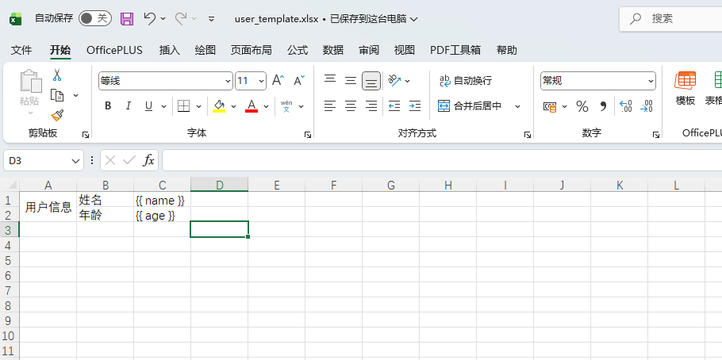

**使用方法**

```java
    @Test
    void test() {
        Map<String, Object> data = new HashMap<>();
        data.put("name", "Ateng");
        data.put("age", "25");
        Workbook workbook = ExcelUtil.exportExcelByTemplate(
                "doc/user_template.xlsx",
                data
        );
        Path filePath = Paths.get("target", "template_export_users.xlsx");
        ExcelUtil.write(workbook, filePath);
        System.out.println("✅ 模板导出成功：" + filePath);
    }
```


###  填充列表变量数据

**创建模版**

```
src
 └─ main
    └─ resources
       └─ doc
          └─ user_list_template.xlsx
```

EasyPOI 模板语法：

- 列表变量：`{{ $fe:  集合名   单个元素别名   第1个字段 第1个字段 ... 第n个字段 }}`
- 其中 `集合名` 就是data中的list：`data.list`

| 姓名               | 年龄  | 手机号码      | 邮箱    | 分数    | 比例    | 生日       | 所在省份   | 所在城市 | 创建时间        |
| ------------------ | ----- | ------------- | ------- | ------- | ------- | ---------- | ---------- | -------- | --------------- |
| {{ $fe:list t.name | t.age | t.phoneNumber | t.email | t.score | t.ratio | t.birthday | t.province | t.city   | t.createTime }} |

```
姓名	年龄	手机号码	邮箱	分数	比例	生日	所在省份	所在城市	创建时间
{{ $fe:list t.name	t.age	t.phoneNumber	t.email	t.score	t.ratio	t.birthday	t.province	t.city	t.createTime }}
```


**使用方法**

```java
    @Test
    void test2() {
        List<MyUser> dataList = InitData.getDataList();
        Map<String, Object> data = new HashMap<>();
        data.put("list", dataList);
        Workbook workbook = ExcelUtil.exportExcelByTemplate(
                "doc/user_list_template.xlsx",
                data
        );
        Path filePath = Paths.get("target", "template_export_list_users.xlsx");
        ExcelUtil.write(workbook, filePath);
        System.out.println("✅ 模板导出成功：" + filePath);
    }
```


### 填充普通和列表变量数据（混合）

**创建模版**

```
src
 └─ main
    └─ resources
       └─ doc
          └─ user_mix_template.xlsx
```

EasyPOI 模板语法：

- 普通变量：`{{name}}`
- 列表变量：`{{ $fe:  集合名   单个元素别名   第1个字段 第1个字段 ... 第n个字段 }}`
- 其中 `集合名` 就是data中的list：`data.list`

| 标题：{{ title }}  |       |               |         |         |         |            |                    |                  |                 |
| ------------------ | ----- | ------------- | ------- | ------- | ------- | ---------- | ------------------ | ---------------- | --------------- |
|                    |       |               |         |         |         |            |                    |                  |                 |
| 姓名               | 年龄  | 手机号码      | 邮箱    | 分数    | 比例    | 生日       | 所在省份           | 所在城市         | 创建时间        |
| {{ $fe:list t.name | t.age | t.phoneNumber | t.email | t.score | t.ratio | t.birthday | t.province         | t.city           | t.createTime }} |
|                    |       |               |         |         |         |            |                    |                  |                 |
|                    |       |               |         |         |         |            | 作者：{{ author }} | 时间：{{ time }} |                 |

```
标题：{{ title }}									
									
姓名	年龄	手机号码	邮箱	分数	比例	生日	所在省份	所在城市	创建时间
{{ $fe:list t.name	t.age	t.phoneNumber	t.email	t.score	t.ratio	t.birthday	t.province	t.city	t.createTime }}
									
							作者：{{ author }}	时间：{{ time }}	
```

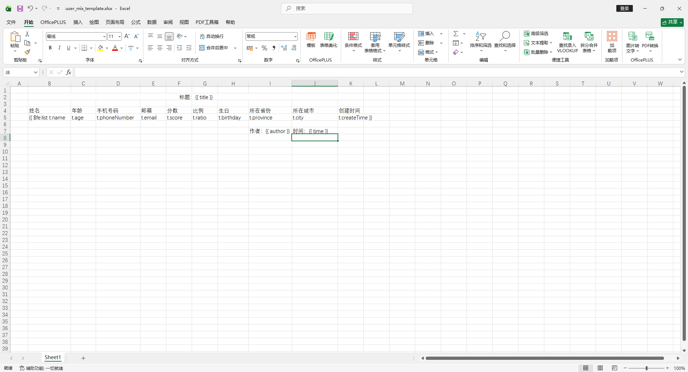

**使用方法**

```java
    @Test
    void test3() {
        List<MyUser> dataList = InitData.getDataList(10);
        Map<String, Object> data = new HashMap<>();
        data.put("list", dataList);
        data.put("title", "EasyPoi 模版导出混合使用");
        data.put("author", "Ateng");
        data.put("time", DateUtil.now());
        Workbook workbook = ExcelUtil.exportExcelByTemplate(
                "doc/user_mix_template.xlsx",
                data
        );
        Path filePath = Paths.get("target", "template_export_mix_users.xlsx");
        ExcelUtil.write(workbook, filePath);
        System.out.println("✅ 模板导出成功：" + filePath);
    }
```


### 填充多 Sheet

**创建模版**

```
src
 └─ main
    └─ resources
       └─ doc
          └─ user_multiple_sheet_template.xlsx
```

Sheet1

```
用户信息	姓名	{{ name }}
	年龄	{{ age }}
	性别	{{ sex }}
```


Sheet2

```
用户信息	姓名	{{ name }}
	年龄	{{ age }}
```

**使用方法**

- 模版导出扫描全部的sheet的变量：params.setScanAllsheet(true)
- 模版导出扫描指定名称sheet的变量：params.setSheetName(new String[]{"Sheet1", "Sheet2"})
- 模版导出扫描指定索引sheet的变量：params.setSheetNum(new Integer[]{0,1})

```java
    @Test
    void testScanAllSheet() {
        Map<String, Object> data = new HashMap<>();
        data.put("name", "Ateng");
        data.put("age", "25");
        data.put("sex", "25");
        Workbook workbook = ExcelUtil.exportExcelByTemplate(
                "doc/user_multiple_sheet_template.xlsx",
                data,
                params -> params.setScanAllsheet(true)
        );
        Path filePath = Paths.get("target", "template_export_multiple_sheet_users.xlsx");
        ExcelUtil.write(workbook, filePath);
        System.out.println("✅ 模板导出成功：" + filePath);
    }
```

Sheet1


Sheet2


### 格式化

#### 普通变量

**创建模版**

```
src
 └─ main
    └─ resources
       └─ doc
          └─ user_format_template.xlsx
```

**模版内容**

```
字段说明	模板表达式
姓名	{{name}}
年龄（数值）	{{n:age}}
年龄描述（三目）	{{age > 18 ? '成年' : '未成年'}}
创建时间原始值	{{createTime}}
创建时间格式化	{{fd:(createTime;yyyy-MM-dd HH:mm:ss)}}
生日（仅日期）	{{fd:(birthday;yyyy-MM-dd)}}
分数原始值	{{score}}
分数两位小数	{{fn:(score;###.00)}}
比例原始值	{{ratio}}
比例百分比	{{fn:(ratio;0.00%)}}
字符串长度	{{le:(name)}}
```


**使用方法**

```java
    @Test
    void test4() throws ParseException {
        Map<String, Object> data = new HashMap<>();

        Date date = new Date();
        Date formatDate = new SimpleDateFormat("yyyy-MM-dd").parse("1999-06-18");

        data.put("name", "Ateng");
        data.put("age", 25);
        data.put("createTime", date);
        data.put("birthday", formatDate);
        data.put("score", 87.456);
        data.put("ratio", 0.8567);

        Workbook workbook = ExcelUtil.exportExcelByTemplate(
                "doc/user_format_template.xlsx",
                data
        );

        Path filePath = Paths.get("target", "template_export_users_format.xlsx");
        ExcelUtil.write(workbook, filePath);

        System.out.println("✅ 普通变量格式化模板导出成功：" + filePath);
    }
```


注意几个“企业级细节”：

| 字段       | 要点                                       |
| ---------- | ------------------------------------------ |
| age        | 必须给数字，不要给字符串，否则 `n:` 会失效 |
| createTime | 必须是 `Date` 或 `LocalDateTime`           |
| birthday   | 同上                                       |
| score      | Double / BigDecimal                        |
| ratio      | 小数 0.8567 → 显示为 85.67%                |

---

#### 普通变量 + dict

**创建模版**

```
src
 └─ main
    └─ resources
       └─ doc
          └─ user_format_dict_template.xlsx
```

**模版内容**

```
字段说明	模板表达式
性别原始值	{{gender}}
性别字典翻译(dict)	{{dict:genderDict;gender}}
```


**创建字典处理器**

```java
package io.github.atengk.handler;

import cn.afterturn.easypoi.handler.inter.IExcelDictHandler;

/**
 * 性别字典处理器
 *
 * 统一维护性别字段的「值 ↔ 显示名称」映射关系：
 *
 * 数据库存值：
 *  1 → 男
 *  2 → 女
 *
 * 使用场景：
 * 1. 导出时：
 *    {{dict:genderDict;gender}}
 *    调用 toName，把 1 / 2 转换为 男 / 女
 *
 * 2. 导入时：
 *    Excel 中是 男 / 女
 *    调用 toValue，把 男 / 女 转换为 1 / 2
 *
 * 这样可以做到：
 * - Excel 对业务人员友好（看中文）
 * - 系统内部对数据库友好（存编码）
 *
 * @author 孔余
 * @since 2026-01-22
 */
public class GenderDictHandler implements IExcelDictHandler {

    /**
     * 导出时调用：将“字典值”转换为“显示名称”
     *
     * @param dict  字典标识，例如：gender
     * @param obj   当前行对象
     * @param name  当前字段名称
     * @param value 当前字段原始值，例如：1、2
     * @return 转换后的显示值，例如：男、女
     */
    @Override
    public String toName(String dict, Object obj, String name, Object value) {
        if (!"genderDict".equals(dict)) {
            return value == null ? "" : value.toString();
        }

        if (value == null) {
            return "";
        }

        switch (value.toString()) {
            case "1":
                return "男";
            case "2":
                return "女";
            default:
                return "未知";
        }
    }

    /**
     * 导入时调用：将“显示名称”反向转换为“字典值”
     *
     * Excel 中如果填写：
     *  男 → 返回 1
     *  女 → 返回 2
     *
     * @param dict  字典标识，例如：gender
     * @param obj   当前行对象
     * @param name  当前字段名称
     * @param value Excel 中读取到的值，例如：男、女
     * @return 转换后的字典值，例如：1、2
     */
    @Override
    public String toValue(String dict, Object obj, String name, Object value) {
        if (!"genderDict".equals(dict)) {
            return value == null ? "" : value.toString();
        }

        if (value == null) {
            return "";
        }

        switch (value.toString().trim()) {
            case "男":
                return "1";
            case "女":
                return "2";
            default:
                return "";
        }
    }
}
```

**使用方法**

```java
    @Test
    void test5() {
        Map<String, Object> data = new HashMap<>();
        data.put("gender", 1);

        Workbook workbook = ExcelUtil.exportExcelByTemplate(
                "doc/user_format_dict_template.xlsx",
                data,
                params -> params.setDictHandler(new GenderDictHandler())
        );

        Path filePath = Paths.get("target", "template_export_users_format_dict.xlsx");
        ExcelUtil.write(workbook, filePath);

        System.out.println("✅ 普通变量 + dict 格式化模板导出成功：" + filePath);
    }
```

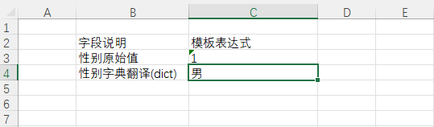

#### 列表变量

**创建模板**

```
src
 └─ main
    └─ resources
       └─ doc
          └─ user_list_format_template.xlsx
```

**模板内容**

```
序号	姓名	年龄(数值)	年龄描述	生日	成绩	百分比	创建时间	金额
{{ $fe:list &INDEX&	t.name	n:t.age	t.age > 18 ? '成年': '未成年'	fd:(t.birthday;yyyy-MM-dd)	fn:(t.score;###.00)	fn:(t.ratio;0.00%)	fd:(t.createTime;yyyy-MM-dd HH:mm:ss)	fn:(t.amount;#,###.00) }}
```


**使用方法示例**

```java
    @Test
    void testListFormatTemplateExport() throws Exception {
        Map<String, Object> data = new HashMap<>();

        List<Map<String, Object>> list = new ArrayList<>();

        SimpleDateFormat fmt = new SimpleDateFormat("yyyy-MM-dd");
        Date now = new Date();

        for (int i = 1; i <= 5; i++) {
            Map<String, Object> u = new HashMap<>();
            u.put("name", "User-" + i);
            u.put("age", 15 + i);
            u.put("birthday", fmt.parse("199" + i + "-06-18"));
            u.put("createTime", now);
            u.put("score", 80.8923 + i);
            u.put("ratio", 0.156 + i * 0.1);
            u.put("amount", 15000.567 + i * 1000);
            list.add(u);
        }

        data.put("list", list);

        Workbook workbook = ExcelUtil.exportExcelByTemplate(
                "doc/user_list_format_template.xlsx",
                data
        );

        Path filePath = Paths.get("target", "template_export_format_users_list.xlsx");
        ExcelUtil.write(workbook, filePath);

        System.out.println("📦 列表模板导出成功：" + filePath);
    }
```


#### 列表变量 + dict

**创建模板**

```
src
 └─ main
    └─ resources
       └─ doc
          └─ user_list_format_dict_template.xlsx
```

**模板内容**

- 字典使用，dict:字典名称:字段名称：dict:genderDict;gender

```
序号	姓名	性别	年龄(数值)	年龄描述	生日	成绩	百分比	创建时间	金额
{{ $fe:list &INDEX&	t.name	dict:genderDict;t.gender	n:t.age	t.age > 18 ? '成年': '未成年'	fd:(t.birthday;yyyy-MM-dd)	fn:(t.score;###.00)	fn:(t.ratio;0.00%)	fd:(t.createTime;yyyy-MM-dd HH:mm:ss)	fn:(t.amount;#,###.00) }}
```


**创建字典处理器**

```java
package io.github.atengk.handler;

import cn.afterturn.easypoi.handler.inter.IExcelDictHandler;

/**
 * 性别字典处理器
 *
 * 统一维护性别字段的「值 ↔ 显示名称」映射关系：
 *
 * 数据库存值：
 *  1 → 男
 *  2 → 女
 *
 * 使用场景：
 * 1. 导出时：
 *    {{dict:genderDict;gender}}
 *    调用 toName，把 1 / 2 转换为 男 / 女
 *
 * 2. 导入时：
 *    Excel 中是 男 / 女
 *    调用 toValue，把 男 / 女 转换为 1 / 2
 *
 * 这样可以做到：
 * - Excel 对业务人员友好（看中文）
 * - 系统内部对数据库友好（存编码）
 *
 * @author 孔余
 * @since 2026-01-22
 */
public class GenderDictHandler implements IExcelDictHandler {

    /**
     * 导出时调用：将“字典值”转换为“显示名称”
     *
     * @param dict  字典标识，例如：gender
     * @param obj   当前行对象
     * @param name  当前字段名称
     * @param value 当前字段原始值，例如：1、2
     * @return 转换后的显示值，例如：男、女
     */
    @Override
    public String toName(String dict, Object obj, String name, Object value) {
        if (!"genderDict".equals(dict)) {
            return value == null ? "" : value.toString();
        }

        if (value == null) {
            return "";
        }

        switch (value.toString()) {
            case "1":
                return "男";
            case "2":
                return "女";
            default:
                return "未知";
        }
    }

    /**
     * 导入时调用：将“显示名称”反向转换为“字典值”
     *
     * Excel 中如果填写：
     *  男 → 返回 1
     *  女 → 返回 2
     *
     * @param dict  字典标识，例如：gender
     * @param obj   当前行对象
     * @param name  当前字段名称
     * @param value Excel 中读取到的值，例如：男、女
     * @return 转换后的字典值，例如：1、2
     */
    @Override
    public String toValue(String dict, Object obj, String name, Object value) {
        if (!"genderDict".equals(dict)) {
            return value == null ? "" : value.toString();
        }

        if (value == null) {
            return "";
        }

        switch (value.toString().trim()) {
            case "男":
                return "1";
            case "女":
                return "2";
            default:
                return "";
        }
    }
}
```

**使用方法示例**

```java
    @Test
    void testListFormatDictTemplateExport() throws Exception {
        Map<String, Object> data = new HashMap<>();

        List<Map<String, Object>> list = new ArrayList<>();

        SimpleDateFormat fmt = new SimpleDateFormat("yyyy-MM-dd");
        Date now = new Date();

        for (int i = 1; i <= 5; i++) {
            Map<String, Object> u = new HashMap<>();
            u.put("name", "User-" + i);
            u.put("gender", String.valueOf(RandomUtil.randomInt(1, 2)));
            u.put("age", 15 + i);
            u.put("birthday", fmt.parse("199" + i + "-06-18"));
            u.put("createTime", now);
            u.put("score", 80.8923 + i);
            u.put("ratio", 0.156 + i * 0.1);
            u.put("amount", 15000.567 + i * 1000);
            list.add(u);
        }

        data.put("list", list);

        Workbook workbook = ExcelUtil.exportExcelByTemplate(
                "doc/user_list_format_dict_template.xlsx",
                data,
                params -> params.setDictHandler(new GenderDictHandler())
        );

        Path filePath = Paths.get("target", "template_export_format_dict_users_list.xlsx");
        ExcelUtil.write(workbook, filePath);

        System.out.println("📦 列表模板导出成功：" + filePath);
    }
```


### 横向遍历

#### 横向遍历表头

**创建模板**

```
src
 └─ main
    └─ resources
       └─ doc
          └─ dynamic_header_template.xlsx
```

**模板内容**

```
{{#fe: titles t.dateStr}}
```

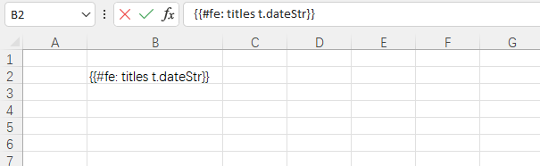

**使用方法示例**

- 需要添加参数：`params -> params.setColForEach(true)`

```java
    @Test
    void testDynamicHeaderTemplateExport() throws Exception {
        Map<String, Object> data = new HashMap<>();

        // 动态表头
        List<Map<String, Object>> colList = new ArrayList<>();

        int monthCount = RandomUtil.randomInt(3, 8); // 随机 3~7 列

        for (int i = 0; i < monthCount; i++) {
            Map<String, Object> m = new HashMap<>();
            m.put("name", "2024-" + (i + 1)); // 表头名称
            colList.add(m);
        }

        data.put("colList", colList);
        System.out.println(data);

        // 导出
        Workbook workbook = ExcelUtil.exportExcelByTemplate(
                "doc/dynamic_header_template.xlsx",
                data,
                params -> params.setColForEach(true)
        );

        ExcelUtil.write(
                workbook,
                Paths.get("target/dynamic_header.xlsx")
        );

        System.out.println("📦 动态表头导出成功");
    }
```


#### 横向表头合并（merge + 横向遍历）

**创建模板**

```
src
 └─ main
    └─ resources
       └─ doc
          └─ dynamic_header_merge_template.xlsx
```

**模板内容**

- 需要合并的表头必须使用变量提供

```
{{tempName}}{{merge:cal:le:(colList) * 1}}
{{#fe:colList t.name}}
```


------

**使用方法示例**

- 同样需要参数：`params -> params.setColForEach(true)`

```java
    @Test
    void testDynamicHeaderMergeTemplateExport()  {
        Map<String, Object> data = new HashMap<>();

        // 动态表头
        List<Map<String, Object>> colList = new ArrayList<>();

        int monthCount = RandomUtil.randomInt(3, 8); // 随机 3~7 列

        for (int i = 0; i < monthCount; i++) {
            Map<String, Object> m = new HashMap<>();
            m.put("name", "2024-" + (i + 1)); // 表头名称
            colList.add(m);
        }

        data.put("tempName", "总表头");
        data.put("colList", colList);

        // 导出
        Workbook workbook = ExcelUtil.exportExcelByTemplate(
                "doc/dynamic_header_merge_template.xlsx",
                data,
                params -> params.setColForEach(true)
        );

        ExcelUtil.write(
                workbook,
                Paths.get("target/dynamic_header_merge.xlsx")
        );

        System.out.println("📦 横向合并表头导出成功");
    }
```

注意这里合并了后有边框样式丢失的问题，暂未找到解决方法。

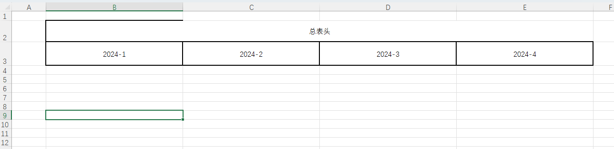

------

#### 横向遍历表头 + 数据（动态）

**避坑总结**

0. `#fe`、`v_fe` 的优先级高于 `$fe`
   必须先铺列，再铺行，否则 `$fe` 没有列可走

1. `$fe` 和 `v_fe` 绝对不能在同一个单元格

```
{{$fe:data	{{v_fe:titles t.val}}
```

2. `$fe` 只管“行循环”，`v_fe` 只管“列循环”，职责必须拆开

3. `#fe` 只负责生成横向表头

```
{{#fe:titles t.name}}
```

4. `v_fe` 不取值，只负责“横向展开列结构”

5. 真正取值靠 `titles.val`，而且它必须是**表达式字符串**

```java
title.put("val", "t." + 字段名);
```

6. EasyPOI 对 `t.val` 会进行二次解析：

```
"t.2024-1"  →  {{t.2024-1}}  →  row.get("2024-1")
```

---

**创建模板**

```
src
 └─ main
    └─ resources
       └─ doc
          └─ dynamic_header_and_data_template.xlsx
```

**模板内容**

```
	{{#fe:titles t.name}}
{{$fe:data	{{v_fe:titles t.val}}
```

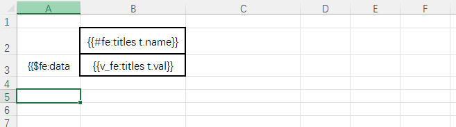

**使用方法示例**

- 需要添加参数：`params -> params.setColForEach(true)`

```java
    @Test
    void testDynamicHeaderAndDataTemplateExport() {

        int monthCount = RandomUtil.randomInt(3, 8);
        int rowCount = RandomUtil.randomInt(3, 6);

        List<Map<String, Object>> titles = new ArrayList<>();

        for (int i = 0; i < monthCount; i++) {
            String date = "2024-" + (i + 1);

            Map<String, Object> title = new HashMap<>();
            title.put("name", date);
            // 关键：这里不是值，是表达式
            title.put("val", "t." + date);

            titles.add(title);
        }

        List<Map<String, Object>> dataList = new ArrayList<>();

        for (int r = 0; r < rowCount; r++) {
            Map<String, Object> row = new HashMap<>();
            for (int i = 0; i < monthCount; i++) {
                String date = "2024-" + (i + 1);
                row.put(date, i + "" + r);
            }
            dataList.add(row);
        }

        Map<String, Object> data = new HashMap<>();
        data.put("titles", titles);
        data.put("data", dataList);


        System.out.println(data);

        // 导出
        Workbook workbook = ExcelUtil.exportExcelByTemplate(
                "doc/dynamic_header_and_data_template.xlsx",
                data,
                params -> params.setColForEach(true)
        );

        ExcelUtil.write(
                workbook,
                Paths.get("target/dynamic_header_and_data.xlsx")
        );

        System.out.println("📦 横向动态表头 + 动态数据导出成功");
    }
```

输出：

> {data=[{2024-5=40, 2024-3=20, 2024-4=30, 2024-1=00, 2024-2=10}, {2024-5=41, 2024-3=21, 2024-4=31, 2024-1=01, 2024-2=11}, {2024-5=42, 2024-3=22, 2024-4=32, 2024-1=02, 2024-2=12}], titles=[{val=t.2024-1, name=2024-1}, {val=t.2024-2, name=2024-2}, {val=t.2024-3, name=2024-3}, {val=t.2024-4, name=2024-4}, {val=t.2024-5, name=2024-5}]}
> 📦 横向动态表头 + 动态数据导出成功


#### 横向遍历表头 + 数据（静态 + 动态）

**避坑总结**

0. `#fe`、`v_fe` 的优先级高于 `$fe`
   必须先铺列，再铺行，否则 `$fe` 没有列可走

1. `$fe` 和 `v_fe` 绝对不能在同一个单元格

```
{{$fe:data	{{v_fe:titles t.val}}
```

2. `$fe` 只管“行循环”，`v_fe` 只管“列循环”，职责必须拆开

3. `#fe` 只负责生成横向表头

```
{{#fe:titles t.name}}
```

4. `v_fe` 不取值，只负责“横向展开列结构”

5. 真正取值靠 `titles.val`，而且它必须是**表达式字符串**

```java
title.put("val", "t." + 字段名);
```

6. EasyPOI 对 `t.val` 会进行二次解析：

```
"t.2024-1"  →  {{t.2024-1}}  →  row.get("2024-1")
```

---

**创建模板**

```
src
 └─ main
    └─ resources
       └─ doc
          └─ dynamic_header_and_data2_template.xlsx
```

**模板内容**

```
{{tempName}}{{merge:cal:le:(titles) + 3}}			
{{author}}	序号	姓名	{{#fe:titles t.name}}
	{{$fe:data &INDEX& 	t.name	{{v_fe:titles t.val}}
```


**使用方法示例**

- 需要添加参数：`params -> params.setColForEach(true)`

```java
    @Test
    void testDynamicHeaderAndData2TemplateExport() {

        int monthCount = RandomUtil.randomInt(3, 8);
        int rowCount = RandomUtil.randomInt(3, 6);

        List<Map<String, Object>> titles = new ArrayList<>();

        for (int i = 0; i < monthCount; i++) {
            String date = "2024-" + (i + 1);

            Map<String, Object> title = new HashMap<>();
            title.put("name", date);
            // 关键：这里不是值，是表达式
            title.put("val", "t." + date);

            titles.add(title);
        }

        List<Map<String, Object>> dataList = new ArrayList<>();

        for (int r = 0; r < rowCount; r++) {
            Map<String, Object> row = new HashMap<>();
            for (int i = 0; i < monthCount; i++) {
                String date = "2024-" + (i + 1);
                row.put(date, i + "" + r);
            }

            row.put("name", "阿腾" + r);

            dataList.add(row);
        }

        Map<String, Object> data = new HashMap<>();
        data.put("titles", titles);
        data.put("data", dataList);
        data.put("author", "Ateng");
        data.put("tempName", "EasyPoi模版导出综合示例");

        System.out.println(data);

        // 导出
        Workbook workbook = ExcelUtil.exportExcelByTemplate(
                "doc/dynamic_header_and_data2_template.xlsx",
                data,
                params -> params.setColForEach(true)
        );

        ExcelUtil.write(
                workbook,
                Paths.get("target/dynamic_header_and_data2.xlsx")
        );

        System.out.println("📦 横向动态表头 + 动态数据导出成功");
    }
```

输出：

> {tempName=EasyPoi模版导出综合示例, data=[{2024-5=40, 2024-6=50, 2024-3=20, name=阿腾0, 2024-4=30, 2024-1=00, 2024-2=10}, {2024-5=41, 2024-6=51, 2024-3=21, name=阿腾1, 2024-4=31, 2024-1=01, 2024-2=11}, {2024-5=42, 2024-6=52, 2024-3=22, name=阿腾2, 2024-4=32, 2024-1=02, 2024-2=12}, {2024-5=43, 2024-6=53, 2024-3=23, name=阿腾3, 2024-4=33, 2024-1=03, 2024-2=13}], author=Ateng, titles=[{val=t.2024-1, name=2024-1}, {val=t.2024-2, name=2024-2}, {val=t.2024-3, name=2024-3}, {val=t.2024-4, name=2024-4}, {val=t.2024-5, name=2024-5}, {val=t.2024-6, name=2024-6}]}
> 📦 横向动态表头 + 动态数据导出成功

注意这里合并了后有边框样式丢失的问题，暂未找到解决方法。

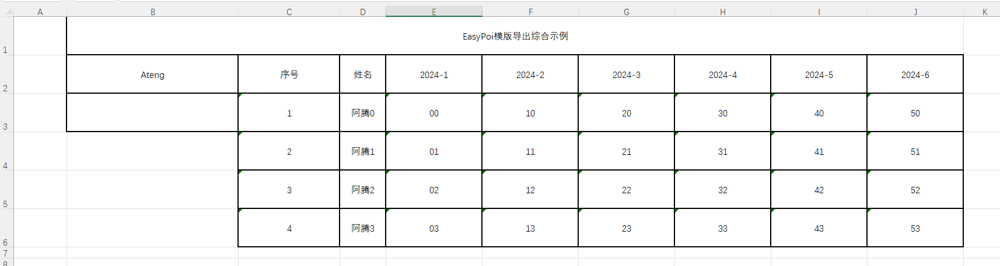


### 模板中图片动态插入（存在BUG！！！）

EasyPOI 中模板图片的本质：

> 模板只是一个变量占位
>  数据中对应字段必须是 `ImageEntity` 对象
>  EasyPOI 在渲染阶段将图片写入 Excel 单元格

**模板语法**

普通变量：

```
{{photo}}
```

列表变量：

```
序号	姓名	头像
{{ $fe:list &INDEX&	t.name	t.photo }}
```

图片字段与普通字段没有任何区别，只是值类型不同。

| 参数           | 示例值              | 类型     | 说明                                                         | 企业级建议                   |
| -------------- | ------------------- | -------- | ------------------------------------------------------------ | ---------------------------- |
| `data`         | `imageBytes`        | `byte[]` | 图片二进制数据，最稳定的输入方式                             | 强烈推荐统一使用 `byte[]`    |
| `type`         | `ImageEntity.Data`  | `String` | 图片来源类型：`Data` 表示使用 byte[]，`URL` 表示使用网络/本地路径 | 模板导出一律用 `Data`        |
| `width`        | `800`               | `int`    | 图片在 Excel 中的显示宽度（单位：像素近似）                  | 不宜过大，一般 60~150 已够用 |
| `height`       | `800`               | `int`    | 图片在 Excel 中的显示高度（单位：像素近似）                  | 和 width 保持比例，避免拉伸  |
| `rowspan`      | `4`                 | `int`    | 图片纵向占用的行数                                           | 需要配合 Excel 行高          |
| `colspan`      | `4`                 | `int`    | 图片横向占用的列数                                           | 需要配合 Excel 列宽          |
| `locationType` | `ImageEntity.EMBED` | `int`    | 图片定位方式：<br>• `EMBED`：嵌入单元格（随单元格移动）<br>• `ABOVE`：浮于单元格上方<br>• `BEHIND`：浮于单元格下方 | Excel 报表场景统一用 `EMBED` |

---

#### 单张图片插入（普通变量）

**创建模板**

```
src
 └─ main
    └─ resources
       └─ doc
          └─ user_image_template.xlsx
```

**模板内容**

```
姓名	头像
{{name}}	{{photo}}
```

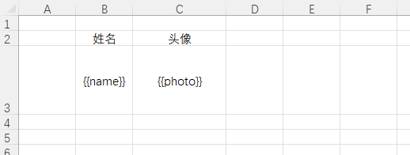

---

**使用示例**

- `image.setWidth(0);` 和 `image.setHeight(0);` 设置了没有作用
- `image.setRowspan(2);` 和 `image.setColspan(2);` 必须得设置，4.5版本的BUG，详情参考 [博客](https://blog.csdn.net/m0_71008260/article/details/133314850) ，如要解决这个问题可以降低版本为4.2。
- 设置了这两个参数后会导致单元格合并。

```java
    @Test
    void testTemplateImage() {
        Map<String, Object> data = new HashMap<>();
        data.put("name", "Ateng");

        byte[] imageBytes = HttpUtil.downloadBytes("https://placehold.co/100x100/png");

        ImageEntity image = new ImageEntity();
        image.setData(imageBytes);
        image.setType(ImageEntity.Data);
        // 设置宽高
        image.setWidth(0);
        image.setHeight(0);
        image.setRowspan(2);
        image.setColspan(2);
        image.setLocationType(ImageEntity.EMBED);

        data.put("photo", image);

        Workbook workbook = ExcelUtil.exportExcelByTemplate(
                "doc/user_image_template.xlsx",
                data
        );

        ExcelUtil.write(
                workbook,
                Paths.get("target/template_export_image.xlsx")
        );

        System.out.println("模板图片插入成功");
    }
```

---

**使用 URL 方式插入图片**

```java
ImageEntity image = new ImageEntity();
image.setUrl("https://xxx.com/avatar.png");
image.setType(ImageEntity.URL);
image.setWidth(120);
image.setHeight(120);
image.setRowspan(4);
image.setColspan(2);
```


---

#### 列表图片插入（$fe 中使用）

**创建模板**

```
src
 └─ main
    └─ resources
       └─ doc
          └─ user_list_image_template.xlsx
```

**模板**

```
序号	姓名	头像
{{ $fe:list &INDEX&	t.name	t.photo }}
```

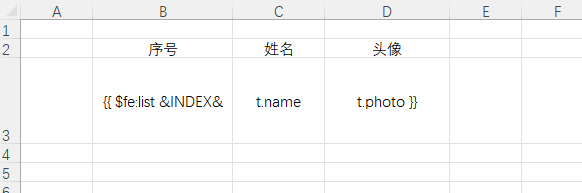

---

**使用示例**

- 因为 BUG ，上一章节单张图片导出都有问题，这个列表导出肯定也不行
- `image.setRowspan();` 和 `image.setColspan(x);` 设置为2就会报错：Cannot add merged region D4:E5 to sheet because it overlaps with an existing merged region (D3:E4).
- `image.setRowspan();` 和 `image.setColspan(x);` 设置为1图片就不展示

```java
    @Test
    void testTemplateListImage() {

        List<Map<String, Object>> list = new ArrayList<>();

        for (int i = 1; i <= 5; i++) {
            Map<String, Object> row = new HashMap<>();
            row.put("name", "User-" + i);

            byte[] imageBytes = HttpUtil.downloadBytes("https://placehold.co/100x100/png");

            ImageEntity image = new ImageEntity();
            image.setData(imageBytes);
            image.setType(ImageEntity.Data);
            image.setWidth(0);
            image.setHeight(0);
            image.setRowspan(2);
            image.setColspan(2);
            image.setLocationType(ImageEntity.EMBED);

            row.put("photo", image);
            list.add(row);
        }

        Map<String, Object> data = new HashMap<>();
        data.put("list", list);

        Workbook workbook = ExcelUtil.exportExcelByTemplate(
                "doc/user_list_image_template.xlsx",
                data
        );

        ExcelUtil.write(
                workbook,
                Paths.get("target/template_export_list_image.xlsx")
        );

        System.out.println("列表模板图片插入成功");
    }
```

---


## 导入 Excel（Impot）

`ImportParams` 常用配置

| 参数名            | 默认值 | 作用说明                                   | 典型使用场景                   |
| ----------------- | ------ | ------------------------------------------ | ------------------------------ |
| `titleRows`       | 0      | Excel 中标题说明行数（非表头）             | 模板第一行是“导入说明”时设为 1 |
| `headRows`        | 1      | Excel 表头行数                             | 基本固定为 1                   |
| `startSheetIndex` | 0      | 从第几个 Sheet 开始读取                    | 多 Sheet 文件读取指定页        |
| `sheetNum`        | 1      | 读取 Sheet 数量                            | 一个文件多张表一起导入         |
| `needVerify`      | false  | 是否开启校验（Validation + VerifyHandler） | 导入必须校验时开启             |
| `verifyHandler`   | null   | 自定义业务校验处理器                       | 跨字段、复杂规则校验           |
| `ignoreEmptyRow`  | false  | 是否忽略物理空行                           | 防止空行导致导入失败           |
| `importFields`    | null   | 校验 Excel 是否为合法模板                  | 防止用户乱传 Excel             |
| `needCheckOrder`  | false  | 是否校验列顺序                             | 强约束模板格式时使用           |

### 基础数据导入

#### 实体类

**Excel 文件**

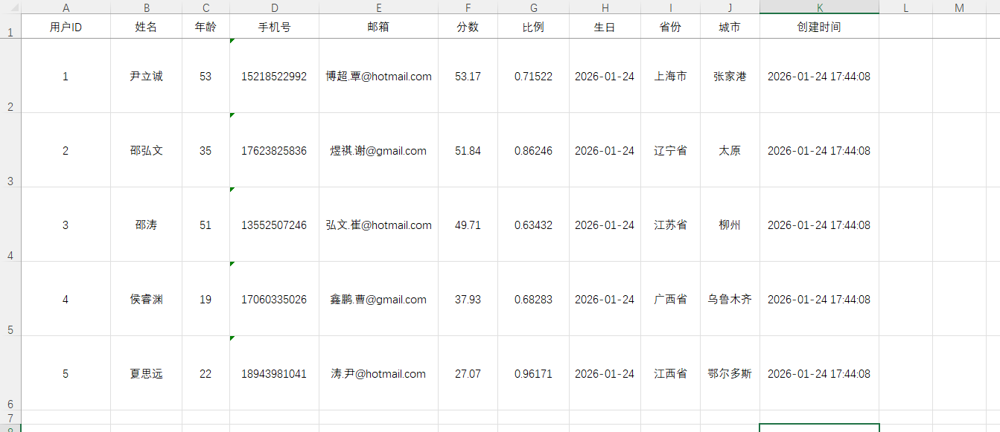

**实体类**

```java
@Data
@Builder
@NoArgsConstructor
@AllArgsConstructor
public class MyUser implements Serializable {

    private static final long serialVersionUID = 1L;

    /**
     * 主键id
     */
    @Excel(name = "用户ID", width = 15, type = 10, orderNum = "1")
    private Long id;

    /**
     * 名称
     */
    @Excel(name = "姓名", width = 12, orderNum = "2")
    private String name;

    /**
     * 年龄
     */
    @Excel(name = "年龄", width = 8, type = 10, orderNum = "3")
    private Integer age;

    /**
     * 手机号码
     */
    @Excel(name = "手机号", width = 15, orderNum = "4")
    private String phoneNumber;

    /**
     * 邮箱
     */
    @Excel(name = "邮箱", width = 20, orderNum = "5")
    private String email;

    /**
     * 分数
     */
    @Excel(name = "分数", width = 10, type = 10, format = "#,##0.00", orderNum = "6")
    private BigDecimal score;

    /**
     * 比例
     */
    @Excel(name = "比例", width = 12, type = 10, format = "0.00000%", orderNum = "7")
    private Double ratio;

    /**
     * 生日
     */
    @Excel(name = "生日", width = 12, format = "yyyy-MM-dd", orderNum = "8")
    private LocalDate birthday;

    /**
     * 所在省份
     */
    @Excel(name = "省份", width = 10, orderNum = "9")
    private String province;

    /**
     * 所在城市
     */
    @Excel(name = "城市", width = 10, orderNum = "10")
    private String city;

    /**
     * 创建时间
     */
    @Excel(name = "创建时间", width = 20, format = "yyyy-MM-dd HH:mm:ss", orderNum = "11")
    private LocalDateTime createTime;

}
```

**使用示例**

```java
    @Test
    public void testSimpleImport() {
        List<MyUser> list = ExcelUtil.importExcelFromClasspath("doc/import_simple_users.xlsx", MyUser.class);
        System.out.println("导入成功！数据: " + list);
    }
```

> 输出：
>
> 导入成功！数据: [MyUser(id=1, name=尹立诚, age=53, phoneNumber=15218522992, email=博超.覃@hotmail.com, score=53.17, ratio=0.71522, birthday=2026-01-24, province=上海市, city=张家港, createTime=2026-01-24T17:44:08, image=null, avatarUrl=null, number=null, status=null), MyUser(id=2, name=邵弘文, age=35, phoneNumber=17623825836, email=煜祺.谢@gmail.com, score=51.84, ratio=0.86246, birthday=2026-01-24, province=辽宁省, city=太原, createTime=2026-01-24T17:44:08, image=null, avatarUrl=null, number=null, status=null), MyUser(id=3, name=邵涛, age=51, phoneNumber=13552507246, email=弘文.崔@hotmail.com, score=49.71, ratio=0.63432, birthday=2026-01-24, province=江苏省, city=柳州, createTime=2026-01-24T17:44:08, image=null, avatarUrl=null, number=null, status=null), MyUser(id=4, name=侯睿渊, age=19, phoneNumber=17060335026, email=鑫鹏.曹@gmail.com, score=37.93, ratio=0.68283, birthday=2026-01-24, province=广西省, city=乌鲁木齐, createTime=2026-01-24T17:44:08, image=null, avatarUrl=null, number=null, status=null), MyUser(id=5, name=夏思远, age=22, phoneNumber=18943981041, email=涛.尹@hotmail.com, score=27.07, ratio=0.96171, birthday=2026-01-24, province=江西省, city=鄂尔多斯, createTime=2026-01-24T17:44:08, image=null, avatarUrl=null, number=null, status=null), MyUser(id=6, name=阿腾, age=25, phoneNumber=17623062936, email=2385569970@qq.com, score=100, ratio=1.0, birthday=2000-03-26, province=重庆市, city=重庆市, createTime=2026-01-24T20:09:02, image=null, avatarUrl=null, number=null, status=null)]

#### Map

**使用示例**

```java
    @Test
    public void testSimpleMapImport() {
        List<Map> list = ExcelUtil.importExcelFromClasspath("doc/import_simple_users.xlsx", Map.class);
        System.out.println("导入成功！数据: " + list);
    }
```

> 输出：
>
> 导入成功！数据: [{用户ID=1, 姓名=尹立诚, 年龄=53, 手机号=15218522992, 邮箱=博超.覃@hotmail.com, 分数=53.17, 比例=0.71522, 生日=2026-01-24, 省份=上海市, 城市=张家港, 创建时间=2026-01-24 17:44:08, excelRowNum=2}, {用户ID=2, 姓名=邵弘文, 年龄=35, 手机号=17623825836, 邮箱=煜祺.谢@gmail.com, 分数=51.84, 比例=0.86246, 生日=2026-01-24, 省份=辽宁省, 城市=太原, 创建时间=2026-01-24 17:44:08, excelRowNum=3}, {用户ID=3, 姓名=邵涛, 年龄=51, 手机号=13552507246, 邮箱=弘文.崔@hotmail.com, 分数=49.71, 比例=0.63432, 生日=2026-01-24, 省份=江苏省, 城市=柳州, 创建时间=2026-01-24 17:44:08, excelRowNum=4}, {用户ID=4, 姓名=侯睿渊, 年龄=19, 手机号=17060335026, 邮箱=鑫鹏.曹@gmail.com, 分数=37.93, 比例=0.68283, 生日=2026-01-24, 省份=广西省, 城市=乌鲁木齐, 创建时间=2026-01-24 17:44:08, excelRowNum=5}, {用户ID=5, 姓名=夏思远, 年龄=22, 手机号=18943981041, 邮箱=涛.尹@hotmail.com, 分数=27.07, 比例=0.96171, 生日=2026-01-24, 省份=江西省, 城市=鄂尔多斯, 创建时间=2026-01-24 17:44:08, excelRowNum=6}, {用户ID=6, 姓名=阿腾, 年龄=25, 手机号=1.7623062936E10, 邮箱=2385569970@qq.com, 分数=100, 比例=1, 生日=Sun Mar 26 00:00:00 CST 2000, 省份=重庆市, 城市=重庆市, 创建时间=Sat Jan 24 20:09:02 CST 2026}]


### 图片导入

**注意事项**

- 选择"嵌入"模式，必须选择"浮动"模式

- params.setSaveUrl(savePath) 不生效，只有@Excel上的savePath才生效
- 注解 @Excel(type = 2, savePath = "target/") 设置了才能保存图片到本地指定目录，保存后字段avatarUrl就是文件的本地路径，然后自行处理（上传OSS）
- 无法使用 params.setDataHandler(handler); 来处理图片的数据，只能由框架处理并保存到本地目录

**实体类**

添加图片字段，使用 String 接受保存的本地图片路径

```java
    /**
     * 图片
     */
    @Excel(name = "图片", type = 2, savePath = "target/", width = 15, height = 30, orderNum = "12")
    private String avatarUrl;
```

**使用示例**

```java
    @Test
    public void testSimpleImageImport() {
        List<MyUser> list = ExcelUtil.importExcelFromClasspath("doc/import_simple_image_users.xlsx", MyUser.class);
        System.out.println("导入成功！数据: " + list);
        list.forEach(user -> {
            File file = new File(user.getAvatarUrl());
            System.out.println(StrUtil.format("姓名：{}，文件大小：{}", user.getName(), FileUtil.readBytes(file).length));
            FileUtil.del(file);
        });
    }
```

> 输出：
>
> 导入成功！数据: [MyUser(id=1, name=尹立诚, age=53, phoneNumber=15218522992, email=博超.覃@hotmail.com, score=53.17, ratio=0.71522, birthday=2026-01-24, province=上海市, city=张家港, createTime=2026-01-24T17:44:08, image=null, avatarUrl=target/\pic68665762057.PNG, number=null, status=null), MyUser(id=2, name=邵弘文, age=35, phoneNumber=17623825836, email=煜祺.谢@gmail.com, score=51.84, ratio=0.86246, birthday=2026-01-24, province=辽宁省, city=太原, createTime=2026-01-24T17:44:08, image=null, avatarUrl=target/\pic87054277356.PNG, number=null, status=null), MyUser(id=3, name=邵涛, age=51, phoneNumber=13552507246, email=弘文.崔@hotmail.com, score=49.71, ratio=0.63432, birthday=2026-01-24, province=江苏省, city=柳州, createTime=2026-01-24T17:44:08, image=null, avatarUrl=target/\pic59159638419.PNG, number=null, status=null), MyUser(id=4, name=侯睿渊, age=19, phoneNumber=17060335026, email=鑫鹏.曹@gmail.com, score=37.93, ratio=0.68283, birthday=2026-01-24, province=广西省, city=乌鲁木齐, createTime=2026-01-24T17:44:08, image=null, avatarUrl=target/\pic72187317844.PNG, number=null, status=null), MyUser(id=5, name=夏思远, age=22, phoneNumber=18943981041, email=涛.尹@hotmail.com, score=27.07, ratio=0.96171, birthday=2026-01-24, province=江西省, city=鄂尔多斯, createTime=2026-01-24T17:44:08, image=null, avatarUrl=target/\pic95551744705.PNG, number=null, status=null), MyUser(id=6, name=阿腾, age=25, phoneNumber=17623062936, email=2385569970@qq.com, score=100, ratio=1.0, birthday=2000-03-26, province=重庆市, city=重庆市, createTime=2026-01-24T20:09:02, image=null, avatarUrl=target/\pic45999786444.JPG, number=null, status=null)]
> 姓名：尹立诚，文件大小：1341
> 姓名：邵弘文，文件大小：1341
> 姓名：邵涛，文件大小：1341
> 姓名：侯睿渊，文件大小：1341
> 姓名：夏思远，文件大小：1341
> 姓名：阿腾，文件大小：14913


### 数据映射

#### replace

**实体类定义**

注意：`replace` 数组格式必须是："显示值_实际值"

```
    // 1→青年 2→中年 3→老年
    @Excel(name = "年龄段", replace = {"青年_1", "中年_2", "老年_3"})
    private Integer number;
```

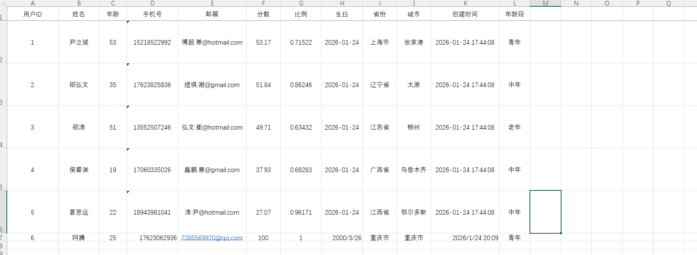

**使用方法**

```java
    @Test
    public void testSimpleReplaceImport() {
        List<MyUser> list = ExcelUtil.importExcelFromClasspath("doc/import_simple_replace_users.xlsx", MyUser.class);
        System.out.println("导入成功！数据: " + list);
    }
```

> 输出：
>
> 导入成功！数据: [MyUser(id=1, name=尹立诚, age=53, phoneNumber=15218522992, email=博超.覃@hotmail.com, score=53.17, ratio=0.71522, birthday=2026-01-24, province=上海市, city=张家港, createTime=2026-01-24T17:44:08, image=null, avatarUrl=null, number=1, status=null), MyUser(id=2, name=邵弘文, age=35, phoneNumber=17623825836, email=煜祺.谢@gmail.com, score=51.84, ratio=0.86246, birthday=2026-01-24, province=辽宁省, city=太原, createTime=2026-01-24T17:44:08, image=null, avatarUrl=null, number=2, status=null), MyUser(id=3, name=邵涛, age=51, phoneNumber=13552507246, email=弘文.崔@hotmail.com, score=49.71, ratio=0.63432, birthday=2026-01-24, province=江苏省, city=柳州, createTime=2026-01-24T17:44:08, image=null, avatarUrl=null, number=3, status=null), MyUser(id=4, name=侯睿渊, age=19, phoneNumber=17060335026, email=鑫鹏.曹@gmail.com, score=37.93, ratio=0.68283, birthday=2026-01-24, province=广西省, city=乌鲁木齐, createTime=2026-01-24T17:44:08, image=null, avatarUrl=null, number=2, status=null), MyUser(id=5, name=夏思远, age=22, phoneNumber=18943981041, email=涛.尹@hotmail.com, score=27.07, ratio=0.96171, birthday=2026-01-24, province=江西省, city=鄂尔多斯, createTime=2026-01-24T17:44:08, image=null, avatarUrl=null, number=2, status=null), MyUser(id=6, name=阿腾, age=25, phoneNumber=17623062936, email=2385569970@qq.com, score=100, ratio=1.0, birthday=2000-03-26, province=重庆市, city=重庆市, createTime=2026-01-24T20:09:02, image=null, avatarUrl=null, number=1, status=null)]


#### 枚举

**创建枚举**

```java
package io.github.atengk.enums;

public enum UserStatus {
    NORMAL(0, "正常"),
    FROZEN(1, "冻结"),
    DELETED(2, "已删除");

    private final int code;
    private final String name;

    UserStatus(int code, String name) {
        this.code = code;
        this.name = name;
    }

    public int getCode() {
        return code;
    }

    public String getName() {
        return name;
    }

    /**
     * 根据 code 获取 name
     */
    public static String getNameByCode(int code) {
        for (UserStatus status : values()) {
            if (status.code == code) {
                return status.name;
            }
        }
        return null;
    }

    /**
     * 根据 name 获取枚举
     */
    public static UserStatus getByName(String name) {
        for (UserStatus status : values()) {
            if (status.name.equals(name)) {
                return status;
            }
        }
        return null;
    }
}
```

**添加字段**

```java
    /**
     * 用户状态
     * enumExportField: 导出 Excel 显示哪个字段
     * enumImportMethod: 导入 Excel 时通过静态方法将值转换为枚举
     */
    @Excel(name = "状态", enumExportField = "name", enumImportMethod = "getByName")
    private UserStatus status;
```


**使用方法**

```java
    @Test
    public void testSimpleEnumImport() {
        List<MyUser> list = ExcelUtil.importExcelFromClasspath("doc/import_simple_enum_users.xlsx", MyUser.class);
        System.out.println("导入成功！数据: " + list);
    }
```

> 输出：
>
> 导入成功！数据: [MyUser(id=1, name=尹立诚, age=53, phoneNumber=15218522992, email=博超.覃@hotmail.com, score=53.17, ratio=0.71522, birthday=2026-01-24, province=上海市, city=张家港, createTime=2026-01-24T17:44:08, image=null, avatarUrl=null, number=null, status=NORMAL), MyUser(id=2, name=邵弘文, age=35, phoneNumber=17623825836, email=煜祺.谢@gmail.com, score=51.84, ratio=0.86246, birthday=2026-01-24, province=辽宁省, city=太原, createTime=2026-01-24T17:44:08, image=null, avatarUrl=null, number=null, status=FROZEN), MyUser(id=3, name=邵涛, age=51, phoneNumber=13552507246, email=弘文.崔@hotmail.com, score=49.71, ratio=0.63432, birthday=2026-01-24, province=江苏省, city=柳州, createTime=2026-01-24T17:44:08, image=null, avatarUrl=null, number=null, status=DELETED), MyUser(id=4, name=侯睿渊, age=19, phoneNumber=17060335026, email=鑫鹏.曹@gmail.com, score=37.93, ratio=0.68283, birthday=2026-01-24, province=广西省, city=乌鲁木齐, createTime=2026-01-24T17:44:08, image=null, avatarUrl=null, number=null, status=NORMAL), MyUser(id=5, name=夏思远, age=22, phoneNumber=18943981041, email=涛.尹@hotmail.com, score=27.07, ratio=0.96171, birthday=2026-01-24, province=江西省, city=鄂尔多斯, createTime=2026-01-24T17:44:08, image=null, avatarUrl=null, number=null, status=NORMAL), MyUser(id=6, name=阿腾, age=25, phoneNumber=17623062936, email=2385569970@qq.com, score=100, ratio=1.0, birthday=2000-03-26, province=重庆市, city=重庆市, createTime=2026-01-24T20:09:02, image=null, avatarUrl=null, number=null, status=DELETED)]


#### 字典 IExcelDictHandler

**在字段上加字典标识**

重点是 `dict = "ageDict"` ，这个 key 要和 handler 里保持一致。

```
@Excel(name = "年龄段", dict = "ageDict")
private Integer number;
```


**实现 `IExcelDictHandler`**

```java
package io.github.atengk.handler;

import cn.afterturn.easypoi.handler.inter.IExcelDictHandler;

public class NumberDictHandler implements IExcelDictHandler {

    @Override
    public String toName(String dict, Object obj, String name, Object value) {
        if ("ageDict".equals(dict)) {
            if (value == null) {
                return "";
            }
            switch (value.toString()) {
                case "1": return "青年";
                case "2": return "中年";
                case "3": return "老年";
            }
        }
        return null;
    }

    @Override
    public String toValue(String dict, Object obj, String name, Object value) {
        if ("ageDict".equals(dict)) {
            if (value == null) {
                return null;
            }
            switch (value.toString()) {
                case "青年": return "1";
                case "中年": return "2";
                case "老年": return "3";
            }
        }
        return null;
    }
}
```

**使用方法**

```java
    @Test
    public void testSimpleDictImport() {
        List<MyUser> list = ExcelUtil.importExcelFromClasspath(
                "doc/import_simple_dict_users.xlsx",
                MyUser.class,
                params -> params.setDictHandler(new NumberDictHandler())
        );
        System.out.println("导入成功！数据: " + list);
    }
```

> 输出：
>
> 导入成功！数据: [MyUser(id=1, name=尹立诚, age=53, phoneNumber=15218522992, email=博超.覃@hotmail.com, score=53.17, ratio=0.71522, birthday=2026-01-24, province=上海市, city=张家港, createTime=2026-01-24T17:44:08, image=null, avatarUrl=null, number=1, status=null), MyUser(id=2, name=邵弘文, age=35, phoneNumber=17623825836, email=煜祺.谢@gmail.com, score=51.84, ratio=0.86246, birthday=2026-01-24, province=辽宁省, city=太原, createTime=2026-01-24T17:44:08, image=null, avatarUrl=null, number=2, status=null), MyUser(id=3, name=邵涛, age=51, phoneNumber=13552507246, email=弘文.崔@hotmail.com, score=49.71, ratio=0.63432, birthday=2026-01-24, province=江苏省, city=柳州, createTime=2026-01-24T17:44:08, image=null, avatarUrl=null, number=3, status=null), MyUser(id=4, name=侯睿渊, age=19, phoneNumber=17060335026, email=鑫鹏.曹@gmail.com, score=37.93, ratio=0.68283, birthday=2026-01-24, province=广西省, city=乌鲁木齐, createTime=2026-01-24T17:44:08, image=null, avatarUrl=null, number=2, status=null), MyUser(id=5, name=夏思远, age=22, phoneNumber=18943981041, email=涛.尹@hotmail.com, score=27.07, ratio=0.96171, birthday=2026-01-24, province=江西省, city=鄂尔多斯, createTime=2026-01-24T17:44:08, image=null, avatarUrl=null, number=2, status=null), MyUser(id=6, name=阿腾, age=25, phoneNumber=17623062936, email=2385569970@qq.com, score=100, ratio=1.0, birthday=2000-03-26, province=重庆市, city=重庆市, createTime=2026-01-24T20:09:02, image=null, avatarUrl=null, number=1, status=null)]

#### 自定义处理 IExcelDataHandler

**字段配置**

```
@Excel(name = "年龄段")
private Integer number;
```


**实现 `IExcelDataHandler`**

```java
package io.github.atengk.handler;

import cn.afterturn.easypoi.handler.inter.IExcelDataHandler;
import org.apache.poi.ss.usermodel.CreationHelper;
import org.apache.poi.ss.usermodel.Hyperlink;

import java.util.HashMap;
import java.util.Map;

/**
 * number 字段导入导出的自定义处理器
 *
 * 功能：
 * - 导出：1 -> 一号、2 -> 二号、3 -> 三号
 * - 导入：一号 -> 1、二号 -> 2、三号 -> 3
 *
 * 注意点：
 * - 实现 IExcelDataHandler 全部方法
 */
public class NumberDataHandler implements IExcelDataHandler<Object> {

    private String[] needHandlerFields;

    /**
     * 字典映射（可改）
     */
    private static final Map<String, String> EXPORT_MAP = new HashMap<>();
    private static final Map<String, String> IMPORT_MAP = new HashMap<>();

    static {
        EXPORT_MAP.put("1", "一号");
        EXPORT_MAP.put("2", "二号");
        EXPORT_MAP.put("3", "三号");

        IMPORT_MAP.put("一号", "1");
        IMPORT_MAP.put("二号", "2");
        IMPORT_MAP.put("三号", "3");
    }

    @Override
    public Object exportHandler(Object obj, String name, Object value) {
        if (!match(name)) {
            return value;
        }
        if (value == null) {
            return null;
        }
        String raw = String.valueOf(value);
        return EXPORT_MAP.getOrDefault(raw, raw);
    }

    @Override
    public Object importHandler(Object obj, String name, Object value) {
        if (!match(name)) {
            return value;
        }
        if (value == null) {
            return null;
        }
        String raw = String.valueOf(value);
        return IMPORT_MAP.getOrDefault(raw, raw);
    }

    @Override
    public String[] getNeedHandlerFields() {
        return needHandlerFields;
    }

    @Override
    public void setNeedHandlerFields(String[] fields) {
        this.needHandlerFields = fields;
    }

    @Override
    public void setMapValue(Map<String, Object> map, String originKey, Object value) {
        if (!match(originKey)) {
            map.put(originKey, value);
            return;
        }

        if (value != null) {
            String raw = String.valueOf(value);
            map.put(originKey, IMPORT_MAP.getOrDefault(raw, raw));
        } else {
            map.put(originKey, null);
        }
    }

    @Override
    public Hyperlink getHyperlink(CreationHelper creationHelper, Object obj, String name, Object value) {
        // 这里通常不用超链接，返回 null 即可
        return null;
    }

    /**
     * 判断字段是否在处理范围
     */
    private boolean match(String name) {
        if (needHandlerFields == null) {
            return false;
        }
        for (String field : needHandlerFields) {
            if (field.equals(name)) {
                return true;
            }
        }
        return false;
    }
}
```

**使用方法**

```java
    @Test
    public void testSimpleHandlerImport() {
        NumberDataHandler handler = new NumberDataHandler();
        // 指定要处理的字段，注意是Excel的字段名（表头）
        handler.setNeedHandlerFields(new String[]{"年龄段"});

        List<MyUser> list = ExcelUtil.importExcelFromClasspath(
                "doc/import_simple_handler_users.xlsx",
                MyUser.class,
                params -> params.setDataHandler(handler)
        );
        System.out.println("导入成功！数据: " + list);
    }
```

> 输出：
>
> 导入成功！数据: [MyUser(id=1, name=尹立诚, age=53, phoneNumber=15218522992, email=博超.覃@hotmail.com, score=53.17, ratio=0.71522, birthday=2026-01-24, province=上海市, city=张家港, createTime=2026-01-24T17:44:08, image=null, avatarUrl=null, number=1, status=null), MyUser(id=2, name=邵弘文, age=35, phoneNumber=17623825836, email=煜祺.谢@gmail.com, score=51.84, ratio=0.86246, birthday=2026-01-24, province=辽宁省, city=太原, createTime=2026-01-24T17:44:08, image=null, avatarUrl=null, number=2, status=null), MyUser(id=3, name=邵涛, age=51, phoneNumber=13552507246, email=弘文.崔@hotmail.com, score=49.71, ratio=0.63432, birthday=2026-01-24, province=江苏省, city=柳州, createTime=2026-01-24T17:44:08, image=null, avatarUrl=null, number=3, status=null), MyUser(id=4, name=侯睿渊, age=19, phoneNumber=17060335026, email=鑫鹏.曹@gmail.com, score=37.93, ratio=0.68283, birthday=2026-01-24, province=广西省, city=乌鲁木齐, createTime=2026-01-24T17:44:08, image=null, avatarUrl=null, number=2, status=null), MyUser(id=5, name=夏思远, age=22, phoneNumber=18943981041, email=涛.尹@hotmail.com, score=27.07, ratio=0.96171, birthday=2026-01-24, province=江西省, city=鄂尔多斯, createTime=2026-01-24T17:44:08, image=null, avatarUrl=null, number=2, status=null), MyUser(id=6, name=阿腾, age=25, phoneNumber=17623062936, email=2385569970@qq.com, score=100, ratio=1.0, birthday=2000-03-26, province=重庆市, city=重庆市, createTime=2026-01-24T20:09:02, image=null, avatarUrl=null, number=1, status=null)]


### 导入错误收集（失败行、失败原因）

#### 基础配置

**添加依赖**

如果是SpringBoot环境直接导入 spring-boot-starter-validation

```xml
        <!-- Hibernate Validator 实现 -->
        <dependency>
            <groupId>org.hibernate.validator</groupId>
            <artifactId>hibernate-validator</artifactId>
            <version>6.2.5.Final</version>
        </dependency>
```

**实体类实现 IExcelModel**

实现 IExcelModel, IExcelDataModel

```java
public class MyUser implements Serializable, IExcelModel, IExcelDataModel {

    @ExcelIgnore
    private String errorMsg;

    /**
     * 获取错误数据
     *
     * @return 错误数据
     */
    @Override
    public String getErrorMsg() {
        return errorMsg;
    }

    /**
     * 设置错误信息
     *
     * @param errorMsg 错误数据
     */
    @Override
    public void setErrorMsg(String errorMsg) {
        this.errorMsg = errorMsg;
    }

    @ExcelIgnore
    private Integer rowNum;

    /**
     * 获取行号
     *
     * @return 数据行号
     */
    @Override
    public Integer getRowNum() {
        return rowNum;
    }

    /**
     * 设置行号
     *
     * @param rowNum 数据行号
     */
    @Override
    public void setRowNum(Integer rowNum) {
        this.rowNum = rowNum;
    }

}
```


#### 使用 Hibernate Validator 效验

**实体添加注解效验**

```java
    /**
     * 名称
     */
    @Excel(name = "姓名", width = 12, orderNum = "2")
    @NotBlank(message = "姓名不能为空")
    private String name;

    /**
     * 年龄
     */
    @Excel(name = "年龄", width = 8, type = 10, orderNum = "3")
    @NotNull(message = "年龄不能为空")
    @Min(value = 0, message = "年龄不能小于 0")
    @Max(value = 120, message = "年龄不能大于 120")
    private Integer age;

    /**
     * 手机号码
     */
    @Excel(name = "手机号", width = 15, orderNum = "4")
    @Pattern(regexp = "^1[3-9]\\d{9}$", message = "手机号格式不正确")
    private String phoneNumber;

    /**
     * 分数
     */
    @Excel(name = "分数", width = 10, type = 10, format = "#,##0.00", orderNum = "6")
    @NotNull(message = "分数不能为空")
    @Min(value = 0, message = "分数不能小于 0")
    @Max(value = 100, message = "分数不能大于 100")
    private BigDecimal score;
```

注意导入的Excel中最后两行故意写错，测试错误收集

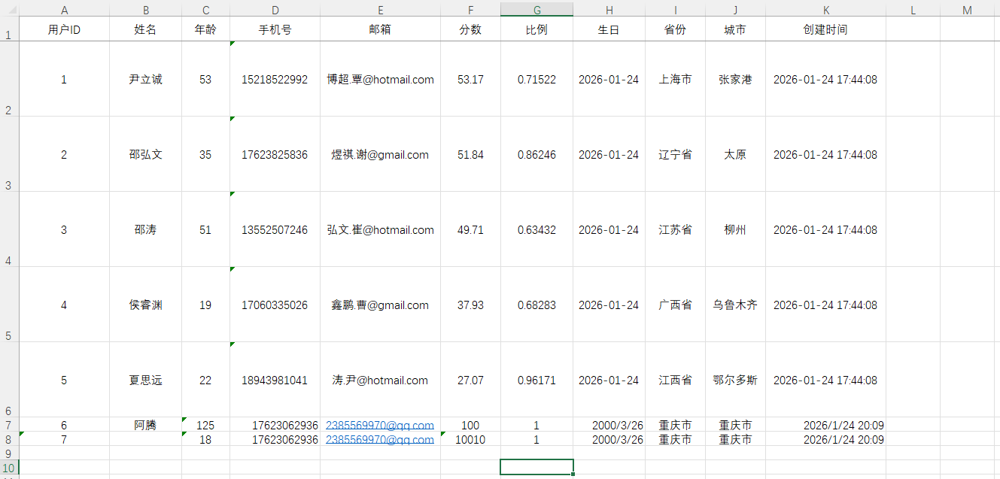

**使用方法**

```java
    @Test
    public void testImportWithHibernateErrorCollect() {
        ExcelImportResult<MyUser> result = ExcelUtil.importExcelMore(
                ExcelUtil.getInputStreamFromClasspath("doc/import_error_users.xlsx"),
                MyUser.class,
                params -> params.setNeedVerify(true)
        );

        System.out.println("是否存在校验失败：" + result.isVerifyFail());
        System.out.println("成功条数：" + result.getList().size());
        System.out.println("成功数据：" + result.getList());
        System.out.println("失败条数：" + result.getFailList().size());
        System.out.println("失败数据：" + result.getFailList());

        // 打印错误数据
        if (result.isVerifyFail() && result.getFailList() != null && !result.getFailList().isEmpty()) {
            result.getFailList().forEach(item -> System.out.println(StrUtil.format("第{}行，错误信息：{}", item.getRowNum(), item.getErrorMsg())));
        }

        // 把成功 Excel 导出来
        if (result.getWorkbook() != null) {
            ExcelUtil.write(result.getWorkbook(), Paths.get("target", "import_success_result.xlsx"));
            System.out.println("成功详情 Excel 已生成：target/import_success_result.xlsx");
        }
        // 把失败 Excel 导出来
        if (result.getFailWorkbook() != null) {
            ExcelUtil.write(result.getFailWorkbook(), Paths.get("target", "import_error_result.xlsx"));
            System.out.println("失败详情 Excel 已生成：target/import_error_result.xlsx");
        }
    }
```

> 输出：
>
> 是否存在校验失败：true
> 成功条数：5
> 成功数据：[MyUser(id=1, name=尹立诚, age=53, phoneNumber=15218522992, email=博超.覃@hotmail.com, score=53.17, ratio=0.71522, birthday=2026-01-24, province=上海市, city=张家港, createTime=2026-01-24T17:44:08, image=null, avatarUrl=null, number=null, status=null, errorMsg=null, rowNum=1), MyUser(id=2, name=邵弘文, age=35, phoneNumber=17623825836, email=煜祺.谢@gmail.com, score=51.84, ratio=0.86246, birthday=2026-01-24, province=辽宁省, city=太原, createTime=2026-01-24T17:44:08, image=null, avatarUrl=null, number=null, status=null, errorMsg=null, rowNum=2), MyUser(id=3, name=邵涛, age=51, phoneNumber=13552507246, email=弘文.崔@hotmail.com, score=49.71, ratio=0.63432, birthday=2026-01-24, province=江苏省, city=柳州, createTime=2026-01-24T17:44:08, image=null, avatarUrl=null, number=null, status=null, errorMsg=null, rowNum=3), MyUser(id=4, name=侯睿渊, age=19, phoneNumber=17060335026, email=鑫鹏.曹@gmail.com, score=37.93, ratio=0.68283, birthday=2026-01-24, province=广西省, city=乌鲁木齐, createTime=2026-01-24T17:44:08, image=null, avatarUrl=null, number=null, status=null, errorMsg=null, rowNum=4), MyUser(id=5, name=夏思远, age=22, phoneNumber=18943981041, email=涛.尹@hotmail.com, score=27.07, ratio=0.96171, birthday=2026-01-24, province=江西省, city=鄂尔多斯, createTime=2026-01-24T17:44:08, image=null, avatarUrl=null, number=null, status=null, errorMsg=null, rowNum=5)]
> 失败条数：2
> 失败数据：[MyUser(id=6, name=阿腾, age=125, phoneNumber=17623062936, email=2385569970@qq.com, score=100, ratio=1.0, birthday=2000-03-26, province=重庆市, city=重庆市, createTime=2026-01-24T20:09:02, image=null, avatarUrl=null, number=null, status=null, errorMsg=年龄年龄不能大于 120, rowNum=6), MyUser(id=7, name=null, age=18, phoneNumber=17623062936, email=2385569970@qq.com, score=10010, ratio=1.0, birthday=2000-03-26, province=重庆市, city=重庆市, createTime=2026-01-24T20:09:02, image=null, avatarUrl=null, number=null, status=null, errorMsg=分数分数不能大于 100,姓名姓名不能为空, rowNum=7)]
> 第6行，错误信息：年龄年龄不能大于 120
> 第7行，错误信息：分数分数不能大于 100,姓名姓名不能为空
> 失败详情 Excel 已生成：target/import_error_result.xlsx
> 失败详情 Excel 已生成：target/import_error_result.xlsx

成功 Excel


失败 Excel


#### 校验处理器 IExcelVerifyHandler

**编写校验处理器 IExcelVerifyHandler**

```java
package io.github.atengk.handler;

import cn.afterturn.easypoi.excel.entity.result.ExcelVerifyHandlerResult;
import cn.afterturn.easypoi.handler.inter.IExcelVerifyHandler;
import cn.hutool.core.util.StrUtil;
import io.github.atengk.entity.MyUser;

import java.math.BigDecimal;

public class MyUserVerifyHandler implements IExcelVerifyHandler<MyUser> {

    @Override
    public ExcelVerifyHandlerResult verifyHandler(MyUser user) {

        // 1. 姓名必填
        if (StrUtil.isBlank(user.getName())) {
            return new ExcelVerifyHandlerResult(false, "姓名不能为空");
        }

        // 2. 年龄范围
        if (user.getAge() == null || user.getAge() < 0 || user.getAge() > 120) {
            return new ExcelVerifyHandlerResult(false, "年龄必须在 0~120 之间");
        }

        // 3. 手机号格式
        if (!StrUtil.isBlank(user.getPhoneNumber())
                && !user.getPhoneNumber().matches("^1[3-9]\\d{9}$")) {
            return new ExcelVerifyHandlerResult(false, "手机号格式不正确");
        }

        // 4. 分数范围
        if (user.getScore() != null && user.getScore().compareTo(new BigDecimal("100")) > 0) {
            return new ExcelVerifyHandlerResult(false, "分数不能大于 100");
        }

        return new ExcelVerifyHandlerResult(true);
    }
}
```

注意导入的Excel中最后两行故意写错，测试错误收集


**使用方法**

配置了 `params.setVerifyHandler(new MyUserVerifyHandler());` 就不会走 Hibernate Validator 效验

```java
    @Test
    public void testImportWithErrorCollect() {
        ExcelImportResult<MyUser> result = ExcelUtil.importExcelMore(
                ExcelUtil.getInputStreamFromClasspath("doc/import_error_users.xlsx"),
                MyUser.class,
                params -> {
                    params.setNeedVerify(true);
                    params.setVerifyHandler(new MyUserVerifyHandler());
                }
        );

        System.out.println("是否存在校验失败：" + result.isVerifyFail());
        System.out.println("成功条数：" + result.getList().size());
        System.out.println("成功数据：" + result.getList());
        System.out.println("失败条数：" + result.getFailList().size());
        System.out.println("失败数据：" + result.getFailList());

        // 打印错误数据
        if (result.isVerifyFail() && result.getFailList() != null && !result.getFailList().isEmpty()) {
            result.getFailList().forEach(item -> System.out.println(StrUtil.format("第{}行，错误信息：{}", item.getRowNum(), item.getErrorMsg())));
        }

        // 把成功 Excel 导出来
        if (result.getWorkbook() != null) {
            ExcelUtil.write(result.getWorkbook(), Paths.get("target", "import_success_result.xlsx"));
            System.out.println("成功详情 Excel 已生成：target/import_success_result.xlsx");
        }
        // 把失败 Excel 导出来
        if (result.getFailWorkbook() != null) {
            ExcelUtil.write(result.getFailWorkbook(), Paths.get("target", "import_error_result.xlsx"));
            System.out.println("失败详情 Excel 已生成：target/import_error_result.xlsx");
        }
    }
```

> 输出：
>
> 是否存在校验失败：true
> 成功条数：5
> 成功数据：[MyUser(id=1, name=尹立诚, age=53, phoneNumber=15218522992, email=博超.覃@hotmail.com, score=53.17, ratio=0.71522, birthday=2026-01-24, province=上海市, city=张家港, createTime=2026-01-24T17:44:08, image=null, avatarUrl=null, number=null, status=null, errorMsg=null, rowNum=1), MyUser(id=2, name=邵弘文, age=35, phoneNumber=17623825836, email=煜祺.谢@gmail.com, score=51.84, ratio=0.86246, birthday=2026-01-24, province=辽宁省, city=太原, createTime=2026-01-24T17:44:08, image=null, avatarUrl=null, number=null, status=null, errorMsg=null, rowNum=2), MyUser(id=3, name=邵涛, age=51, phoneNumber=13552507246, email=弘文.崔@hotmail.com, score=49.71, ratio=0.63432, birthday=2026-01-24, province=江苏省, city=柳州, createTime=2026-01-24T17:44:08, image=null, avatarUrl=null, number=null, status=null, errorMsg=null, rowNum=3), MyUser(id=4, name=侯睿渊, age=19, phoneNumber=17060335026, email=鑫鹏.曹@gmail.com, score=37.93, ratio=0.68283, birthday=2026-01-24, province=广西省, city=乌鲁木齐, createTime=2026-01-24T17:44:08, image=null, avatarUrl=null, number=null, status=null, errorMsg=null, rowNum=4), MyUser(id=5, name=夏思远, age=22, phoneNumber=18943981041, email=涛.尹@hotmail.com, score=27.07, ratio=0.96171, birthday=2026-01-24, province=江西省, city=鄂尔多斯, createTime=2026-01-24T17:44:08, image=null, avatarUrl=null, number=null, status=null, errorMsg=null, rowNum=5)]
> 失败条数：2
> 失败数据：[MyUser(id=6, name=阿腾, age=125, phoneNumber=17623062936, email=2385569970@qq.com, score=100, ratio=1.0, birthday=2000-03-26, province=重庆市, city=重庆市, createTime=2026-01-24T20:09:02, image=null, avatarUrl=null, number=null, status=null, errorMsg=年龄年龄不能大于 120,年龄必须在 0~120 之间, rowNum=6), MyUser(id=7, name=null, age=18, phoneNumber=17623062936, email=2385569970@qq.com, score=10010, ratio=1.0, birthday=2000-03-26, province=重庆市, city=重庆市, createTime=2026-01-24T20:09:02, image=null, avatarUrl=null, number=null, status=null, errorMsg=姓名姓名不能为空,分数分数不能大于 100,姓名不能为空, rowNum=7)]
> 第6行，错误信息：年龄年龄不能大于 120,年龄必须在 0~120 之间
> 第7行，错误信息：姓名姓名不能为空,分数分数不能大于 100,姓名不能为空
> 成功详情 Excel 已生成：target/import_success_result.xlsx
> 失败详情 Excel 已生成：target/import_error_result.xlsx

成功 Excel

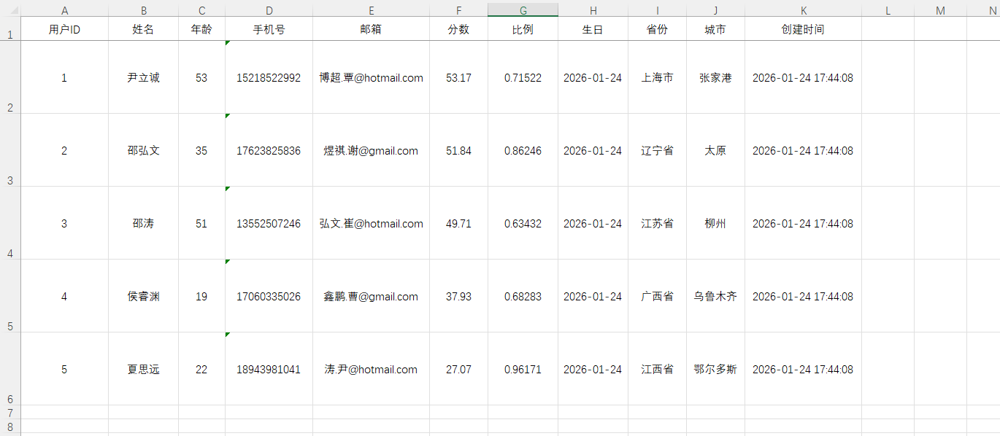

失败 Excel

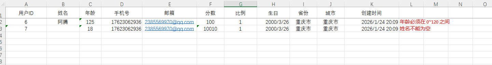

### 多线程导入

**使用方法**

```java
    @Test
    public void testImportWithMultiThread() {
        List<MyUser> list = ExcelUtil.importExcelFromClasspath(
                "doc/import_simple_users.xlsx",
                MyUser.class,
                params -> {
                    /**
                     * 开启多线程
                     */
                    params.setConcurrentTask(true);
                    /**
                     * 每个并发任务处理多少条数据
                     * 默认 1000，建议 500 ~ 2000
                     */
                    params.setCritical(500);
                }
        );
        System.out.println("导入成功！数据: " + list);
    }
```

### 多 Sheet 导入

#### 读取多个连续 Sheet

准备一个多 Sheet 的数据，但是每个 Sheet 的数据格式都是一样的。前3个 Sheet 有7条数据。


**使用示例**

```java
    @Test
    public void testImportMultipleSheet1() {
        List<MyUser> list = ExcelUtil.importExcelFromClasspath(
                "doc/import_multi_sheet_users.xlsx",
                MyUser.class,
                params -> {
                    // 表头行数,默认1
                    params.setHeadRows(2);
                    // 开始读取的sheet位置,默认为0
                    params.setStartSheetIndex(0);
                    // 上传表格需要读取的sheet 数量,默认为1
                    params.setSheetNum(3);
                }
        );
        System.out.println("导入成功！数据条数: " + list.size());
        System.out.println("导入成功！数据: " + list);
    }
```

> 输出：
>
> 导入成功！数据条数: 7
> 导入成功！数据: [MyUser(id=null, name=马俊驰, age=80, phoneNumber=15184764540, email=明杰.邓@gmail.com, score=90.7, ratio=0.34432, birthday=2026-01-25, province=湖北省, city=潮州, createTime=2026-01-25T07:55:09, image=null, avatarUrl=null, number=null, status=null, errorMsg=null, rowNum=2), MyUser(id=null, name=曹炫明, age=14, phoneNumber=15862470324, email=鹏.邹@yahoo.com, score=18.54, ratio=0.44461, birthday=2026-01-25, province=湖北省, city=天津, createTime=2026-01-25T07:55:09, image=null, avatarUrl=null, number=null, status=null, errorMsg=null, rowNum=3), MyUser(id=null, name=林哲瀚, age=78, phoneNumber=15830651507, email=明.郝@yahoo.com, score=30.8, ratio=0.58629, birthday=2026-01-25, province=新疆, city=银川, createTime=2026-01-25T07:55:09, image=null, avatarUrl=null, number=null, status=null, errorMsg=null, rowNum=2), MyUser(id=null, name=韩鹏飞, age=27, phoneNumber=14789970992, email=思.张@gmail.com, score=84.45, ratio=0.67831, birthday=2026-01-25, province=新疆, city=汕头, createTime=2026-01-25T07:55:09, image=null, avatarUrl=null, number=null, status=null, errorMsg=null, rowNum=3), MyUser(id=null, name=萧晟睿, age=62, phoneNumber=15099272259, email=煜城.薛@hotmail.com, score=11.78, ratio=0.45664, birthday=2026-01-25, province=河南省, city=常德, createTime=2026-01-25T07:55:09, image=null, avatarUrl=null, number=null, status=null, errorMsg=null, rowNum=2), MyUser(id=null, name=邓思淼, age=19, phoneNumber=15194415536, email=懿轩.高@yahoo.com, score=84.7, ratio=0.81993, birthday=2026-01-25, province=河南省, city=三门峡, createTime=2026-01-25T07:55:09, image=null, avatarUrl=null, number=null, status=null, errorMsg=null, rowNum=3), MyUser(id=null, name=赵明, age=12, phoneNumber=15521006147, email=锦程.韦@hotmail.com, score=79.37, ratio=0.16474, birthday=2026-01-25, province=河南省, city=常德, createTime=2026-01-25T07:55:09, image=null, avatarUrl=null, number=null, status=null, errorMsg=null, rowNum=4)]

#### 多 Sheet，多实体

准备一个多 Sheet 的数据，但是每个 Sheet 的数据格式都是不一样的。


**使用方法**

```java
    @Test
    public void testImportMultipleSheet2() {
        String classPathExcel = "doc/import_multi_sheet.xlsx";
        // 用户列表
        List<MyUser> userList = ExcelUtil.importExcelFromClasspath(
                classPathExcel,
                MyUser.class,
                params -> params.setSheetName("用户列表")
        );
        System.out.println("导入成功！用户列表: " + userList);
        // 学生列表
        List<Student> studentList = ExcelUtil.importExcelFromClasspath(
                classPathExcel,
                Student.class,
                params -> params.setSheetName("学生列表")
        );
        System.out.println("导入成功！学生列表: " + studentList);
    }
```

> 输出：
>
> 导入成功！用户列表: [MyUser(id=1, name=尹立诚, age=53, phoneNumber=15218522992, email=博超.覃@hotmail.com, score=53.17, ratio=0.71522, birthday=2026-01-24, province=上海市, city=张家港, createTime=2026-01-24T17:44:08, image=null, avatarUrl=null, number=null, status=null, errorMsg=null, rowNum=1), MyUser(id=2, name=邵弘文, age=35, phoneNumber=17623825836, email=煜祺.谢@gmail.com, score=51.84, ratio=0.86246, birthday=2026-01-24, province=辽宁省, city=太原, createTime=2026-01-24T17:44:08, image=null, avatarUrl=null, number=null, status=null, errorMsg=null, rowNum=2), MyUser(id=3, name=邵涛, age=51, phoneNumber=13552507246, email=弘文.崔@hotmail.com, score=49.71, ratio=0.63432, birthday=2026-01-24, province=江苏省, city=柳州, createTime=2026-01-24T17:44:08, image=null, avatarUrl=null, number=null, status=null, errorMsg=null, rowNum=3), MyUser(id=4, name=侯睿渊, age=19, phoneNumber=17060335026, email=鑫鹏.曹@gmail.com, score=37.93, ratio=0.68283, birthday=2026-01-24, province=广西省, city=乌鲁木齐, createTime=2026-01-24T17:44:08, image=null, avatarUrl=null, number=null, status=null, errorMsg=null, rowNum=4), MyUser(id=5, name=夏思远, age=22, phoneNumber=18943981041, email=涛.尹@hotmail.com, score=27.07, ratio=0.96171, birthday=2026-01-24, province=江西省, city=鄂尔多斯, createTime=2026-01-24T17:44:08, image=null, avatarUrl=null, number=null, status=null, errorMsg=null, rowNum=5), MyUser(id=6, name=阿腾, age=25, phoneNumber=17623062936, email=2385569970@qq.com, score=100, ratio=1.0, birthday=2000-03-26, province=重庆市, city=重庆市, createTime=2026-01-24T20:09:02, image=null, avatarUrl=null, number=null, status=null, errorMsg=null, rowNum=6)]
> ...
> 导入成功！学生列表: [Student(name=马俊驰, age=80), Student(name=曹炫明, age=14), Student(name=冯峻熙, age=78), Student(name=孙致远, age=3), Student(name=余天磊, age=2), Student(name=莫金鑫, age=6), Student(name=姜锦程, age=90), Student(name=阿腾, age=25)]


### 导入获取Key-Value

EasyPoi 的 Key-Value 导入不是“Excel 表格导入”，
 而是“基于 Excel 的配置文件解析器”，
 `titleRows` = 扫描深度，而不是表头行数。

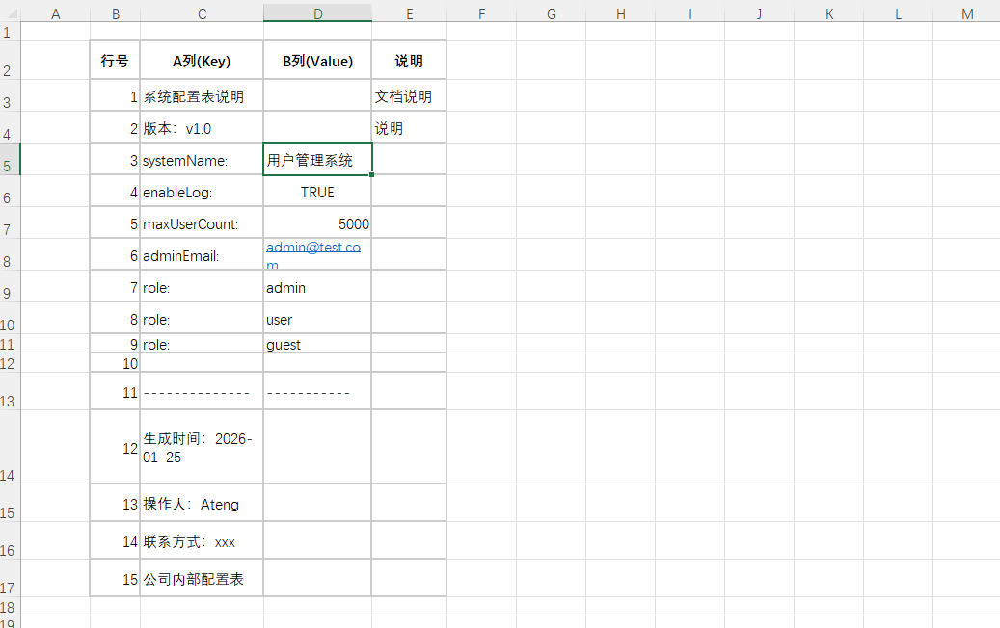

**使用方法**

```java
    @Test
    public void testImportKeyValue() {
        ExcelImportResult<Map> result = ExcelUtil.importExcelMore(
                ExcelUtil.getInputStreamFromClasspath("doc/import_key_value.xlsx"),
                Map.class,
                params -> {
                    params.setSheetName("配置区");
                    params.setKeyMark(":");
                    params.setReadSingleCell(true);
                    // 从第 0 行开始，最多向下扫描 titleRows 行
                    params.setTitleRows(10);
                }
        );
        System.out.println(result.getMap());
    }
```

> 输出：
>
> {systemName:=用户管理系统, maxUserCount:=5000.0, enableLog:=true, adminEmail:=admin@test.com, role:=[admin, user, guest]}


## Word 模版导出

模版指令和 Excel 的一样的

### 创建工具类

**创建 WordUtil 工具类**

```java
package io.github.atengk.util;

import cn.afterturn.easypoi.word.entity.MyXWPFDocument;
import cn.afterturn.easypoi.word.parse.ParseWord07;
import org.apache.poi.xwpf.usermodel.XWPFDocument;

import javax.servlet.http.HttpServletResponse;
import java.io.*;
import java.nio.file.Files;
import java.nio.file.Path;
import java.nio.file.Paths;
import java.util.Map;

/**
 * Word 模板填充工具
 *
 * @author 孔余
 * @since 2026-01-22
 */
public final class WordUtil {

    private static final String DOCX_CONTENT_TYPE =
            "application/vnd.openxmlformats-officedocument.wordprocessingml.document";

    private WordUtil() {
        // 工具类不允许实例化
    }

    /**
     * 将 InputStream 转为 MyXWPFDocument，并填充 Map 数据。
     *
     * @param inputStream Word 模板输入流（必须为 docx）
     * @param map         数据模型
     */
    public static XWPFDocument export(InputStream inputStream, Map<String, Object> map) {
        if (inputStream == null) {
            throw new IllegalArgumentException("模板输入流不能为空");
        }
        if (map == null) {
            throw new IllegalArgumentException("数据模型 Map 不能为空");
        }

        try {
            // 按你要求这里必须是 MyXWPFDocument
            XWPFDocument document = new MyXWPFDocument(inputStream);

            // 调用 EasyPoi 填充
            new ParseWord07().parseWord(document, map);

            return document;
        } catch (Exception e) {
            throw new RuntimeException("Word 模板填充失败：" + e.getMessage(), e);
        }
    }

    /**
     * 将文档写入到指定文件路径。
     *
     * <p>内部委托给 {@link #write(XWPFDocument, Path)} 保证逻辑统一。</p>
     *
     * @param document Word 文档对象（不能为空）
     * @param target   文件路径字符串（不能为空、非空白）
     * @throws IllegalArgumentException 参数为空或路径非法时抛出
     * @throws RuntimeException         写入失败时抛出
     */
    public static void write(XWPFDocument document, String target) {
        validateDocument(document);
        if (target == null || target.trim().isEmpty()) {
            throw new IllegalArgumentException("输出路径 String target 不能为空或空白");
        }

        try {
            write(document, Paths.get(target));
        } catch (Exception e) {
            throw new RuntimeException("Word 文档写入 String 路径失败：" + target, e);
        }
    }

    /**
     * 将文档写入到指定文件。
     *
     * @param document  Word 文档对象（不能为空）
     * @param target    输出目标文件对象（不能为空）
     * @throws IllegalArgumentException 参数为空时抛出
     * @throws RuntimeException         写入失败时抛出
     */
    public static void write(XWPFDocument document, File target) {
        validateDocument(document);
        if (target == null) {
            throw new IllegalArgumentException("输出目标 File 不能为空");
        }

        try (OutputStream os = new FileOutputStream(target)) {
            document.write(os);
        } catch (IOException e) {
            throw new RuntimeException("Word 文档写入文件失败：" + target.getAbsolutePath(), e);
        }
    }

    /**
     * 将文档写入到指定路径。
     *
     * @param document  Word 文档对象（不能为空）
     * @param path      输出路径（不能为空）
     * @throws IllegalArgumentException 参数为空时抛出
     * @throws RuntimeException         写入失败时抛出
     */
    public static void write(XWPFDocument document, Path path) {
        validateDocument(document);
        if (path == null) {
            throw new IllegalArgumentException("输出目标 Path 不能为空");
        }

        try (OutputStream os = Files.newOutputStream(path)) {
            document.write(os);
        } catch (IOException e) {
            throw new RuntimeException("Word 文档写入路径失败：" + path.toAbsolutePath(), e);
        }
    }

    /**
     * 将文档写入到指定输出流。
     *
     * <p>该方法不负责关闭传入的 {@link OutputStream}，
     * 调用者需自行管理输出流生命周期。</p>
     *
     * @param document  Word 文档对象（不能为空）
     * @param os        输出流（不能为空）
     * @throws IllegalArgumentException 参数为空时抛出
     * @throws RuntimeException         写入失败时抛出
     */
    public static void write(XWPFDocument document, OutputStream os) {
        validateDocument(document);
        if (os == null) {
            throw new IllegalArgumentException("输出流 OutputStream 不能为空");
        }

        try {
            document.write(os);
        } catch (IOException e) {
            throw new RuntimeException("Word 文档写入 OutputStream 失败", e);
        }
    }

    /**
     * 将文档写入到 HTTP 响应中，实现浏览器下载。
     *
     * @param document  Word 文档对象（不能为空）
     * @param response  HTTP 响应对象（不能为空）
     * @param filename  下载文件名（不能为空，将自动附加 .docx）
     * @throws IllegalArgumentException 参数为空时抛出
     * @throws RuntimeException         写入失败时抛出
     */
    public static void write(XWPFDocument document, HttpServletResponse response, String filename) {
        validateDocument(document);
        if (response == null) {
            throw new IllegalArgumentException("HttpServletResponse 不能为空");
        }
        if (filename == null || filename.trim().isEmpty()) {
            throw new IllegalArgumentException("下载文件名不能为空");
        }

        try {
            response.setContentType(DOCX_CONTENT_TYPE);
            response.setHeader("Content-Disposition",
                    "attachment; filename=\"" + encodeFilename(filename) + "\"");

            try (OutputStream os = response.getOutputStream()) {
                document.write(os);
            }
        } catch (IOException e) {
            throw new RuntimeException("Word 文档写入 HTTP 响应失败", e);
        }
    }

    /**
     * 校验文档是否为空。
     */
    private static void validateDocument(XWPFDocument document) {
        if (document == null) {
            throw new IllegalArgumentException("XWPFDocument 文档不能为空");
        }
    }

    /**
     * 处理文件名的基本兼容（仅处理空格与基础字符，复杂场景可自行扩展）。
     */
    private static String encodeFilename(String filename) {
        return filename.trim().replace(" ", "_") + ".docx";
    }

}
```


### 填充普通变量数据

**模版准备**

```
我

我叫 {{name}}，今年 {{age}} 岁。对我来说，{{age}} 岁是一个既不算年轻、又还未真正成熟的阶段，很多事情都在摸索、尝试和建立中。虽然有时候会迷茫，但我知道成长本来就是在不确定中慢慢找方向。
现在的 {{name}} 会更关注自己的选择、节奏和目标，也开始意识到生活并不是一味追赶别人，而是要找到适合自己的步伐。
我相信只要保持学习、保持行动、保持好奇，就能让未来的自己更笃定、更坦然。总之，{{age}} 岁是向上生长的年纪，也是 {{name}} 正在认真面对人生的重要时刻。


```

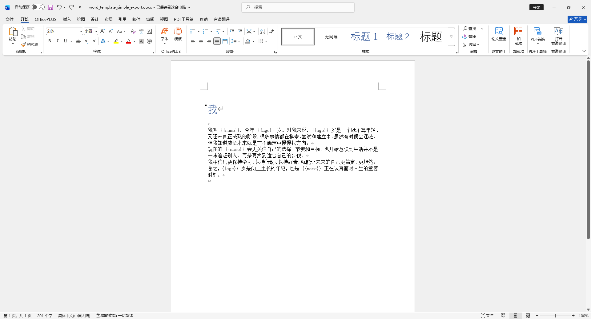

**使用方法**

```java
    @Test
    void testWordSimpleExport() {
        Map<String, Object> data = new HashMap<>();
        data.put("name", "Ateng");
        data.put("age", 25);
        XWPFDocument document = WordUtil.export(ExcelUtil.getInputStreamFromClasspath("doc/word_template_simple_export.docx"), data);
        WordUtil.write(document, "target/word_template_simple_export.docx");
    }
```


### 填充列表变量数据

**模版准备**

```
我

我叫 {{name}}，今年 {{age}} 岁。对我来说，{{age}} 岁是一个既不算年轻、又还未真正成熟的阶段，很多事情都在摸索、尝试和建立中。虽然有时候会迷茫，但我知道成长本来就是在不确定中慢慢找方向。
现在的 {{name}} 会更关注自己的选择、节奏和目标，也开始意识到生活并不是一味追赶别人，而是要找到适合自己的步伐。
我相信只要保持学习、保持行动、保持好奇，就能让未来的自己更笃定、更坦然。总之，{{age}} 岁是向上生长的年纪，也是 {{name}} 正在认真面对人生的重要时刻。

时间	金额
{{$fe:list t.time	t.amount}}


```

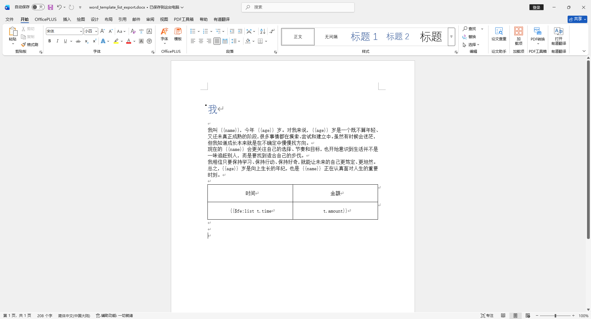

**使用方法**

```java
    @Test
    void testWordListExport() {
        Map<String, Object> data = new HashMap<>();
        data.put("name", "Ateng");
        data.put("age", 25);

        // ===== 构造列表数据（循环 100 次）=====
        List<Map<String, Object>> list = new ArrayList<>();
        for (int i = 1; i <= 100; i++) {
            Map<String, Object> row = new HashMap<>();
            row.put("time", LocalDateTime.now());
            row.put("amount", i * 1000);
            list.add(row);
        }

        data.put("list", list);

        XWPFDocument document = WordUtil.export(
                ExcelUtil.getInputStreamFromClasspath("doc/word_template_list_export.docx"),
                data
        );
        WordUtil.write(document, "target/word_template_list_export.docx");
    }
```


### 格式化

**模版准备**

```
我

我叫 {{name}}，今年 {{age}} 岁（状态：{{age > 18 ? '成年' : '未成年'}}）。

对我来说，{{age}} 岁是一个既不算年轻、又还未真正成熟的阶段，
很多事情都在摸索、尝试和建立中。虽然有时候会迷茫，但我知道成长本来就是在不确定中慢慢找方向。

现在的 {{name}} 会更关注自己的选择、节奏和目标，
也开始意识到生活并不是一味追赶别人，而是要找到适合自己的步伐。

我相信只要保持学习、保持行动、保持好奇，
就能让未来的自己更笃定、更坦然。

补充信息：
- 创建时间（原始值）：{{createTime}}
- 创建时间（格式化）：{{fd:(createTime;yyyy-MM-dd HH:mm:ss)}}
- 生日（格式化，仅日期）：{{fd:(birthday;yyyy-MM-dd)}}
- 当前分数（原始值）：{{score}}
- 当前分数（两位小数展示）：{{fn:(score;###.00)}}
- 完成度（原始值）：{{ratio}}
- 完成度（百分比）：{{fn:(ratio;0.00%)}}
- 名字长度值：{{le:(name)}}

总之，{{age}} 岁是向上生长的年纪，
也是 {{name}} 正在认真面对人生的重要时刻。


```


**使用方法**

```java
    @Test
    void testWordFormatExport() {
        // ========= 构建数据模型 =========
        Map<String, Object> data = new HashMap<>();
        data.put("name", "Ateng");                  // 字符串字段
        data.put("age", 25);                        // 数值字段

        // 日期字段示例（支持原始值和格式化）
        data.put("createTime", new Date());         // 当前时间
        data.put("birthday", new GregorianCalendar(1999, Calendar.JUNE, 5).getTime());

        // 数值字段示例（支持原始与格式化）
        data.put("score", 89.756);                  // 原始分数
        data.put("ratio", 0.3765);                  // 比例（用于百分比格式化）

        // ========= 渲染到模板 =========
        XWPFDocument document = WordUtil.export(
                ExcelUtil.getInputStreamFromClasspath("doc/word_template_format_export.docx"),
                data
        );

        // ========= 写出到目标 =========
        WordUtil.write(document, "target/word_template_format_export.docx");
    }
```

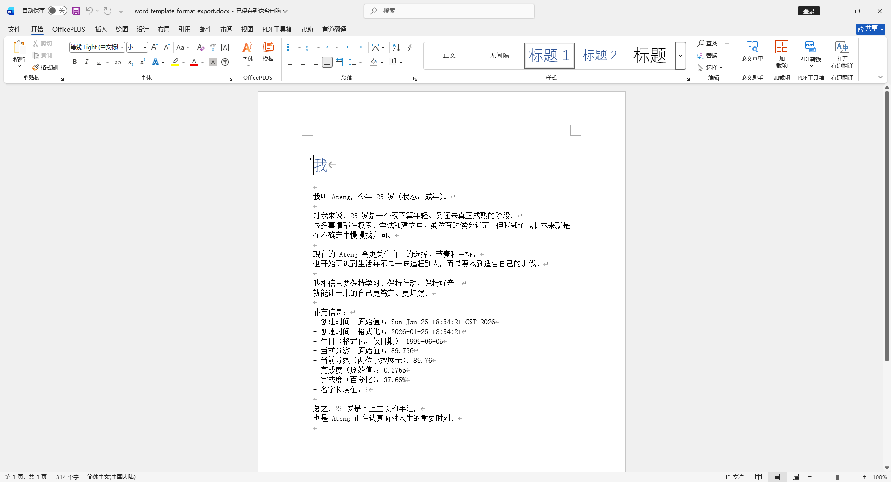


### 填充图片

**模版准备**

```
我

我叫 {{name}}，今年 {{age}} 岁。对我来说，{{age}} 岁是一个既不算年轻、又还未真正成熟的阶段，很多事情都在摸索、尝试和建立中。虽然有时候会迷茫，但我知道成长本来就是在不确定中慢慢找方向。
现在的 {{name}} 会更关注自己的选择、节奏和目标，也开始意识到生活并不是一味追赶别人，而是要找到适合自己的步伐。
我相信只要保持学习、保持行动、保持好奇，就能让未来的自己更笃定、更坦然。总之，{{age}} 岁是向上生长的年纪，也是 {{name}} 正在认真面对人生的重要时刻。
以下是我的帅照：
{{image}}


```

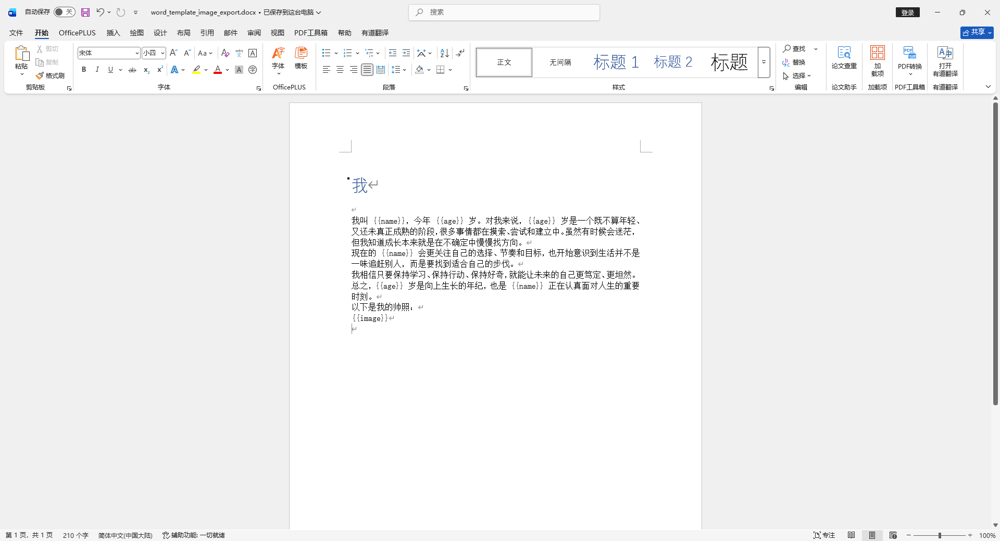

**使用方法**

图片使用 `ImageEntity` 实体类构建

```java
    @Test
    void testWordSimpleExport() {
        Map<String, Object> data = new HashMap<>();
        data.put("name", "Ateng");
        data.put("age", 25);
        XWPFDocument document = WordUtil.export(ExcelUtil.getInputStreamFromClasspath("doc/word_template_simple_export.docx"), data);
        WordUtil.write(document, "target/word_template_simple_export.docx");
    }
```


