# FastExcel

新一代 JAVA 解析 EXCEL 工具：FastExcel是一个基于Java的、快速、简洁、解决大文件内存溢出的Excel处理工具

参考：[官方文档](https://idev.cn/fastexcel/zh-CN/docs)


## 基础配置

### 添加依赖

**FastExcel依赖**

```xml
<!-- FastExcel 依赖 -->
<dependency>
    <groupId>cn.idev.excel</groupId>
    <artifactId>fastexcel</artifactId>
    <version>${fastexcel.version}</version>
</dependency>
```

**完整pom.xml如下：**

```xml
<?xml version="1.0" encoding="UTF-8"?>
<project xmlns:xsi="http://www.w3.org/2001/XMLSchema-instance" xmlns="http://maven.apache.org/POM/4.0.0"
         xsi:schemaLocation="http://maven.apache.org/POM/4.0.0 https://maven.apache.org/xsd/maven-4.0.0.xsd">
    <!-- 项目模型版本 -->
    <modelVersion>4.0.0</modelVersion>

    <!-- 项目坐标 -->
    <groupId>local.ateng.java</groupId>
    <artifactId>fast-excel</artifactId>
    <version>v1.0</version>
    <name>fast-excel</name>
    <description>FastExcel是一个基于Java的、快速、简洁、解决大文件内存溢出的Excel处理工具</description>
    <url>https://idev.cn/fastexcel/zh-CN</url>

    <!-- 项目属性 -->
    <properties>
        <java.version>21</java.version>
        <project.build.sourceEncoding>UTF-8</project.build.sourceEncoding>
        <project.reporting.outputEncoding>UTF-8</project.reporting.outputEncoding>
        <spring-boot.version>3.4.1</spring-boot.version>
        <maven-compiler.version>3.12.1</maven-compiler.version>
        <lombok.version>1.18.36</lombok.version>
        <hutool.version>5.8.35</hutool.version>
        <fastjson2.version>2.0.53</fastjson2.version>
        <fastexcel.version>1.1.0</fastexcel.version>
    </properties>

    <!-- 项目依赖 -->
    <dependencies>
        <!-- Spring Boot Web Starter: 包含用于构建Web应用程序的Spring Boot依赖项 -->
        <dependency>
            <groupId>org.springframework.boot</groupId>
            <artifactId>spring-boot-starter-web</artifactId>
        </dependency>

        <!-- Spring Boot Starter Test: 包含用于测试Spring Boot应用程序的依赖项 -->
        <dependency>
            <groupId>org.springframework.boot</groupId>
            <artifactId>spring-boot-starter-test</artifactId>
            <scope>test</scope>
        </dependency>

        <!-- Lombok: 简化Java代码编写的依赖项 -->
        <!-- https://mvnrepository.com/artifact/org.projectlombok/lombok -->
        <dependency>
            <groupId>org.projectlombok</groupId>
            <artifactId>lombok</artifactId>
            <version>${lombok.version}</version>
            <scope>provided</scope>
        </dependency>

        <!-- Hutool: Java工具库，提供了许多实用的工具方法 -->
        <dependency>
            <groupId>cn.hutool</groupId>
            <artifactId>hutool-all</artifactId>
            <version>${hutool.version}</version>
        </dependency>

        <!-- 高性能的JSON库 -->
        <!-- https://github.com/alibaba/fastjson2/wiki/fastjson2_intro_cn#0-fastjson-20%E4%BB%8B%E7%BB%8D -->
        <dependency>
            <groupId>com.alibaba.fastjson2</groupId>
            <artifactId>fastjson2</artifactId>
            <version>${fastjson2.version}</version>
        </dependency>

        <!-- JavaFaker: 用于生成虚假数据的Java库 -->
        <dependency>
            <groupId>com.github.javafaker</groupId>
            <artifactId>javafaker</artifactId>
            <version>1.0.2</version>
        </dependency>

        <!-- FastExcel 依赖 -->
        <dependency>
            <groupId>cn.idev.excel</groupId>
            <artifactId>fastexcel</artifactId>
            <version>${fastexcel.version}</version>
        </dependency>

    </dependencies>

    <!-- Spring Boot 依赖管理 -->
    <dependencyManagement>
        <dependencies>
            <dependency>
                <groupId>org.springframework.boot</groupId>
                <artifactId>spring-boot-dependencies</artifactId>
                <version>${spring-boot.version}</version>
                <type>pom</type>
                <scope>import</scope>
            </dependency>
        </dependencies>
    </dependencyManagement>

    <!-- 插件仓库配置 -->
    <repositories>
        <!-- Central Repository -->
        <repository>
            <id>central</id>
            <name>阿里云中央仓库</name>
            <url>https://maven.aliyun.com/repository/central</url>
            <!--<name>Maven官方中央仓库</name>
            <url>https://repo.maven.apache.org/maven2/</url>-->
        </repository>
    </repositories>

    <!-- 构建配置 -->
    <build>
        <finalName>${project.name}-${project.version}</finalName>
        <plugins>
            <!-- Maven 编译插件 -->
            <plugin>
                <groupId>org.apache.maven.plugins</groupId>
                <artifactId>maven-compiler-plugin</artifactId>
                <version>${maven-compiler.version}</version>
                <configuration>
                    <source>${java.version}</source>
                    <target>${java.version}</target>
                    <encoding>${project.build.sourceEncoding}</encoding>
                    <!-- 编译参数 -->
                    <compilerArgs>
                        <!-- 启用Java 8参数名称保留功能 -->
                        <arg>-parameters</arg>
                    </compilerArgs>
                </configuration>
            </plugin>

            <!-- Spring Boot Maven 插件 -->
            <plugin>
                <groupId>org.springframework.boot</groupId>
                <artifactId>spring-boot-maven-plugin</artifactId>
                <version>${spring-boot.version}</version>
                <executions>
                    <execution>
                        <id>repackage</id>
                        <goals>
                            <goal>repackage</goal>
                        </goals>
                    </execution>
                </executions>
            </plugin>
        </plugins>
        <resources>
            <!-- 第一个资源配置块 -->
            <resource>
                <directory>src/main/resources</directory>
                <filtering>false</filtering>
            </resource>
            <!-- 第二个资源配置块 -->
            <resource>
                <directory>src/main/resources</directory>
                <includes>
                    <include>application*</include>
                    <include>bootstrap*.yml</include>
                    <include>common*</include>
                    <include>banner*</include>
                </includes>
                <filtering>true</filtering>
            </resource>
        </resources>
    </build>

</project>
```

### 创建实体类

参考：[官方文档](https://idev.cn/fastexcel/zh-CN/docs/write/write_hard)

```java
package local.ateng.java.excel.entity;

import cn.idev.excel.annotation.ExcelProperty;
import cn.idev.excel.annotation.format.DateTimeFormat;
import cn.idev.excel.annotation.format.NumberFormat;
import cn.idev.excel.annotation.write.style.ColumnWidth;
import cn.idev.excel.annotation.write.style.ContentRowHeight;
import cn.idev.excel.annotation.write.style.HeadRowHeight;
import lombok.AllArgsConstructor;
import lombok.Builder;
import lombok.Data;
import lombok.NoArgsConstructor;

import java.io.Serial;
import java.io.Serializable;
import java.math.BigDecimal;
import java.time.LocalDate;
import java.time.LocalDateTime;

@Data
@Builder
@NoArgsConstructor
@AllArgsConstructor
@HeadRowHeight(25)  // 设置表头行高
@ContentRowHeight(20)  // 设置数据内容行高
@ColumnWidth(15)       // 设置列宽
public class MyUser implements Serializable {

    @Serial
    private static final long serialVersionUID = 1L;

    /**
     * 主键id
     */
    @ExcelProperty("主键id")
    @ColumnWidth(20) // 单独设置列宽
    private Long id;

    /**
     * 名称
     */
    @ExcelProperty("名称")
    private String name;

    /**
     * 年龄
     */
    @ExcelProperty("年龄")
    private Integer age;

    /**
     * 手机号码
     */
    @ExcelProperty("手机号码")
    private String phoneNumber;

    /**
     * 邮箱
     */
    @ExcelProperty("邮箱")
    @ColumnWidth(20) // 单独设置列宽
    private String email;

    /**
     * 分数
     */
    @ExcelProperty("分数")
    @NumberFormat("0.00")
    private BigDecimal score;

    /**
     * 比例
     */
    @ExcelProperty("比例")
    @NumberFormat("0.00%")
    private Double ratio;

    /**
     * 生日
     */
    @ExcelProperty("生日")
    @DateTimeFormat("yyyy年MM月dd日")
    private LocalDate birthday;

    /**
     * 所在省份
     */
    @ExcelProperty("所在省份")
    private String province;

    /**
     * 所在城市
     */
    @ExcelProperty("所在城市")
    private String city;

    /**
     * 创建时间
     */
    @ExcelProperty(value = "创建时间")
    @DateTimeFormat("yyyy-MM-dd HH:mm:ss")
    @ColumnWidth(20) // 单独设置列宽
    private LocalDateTime createTime;

}
```

### 创建数据生成器

```java
package local.ateng.java.excel.init;

import com.github.javafaker.Faker;
import local.ateng.java.excel.entity.MyUser;
import lombok.Getter;

import java.math.BigDecimal;
import java.time.LocalDate;
import java.time.LocalDateTime;
import java.util.ArrayList;
import java.util.List;
import java.util.Locale;
import java.util.UUID;

/**
 * 初始化数据
 *
 * @author 孔余
 * @email 2385569970@qq.com
 * @since 2025-01-09
 */
@Getter
public class InitData {
    public static List<MyUser> list;

    static {
        //生成测试数据
        // 创建一个Java Faker实例，指定Locale为中文
        Faker faker = new Faker(new Locale("zh-CN"));
        List<MyUser> userList = new ArrayList();
        for (int i = 1; i <= 1000; i++) {
            MyUser user = new MyUser();
            user.setId(UUID.randomUUID().getMostSignificantBits() & Long.MAX_VALUE);
            user.setName(faker.name().fullName());
            user.setAge(faker.number().numberBetween(0, 100));
            user.setPhoneNumber(faker.phoneNumber().cellPhone());
            user.setEmail(faker.internet().emailAddress());
            user.setScore(BigDecimal.valueOf(faker.number().randomDouble(2, 0, 100)));
            user.setRatio(faker.number().randomDouble(5, 0, 1));
            user.setBirthday(LocalDate.now());
            user.setProvince(faker.address().state());
            user.setCity(faker.address().cityName());
            user.setCreateTime(LocalDateTime.now());
            userList.add(user);
        }
        list = userList;
    }
}
```


## 写入文件

### 写入文件到本地

```java
package local.ateng.java.excel;

import cn.idev.excel.FastExcel;
import local.ateng.java.excel.entity.MyUser;
import local.ateng.java.excel.init.InitData;
import org.junit.jupiter.api.Test;

public class FastExcelTests {

    @Test
    public void writeExcel() {
        String fileName = "D:/demo.xlsx";
        // 创建一个名为“模板”的 sheet 页，并写入数据
        FastExcel.write(fileName, MyUser.class).sheet("模板").doWrite(InitData.getDataList());
    }

}
```

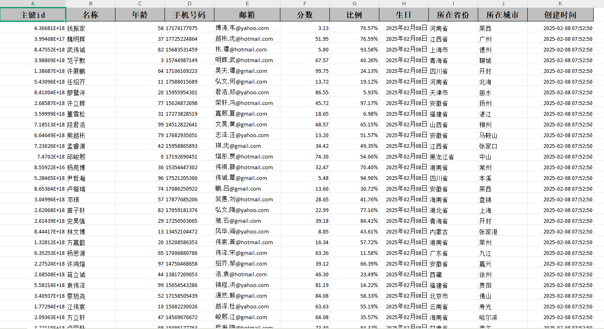


### 分批多次写入

```java
    /**
     * 分批多次写入
     * 分批写入数据到同一个 Sheet 或多个 Sheet，可实现大数据量的分页写入。
     */
    @Test
    public void writeExcel2() {
        String fileName = "D:/demo.xlsx";
        try (ExcelWriter excelWriter = FastExcel.write(fileName, MyUser.class).build()) {
            for (int i = 0; i < 5; i++) {
                WriteSheet writeSheet = FastExcel.writerSheet(i, "模版" + i).build();
                excelWriter.write(InitData.getDataList(), writeSheet);
            }
        }
    }
```

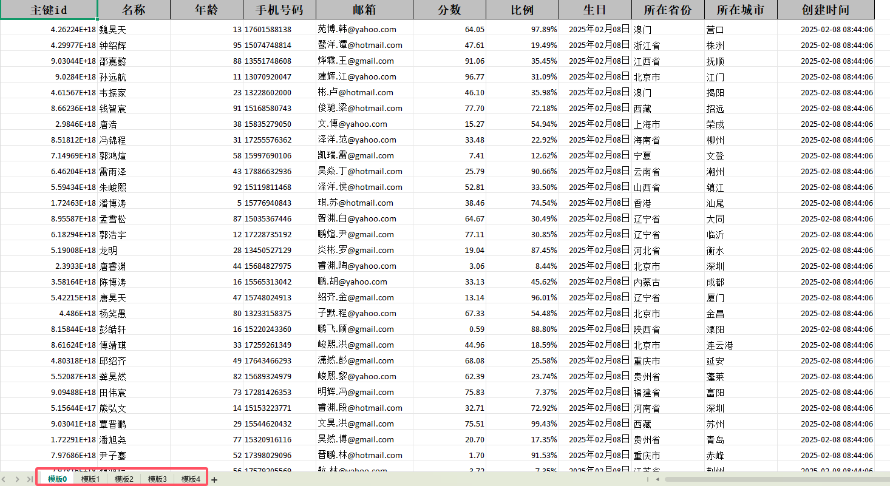


### 修改表格样式

#### 创建处理器

创建处理器，设置表格样式

```java
package local.ateng.java.excel.handler;

import cn.idev.excel.write.metadata.style.WriteCellStyle;
import cn.idev.excel.write.metadata.style.WriteFont;
import cn.idev.excel.write.style.HorizontalCellStyleStrategy;
import org.apache.poi.ss.usermodel.*;

public class CustomCellStyleWriteHandler {

    /**
     * 设置内容和表头的样式策略
     * @return HorizontalCellStyleStrategy
     */
    public static HorizontalCellStyleStrategy cellStyleStrategy() {
        // 设置数据内容样式
        WriteCellStyle contentWriteCellStyle = new WriteCellStyle();
        contentWriteCellStyle.setVerticalAlignment(VerticalAlignment.CENTER);
        contentWriteCellStyle.setHorizontalAlignment(HorizontalAlignment.CENTER);
        contentWriteCellStyle.setWrapped(false); // 不自动换行
        setBorderStyleAndFont(contentWriteCellStyle, (short) 12, false, false); // 12号字体，不加粗，无背景色

        // 设置表头样式
        WriteCellStyle headWriteCellStyle = new WriteCellStyle();
        headWriteCellStyle.setVerticalAlignment(VerticalAlignment.CENTER);
        headWriteCellStyle.setHorizontalAlignment(HorizontalAlignment.CENTER);
        headWriteCellStyle.setFillForegroundColor(IndexedColors.GREY_40_PERCENT.getIndex()); // 替换为浅灰色
        headWriteCellStyle.setFillPatternType(FillPatternType.SOLID_FOREGROUND);
        setBorderStyleAndFont(headWriteCellStyle, (short) 14, true, true); // 14号字体，加粗，有背景色

        return new HorizontalCellStyleStrategy(headWriteCellStyle, contentWriteCellStyle);
    }

    /**
     * 设置边框样式、字体大小及背景色
     * @param writeCellStyle 写入样式
     * @param fontSize 字体大小
     * @param bold 是否加粗
     * @param hasBackground 是否需要背景色
     */
    private static void setBorderStyleAndFont(WriteCellStyle writeCellStyle, short fontSize, boolean bold, boolean hasBackground) {
        // 设置边框样式（改为双线边框）
        writeCellStyle.setBorderLeft(BorderStyle.DOUBLE);
        writeCellStyle.setBorderTop(BorderStyle.DOUBLE);
        writeCellStyle.setBorderRight(BorderStyle.DOUBLE);
        writeCellStyle.setBorderBottom(BorderStyle.DOUBLE);

        // 设置字体
        WriteFont writeFont = new WriteFont();
        writeFont.setColor(IndexedColors.BLACK.getIndex());
        writeFont.setFontHeightInPoints(fontSize);
        writeFont.setBold(bold);
        writeCellStyle.setWriteFont(writeFont);

        // 是否需要背景色
        if (!hasBackground) {
            writeCellStyle.setFillPatternType(FillPatternType.NO_FILL);
        }
    }
}
```

#### 修改表格样式

```java
    /**
     * 使用自定义处理器，修改表格样式
     */
    @Test
    public void writeExcel3() {
        String fileName = "D:/demo.xlsx";
        FastExcel
                .write(fileName, MyUser.class)
                .registerWriteHandler(CustomCellStyleWriteHandler.cellStyleStrategy())
                .sheet("模板")
                .doWrite(InitData.getDataList());
    }
```

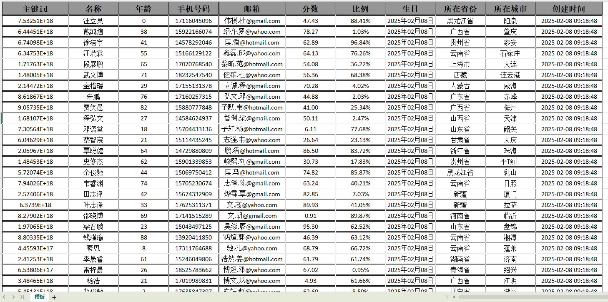


### 导出图片

#### 创建Converter

```java
package local.ateng.java.excel.converter;

import cn.idev.excel.converters.Converter;
import cn.idev.excel.metadata.GlobalConfiguration;
import cn.idev.excel.metadata.data.WriteCellData;
import cn.idev.excel.metadata.property.ExcelContentProperty;
import cn.idev.excel.util.IoUtils;
import org.slf4j.Logger;
import org.slf4j.LoggerFactory;

import java.io.IOException;
import java.io.InputStream;
import java.net.URL;

/**
 * 自定义 Excel 图片转换器，用于将 URL 字符串转换为 Excel 图片。
 * 该转换器支持：
 * 1. 通过 URL 下载图片并插入到 Excel 单元格中。
 * 2. 如果图片 URL 为空或无效，则使用默认图片 URL 进行替代。
 * 3. 保障 Excel 生成时不会因图片下载失败而导致异常。
 */
public class StringUrlImageConverter implements Converter<String> {

    /**
     * 默认图片 URL（当原始 URL 无效或下载失败时使用）
     */
    private static final String DEFAULT_IMAGE_URL = "http://192.168.1.12:9000/data/image/logo1.jpg";
    private static final Logger log = LoggerFactory.getLogger(StringUrlImageConverter.class);

    /**
     * 将 URL 字符串转换为 Excel 可用的图片数据。
     *
     * @param url                 图片的 URL 字符串
     * @param contentProperty     Excel 内容属性（未使用）
     * @param globalConfiguration 全局配置（未使用）
     * @return WriteCellData<?> 包含图片字节数组的 Excel 数据单元
     */
    @Override
    public WriteCellData<?> convertToExcelData(String url, ExcelContentProperty contentProperty, GlobalConfiguration globalConfiguration) {
        // 如果 URL 为空，则使用默认图片 URL
        String finalUrl = (url == null || url.trim().isEmpty()) ? DEFAULT_IMAGE_URL : url;

        // 下载图片（如果失败，则返回默认图片）
        byte[] imageBytes = downloadImage(finalUrl);
        if (imageBytes == null) {
            imageBytes = downloadImage(DEFAULT_IMAGE_URL);
        }

        return new WriteCellData<>(imageBytes);
    }

    /**
     * 从指定的 URL 下载图片并转换为字节数组。
     *
     * @param imageUrl 图片的 URL 地址
     * @return 图片的字节数组，如果下载失败则返回 null
     */
    private byte[] downloadImage(String imageUrl) {
        try (InputStream inputStream = new URL(imageUrl).openStream()) {
            return IoUtils.toByteArray(inputStream);
        } catch (IOException e) {
            log.error("图片下载失败：{}，使用默认图片替代", imageUrl);
        }
        return null; // 失败时返回 null
    }
}
```

#### 创建图片实体类

```java
package local.ateng.java.excel.entity;

import cn.idev.excel.annotation.ExcelProperty;
import cn.idev.excel.annotation.write.style.ColumnWidth;
import cn.idev.excel.annotation.write.style.ContentRowHeight;
import cn.idev.excel.annotation.write.style.HeadRowHeight;
import local.ateng.java.excel.converter.StringUrlImageConverter;
import lombok.AllArgsConstructor;
import lombok.Builder;
import lombok.Data;
import lombok.NoArgsConstructor;

@Data
@Builder
@AllArgsConstructor
@NoArgsConstructor
@ContentRowHeight(100)
@HeadRowHeight(25)
@ColumnWidth(25)
public class MyImage {
    @ExcelProperty(value = "序号")
    private Integer id;
    @ExcelProperty(value = "名字")
    private String name;
    @ExcelProperty(value = "图片", converter = StringUrlImageConverter.class)
    @ColumnWidth(25)
    private String url;
}
```

#### 导出图片

```java
    /**
     * 导出图片
     */
    @Test
    public void writeExcel4() {
        List<MyImage> list = new ArrayList<>() {{
            add(new MyImage(1, "图片1", "http://192.168.1.12:9000/data/image/logo1.jpg"));
            add(new MyImage(2, "图片2", "http://192.168.1.12:9000/data/image/logo2.jpg"));
            add(new MyImage(3, "图片异常", "http://192.168.1.12:9000/data/image/error.jpg"));
            add(new MyImage(4, "图片不存在", "null"));
        }};
        String fileName = "D:/demo.xlsx";
        FastExcel
                .write(fileName, MyImage.class)
                .registerWriteHandler(CustomCellStyleWriteHandler.cellStyleStrategy())
                .sheet("模板")
                .doWrite(list);
    }
```

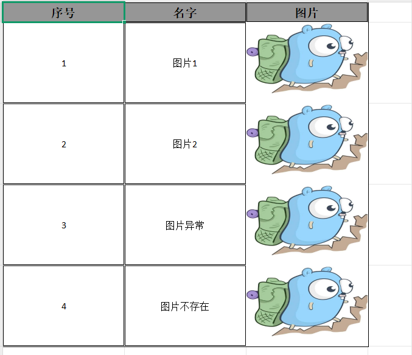

### 动态表头（数据）写入

```java
    /**
     * 动态表头（数据）写入
     */
    @Test
    public void writeExcel5() {
        // 生成动态表头，最终要转换为这种格式：[[header1], [header2], [header3]...]
        List<String> headerList = new ArrayList<>();
        int randomInt = RandomUtil.randomInt(1, 20);
        for (int i = 0; i < randomInt; i++) {
            headerList.add("表头" + (i + 1));
        }
        List<List<String>> head = headerList.stream()
                .map(s -> Collections.singletonList(s))
                .collect(Collectors.toList());
        System.out.println(head);
        // 生成数据
        List<List<String>> data = new ArrayList<>();
        for (int i = 0; i < 10; i++) {  // 假设我们生成 10 行数据
            List<String> row = new ArrayList<>();
            for (int j = 0; j < headerList.size(); j++) {  // 每行数据的列数与表头列数一致
                row.add("数据" + (i + 1) + "-" + (j + 1));  // 模拟数据
            }
            data.add(row);
        }
        System.out.println(data);
        // 导出数据
        String fileName = "D:/demo.xlsx";
        FastExcel
                .write(fileName)
                .head(head)
                .sheet("模板")
                .doWrite(data);
    }
```

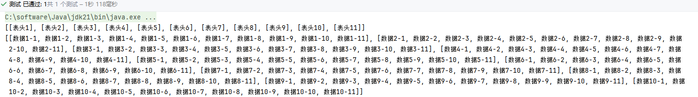

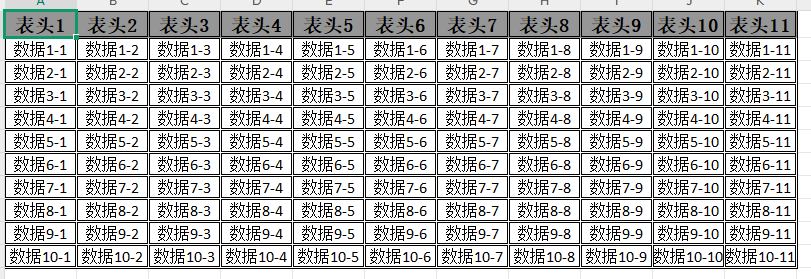


### 导出为CSV文件

```java
    /**
     * 导出为CSV文件
     */
    @Test
    public void writeExcel6() {
        String fileName = "D:/demo.csv";
        FastExcel
                .write(fileName, MyUser.class)
                .excelType(ExcelTypeEnum.CSV)
                .sheet()
                .doWrite(InitData.getDataList());
    }
```

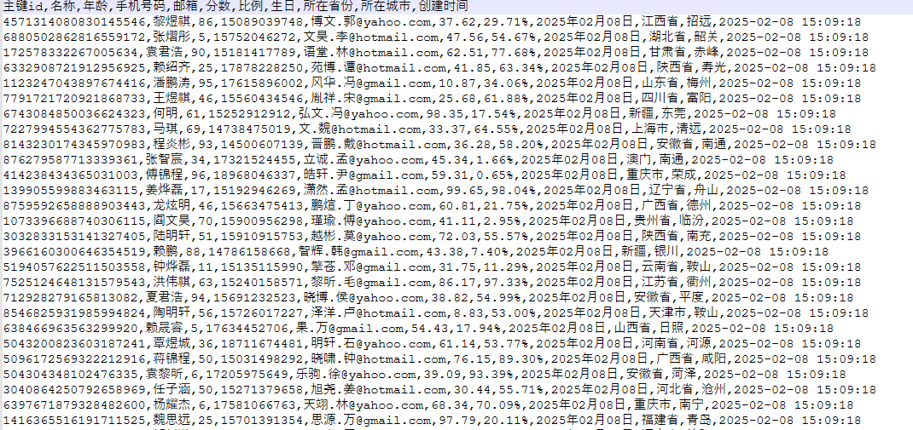

### 导出为CSV文件，自定义表头

```java
    /**
     * 导出为CSV文件，自定义表头
     */
    @Test
    public void writeExcel7() {
        // 生成表头，最终要转换为这种格式：[[header1], [header2], [header3]...]
        List<String> headerList = Arrays.asList("名称", "手机号码", "分数", "所在省份", "创建时间");
        List<List<String>> head = headerList.stream()
                .map(s -> Collections.singletonList(s))
                .collect(Collectors.toList());
        System.out.println(head);
        // 导出数据
        String fileName = "D:/demo.csv";
        List<List<String>> data = InitData.getDataList().stream()
                .map(obj -> Arrays.asList(
                        obj.getName(),
                        obj.getPhoneNumber(),
                        String.valueOf(obj.getScore()),
                        obj.getProvince(),
                        String.valueOf(obj.getCreateTime())
                ))
                .collect(Collectors.toList());
        FastExcel
                .write(fileName)
                .excelType(ExcelTypeEnum.CSV)
                .head(head)
                .sheet()
                .doWrite(data);
    }
```

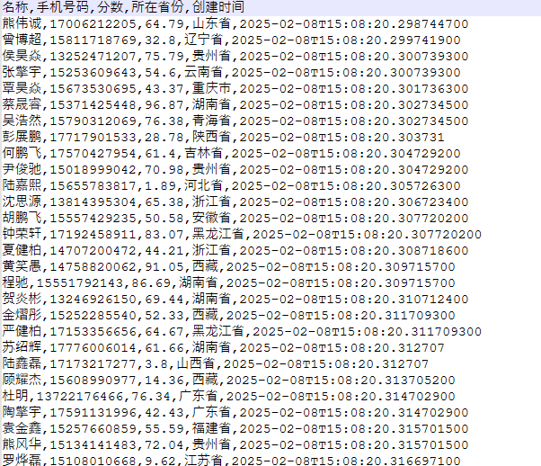

### 追加写入 CSV（支持大数据量）

```java
    /**
     * 追加写入 CSV（支持大数据量）
     */
    @Test
    public void writeExcel8() {
        String fileName = "D:/demo.csv";
        try (ExcelWriter excelWriter = FastExcel
                .write(fileName, MyUser.class)
                .excelType(ExcelTypeEnum.CSV)
                .build()) {
            WriteSheet writeSheet = FastExcel.writerSheet().build();
            // 第一批数据
            excelWriter.write(InitData.getDataList(), writeSheet);
            // 第二批数据
            excelWriter.write(InitData.getDataList(), writeSheet);
        }
    }
```

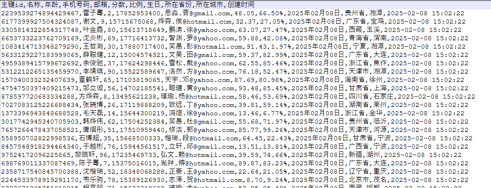


## 填充文件

参考：[官方文档](https://idev.cn/fastexcel/zh-CN/docs/fill/fill)

### 创建测试类

这里就直接使用ClassPathResource来读取resources目录下的文件，所以需要用到SpringBoot

```java
package local.ateng.java.excel;

import org.springframework.boot.test.context.SpringBootTest;

@SpringBootTest
public class FastExcelWithTemplateTests {
}
```

### 填充基本数据列表

文件模板存放在 `resources/doc/用户信息模板.xlsx`

#### 使用实体类

```java
    /**
     * 根据模板写入
     * 使用实体类
     */
    @Test
    public void writeExcel() throws IOException {
        String outputFile = "D:/demo.xlsx";
        InputStream inputStream = new ClassPathResource("doc/用户信息模板.xlsx").getInputStream();
        FastExcel
                .write(outputFile)
                .withTemplate(inputStream)
                .sheet("用户信息")
                .doFill(InitData.getDataList());
    }
```

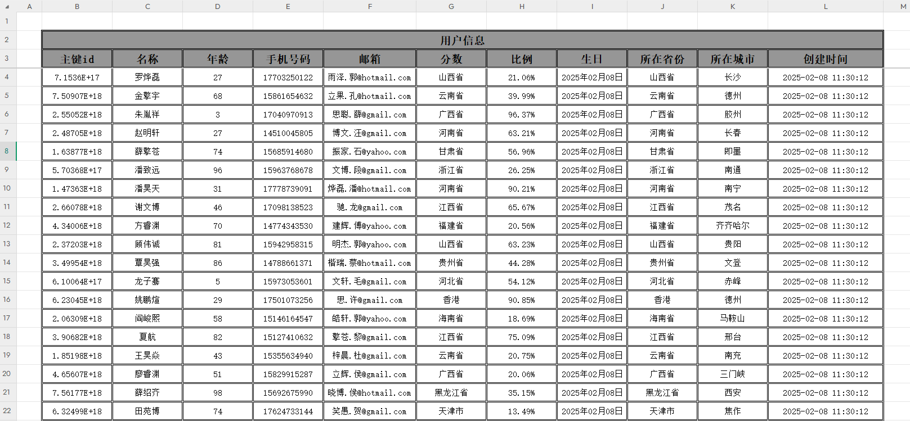

#### 使用Map或者其他KV类型

```java
    /**
     * 根据模板写入
     * 使用Map
     */
    @Test
    public void writeExcel2() throws IOException {
        // 假如存在一个Map
        List<Map> list = Convert.toList(Map.class, InitData.getDataList());
        //List<JSONObject> list = Convert.toList(JSONObject.class, InitData.getDataList());
        String outputFile = "D:/demo.xlsx";
        InputStream inputStream = new ClassPathResource("doc/用户信息模板.xlsx").getInputStream();
        FastExcel
                .write(outputFile)
                .withTemplate(inputStream)
                .sheet("用户信息")
                .doFill(list);
    }
```

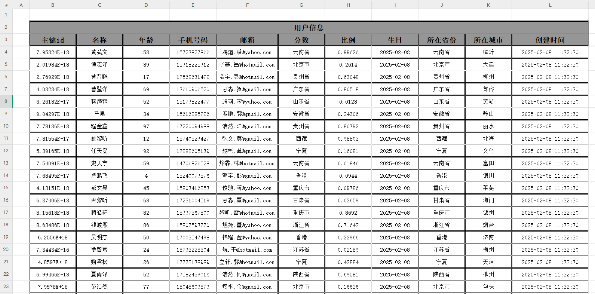


### 填充图片数据

```java
    /**
     * 填充图片数据
     */
    @Test
    public void writeExcel3() throws IOException {
        List<MyImage> list = new ArrayList<>() {{
            add(new MyImage(1, "图片1", "http://192.168.1.12:9000/data/image/logo1.jpg"));
            add(new MyImage(2, "图片2", "http://192.168.1.12:9000/data/image/logo2.jpg"));
            add(new MyImage(3, "图片异常", "http://192.168.1.12:9000/data/image/error.jpg"));
            add(new MyImage(4, "图片不存在", "null"));
        }};
        String outputFile = "D:/demo.xlsx";
        InputStream inputStream = new ClassPathResource("doc/图片信息模板.xlsx").getInputStream();
        FastExcel
                .write(outputFile)
                .withTemplate(inputStream)
                .sheet("图片信息")
                .doFill(list);
    }
```

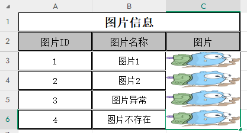


### 自定义数据填充多个Sheet

```java
    /**
     * 自定义数据填充多个Sheet
     */
    @Test
    public void writeExcel4() throws IOException {
        // 构造数据: 用户信息Sheet
        List<MyUser> userList = InitData.getDataList();
        // 构造数据: 其他信息Sheet
        JSONObject json = JSONObject.of(
                "myName", "阿腾",
                "myDate", DateUtil.now(),
                "myImage", HttpUtil.downloadBytes("http://192.168.1.12:9000/data/image/logo1.jpg"),
                "myDesc", "Hello，我是Ateng！热衷于技术研究和探索，也喜欢户外运动，享受挑战和冒险的乐趣。"
        );
        // 读取文件
        String outputFile = "D:/demo.xlsx";
        InputStream inputStream = new ClassPathResource("doc/自定义填充模板.xlsx").getInputStream();
        // 写入数据
        try (ExcelWriter excelWriter = FastExcel.write(outputFile).withTemplate(inputStream).build()) {
            // 其他信息Sheet
            WriteSheet writeSheet = FastExcel.writerSheet("其他信息").build();
            excelWriter.fill(json, writeSheet);
            // 用户信息Sheet
            WriteSheet writeSheet2 = FastExcel.writerSheet("用户信息").build();
            excelWriter.fill(userList, writeSheet2);
        }
    }
```

这里有个问题就是图片没有完全填充在合并后的单元格中

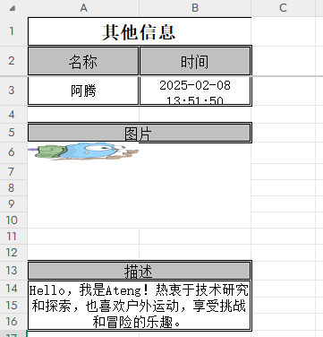


通过手动指定图片绘制位置来实现图片填充的问题，效果图和代码如下：


```java
    /**
     * 自定义数据填充多个Sheet，解决图片在单个单元格问题
     */
    @Test
    public void writeExcel5() throws IOException {
        // 构造数据: 用户信息Sheet
        List<MyUser> userList = InitData.getDataList();
        // 构造数据: 其他信息Sheet
        JSONObject json = JSONObject.of(
                "myName", "阿腾",
                "myDate", DateUtil.now(),
                //"myImage", HttpUtil.downloadBytes("http://192.168.1.12:9000/data/image/logo1.jpg"),
                "myDesc", "Hello，我是Ateng！热衷于技术研究和探索，也喜欢户外运动，享受挑战和冒险的乐趣。"
        );
        // 读取文件
        String outputFile = "D:/demo.xlsx";
        InputStream inputStream = new ClassPathResource("doc/自定义填充模板.xlsx").getInputStream();
        // 写入数据
        try (ExcelWriter excelWriter = FastExcel.write(outputFile).withTemplate(inputStream).build()) {
            // 用户信息Sheet
            WriteSheet writeSheet2 = FastExcel.writerSheet("用户信息").build();
            excelWriter.fill(userList, writeSheet2);
            // 其他信息Sheet
            WriteSheet writeSheet = FastExcel.writerSheet("其他信息").build();
            excelWriter.fill(json, writeSheet);
            // 其他信息Sheet，图片绘制位置
            Workbook workbook = excelWriter.writeContext().writeWorkbookHolder().getWorkbook();
            CreationHelper creationHelper = workbook.getCreationHelper();
            ClientAnchor clientAnchor = creationHelper.createClientAnchor();
            clientAnchor.setCol1(0);
            clientAnchor.setCol2(2);
            clientAnchor.setRow1(5);
            clientAnchor.setRow2(10);
            Drawing<?> drawingPatriarch = workbook.getSheet("其他信息").createDrawingPatriarch();
            byte[] bytes = HttpUtil.downloadBytes("http://192.168.1.12:9000/data/image/logo1.jpg");
            int picture = workbook.addPicture(bytes, Workbook.PICTURE_TYPE_JPEG);
            drawingPatriarch.createPicture(clientAnchor, picture);
        }
    }
```


## 导入文件

### 导入Excel文件，读取为实体类

```java
    /**
     * 导入Excel文件，读取为实体类
     */
    @Test
    public void readExcel() {
        String fileName = "D:/demo.xlsx";
        List<MyUser> list = FastExcel.read(fileName).head(MyUser.class).sheet().doReadSync();
        System.out.println(list);
    }
```

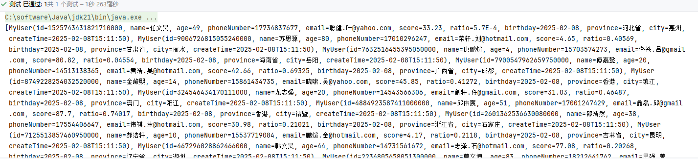

### 导入Excel文件，读取为Map

```java
    /**
     * 导入Excel文件，读取为Map
     */
    @Test
    public void readExcel2() {
        String fileName = "D:/demo.xlsx";
        List<Map<Integer, String>> list = FastExcel.read(fileName).sheet().doReadSync();
        System.out.println(list);
    }
```

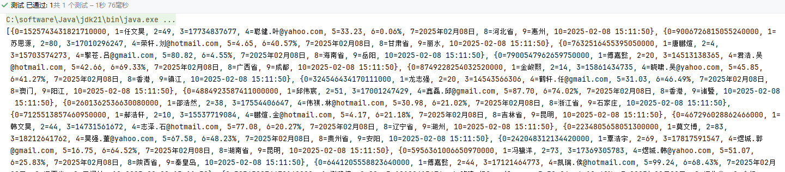

### 导入Excel文件，设置监听器

如果数据出现异常，立即抛出错误行数列数，并停止导入

#### 创建监听器

```java
package local.ateng.java.excel.listener;

import cn.hutool.core.util.StrUtil;
import cn.idev.excel.context.AnalysisContext;
import cn.idev.excel.event.AnalysisEventListener;
import cn.idev.excel.exception.ExcelDataConvertException;
import local.ateng.java.excel.entity.MyUser;
import lombok.extern.slf4j.Slf4j;

@Slf4j
public class MyUserListener extends AnalysisEventListener<MyUser> {
    @Override
    public void onException(Exception exception, AnalysisContext context) {
        log.error("解析失败: {}", exception.getMessage());
        if (exception instanceof ExcelDataConvertException) {
            ExcelDataConvertException ex = (ExcelDataConvertException) exception;
            String str = StrUtil.format("第 {} 行, 第 {} 列解析异常", ex.getRowIndex(), ex.getColumnIndex());
            log.error(str);
            throw new RuntimeException(str);
        }
    }

    @Override
    public void invoke(MyUser data, AnalysisContext context) {
    }

    @Override
    public void doAfterAllAnalysed(AnalysisContext context) {
    }

}
```

#### 使用监听器

```java
    /**
     * 导入Excel文件，设置监听器
     */
    @Test
    public void readExcel3() {
        String fileName = "D:/demo.xlsx";
        List<MyUser> list = FastExcel
                .read(fileName, MyUser.class, new MyUserListener())
                .sheet()
                .doReadSync();
        System.out.println(list);
    }
```

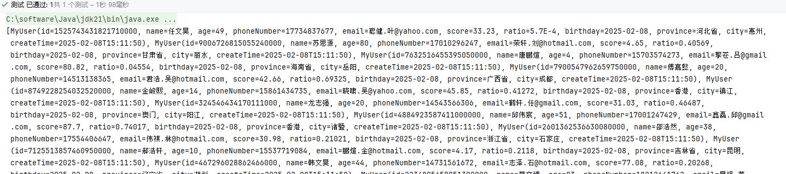

### 导入Excel文件，设置监听器并写入为Map

手动检验每一行数据，忽略出现异常的数据

#### 创建监听器

```java
package local.ateng.java.excel.listener;

import cn.hutool.core.util.NumberUtil;
import cn.idev.excel.context.AnalysisContext;
import cn.idev.excel.event.AnalysisEventListener;
import local.ateng.java.excel.entity.MyUser;
import lombok.extern.slf4j.Slf4j;

import java.math.BigDecimal;
import java.time.LocalDate;
import java.time.LocalDateTime;
import java.time.format.DateTimeFormatter;
import java.util.ArrayList;
import java.util.List;
import java.util.Map;
import java.util.concurrent.CopyOnWriteArrayList;

@Slf4j
public class MyUserMapListener extends AnalysisEventListener<Map<Integer, String>> {
    public final static List<MyUser> userList = new CopyOnWriteArrayList<>();

    @Override
    public void invoke(Map<Integer, String> dataMap, AnalysisContext context) {
        // 获取数据
        // {0=1525743431821710000, 1=任文昊, 2=49, 3=17734837677, 4=聪健.叶@yahoo.com, 5=33.23, 6=0.06%, 7=2025年02月08日, 8=河北省, 9=惠州, 10=2025-02-08 15:11:50}
        //System.out.println(dataMap);
        String idValue = dataMap.get(0);
        String nameValue = dataMap.get(1);
        String ageValue = dataMap.get(2);
        String phoneValue = dataMap.get(3);
        String emailValue = dataMap.get(4);
        String scoreValue = dataMap.get(5);
        String ratioValue = dataMap.get(6);
        String birthdayValue = dataMap.get(7);
        String provinceValue = dataMap.get(8);
        String cityValue = dataMap.get(9);
        String createTimeValue = dataMap.get(10);
        // 校验数据
        try {
            Long id = Long.valueOf(idValue);
            Integer age = Integer.valueOf(ageValue);
            BigDecimal score = new BigDecimal(scoreValue).setScale(2, BigDecimal.ROUND_HALF_UP);
            Double ratio = Double.valueOf(NumberUtil.parseDouble(ratioValue) / 100);
            LocalDate birthday = LocalDate.parse(birthdayValue, DateTimeFormatter.ofPattern("yyyy年MM月dd日"));
            LocalDateTime createTime = LocalDateTime.parse(createTimeValue, DateTimeFormatter.ofPattern("yyyy-MM-dd HH:mm:ss"));
            MyUser myUser = MyUser.builder()
                    .id(id)
                    .name(nameValue)
                    .age(age)
                    .phoneNumber(phoneValue)
                    .email(emailValue)
                    .score(score)
                    .ratio(ratio)
                    .birthday(birthday)
                    .province(provinceValue)
                    .city(cityValue)
                    .createTime(createTime)
                    .build();
            userList.add(myUser);
        } catch (NumberFormatException e) {
            // 获取当前行号（从0开始）
            int rowNum = context.readRowHolder().getRowIndex();
            // 获取当前行的列数
            log.error("第{}行错误数据: {}", rowNum, dataMap);
        }

    }

    @Override
    public void doAfterAllAnalysed(AnalysisContext context) {
        log.info("数据加载完毕：{}", userList.size());
    }

}
```

#### 使用监听器

```java
    /**
     * 导入Excel文件，设置监听器并写入为Map
     */
    @Test
    public void readExcel4() {
        String fileName = "D:/demo.xlsx";
        FastExcel
                .read(fileName, new MyUserMapListener())
                .sheet()
                .doRead();
        List<MyUser> userList = new ArrayList<>(MyUserMapListener.userList);
        MyUserMapListener.userList.clear();
        System.out.println(userList);
    }
```

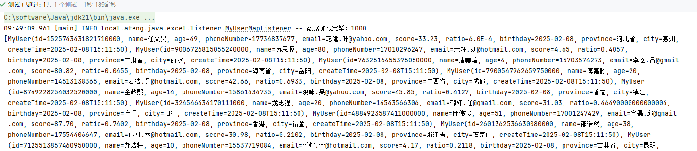


## SpringBoot使用

### 导出

在SpringBoot通过接口导出文件，其实就是将文件路径改为 `response.getOutputStream()` ，然后设置HTTP相关的参数。

```java
package local.ateng.java.excel.controller;

import cn.idev.excel.FastExcel;
import cn.idev.excel.support.ExcelTypeEnum;
import jakarta.servlet.http.HttpServletResponse;
import local.ateng.java.excel.entity.MyUser;
import local.ateng.java.excel.handler.CustomCellStyleWriteHandler;
import local.ateng.java.excel.init.InitData;
import org.springframework.web.bind.annotation.GetMapping;
import org.springframework.web.bind.annotation.RequestMapping;
import org.springframework.web.bind.annotation.RestController;

import java.io.IOException;
import java.net.URLEncoder;

@RestController
@RequestMapping("/export")
public class ExportController {

    /**
     * 导出 Excel 文件的接口
     * 访问路径: GET /export/simple
     *
     * @param response HTTP 响应对象，用于返回 Excel 文件流
     * @throws IOException 可能的 IO 异常
     */
    @GetMapping("/simple")
    public void simple(HttpServletResponse response) throws IOException {
        // 设置响应的内容类型为 Excel 文件
        response.setContentType("application/vnd.openxmlformats-officedocument.spreadsheetml.sheet");
        // 设置字符编码，防止文件名乱码
        response.setCharacterEncoding("utf-8");

        // 生成导出文件的名称，避免重复，使用时间戳
        String name = "用户文件";
        String filename = URLEncoder.encode(name, "UTF-8") // 进行 URL 编码，防止中文乱码
                .replaceAll("\\+", "%20")  // 处理 "+" 号替换为空格
                + System.currentTimeMillis()  // 添加时间戳，防止文件重名
                + ExcelTypeEnum.XLSX.getValue();  // 获取 Excel 文件的扩展名（.xlsx）

        // 设置 HTTP 响应头，通知浏览器以附件方式下载
        response.setHeader("Content-disposition", "attachment;filename*=utf-8''" + filename);

        // 使用 FastExcel 进行 Excel 导出
        FastExcel
                .write(response.getOutputStream(), MyUser.class)  // 指定数据模型类 MyUser
                .registerWriteHandler(CustomCellStyleWriteHandler.cellStyleStrategy())  // 注册自定义样式处理器
                .sheet(name)  // 设置 Excel 工作表名称
                .doWrite(InitData.getDataList());  // 写入数据
    }

}
```

### 导入

- simple：导入文件，遇到错误数据立即抛出错误并终止导入
- ignore：忽略错误的数据

```java
package local.ateng.java.excel.controller;

import cn.idev.excel.FastExcel;
import cn.idev.excel.support.ExcelTypeEnum;
import jakarta.servlet.http.HttpServletResponse;
import local.ateng.java.excel.entity.MyUser;
import local.ateng.java.excel.handler.CustomCellStyleWriteHandler;
import local.ateng.java.excel.init.InitData;
import local.ateng.java.excel.listener.MyUserListener;
import local.ateng.java.excel.listener.MyUserMapListener;
import org.springframework.http.ResponseEntity;
import org.springframework.web.bind.annotation.*;
import org.springframework.web.multipart.MultipartFile;

import java.io.IOException;
import java.net.URLEncoder;
import java.util.ArrayList;
import java.util.List;

@RestController
@RequestMapping("/import")
public class ImportController {


    @PostMapping("/simple")
    public ResponseEntity<String> simple(@RequestParam("file") MultipartFile file) throws IOException {
        List<MyUser> list = FastExcel
                .read(file.getInputStream(), MyUser.class, new MyUserListener())
                .sheet()
                .doReadSync();
        System.out.println(list);
        return ResponseEntity.ok("文件上传并处理成功！");
    }

    @PostMapping("/ignore")
    public ResponseEntity<String> ignore(@RequestParam("file") MultipartFile file) throws IOException {
        String fileName = "D:/demo.xlsx";
        FastExcel
                .read(fileName, new MyUserMapListener())
                .sheet()
                .doRead();
        List<MyUser> userList = new ArrayList<>(MyUserMapListener.userList);
        MyUserMapListener.userList.clear();
        System.out.println(userList);
        return ResponseEntity.ok("文件上传并处理成功！" + userList.size());
    }

}
```

