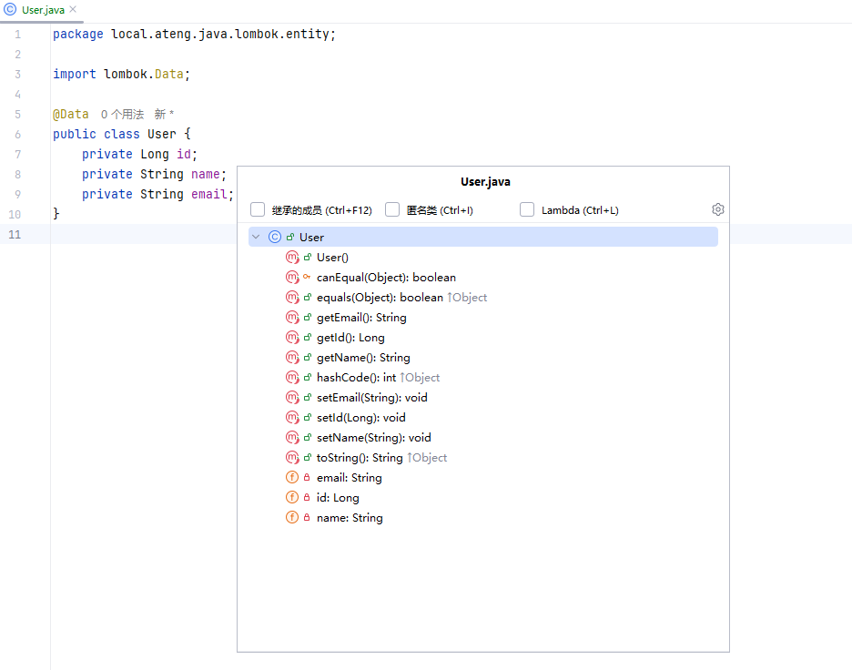

# Lombok

Lombok 是一个 Java 库，通过注解的方式，自动生成常见的 Java 类的样板代码，减少了大量的冗余代码。Lombok 通过注解处理器在编译时生成代码，提升了代码的可读性和可维护性。

常用的 Lombok 注解包括生成 Getter、Setter、`toString()`、`hashCode()` 和 `equals()` 等方法，甚至支持构造器、日志记录、构建者模式等功能。

## Lombok注解概述

- `@Getter` 和 `@Setter`: 自动生成getter和setter方法。
- `@ToString`: 自动生成`toString()`方法。
- `@EqualsAndHashCode`: 自动生成`equals()`和`hashCode()`方法。
- `@NoArgsConstructor` 和 `@AllArgsConstructor`: 生成无参构造方法和全参构造方法。
- `@Builder`: 生成建造者模式的构造方法。
- `@Data`: 包含`@Getter`、`@Setter`、`@ToString`、`@EqualsAndHashCode` 和 `@RequiredArgsConstructor`。
- `@Slf4j`: 生成SLF4J日志记录器。
- `@NonNull`: 用于确保某个字段不为null。

## 常用 Lombok 注解及其使用方法

1. **@Data**
   - `@Data` 是一个常用的组合注解，它结合了多个 Lombok 注解的功能。
   - 自动生成：
     - Getter 和 Setter 方法
     - `toString()` 方法
     - `equals()` 和 `hashCode()` 方法
     - `RequiredArgsConstructor`（至少包含一个 `final` 字段或 `@NonNull` 字段的构造函数）

   **示例：**
   ```java
   import lombok.Data;
   
   @Data
   public class User {
       private Long id;
       private String name;
       private String email;
   }
   ```

   以上代码等效于手动写出所有 getter、setter、`toString()`、`equals()` 和 `hashCode()` 方法，以及一个默认的无参构造函数。
   
   在 IntelliJ IDEA 中查看类的所有方法按 `Ctrl + F12`
   
   
   
   

---

2. **@Builder**
   - `@Builder` 提供了建造者模式的实现，允许你使用链式调用的方式构建对象。

   **示例：**
   ```java
   import lombok.Builder;
   
   @Builder
   public class User {
       private Long id;
       private String name;
       private String email;
   }
   ```

   使用时：
   ```java
   User user = User.builder()
                   .id(1L)
                   .name("John Doe")
                   .email("john.doe@example.com")
                   .build();
   ```

   这个注解让你可以通过链式调用和 `.build()` 方法创建对象，避免了大量的构造函数调用。

---

3. **@NoArgsConstructor 和 @AllArgsConstructor**
   - `@NoArgsConstructor` 用于生成一个无参构造方法。
   - `@AllArgsConstructor` 用于生成一个包含所有字段的全参构造方法。

   **示例：**
   ```java
   import lombok.NoArgsConstructor;
   import lombok.AllArgsConstructor;
   
   @NoArgsConstructor
   @AllArgsConstructor
   public class User {
       private Long id;
       private String name;
       private String email;
   }
   ```

   使用时：
   ```java
   User user1 = new User();  // 使用无参构造
   User user2 = new User(1L, "John Doe", "john.doe@example.com");  // 使用全参构造
   ```

   这两个注解使得你可以方便地根据需求生成不同类型的构造方法。

---

4. **@NonNull**
   - `@NonNull` 用于确保某个字段不为 `null`。它会在构造方法、setter 或其他方法中插入 `null` 检查。

   **示例：**
   ```java
   import lombok.NonNull;
   
   public class User {
       private Long id;
   
       @NonNull
       private String name;
   
       @NonNull
       private String email;
   }
   ```

   使用时，Lombok 会自动为 `name` 和 `email` 字段生成一个非空检查，在构造函数或 setter 方法中进行 `null` 检查。

---

5. **@Slf4j**
   - `@Slf4j` 用于自动为类生成一个 `org.slf4j.Logger` 实例，便于进行日志记录。

   **示例：**
   ```java
   import lombok.Slf4j;
   
   @Slf4j
   public class UserService {
       public void createUser(String name) {
           log.info("Creating user with name: {}", name);
       }
   }
   ```

   使用时：
   ```java
   UserService userService = new UserService();
   userService.createUser("John Doe");
   ```

   `@Slf4j` 注解自动为类生成一个名为 `log` 的静态 Logger 实例，您可以直接使用它进行日志输出。


