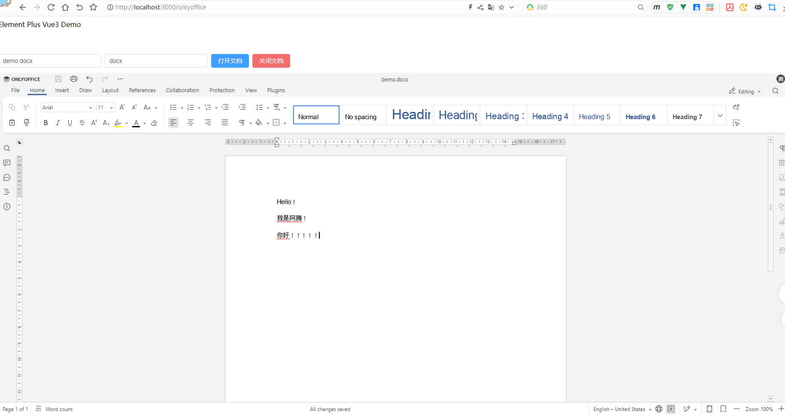
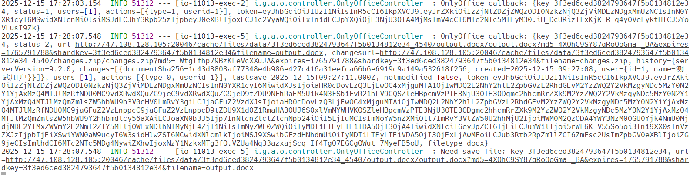
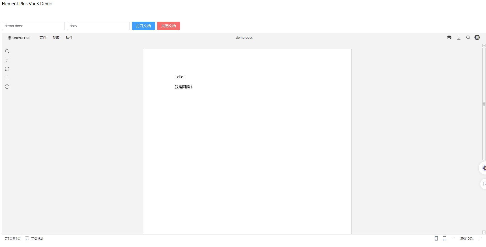

# OnlyOffice


## 配置概览

OnlyOffice信息，安装文档参考：[链接](https://atengk.github.io/ops/#/work/docker/service/onlyoffice/)

```
Address: http://47.108.128.105:20046
JWT: Admin@123
```

MinIO对象存储文件

```
http://47.108.128.105:20006/data/demo.docx
http://47.108.128.105:20006/data/demo.xlsx
http://47.108.128.105:20006/data/demo.pptx
```

后端地址

```
获取配置地址：http://47.108.128.105:11013/onlyoffice/config
回调地址，注意这个地址需要OnlyOffice服务能直接访问到：http://47.108.128.105:11013/onlyoffice/callback
```


## 后端配置

### 创建类

注意跨域问题，这里简单处理

```java
package io.github.atengk.onlyoffice.controller;

import cn.hutool.crypto.digest.DigestUtil;
import cn.hutool.jwt.JWT;
import lombok.extern.slf4j.Slf4j;
import org.springframework.web.bind.annotation.*;

import java.nio.charset.StandardCharsets;
import java.util.HashMap;
import java.util.Map;

/**
 * OnlyOffice 在线编辑集成控制器
 * <p>
 * 作用：
 * 1. 提供前端 DocsAPI.DocEditor 所需的配置（/config）
 * 2. 接收 OnlyOffice DocumentServer 的回调（/callback）
 * <p>
 * 适配版本：
 * onlyoffice/documentserver:9.2
 */
@Slf4j
@CrossOrigin(originPatterns = "*")
@RestController
@RequestMapping("/onlyoffice")
public class OnlyOfficeController {

    /* ========================= 常量配置区 ========================= */

    /**
     * OnlyOffice JWT 密钥
     * ⚠️ 必须与 DocumentServer 环境变量 JWT_SECRET 保持一致
     */
    private static final String ONLYOFFICE_JWT_SECRET = "Admin@123";

    /**
     * 文件访问基础地址（文件必须是 DocumentServer 可直接访问的公网地址）
     * 示例：http://ip:port/data/demo.docx
     */
    private static final String FILE_BASE_URL = "http://47.108.128.105:20006/data/";

    /**
     * OnlyOffice 回调地址
     * status=2 / status=6 时会携带文件下载地址
     */
    private static final String CALLBACK_URL = "http://47.108.128.105:11013/onlyoffice/callback";

    /**
     * 编辑模式：edit / view
     */
    private static final String EDIT_MODE = "edit";

    /**
     * 当前演示用户 ID
     * 实际项目中应来自登录用户
     */
    private static final String DEMO_USER_ID = "1";

    /**
     * 当前演示用户名称
     */
    private static final String DEMO_USER_NAME = "测试用户";

}
```


### 获取 OnlyOffice 编辑器配置

```java
    /**
     * 获取 OnlyOffice 编辑器配置
     *
     * @param fileName 文件名（如 demo.docx / demo.xlsx）
     * @param fileType 文件类型（docx / xlsx / pptx）
     * @return OnlyOffice DocEditor 初始化配置
     */
    @GetMapping("/config")
    public Map<String, Object> getConfig(@RequestParam String fileName,
                                         @RequestParam String fileType) {

        /* ---------- 1. document 配置 ---------- */

        Map<String, Object> document = new HashMap<>();
        document.put("fileType", fileType);
        document.put("key", DigestUtil.md5Hex(fileName)); // 文件唯一标识（同一文件必须固定），注意不要有中文
        document.put("title", fileName);
        document.put("url", FILE_BASE_URL + fileName);

        /* ---------- 2. editorConfig 配置 ---------- */

        Map<String, Object> editorConfig = new HashMap<>();
        editorConfig.put("mode", EDIT_MODE);
        editorConfig.put("lang", "zh-CN");

        Map<String, Object> user = new HashMap<>();
        user.put("id", DEMO_USER_ID);
        user.put("name", DEMO_USER_NAME);
        editorConfig.put("user", user);

        editorConfig.put("callbackUrl", CALLBACK_URL);

        /* ---------- 3. 顶层 config ---------- */

        Map<String, Object> config = new HashMap<>();
        config.put("document", document);
        config.put("editorConfig", editorConfig);

        /* ---------- 4. 生成 JWT（基于最终 config） ---------- */

        JWT jwt = JWT.create();
        jwt.setPayload("document", document);
        jwt.setPayload("editorConfig", editorConfig);

        String token = jwt
                .setKey(ONLYOFFICE_JWT_SECRET.getBytes(StandardCharsets.UTF_8))
                .sign();

        config.put("token", token);

        return config;
    }
```


### OnlyOffice 回调接口

```java
    /**
     * OnlyOffice 回调接口
     * <p>
     * 回调触发说明：
     * status=1  打开文档
     * status=2  关闭文档并保存（最重要）
     * status=6  强制保存完成
     *
     * @param body DocumentServer 回调数据
     * @return error=0 表示接收成功
     */
    @PostMapping("/callback")
    public Map<String, Object> callback(@RequestBody Map<String, Object> body) {

        log.info("OnlyOffice callback: {}", body);

        Integer status = (Integer) body.get("status");

        // status=2 或 status=6 才是真正需要保存文件的时机
        if (status != null && (status == 2 || status == 6)) {
            String fileUrl = (String) body.get("url");
            String fileKey = (String) body.get("key");

            log.info("Need save file: key={}, url={}", fileKey, fileUrl);

            // TODO:
            // 1. 下载 fileUrl
            // 2. 覆盖原文件（本地 / MinIO / OSS）
        }

        Map<String, Object> result = new HashMap<>();
        result.put("error", 0);
        return result;
    }
```


## 前端配置

### 配置 OnlyOffice API

在 index.html 添加以下代码

```
<script src="http://47.108.128.105:20046/web-apps/apps/api/documents/api.js"></script>
```

### OnlyOffice 页面

```vue
<template>
  <div>
    <!-- ================= 操作区 ================= -->
    <el-space style="margin-bottom: 12px">
      <!-- 文件名输入（如 demo.docx / demo.xlsx） -->
      <el-input
        v-model="fileName"
        placeholder="请输入文件名，如 demo.docx"
        style="width: 240px"
        clearable
      />

      <!-- 文件类型输入（必须与文件真实类型一致） -->
      <el-input
        v-model="fileType"
        placeholder="请输入文件类型，如 docx / xlsx"
        style="width: 240px"
        clearable
      />

      <!-- 打开文档按钮 -->
      <el-button type="primary" @click="openDoc">
        打开文档
      </el-button>

      <!--
        关闭文档按钮（非常重要）
        说明：
        1. 点击该按钮会调用 destroyEditor()
        2. OnlyOffice 会认为“编辑会话结束”
        3. 如果文档有修改，将触发后端 callback，status = 2
        4. 后端应在 status=2 时下载并保存文件
      -->
      <el-button
        type="danger"
        @click="closeDoc"
        :disabled="!editorRef"
      >
        关闭文档
      </el-button>
    </el-space>

    <!-- ================= 编辑器容器 ================= -->
    <!--
      OnlyOffice 编辑器挂载节点
      DocsAPI.DocEditor 会在此容器内创建 iframe
    -->
    <div id="editor" style="height: 800px;"></div>
  </div>
</template>

<script setup lang="ts">
import { ref, onBeforeUnmount } from 'vue'
import axios from 'axios'

/**
 * 当前打开的文件名
 * 示例：demo.docx / demo.xlsx
 */
const fileName = ref('demo.docx')

/**
 * 当前文件类型
 * ⚠️ 必须与文件真实类型保持一致
 */
const fileType = ref('docx')

/**
 * OnlyOffice 编辑器实例
 * DocsAPI.DocEditor 返回的对象
 */
const editorRef = ref<any>(null)

/**
 * 打开文档
 *
 * 执行流程：
 * 1. 如果已有编辑器实例，先 destroyEditor（防止多个会话）
 * 2. 向后端请求 OnlyOffice 配置
 * 3. 使用 DocsAPI.DocEditor 创建编辑器实例
 */
const openDoc = async () => {
  // 已存在编辑器实例时，先关闭（不会触发保存）
  if (editorRef.value) {
    editorRef.value.destroyEditor()
    editorRef.value = null
  }

  // 从后端获取 OnlyOffice 配置（含 JWT）
  const { data } = await axios.get(
    'http://47.108.128.105:11013/onlyoffice/config',
    {
      params: {
        fileName: fileName.value,
        fileType: fileType.value,
      }
    }
  )

  // 创建 OnlyOffice 编辑器
  // @ts-ignore
  editorRef.value = new DocsAPI.DocEditor('editor', {
    ...data,
    height: '800px'
  })
}

/**
 * 关闭文档（⚠️ 核心方法）
 *
 * 重要说明：
 * 1. destroyEditor() 表示“主动关闭编辑会话”
 * 2. 如果文档内容发生过修改
 * 3. OnlyOffice DocumentServer 会向 callbackUrl 发送回调
 * 4. 回调中 status = 2，表示文档已保存，可下载最终文件
 */
const closeDoc = () => {
  if (editorRef.value) {
    editorRef.value.destroyEditor()
    editorRef.value = null
  }
}

/**
 * 页面卸载时自动关闭文档
 *
 * 场景：
 * - 页面刷新
 * - 路由切换
 *
 * 作用：
 * 保证 destroyEditor() 被调用，
 * 防止文档修改后未触发 status=2 回调
 */
onBeforeUnmount(() => {
  closeDoc()
})
</script>

```


## 在线编辑示例



点击 `关闭文档` 按钮后，会调用回调保存




## 在线预览示例

------

一、OnlyOffice 的「在线预览」本质是什么？

> **预览 ≠ 新功能**
>
> 👉 **就是把编辑模式 `edit` 改成只读 `view`**

OnlyOffice 并不存在单独的 “preview API”。

------

二、实现在线预览的唯一正确方式（核心）

✅ 关键配置

```json
editorConfig: {
  mode: "view"
}
```

对比：

| 场景     | mode |
| -------- | ---- |
| 在线编辑 | edit |
| 在线预览 | view |

------

三、后端如何支持「编辑 / 预览」两种模式（推荐）

1️⃣ 接口增加一个参数 `preview`

```http
GET /onlyoffice/config?fileName=demo.docx&fileType=docx&preview=true
```

------

2️⃣ 后端完整实现（**生产级**）

```java
@GetMapping("/config")
public Map<String, Object> getConfig(
        @RequestParam String fileName,
        @RequestParam String fileType,
        @RequestParam(defaultValue = "false") Boolean preview) {

    // ==================== document ====================
    Map<String, Object> document = new HashMap<>();
    document.put("fileType", fileType);
    document.put("key", DigestUtil.md5Hex(fileName));
    document.put("title", fileName);
    document.put("url", FILE_BASE_URL + fileName);

    // ==================== editorConfig ====================
    Map<String, Object> editorConfig = new HashMap<>();

    /**
     * edit  : 编辑模式
     * view  : 预览（只读）模式
     */
    editorConfig.put("mode", preview ? "view" : "edit");

    /**
     * 语言
     */
    editorConfig.put("lang", "zh-CN");

    Map<String, Object> user = new HashMap<>();
    user.put("id", "1");
    user.put("name", "测试用户");
    editorConfig.put("user", user);

    editorConfig.put("callbackUrl", CALLBACK_URL);

    // ==================== config ====================
    Map<String, Object> config = new HashMap<>();
    config.put("document", document);
    config.put("editorConfig", editorConfig);

    // ==================== JWT ====================
    JWT jwt = JWT.create();
    jwt.setPayload("document", document);
    jwt.setPayload("editorConfig", editorConfig);

    String token = jwt
            .setKey(JWT_SECRET.getBytes(StandardCharsets.UTF_8))
            .sign();

    config.put("token", token);

    return config;
}
```

------

四、前端如何使用（非常简单）

编辑

```ts
openDoc(false)
```

预览

```ts
openDoc(true)
```

前端完整示例

```ts
const openDoc = async (preview = false) => {
  if (editorRef.value) {
    editorRef.value.destroyEditor()
    editorRef.value = null
  }

  const { data } = await axios.get(
    'http://localhost:11013/onlyoffice/config',
    {
      params: {
        fileName: fileName.value,
        fileType: fileType.value,
        preview
      }
    }
  )

  // @ts-ignore
  editorRef.value = new DocsAPI.DocEditor('editor', {
    ...data,
    height: '800px'
  })
}
```

| 类型 | 是否支持预览     |
| ---- | ---------------- |
| docx | ✅                |
| xlsx | ✅                |
| pptx | ✅                |
| pdf  | ✅（内置 viewer） |

⚠️ PDF 只能预览，不能 edit（这是 OnlyOffice 设计）


